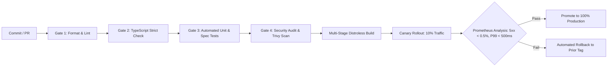

# Explore Bharat Safar — CI/CD Automation & Release Pipeline Summary
## GitHub Actions Architecture, Quality Gates & Progressive Delivery

---

## 1. Automated Pipeline Architecture

---

## 2. Active Workflows Overview

1. **`ci-pipeline.yml`**:
   - Executes on all pull requests and pushes to `main`.
   - Runs Prettier check, ESLint, TypeScript `tsc --noEmit`, and monorepo test runner.
2. **`production-deploy.yml`**:
   - Triggered on release git tags (`v*`) or manual workflow dispatch.
   - Executes pre-flight verification, multi-stage Docker builds, Trivy container layer scanning, canary deployment (10% $\rightarrow$ 50% $\rightarrow$ 100%), and post-deployment smoke tests.
3. **`release.yml`**:
   - Automates semantic version bumping (`patch`, `minor`, `major`), changelog creation, and git tagging.
4. **`security-compliance.yml`**:
   - Nightly and PR scans for dependency CVEs (`pnpm audit --prod`), copyleft license violations, and secret leaks (Gitleaks).
