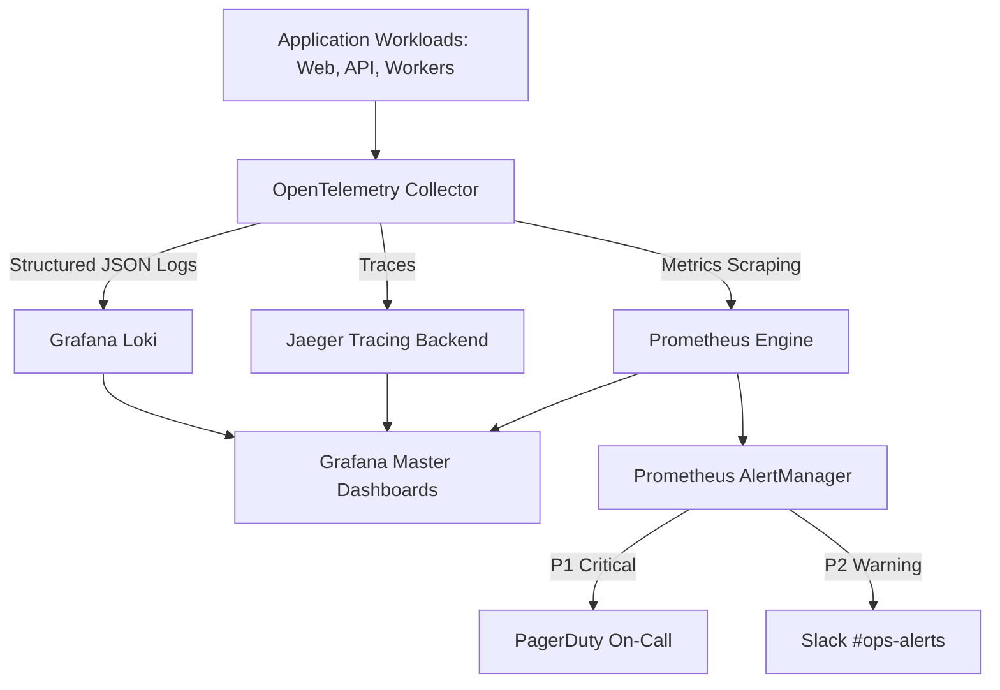

# Explore Bharat Safar — Monitoring, Telemetry & SRE Summary
## Golden Signals, Grafana Dashboards & Distributed Tracing

---

## 1. Observability Architecture

---

## 2. Grafana Production Dashboards

Located at `infrastructure/monitoring/grafana/dashboards/`:
1. **`ebs-executive-sla-slo.json`**:
   - 30-Day Rolling Availability percentage ($99.95\%$ Target).
   - Remaining Error Budget gauge ($0.05\%$ allowed error window).
   - Core Web Vitals telemetry (LCP, CLS, INP).
2. **`ebs-api-performance.json`**:
   - Request throughput breakdown by HTTP status code (2xx, 3xx, 4xx, 5xx).
   - Latency quantiles: P50, P90, P99 ($< 500\text{ms}$ threshold).
   - Server-Timing execution duration breakdowns.
3. **`ebs-infrastructure-health.json`**:
   - Active PostgreSQL connections vs pool capacity.
   - Redis cluster memory utilization & cache hit/miss ratio.
   - BullMQ worker throughput and backlog depth.
   - Kubernetes Node CPU, memory, and disk pressure.

---

## 3. SRE Alerting Rules & Escalation

Defined in `infrastructure/monitoring/prometheus/alert-rules.yaml`:
- **`HighApiErrorRate`** (5xx $> 1\%$ over 2m) $\rightarrow$ **P1 Critical** (PagerDuty).
- **`P99LatencySpike`** ($> 500\text{ms}$ over 5m) $\rightarrow$ **P2 Warning** (Slack).
- **`DatabaseConnectionPoolSaturated`** ($> 85\%$ connections) $\rightarrow$ **P1 Critical** (PagerDuty).
- **`RedisMemoryUsageHigh`** ($> 80\%$) $\rightarrow$ **P2 Warning** (Slack).
- **`BullMQQueueBacklogHigh`** ($> 5,000$ jobs) $\rightarrow$ **P2 Warning** (Slack).
- **`PodCrashLooping`** ($> 2$ restarts in 15m) $\rightarrow$ **P1 Critical** (PagerDuty).
