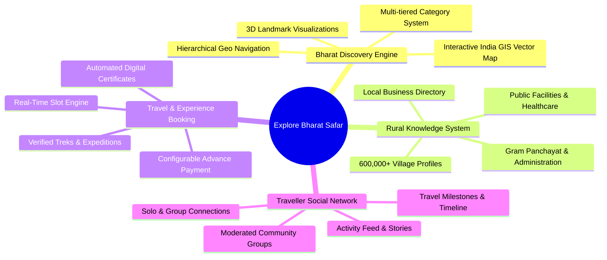
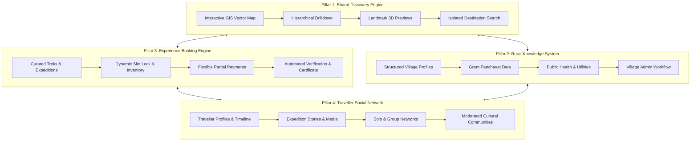
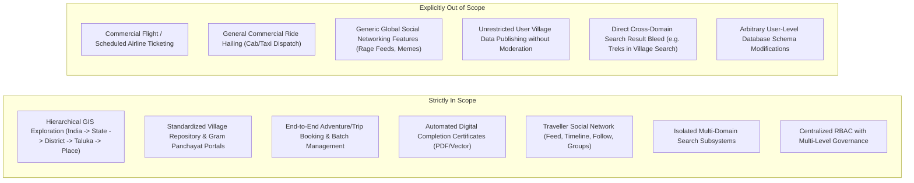

# Explore Bharat Safar — Project Vision, Concept & Ecosystem Idea

- **Document Identifier**: EBS-DOC-01-IDEA
- **Version**: 1.0.0
- **Status**: Approved
- **Author**: Enterprise Architecture & Solutions Engineering Team
- **Target Audience**: Product Managers, Software Architects, UI/UX Teams, Lead Engineers, Domain Specialists, Investors
- **Related Documents**:
  - `02-specification.md`
  - `03-architecture.md`
  - `07-roadmap.md`
  - `08-context.md`
  - `16-map-engine.md`
  - `26-business-rules.md`
- **Last Updated**: 2026-09-28

---

## 1. Executive Summary

**Explore Bharat Safar** is an enterprise-grade digital knowledge and travel ecosystem dedicated entirely to the geography, cultural heritage, rural fabric, adventure tourism, and traveller community of Bharat (India).

It is explicitly **not** a basic travel directory, nor a conventional OTA (Online Travel Agency) booking portal, nor an ordinary tourism blog. Rather, it represents a unified, multi-tiered digital platform engineered to preserve cultural intelligence, document geographical administrative units from the sovereign nation level down to the smallest gram panchayat village, provide end-to-end verified experiential travel and adventure bookings, and cultivate a community of conscious, verified travellers.

---

## 2. Problem Statement & Market Analysis

Contemporary travel and geographical exploration platforms serving India exhibit severe fragmentation, commercial bias, and urban-centric skew:

1. **Information Fragmentation & Shallow Documentation**:
   - Detailed cultural, historical, architectural, and geographical data on tier-2/3/4 locations, remote talukas, and rural hamlets are either scattered across unverified personal blogs or entirely undocumented digitally.
   - Mainstream mapping solutions focus almost exclusively on turn-by-turn point-to-point road navigation and commercial points of interest, completely lacking educational depth, historical context, or curated architectural visual aids.

2. **Neglect of Rural Bharat (Villages & Panchayats)**:
   - India encompasses over 600,000 villages, housing roughly 65% of the nation's population. Current digital portals provide zero structured information regarding village administration, local culture, historical formation, weekly agrarian markets (*haats*), public infrastructure, primary health centers (PHCs), or verified local homestays.

3. **Commercialized, Disconnected Booking Experiences**:
   - Conventional booking portals prioritize high-volume commercial hotel rooms and flight tickets, ignoring authentic regional expeditions, guided heritage walks, rural immersion journeys, and ecological trekking trails.
   - Existing trekking operators operate via disjointed Google Forms, manual bank transfers, or unstandardized WhatsApp groups lacking inventory locking, participant health telemetry, legal risk acceptance, or verifiable completion certificates.

4. **Absence of a Purpose-Built Traveller Network**:
   - General-purpose social media networks emphasize algorithmic rage-engagement, viral short-form memes, and superficial influencer media, diluting genuine travel journals, trekking logs, practical trail advisories, and ethical local exploration ethics.

---

## 3. Core Vision & Strategic Philosophy

### 3.1 The Guiding Mission
> *"Discover Bharat. Experience Bharat. Understand Bharat."*

Explore Bharat Safar is founded on the conviction that every geographical unit of India possesses historical value, community vitality, and cultural dignity. The long-term objective of the ecosystem is to digitally document every:
- **State & Union Territory** (28 States, 8 UTs)
- **District** (780+ administrative districts)
- **Taluka / Tehsil / Sub-district** (6,000+ administrative subdivisions)
- **Village & Gram Panchayat** (664,000+ documented rural settlements)
- **Historical Monument, Fort, Temple, Cave, & Stepwell**
- **Ecological Asset** (Waterfalls, lakes, rivers, wildlife sanctuaries, national parks, peaks, and valleys)

### 3.2 Product Tenets
- **Geographical Integrity**: Strict top-down administrative consistency ($India \rightarrow State \rightarrow District \rightarrow Taluka \rightarrow Place/Village$) that mirrors real-world governance and spatial hierarchy.
- **Enterprise Longevity**: Decoupled, modular architecture supporting independent scaling, rigorous data governance, immutable audit logging, and provider-agnostic infrastructure.
- **Community Empowerment**: Decentralized local data administration where designated Village Admins curate grassroots information subject to multi-tier editorial and administrative governance.
- **Holistic Lifecycle**: Guiding the traveller seamlessly from discovery $\rightarrow$ spatial orientation $\rightarrow$ booking $\rightarrow$ on-ground itinerary execution $\rightarrow$ verifiable digital certification $\rightarrow$ post-travel retrospection and social storytelling.

---

## 4. The Four Pillars of the Ecosystem

### Pillar 1: Bharat Discovery Engine (Interactive India GIS Map)
An interactive vector-rendered spatial discovery tool allowing users to visually traverse the expanse of India. Highlighting geographic borders, coastlines, river networks, and islands, the engine overlays custom miniature 3D landmark icons (such as the Gateway of India, Raigad Fort, Kailasa Temple, Taj Mahal, Brihadeeswara Temple, Hawa Mahal, and Pangong Lake) anchored to precise geographic coordinates. 
Clicking any landmark or region initiates a fluid, hardware-accelerated zoom and pan transition, unpacking state profiles, district polygons, taluka boundaries, and place dossiers without page reload or context loss.

### Pillar 2: Village Information & Rural Bharat Knowledge System
A standardized digital encyclopedia capturing the socioeconomic, historical, infrastructural, and agricultural realities of India's rural expanse. Each village record maintains geo-spatial boundaries, demographic indices, revenue circle affiliations, historical narratives, prominent temples/monuments, local public offices (Panchayat office, police patil, primary health centers), seasonal festivals, and verified local micro-enterprises. Designated Village Admins manage updates through a strict review-and-approval governance pipeline.

### Pillar 3: Travel Booking, Adventure & Experience Management System
An enterprise transactional engine engineered for high-concurrency reservation of trekking expeditions, rural homestays, cultural immersions, and seasonal adventures. Features include real-time distributed inventory locking, customizable upfront booking percentages (e.g., 25%, 50%, 100% advance payments configured by the Super Admin), participant medical and emergency contact telemetry, immutable terms acceptance logging, and an automated cryptographic certificate generation engine triggered post-attendance and fiscal settlement.

### Pillar 4: Traveller Social Network & Community Platform
A specialized, safe social fabric constructed exclusively around travel, culture, and outdoor pursuits. Users curate personal travel profiles featuring visited-place counters, chronologically plotted travel timelines, expedition journals, temporary media stories, and verified place reviews. The module facilitates safe discovery between solo travellers seeking companions based on shared fitness and destination parameters, as well as niche communities categorized by activity, region, and heritage themes.

---

## 5. Stakeholder Personas & Value Propositions

| Stakeholder Persona | Key Needs & Pain Points | Value Proposition Delivered by Platform |
| :--- | :--- | :--- |
| **Cultural Explorer & Tourist** | Desires off-beat, non-commercial destinations with accurate historical, architectural, and route data. | Interactive GIS drill-down from nation to taluka; vetted cultural narratives; weather advisories; clean emergency directories. |
| **Adventure Trekker & Mountaineer** | Seeks reliable trail difficulty grades, day-wise itineraries, verified guides, transparent slot availability, and completion recognition. | Real-time batch booking; transparent gear/medical checklists; offline-capable itineraries; immutable completion certificates. |
| **Solo Traveller** | Hesitant about safety, route clarity, and finding compatible, verified companions for remote expeditions. | Verified traveller profiles; interest-matched companion discovery; moderated regional safety alerts. |
| **Village Administrator / Gram Sevak** | Lacks digital channels to publicize village heritage, local homestays, rural crafts, cultural festivals, or public notices. | Dedicated localized dashboard to curate official contacts, public infrastructure status, and tourist attractions with audit oversight. |
| **Expedition / Booking Administrator** | Overwhelmed by manual slot reconciliations, untracked bank transfers, paper participant waivers, and certificate printing. | Automated batch inventory control; partial payment workflows; integrated waiver acceptance; batch attendance verification. |
| **Content Editor & Historian** | Frustrated by unformatted, contradictory historical folklore and unverified claims on social forums. | Structured CMS with rich multimedia galleries, categorical tagging, and standardized citation architectures. |
| **Platform Super Admin** | Requires global visibility, security posture management, role assignment, financial audit trails, and revenue controls. | Centralized administration console with global feature toggles, payment percentage controls, master audit logs, and granular RBAC. |

---

## 6. Scope Boundaries

---

## 7. High-Level System Success Metrics (KPIs)

1. **Exploration Engagement**:
   - Depth of geographical drill-down ($Average\ Drilldown\ Level \ge 3.8$).
   - Interactive dwell time on vector maps and landmark visual nodes ($\ge 4.5\text{ minutes/session}$).
2. **Rural Digital Penetration**:
   - Number of verified village records with complete administrative and facility records ($> 50,000$ in Year 1).
   - Speed of Village Admin update moderation ($\le 24\text{ hours}$ turnaround).
3. **Booking Reliability & Integrity**:
   - Zero double-booking occurrences across concurrent batch reservations ($0.00\%$ failure).
   - Real-time inventory synchronization latency ($\le 250\text{ ms}$ over WebSockets).
   - Certificate issuance accuracy ($100\%$ validation against payment clearance and attendance verification).
4. **Platform Security & Compliance**:
   - Zero unauthorized data tampering in village profiles or administrative settings ($100\%$ audit log coverage).
   - Strict session isolation, role-based boundary containment, and encrypted credential storage.

---

## 8. Summary & Next Steps

This document crystallizes the strategic intent, architectural philosophy, and foundational value delivery of Explore Bharat Safar. Every subsequent document in this repository directly elaborates on the concepts established herein. 

The complete technical and functional blueprint proceeds immediately with `02-specification.md`, where the exhaustive requirements, functional flows, and module interactions are formally specified.
