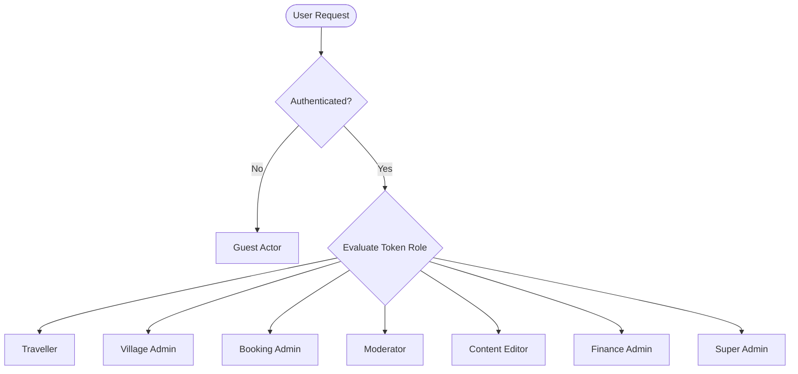
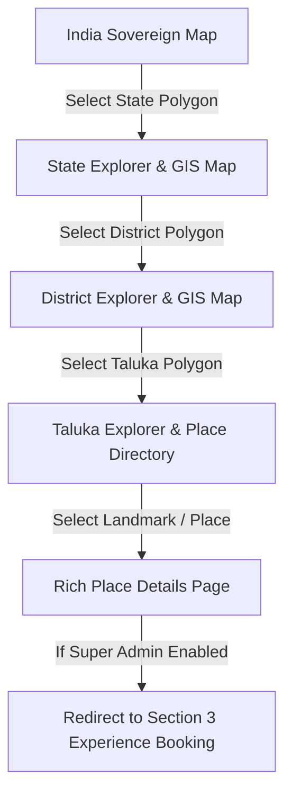
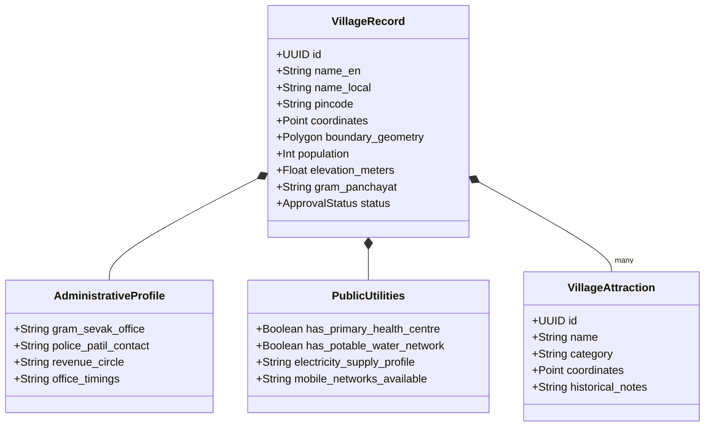
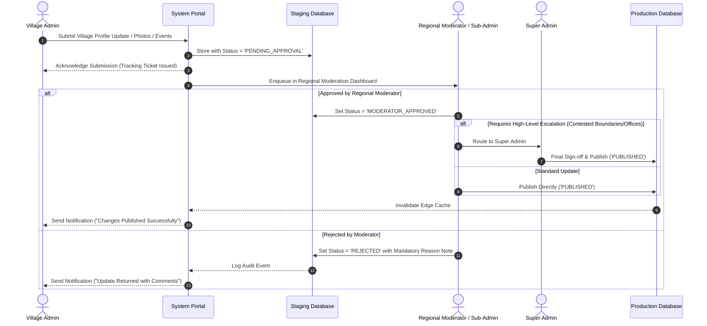
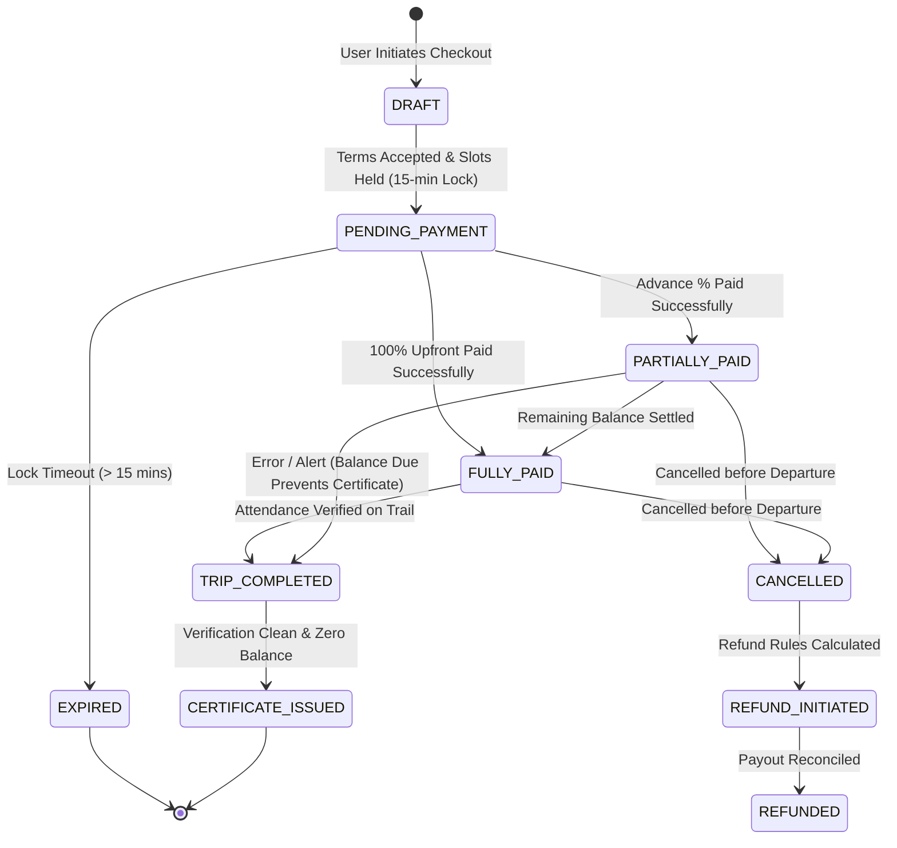
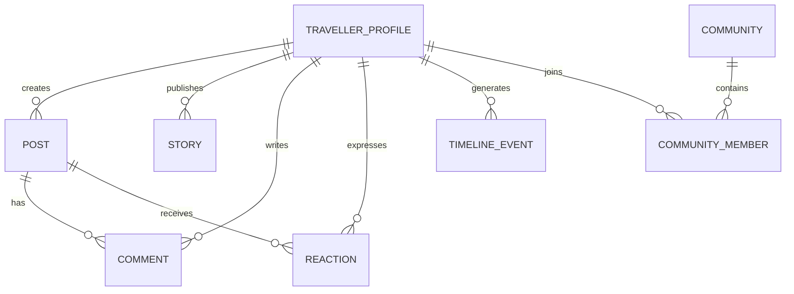
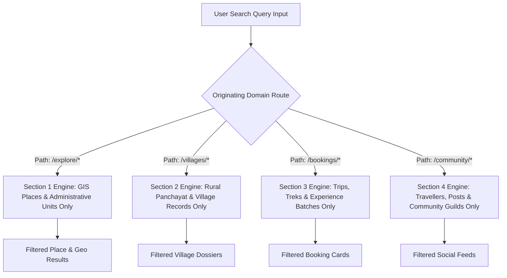

# Explore Bharat Safar — Comprehensive System Requirements & Functional Specifications

- **Document Identifier**: EBS-DOC-02-SPEC
- **Version**: 1.0.0
- **Status**: Approved
- **Author**: Enterprise Architecture & Solutions Engineering Team
- **Target Audience**: Product Managers, Functional Analysts, Frontend/Backend Engineers, QA Engineers, GIS Specialists
- **Related Documents**:
  - `01-idea.md`
  - `03-architecture.md`
  - `09-api-design.md`
  - `10-database-design.md`
  - `14-booking-system.md`
  - `15-social-media.md`
  - `16-map-engine.md`
  - `26-business-rules.md`
- **Last Updated**: 2026-09-28

---

## 1. Specification Overview & System Objectives

This document serves as the canonical software requirement specification (SRS) for the **Explore Bharat Safar** ecosystem. It specifies the functional requirements, operational workflows, system behavior, data validation rules, and acceptance criteria across all four foundational modules:

1. **Section 1: Bharat Discovery Engine** (Hierarchical GIS Interactive India Map)
2. **Section 2: Village Information & Rural Bharat Knowledge System**
3. **Section 3: Travel Booking, Adventure & Experience Management System**
4. **Section 4: Traveller Social Network & Community Platform**

Every software engineer, architect, and quality assurance specialist must implement and verify the platform in strict conformance with these specifications.

---

## 2. Global System Actors & Role-Based Matrix

The system enforces strict multi-tenant, role-based access control (RBAC). Every incoming request must be authorized according to the actor's defined permission envelope.



### 2.1 Role Definitions & Permission Envelope

| Role Identifier | Authentication Required | Accessible Functional Scope | Explicit Functional Restrictions |
| :--- | :--- | :--- | :--- |
| **Guest** | No | Read-only access to Section 1 (GIS Discovery), Section 2 public village records, public articles, and public trip listings. | Cannot book trips, write reviews, create social posts, post comments, or access administrative endpoints. |
| **Traveller** | Yes (JWT / Session) | Complete discovery access; booking experiences; adding participants; partial/full payments; downloading certificates; publishing social posts, stories, comments; joining communities; following users; submitting verified reviews. | Cannot approve village edits, moderate external reviews, modify global trip catalogs, adjust payment percentages, or alter system settings. |
| **Village Admin** | Yes (MFA Recommended) | Scoped administration of assigned Village records; submitting descriptive updates, historical records, events, public utility contacts, and photo galleries for approval. | Strictly prohibited from publishing directly without review; zero access to other villages; zero access to bookings, payments, or global settings. |
| **Booking Admin** | Yes (MFA Enforced) | Managing trip catalog schedules, batch departures, capacity thresholds, on-ground participant attendance verification, and manual booking status corrections. | Cannot alter core financial ledger records, edit GIS geographic boundaries, or modify system security configuration. |
| **Finance Admin** | Yes (MFA Enforced) | Viewing transaction ledgers, reconciling gateway payouts, validating offline/partial balances, approving processed refunds, and issuing tax invoices. | Cannot modify destination descriptions, approve village updates, or alter trip batch itineraries. |
| **Moderator** | Yes (MFA Enforced) | Reviewing flagged social content, traveller reviews, forum discussions, photo submissions, and triage of abuse reports. | Cannot alter booking fees, change system configuration, or modify administrative roles. |
| **Content Editor** | Yes (MFA Enforced) | Managing CMS travel articles, editorial guides, state/district cultural profiles, and SEO metadata. | Cannot access transactional data, user credentials, or financial reports. |
| **Super Admin** | Yes (MFA Enforced + IP Allowlist) | Unrestricted global access; dynamic navigation menu configuration; upfront payment percentage definition; role delegation; audit log inspection; database backup orchestration; feature toggles. | Bound only by immutable audit trail logging; all actions are permanently logged. |

---

## 3. Section 1: Bharat Discovery Engine (Interactive India GIS Map)

### 3.1 Primary Objective & Hierarchical Geo-Navigation
The Bharat Discovery Engine provides a vectorized, top-down exploration experience representing the sovereign territory of Bharat. The geographical drilldown follows an uncompromising hierarchy:

$$\text{India (National Level)} \longrightarrow \text{State / UT} \longrightarrow \text{District} \longrightarrow \text{Taluka} \longrightarrow \text{Place / Attraction}$$



### 3.2 Map Engine & Cartographic Specifications
- **Projection & Boundaries**: Rendered using standard WGS84 coordinates projected via Web Mercator or accurate SVG/TopoJSON layer representations depicting all 28 States and 8 Union Territories with verified sovereign boundaries, complete coastlines, and island archipelagos (Andaman & Nicobar, Lakshadweep).
- **Format Support**: The GIS Engine must ingest GeoJSON, TopoJSON, PostGIS spatial queries, and Mapbox Vector Tiles (MVT).
- **Viewport Controls**: Smooth, 60fps hardware-accelerated zoom (levels 4 through 18), inertial pan, coordinate bounding constraints, and automatic resolution switching to prevent mobile GPU throttling.

### 3.3 Miniature 3D Landmark Visualizations
Rather than relying purely on text labels, the national and state maps render lightweight, optimized 3D isometric or stylized vector landmark tokens positioned at precise latitude/longitude coordinates:

| State / UT | Representative Landmark Visualizations | Latitude / Longitude Coordinates |
| :--- | :--- | :--- |
| **Maharashtra** | Gateway of India, Raigad Fort, Kailasa Temple (Ellora), Ajanta Caves | $18.9220^\circ\text{ N}, 72.8347^\circ\text{ E}$ |
| **Rajasthan** | Hawa Mahal, Amber Fort, Jaisalmer Fort | $26.9239^\circ\text{ N}, 75.8267^\circ\text{ E}$ |
| **Gujarat** | Statue of Unity, Rani ki Vav, Somnath Temple | $21.8380^\circ\text{ N}, 73.7191^\circ\text{ E}$ |
| **Tamil Nadu** | Brihadeeswara Temple, Meenakshi Amman Temple, Nilgiri Railway | $10.7828^\circ\text{ N}, 79.1318^\circ\text{ E}$ |
| **Karnataka** | Hampi Ruins (Virupaksha), Mysore Palace, Gol Gumbaz | $15.3350^\circ\text{ N}, 76.4600^\circ\text{ E}$ |
| **Uttar Pradesh** | Taj Mahal, Kashi Vishwanath Temple, Fatehpur Sikri | $27.1751^\circ\text{ N}, 78.0421^\circ\text{ E}$ |
| **Punjab** | Golden Temple (Harmandir Sahib), Wagah Border | $31.6200^\circ\text{ N}, 74.8765^\circ\text{ E}$ |
| **Jammu & Kashmir** | Dal Lake (Shikara), Gulmarg Gondola | $34.1105^\circ\text{ N}, 74.8690^\circ\text{ E}$ |
| **Ladakh** | Pangong Tso, Hemis Monastery | $33.7595^\circ\text{ N}, 78.6674^\circ\text{ E}$ |
| **Kerala** | Alleppey Backwaters, Bekal Fort | $9.4981^\circ\text{ N}, 76.3388^\circ\text{ E}$ |
| **West Bengal** | Victoria Memorial, Howrah Bridge, Darjeeling Himalayan Toy Train | $22.5448^\circ\text{ N}, 88.3426^\circ\text{ E}$ |
| **Assam** | Kaziranga National Park, Kamakhya Temple | $26.5775^\circ\text{ N}, 93.1711^\circ\text{ E}$ |
| **Odisha** | Konark Sun Temple, Jagannath Temple Puri | $19.8876^\circ\text{ N}, 86.0945^\circ\text{ E}$ |

#### Landmark Behavioral Spec
- **Hover**: Scale token $1.15\times$, illuminate elevation drop-shadow, trigger subtle GSAP floating bounce, and display miniature tooltip (Name + District).
- **Click**: Open an interactive non-modal drawer preview displaying:
  1. Primary High-Res Thumbnail
  2. Category Badge (e.g., UNESCO Heritage, Hill Fort, River Basin)
  3. Administrative Breadcrumbs ($State \rightarrow District \rightarrow Taluka$)
  4. 200-character Curated Summary
  5. Verified Traveller Rating & Total Reviews
  6. Call-to-Action button: *"Explore Deeply"* (Navigates directly to full Place Details Page)

### 3.4 State, District, and Taluka Exploration Modules

#### State Page Specification
Clicking any State triggers a smooth camera tween zooming into the selected polygon, fading adjacent states, and dynamically fetching the State Record via GraphQL/REST:
- **Hero & Meta Data**: State Emblem, Capital City, Official Language(s), Population Census metrics, Geographical Area ($\text{km}^2$), Climate bands.
- **Cultural Canvas**: Historical overview, dynasty chronicles, traditional cuisine, native folk arts, handlooms, and seasonal festival calendar.
- **Embedded District Map**: Second-level SVG/GeoJSON vector renderer depicting internal district polygons with interactive hover and click listeners.
- **Connectivity Hub**: Nearest domestic/international airports, major railway junctions, national highway networks, and seasonal travel advisories.

#### District Page Specification
Loading a District unpacks granular territorial data:
- **Geographic Overview**: Topography, forest cover, major river basins, annual rainfall profile.
- **Attraction Directory**: Filterable list of tourist, religious, ecological, and heritage sites.
- **Embedded Taluka Map**: Third-level GIS interactive map delineating every sub-district/taluka boundary with marker clustering.
- **Emergency Directory**: District Collectorate helpline, Superintendent of Police control room, district civil hospital contacts.

#### Taluka Page Specification
Represents the grassroots administrative sub-unit:
- **Taluka Overview**: Headquarters, rural vs urban split, local governance profile.
- **Granular Attraction Registry**: All documented forts, waterfalls, temples, caves, camping grounds, and panoramic view-points located within the taluka.
- **Contained Village List**: Paginated list of constituent villages with direct deep-links to Section 2 village profiles.

### 3.5 Place Details Page Specification
The definitive dossier for an individual destination:
- **Hero Carousel**: Responsive picture elements with progressive WebP/AVIF images and full-screen lightbox.
- **Encyclopedic Narrative**: Architectural lineage, chronological history, religious or cultural significance, and mytho-historical context.
- **Practical Logistics**:
  - Operating Hours, Weekly Closures, Permitted Photography Rules.
  - Entry Tariffs (Domestic, International, Student, Camera fees).
  - Wheelchair Accessibility, Restrooms, Parking Capacity, Drinking Water Availability.
  - Geo-Coordinates, Elevation ($\text{meters AMSL}$), Route Map, and Distance Matrix from major transit hubs.
- **Verified Reviews**: Aggregated rating distribution, category ratings (Cleanliness, Safety, Accessibility), and paginated user reviews.
- **"Book Now" Dynamic Integration**:
  - The "Book Now" CTA is conditionally displayed **if and only if** the `is_booking_enabled` boolean flag is set to `TRUE` by the Super Admin in the central database.
  - When disabled: The button is omitted entirely from the DOM with zero empty structural reservation.
  - When enabled: Selecting "Book Now" redirects the user seamlessly into Section 3 with the destination identifier pre-populated in the booking reservation flow.

---

## 4. Section 2: Village Information & Rural Bharat Knowledge System

### 4.1 Primary Objective & Rural Hierarchy
Section 2 organizes and elevates rural knowledge into an authenticated digital repository:

$$\text{India} \longrightarrow \text{State} \longrightarrow \text{District} \longrightarrow \text{Taluka} \longrightarrow \text{Village} \longrightarrow \text{Panchayat, Facilities, Attractions, Directory}$$



### 4.2 Comprehensive Village Profile Structure
Each village dossier contains systematically verified attributes:
1. **Administrative & Geo-Spatial Metadata**:
   - Village Name (English & Devanagari / Local Regional Script), Census Code (LGD Code).
   - Gram Panchayat Name, Block Development Office, Revenue Circle.
   - Spatial Coordinates (Centroid Latitude/Longitude), Elevation, Cadastral Boundary polygon (PostGIS `geometry(Polygon, 4326)`).
2. **Historical & Cultural Dossier**:
   - Etymology and meaning of the village name.
   - Historical origin, ancient settlements, freedom movement connections, local folk traditions, and local dialect nuances.
   - Annual Fair (*Jatra / Mela*), religious processions, and traditional weekly markets (*haats*).
3. **Socio-Economic & Agrarian Fabric**:
   - Primary crops grown (Kharif, Rabi, Zaid), predominant irrigation sources (wells, canals, borewells, river lift).
   - Major handicraft cottage industries, weaving looms, pottery, metal-smithing, and agricultural cooperatives.
4. **Public Utilities & Civic Infrastructure**:
   - **Healthcare**: Primary Health Centre (PHC), Sub-Centre, Accredited Social Health Activist (ASHA) worker contact, emergency ambulance response point.
   - **Education**: Zilla Parishad Primary School, Secondary School, Anganwadi Centres, Public Village Library.
   - **Connectivity & Utilities**: Asphalt road accessibility (*PMGSY road*), bus frequency, daily train halt (if applicable), cellular 4G/5G reception (by provider), power availability indices.
5. **Local Directory & Rural Homestays**:
   - Verified rural homestays, local farm-stays, authorized village guides, local repair/mechanic services, pharmacies.

### 4.3 Village Administration & Two-Tier Governance Workflow
To guarantee zero vandalism or erroneous submissions, Village Admins operate strictly under a mediated workflow:



### 4.4 Public Information Safety & Privacy Compliance
- **Public vs. Private Demarcation**: Official government contact numbers, Gram Panchayat office landlines, and departmental email IDs are verified and published.
- **Privacy Protections**: Personal mobile numbers, private residential homesteads, or personal identity numbers (such as Aadhaar) of village officials or citizens are strictly prohibited from entry and filtered via automated regex and DLP algorithms.

---

## 5. Section 3: Travel Booking, Adventure & Experience Management System

### 5.1 Architecture of the Experience Engine
The booking engine handles high-concurrency reservations for complex multi-day treks, heritage walks, rural immersion camps, and mountaineering expeditions.



### 5.2 Comprehensive Experience Dossier Requirements
Each published expedition record must expose:
- **Technical Trail Grade**: Easy, Moderate, Difficult, Challenging, Technical (Alpine/Rope required).
- **Physical Demands**: Maximum Altitude ($\text{meters}$), Total Trekking Distance ($\text{km}$), Daily Ascent/Descent profile, Minimum Age, Mandatory Fitness Benchmark (e.g., ability to jog $5\text{ km}$ in $30\text{ mins}$).
- **Inclusions & Exclusions**: Clear tabular breakdown of meals (Breakfast, Packed Lunch, Trail Snacks, Dinner), tent equipment, forest entry permits, guide fees, porterage, personal porter allowances, and emergency oxygen cylinders.
- **Medical & Waiver Requirements**: Mandatory self-declaration of pre-existing respiratory, cardiac, or orthopedic conditions; blood group recording; emergency contact verification.

### 5.3 Upfront Partial Payment Calculation Engine
The platform implements dynamic deposit threshold configuration managed by the Super Admin:

$$\text{Total Booking Amount } (TBA) = \sum (\text{Base Price} \times \text{Participants}) + \sum (\text{Add-ons}) + \text{Taxes} - \text{Discounts}$$

$$\text{Required Advance Deposit } (RAD) = TBA \times \left( \frac{\text{Admin Configured Percentage}}{100} \right)$$

$$\text{Outstanding Balance Due } (OBD) = TBA - \text{Total Amount Paid}$$

- **Advance Percentages**: The Super Admin can configure global or trip-specific mandatory deposit percentages: $10\%$, $25\%$, $50\%$, $75\%$, or $100\%$.
- **Inventory Locking**: During checkout, slots are locked in Redis with a 15-minute TTL. If payment webhook confirmation fails within this window, the slot lock is released automatically back to the public batch pool.

### 5.4 Digital Certificate Issuance Engine
Certificates are never generated manually. They are programmatically synthesized as vector-grade PDFs upon meeting strict systemic prerequisites:
1. **Prerequisite 1**: Batch completion date has passed.
2. **Prerequisite 2**: Booking status is `TRIP_COMPLETED` with on-ground biometric or QR-verified attendance logged by the Trek Leader.
3. **Prerequisite 3**: `Outstanding Balance Due (OBD) == 0.00` (Zero outstanding dues).
4. **Prerequisite 4**: Participant identity matches registration record.

#### Cryptographic Verification Payload
Each generated certificate embeds an immutable cryptographic verification payload:
- **Unique Certificate ID**: Format: `EBS-CERT-[YEAR]-[EXP_CODE]-[UNIQUE_HEX_6]` (e.g., `EBS-CERT-2026-HARISH-8F3A21`).
- **Embedded Dynamic QR Code**: Direct resolution to `https://explorebharatsafar.in/verify/EBS-CERT-2026-HARISH-8F3A21`.
- **Public Verification Endpoint**: Renders participant name, expedition title, trail altitude, completion timestamp, authorized expedition organizer signature, and verification seal.

---

## 6. Section 4: Traveller Social Network & Community Platform

### 6.1 Purpose & Domain Isolation
The social network operates strictly as an expedition and heritage-focused social platform. It discourages clickbait and viral memes by prioritizing structured trail logs, geotagged photographs, community trail advisories, and verified trip reviews.



### 6.2 Profile Dashboard & Automated Travel Timeline
Every registered traveller maintains a rich profile consisting of:
- **Verified Metrics**: Total States Explored, Total Districts Visited, Total Rural Hamlets Documented, Expeditions Completed, Badges Acquired.
- **Automated Travel Timeline**: A chronologically rendered interactive timeline plotted automatically from platform milestones:
  - *"Completed Roopkund High-Altitude Expedition (4,800m)"* [Linked to Verified Booking & Certificate]
  - *"Documented Ancient Stepwell in Taluka Patan, Gujarat"* [Linked to Place Record]
  - *"Awarded Sahyadri Sentinel Explorer Badge"*
- **Privacy Controls**: Profiles can be toggled between `PUBLIC` (visible to all registered travellers) and `CONNECTIONS_ONLY`. Contact information remains permanently masked.

### 6.3 Post Types, Media Governance & Temporary Stories
- **Post Formats**:
  1. *Expedition Journal*: Long-form markdown log with elevation charts, GPX trail previews, day-wise notes, and gear recommendations.
  2. *Photo Showcase*: High-resolution photo carousels with EXIF location validation and altitude tags.
  3. *Community Trail Advisory*: Pinned alert regarding trail conditions (e.g., landslide road blocks, heavy monsoon river swelling, forest permit updates).
- **Temporary Stories**: Ephemeral media snippets (photos or short video clips up to 60 seconds) with location and trail tags that automatically transition to `ARCHIVED` status exactly 24 hours post-publication.
- **Social Interactions**: Configurable emotional reactions (e.g., *Inspiring, Adventurous, Pristine, Respect*), threaded comments, and content saving into private offline-accessible collections.

### 6.4 Solo & Group Connections and Travel Communities
- **Solo Traveller Discovery Engine**: Travellers planning independent departures can opt-in to discover other verified solo travellers matching:
  - Planned Destination & Departure Window
  - Trek Difficulty Rating Preference
  - Language Fluency
  - Gender Preference (e.g., Solo Female Travel circles)
- **Moderated Communities**: Topical and geographical community forums (e.g., *Western Ghats Trekkers, Himalayan Explorers, Konkan Coastal Wanderers, Heritage Temple Architecture Guild*) administered by appointed moderators with strict adherence to anti-spam guidelines.

---

## 7. Isolated Multi-Domain Search Architecture

A fundamental architectural mandate is that each of the four core sections maintains absolute search isolation. Cross-domain result leakage is explicitly prohibited.



### 7.1 Search Isolation Enforcement Matrix

| Search Context | Permitted Search Entities | Strictly Prohibited Entities |
| :--- | :--- | :--- |
| **Section 1 Search** | State names, District names, Taluka names, Places, Monuments, Ecological points of interest. | Village records, Booking packages, Batch slots, Traveller user accounts, Social posts. |
| **Section 2 Search** | Village names, Gram Panchayats, PIN codes, Taluka village registries. | Trek bookings, State tourism summaries, Social media stories, Discussion threads. |
| **Section 3 Search** | Experience titles, Trek trails, Batch departure dates, Difficulty categories, Guide profiles. | Administrative village directories, Sovereign GIS boundaries, Personal user feeds. |
| **Section 4 Search** | Traveller usernames, Community titles, Post tags, Expedition hashtags. | Commercial booking inventories, Official Gram Panchayat documents, GIS polygons. |

---

## 8. Non-Functional Specifications & Quality Attributes

### 8.1 Performance & Latency Budgets
- **First Contentful Paint (FCP)**: $\le 1.2\text{ seconds}$ on standard 4G networks.
- **Time to Interactive (TTI)**: $\le 2.4\text{ seconds}$ on mid-tier mobile hardware.
- **GIS Vector Tile Fetch**: $\le 150\text{ ms}$ for cached TopoJSON/GeoJSON polygons.
- **Booking Concurrency Throughput**: Minimum 2,500 simultaneous checkout operations without race conditions or double allocations.
- **Real-Time Inventory Latency**: WebSocket broadcast latency $\le 200\text{ ms}$ globally across active sessions.

### 8.2 Security, Integrity & Compliance
- **Authentication**: Stateless RFC 7519 JSON Web Tokens (JWT) signed via asymmetric RS256 with 15-minute access expiry and encrypted HttpOnly, SameSite=Strict refresh cookies.
- **Data Protection**: AES-256 encryption at rest for all database volumes, participant medical records, and transaction logs. TLS 1.3 encryption in transit.
- **Immutable Audit Logging**: Every administrative modification, role escalation, village record approval, payment refund, and certificate generation writes an append-only, tamper-evident audit record in the `audit_logs` schema.
- **Injection Prevention**: 100% parameterized SQL queries via enterprise ORM (Prisma / TypeORM) with zero raw string concatenation. Strict Content Security Policy (CSP) blocking unauthorized script injection.

---

## 9. Comprehensive Acceptance Criteria Matrix

```gherkin
Feature: Section 1 - GIS Map Navigation and Conditional Booking
  Scenario: User drills down from State to Place with Booking Enabled
    Given a user is browsing the Bharat Discovery Engine on the national view
    When the user selects the "Maharashtra" state polygon
    Then the map smoothly zooms to Maharashtra boundaries and loads district polygons
    When the user selects the "Raigad" district and drills into "Mahad" taluka
    And opens the place details for "Raigad Fort"
    And "is_booking_enabled" for Raigad Fort is TRUE
    Then the "Book Now" action button is visibly rendered
    When the user clicks "Book Now"
    Then the user is redirected to the corresponding Section 3 booking record with parameters preserved

  Scenario: User views Place with Booking Disabled
    Given a user navigates to a place where "is_booking_enabled" is FALSE
    Then the "Book Now" button is completely absent from the DOM
    And no empty structural placeholder is visible
```

```gherkin
Feature: Section 2 - Village Profile Moderation Workflow
  Scenario: Village Admin submits updates requiring multi-tier review
    Given an authenticated Village Admin for village "Kudale"
    When the admin edits the Primary Health Centre operating hours and submits
    Then the status is saved as "PENDING_APPROVAL"
    And the update is not visible on the public village page
    When a regional Moderator reviews and approves the update
    Then the status updates to "PUBLISHED"
    And the public village page updates with the new operating hours
    And an immutable audit log entry is generated
```

```gherkin
Feature: Section 3 - Upfront Partial Payment and Certificate Clearance
  Scenario: Traveller books a trek with 25% mandatory advance and completes trip
    Given the Super Admin has configured a 25% mandatory deposit for "Harishchandragad Trek"
    When a traveller books 2 slots totaling INR 4,000
    Then the initial payable amount is calculated as exactly INR 1,000
    And the remaining balance is recorded as INR 3,000
    When the traveller completes payment of INR 1,000
    Then 2 slots are confirmed and booking status is "PARTIALLY_PAID"
    When the trek concludes and the traveller's attendance is verified
    But the remaining balance of INR 3,000 has NOT been settled
    Then the digital certificate CANNOT be generated
    When the remaining balance of INR 3,000 is settled in full
    Then the digital certificate is automatically synthesized and available for download
```

---

## 10. Summary & Downstream Alignment

This specification establishes the definitive operational rules, user flows, and quality criteria for Explore Bharat Safar. Every requirement detailed here directly informs the technical architecture in `03-architecture.md`, the UI/UX layout systems in `04-ui-ux.md`, the REST/GraphQL endpoints in `09-api-design.md`, and the relational schemas in `10-database-design.md`.
