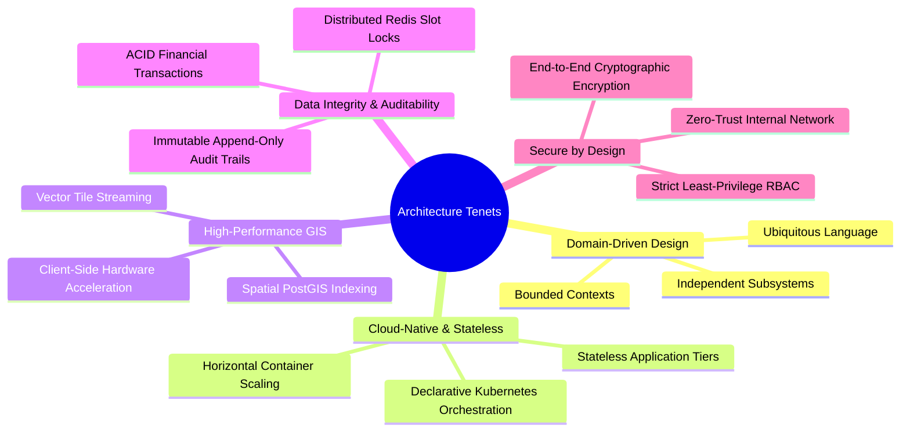
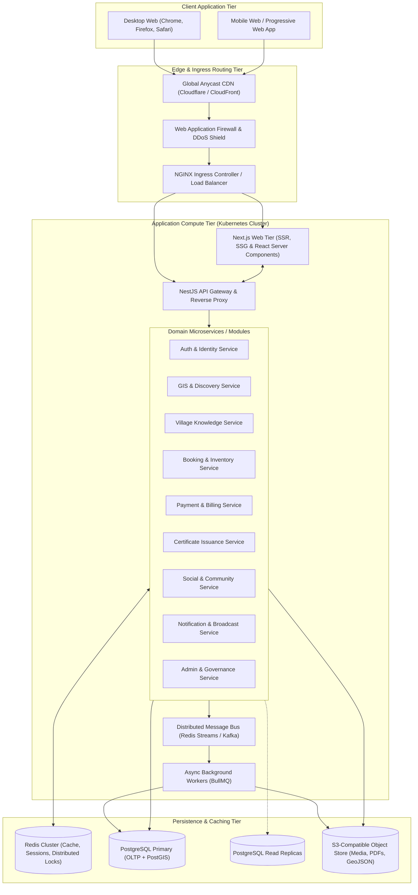
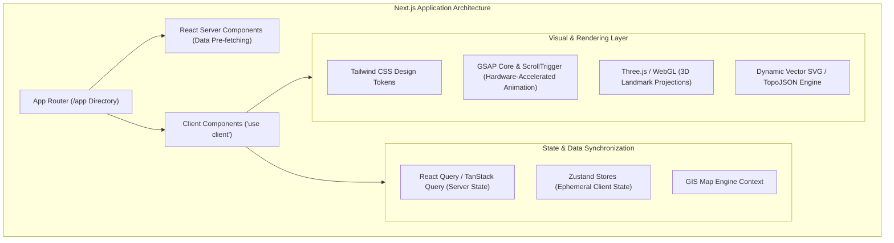
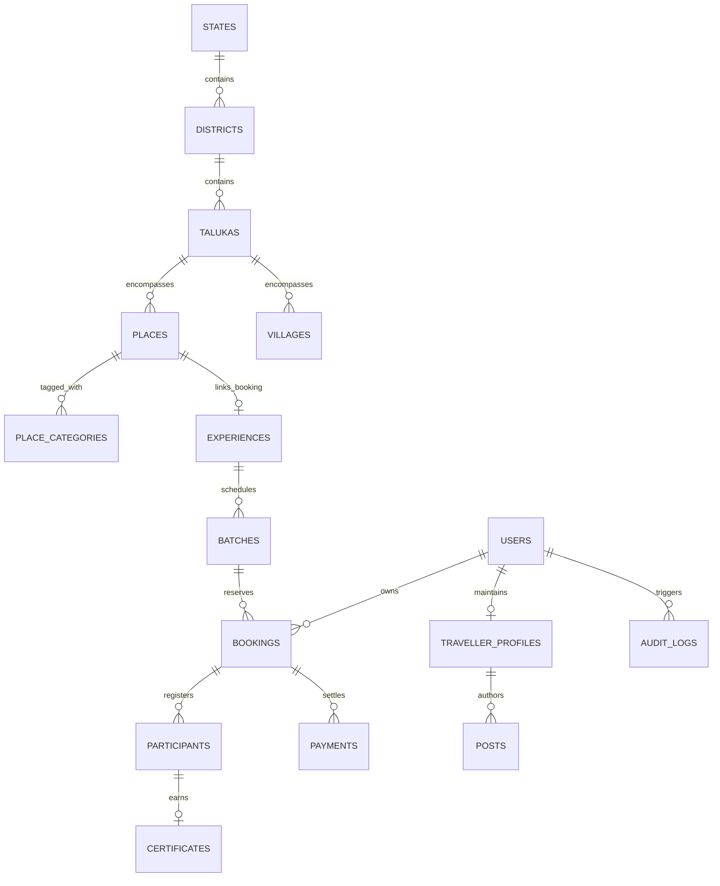
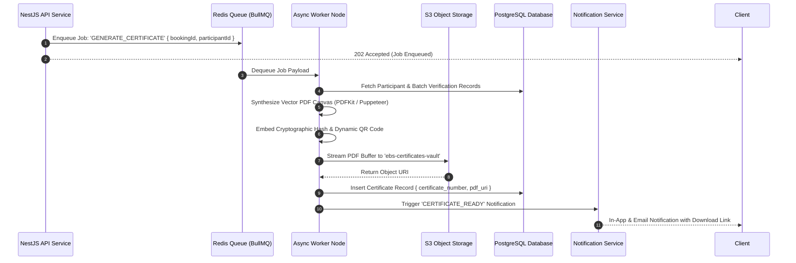
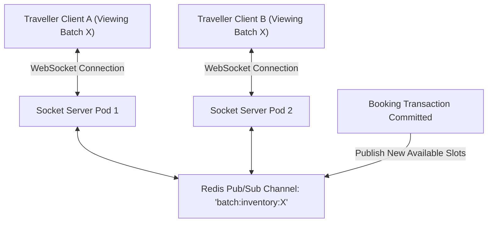
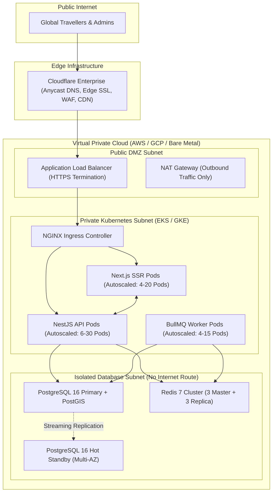

# Explore Bharat Safar — Core Technical Architecture & Infrastructure Blueprint

- **Document Identifier**: EBS-DOC-03-ARCH
- **Version**: 1.0.0
- **Status**: Approved
- **Author**: Enterprise Architecture & Solutions Engineering Team
- **Target Audience**: Chief Technology Officer, Enterprise Solution Architects, Lead Backend/Frontend Engineers, DevOps/Cloud Architects, Database Administrators, Security Officers
- **Related Documents**:
  - `01-idea.md`
  - `02-specification.md`
  - `09-api-design.md`
  - `10-database-design.md`
  - `11-security.md`
  - `16-map-engine.md`
  - `22-deployment.md`
  - `23-devops.md`
- **Last Updated**: 2026-09-28

---

## 1. Architectural Vision & Governing Principles

The **Explore Bharat Safar** technical architecture is designed as a resilient, enterprise-grade distributed system capable of serving millions of concurrent national and international explorers, handling burst booking loads during seasonal trekking openings, maintaining sub-second GIS spatial interactions, and securing sensitive fiscal and identity transactions.

### 1.1 Core Principles
- **Modularity & Decoupling**: Organized as clean, domain-isolated modules within a unified modular monolith / microservice-ready topology. Domains communicate strictly via formal internal service contracts or asynchronous event buses.
- **Stateless Application Services**: Web and API application tiers retain no in-memory session state; all ephemeral state is persisted in clustered Redis instances, allowing instantaneous horizontal pod autoscaling (HPA).
- **Spatial First-Class Citizenship**: Geographic and geospatial data are natively modeled via PostGIS spatial primitives rather than loose float coordinates, enabling accurate boundary containment, polygon intersections, and distance computations.
- **Provider Agnosticism**: Cartography, object storage, SMS/Email gateways, and payment processing are decoupled behind generic abstraction layers (ports and adapters pattern).

---

## 2. High-Level End-to-End System Architecture

---

## 3. Frontend Architecture (Next.js & Modern Web Stack)

The frontend is architected as an enterprise Next.js application utilizing the App Router, React Server Components (RSC), and TypeScript.

### 3.1 Technology Stack Specifications
- **Core Framework**: Next.js 14+ (App Router architecture with streaming SSR and React Server Components).
- **Type Safety**: TypeScript 5.x enforced under strict compiler flags (`noImplicitAny`, `strictNullChecks`).
- **Styling Architecture**: Tailwind CSS coupled with custom design token definitions (ensuring WCAG 2.1 AA compliant color contrasts).
- **Animation Framework**: GreenSock Animation Platform (GSAP 3) utilized for camera movements, SVG boundary interpolations, accordion expansions, and modal drawers.
- **3D Visualization**: Three.js WebGL canvas overlay for rendering lightweight, non-blocking 3D landmark icons directly above map coordinates.
- **Client Cache**: TanStack Query (React Query) configured with strict stale-while-revalidate policies, optimistic updates for social reactions, and background cache garbage collection.

---

## 4. Backend Architecture (NestJS / Node.js Modular Monolith)

The backend is built using NestJS and TypeScript, organized using Domain-Driven Design (DDD) principles into distinct bounded contexts.

```mermaid
graph LR
    subgraph CoreDomain["Domain Layer"]
        Entities["Domain Entities & Aggregates"]
        ValueObjects["Value Objects"]
        DomainEvents["Domain Events"]
    end

    subgraph AppDomain["Application Layer"]
        UseCases["Application Services / Use Cases"]
        Commands["Command Handlers (CQRS)"]
        Queries["Query Handlers (CQRS)"]
    end

    subgraph InfraDomain["Infrastructure Layer"]
        ORM["Prisma / TypeORM Mappings"]
        SpatialAdapters["PostGIS Geospatial Adapters"]
        PaymentAdapters["Payment Gateway Adapters (Razorpay, Stripe)"]
        MailerAdapters["Transactional Email / SMS Adapters"]
    end

    subgraph InterfaceDomain["Interface / Presentation Layer"]
        RESTControllers["REST API Controllers (OpenAPI / Swagger)"]
        WSGateways["WebSocket Gateways (Socket.io)"]
        CronControllers["Scheduled Job Controllers"]
    end

    InterfaceDomain --> AppDomain
    AppDomain --> CoreDomain
    InfraDomain --> CoreDomain
    AppDomain --> InfraDomain
```

### 4.1 Bounded Context Breakdown

| Bounded Context | Core Domain Responsibilities | Primary Data Entities |
| :--- | :--- | :--- |
| **Identity & Access** | Authentication, JWT signing/rotation, RBAC enforcement, session tracking. | `User`, `Role`, `Permission`, `RefreshToken`, `Session` |
| **GIS & Discovery** | National/State/District/Taluka boundaries, places, 3D landmark models. | `State`, `District`, `Taluka`, `Place`, `Landmark`, `Category` |
| **Village Knowledge** | Rural information, Panchayat profiles, public utilities, local directories. | `Village`, `PanchayatProfile`, `PublicFacility`, `LocalBusiness` |
| **Booking & Inventory** | Experience catalog, batch departures, real-time slot inventory, orders. | `Experience`, `Batch`, `Booking`, `Participant`, `InventoryLock` |
| **Payments & Invoicing** | Upfront deposit calculation, gateway integration, refunds, tax invoices. | `PaymentTransaction`, `Invoice`, `RefundRecord`, `PaymentLedger` |
| **Certificate Engine** | Automated vector PDF generation, cryptographic signature, QR encoding. | `Certificate`, `CertificateVerification` |
| **Social & Community** | Traveller profiles, feeds, stories, comments, reactions, travel timeline. | `TravellerProfile`, `Post`, `Story`, `Comment`, `Reaction`, `Community` |
| **Notification Engine** | Multi-channel delivery (In-app, WebSockets, Email, SMS, WhatsApp). | `Notification`, `NotificationPreference`, `DeliveryLog` |
| **Audit & Governance** | Immutable system-wide audit logging, content moderation queues. | `AuditLog`, `ModerationQueueItem` |

---

## 5. Database Architecture (PostgreSQL, PostGIS & Redis)

The data tier is structured around PostgreSQL as the single source of truth, enhanced by PostGIS for spatial operations and Redis for ultra-low latency caching and distributed synchronization.

### 5.1 Storage Architecture & Tiering
1. **Primary Relational Store (PostgreSQL 16+)**:
   - Master node configured for asynchronous replication to two Read Replicas.
   - Enforces referential integrity, foreign key constraints, cascading soft-deletes (`deleted_at IS NULL`), and audit columns (`created_at`, `updated_at`, `created_by`, `updated_by`).
   - PostGIS extension activated for native spatial data types (`geometry(Polygon, 4326)`, `geometry(Point, 4326)`).
2. **In-Memory Cache & Lock Store (Redis 7 Cluster)**:
   - Evaluates slot lock reservations via atomic Redis Lua scripts (`SET resource_id token NX PX 900000`).
   - Manages WebSocket pub/sub adapters for real-time inventory and chat messaging.
   - Implements sliding window rate-limiting algorithms to mitigate denial-of-service attempts.
3. **Distributed Object Storage (MinIO / AWS S3)**:
   - Direct, pre-signed upload URLs generated by backend services to reduce API server memory pressure.
   - Dedicated bucket isolation: `ebs-media-public`, `ebs-certificates-vault`, `ebs-private-documents`, `ebs-system-backups`.

---

## 6. Asynchronous Background Worker Architecture (BullMQ)

High-latency and CPU-intensive operations are completely offloaded from the synchronous HTTP request/response lifecycle into BullMQ worker queues backed by Redis:

### 6.1 Worker Queue Taxonomy
- **`queue-media-processing`**: Resizing images into responsive formats (AVIF, WebP), generating blurry LQIP placeholders, stripping EXIF privacy data, and executing video transcoding.
- **`queue-certificate-generation`**: Synthesizing vector-grade, print-ready PDF certificates with embedded QR codes upon batch clearance.
- **`queue-notifications`**: Asynchronously dispatching transactional emails (SendGrid / AWS SES), SMS alerts, and push notifications.
- **`queue-search-indexer`**: Ingesting database mutations into isolated search indices to support instantaneous typeahead and auto-complete.
- **`queue-audit-logger`**: Persisting high-volume system events and administrative traces without impacting HTTP latency.

---

## 7. Real-Time Communication Architecture (WebSockets)

Real-time state synchronization is orchestrated via Socket.io clusters utilizing Redis Pub/Sub adapters.

### 7.1 Real-Time Channels & Events
- **`inventory:batch:{batchId}`**: Broadcasts real-time slot decrements/increments upon confirmed payment or release of expired locks.
- **`notification:user:{userId}`**: Delivers immediate, non-intrusive toast notifications for booking confirmations, moderator approvals, or community mentions.
- **`admin:dashboard:metrics`**: Streams real-time concurrent user counters, active booking transactions, and pending moderation queue counts to Super Admin consoles.

---

## 8. Network Topology & Production Deployment Blueprint

---

## 9. Failure Modes, High Availability & Disaster Recovery

| Subsystem Component | Potential Failure Scenario | Automated Resilience & Failover Strategy |
| :--- | :--- | :--- |
| **Primary Database (PostgreSQL)** | Hardware degradation or primary instance termination. | Automatic failover to Hot Standby replica via Patroni / AWS RDS Multi-AZ within $\le 30\text{ seconds}$; zero transactional loss for committed writes. |
| **Redis Node Failure** | Primary cache node failure. | Redis Sentinel / Cluster promotes replica to master in $\le 5\text{ seconds}$. Transient booking locks gracefully retry via exponential backoff. |
| **Payment Gateway Outage** | External gateway (e.g., Razorpay) reports 5xx errors or network timeout. | System maintains booking in `PENDING_PAYMENT` state, pauses slot expiry timer for up to 30 minutes, and triggers gateway failover routing. |
| **Object Storage Outage** | S3 bucket API timeout during media upload. | Direct client upload failure triggers circuit breaker; media upload queued locally in browser IndexedDB with automatic background retry. |
| **High-Volume Spike (Flash Sale)** | 100,000+ users arrive simultaneously for seasonal trek registration. | CDN absorbs all static pages and GeoJSON vector assets; API rate limiters throttle non-checkout requests; Redis distributed locks guarantee zero overbooking. |

---

## 10. Summary & Technical Alignment

This architectural blueprint establishes the structural, computational, and spatial backbone of Explore Bharat Safar. All subsequent implementation documents—including UI/UX specifications in `04-ui-ux.md`, API endpoint declarations in `09-api-design.md`, relational schemas in `10-database-design.md`, and deployment playbooks in `22-deployment.md`—must adhere strictly to the modular topology, security boundaries, and data flows defined herein.
