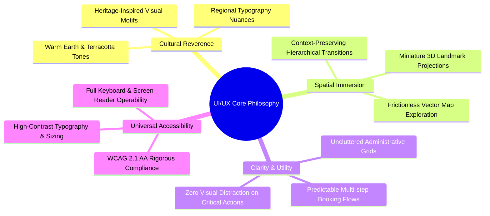
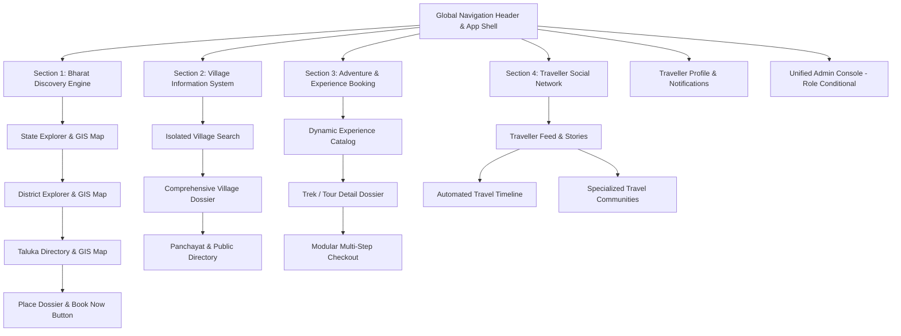
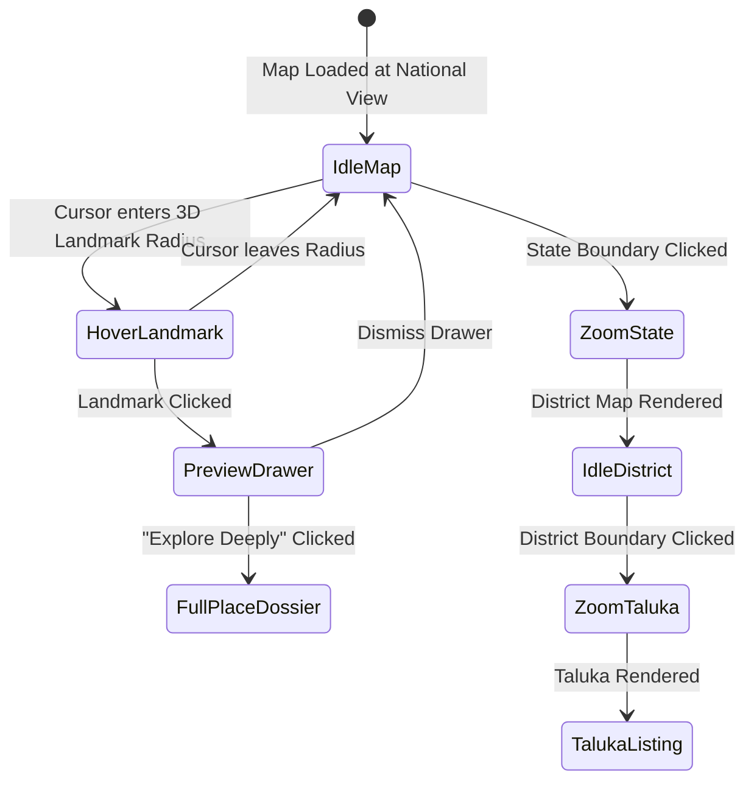
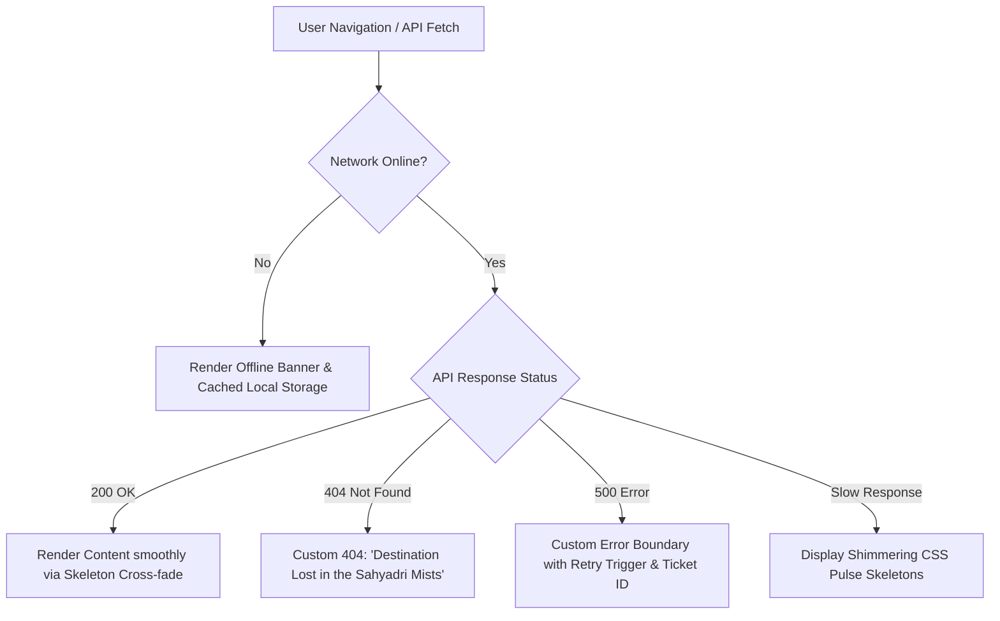

# Explore Bharat Safar — User Interface & User Experience (UI/UX) Design Specification

- **Document Identifier**: EBS-DOC-04-UIUX
- **Version**: 1.0.0
- **Status**: Approved
- **Author**: Enterprise Architecture & Solutions Engineering Team
- **Target Audience**: UI Designers, UX Researchers, Frontend Engineers, Mobile Developers, Product Managers, Accessibility Auditors
- **Related Documents**:
  - `01-idea.md`
  - `02-specification.md`
  - `03-architecture.md`
  - `06-styleguide.md`
  - `16-map-engine.md`
  - `17-animation.md`
- **Last Updated**: 2026-09-28

---

## 1. UI/UX Vision & Design Philosophy

The user experience of **Explore Bharat Safar** must evoke the grandeur, spiritual depth, ecological diversity, and vibrant cultural fabric of Bharat while upholding uncompromising standards of modern, accessible, and high-performance digital interaction.



### 1.1 The Dwell Experience
Unlike commercial travel portals that aggressively pressure visitors with urgency timers, blinking popups, and intrusive upsells, Explore Bharat Safar is designed for **immersive discovery**. Users should feel as though they are physically traversing the sovereign geography of India, effortlessly gliding from a sweeping national view down into ancient talukas and tranquil rural villages.

---

## 2. Information Architecture & Navigation Topology

The application’s information architecture is structured around four primary exploration domains, unified by a global, non-intrusive navigation shell.



---

## 3. Global Responsive Breakpoints & Layout Grids

The interface is engineered mobile-first using a fluid, responsive 12-column layout grid.

| Device Tier | Breakpoint Width ($\text{px}$) | Maximum Container Width | Column Count | Gutter Width | Margin Width |
| :--- | :--- | :--- | :--- | :--- | :--- |
| **Mobile Portrait** | $320\text{px} - 639\text{px}$ | $100\%$ fluid | 4 Columns | $16\text{px}$ | $16\text{px}$ |
| **Mobile Landscape / Small Tablet** | $640\text{px} - 767\text{px}$ | $600\text{px}$ | 8 Columns | $20\text{px}$ | $24\text{px}$ |
| **Tablet Portrait / Laptop** | $768\text{px} - 1023\text{px}$ | $720\text{px}$ | 12 Columns | $24\text{px}$ | $32\text{px}$ |
| **Desktop / Widescreen** | $1024\text{px} - 1439\text{px}$ | $1200\text{px}$ | 12 Columns | $32\text{px}$ | $48\text{px}$ |
| **Ultra-Wide / Display Workstations**| $\ge 1440\text{px}$ | $1440\text{px}$ (Fixed centered) | 12 Columns | $32\text{px}$ | Auto Margin |

---

## 4. Atomic Design Component Architecture

```mermaid
graph LR
    subgraph Atoms["Atoms (Foundational Elements)"]
        A1[Buttons & Icon Badges]
        A2[Typography Nodes]
        A3[Input Fields & Toggles]
        A4[Map Marker Pins]
    end

    subgraph Molecules["Molecules (Functional Units)"]
        M1[Search Input with Autocomplete]
        M2[Landmark 3D Preview Tooltip]
        M3[Batch Availability Badge]
        M4[Participant Card Item]
    end

    subgraph Organisms["Organisms (Complex Modules)"]
        O1[Interactive Vector GIS Map Canvas]
        O2[Village Public Directory Card]
        O3[Booking Pricing & Partial Pay Calculator]
        O4[Social Expedition Journal Post]
    end

    subgraph Templates["Templates (Page Layouts)"]
        T1[Exploration Map Split-Pane Layout]
        T2[Village Encyclopedia Layout]
        T3[Expedition Checkout Layout]
    end

    Atoms --> Molecules
    Molecules --> Organisms
    Organisms --> Templates
```



---

## 5. Screen Layout Specifications & Wireframe Requirements

As mandated by system documentation standards, explicit technical wireframe layout specifications are detailed below for each primary interface.

### 5.1 Section 1: Bharat Discovery Engine (Homepage & GIS Map)

> **Illustration Required: Homepage Wireframe**  
> *Conceptual Layout*: Full-screen interactive vector map of Bharat centered at coordinates $(22.3511^\circ\text{ N}, 78.6677^\circ\text{ E})$. Top floating navigation bar with glassmorphic backdrop (`backdrop-blur-md`). Center-floating isolated search bar. Left floating hierarchical breadcrumb trail ($India \rightarrow State \rightarrow District \rightarrow Taluka$). Interactive miniature 3D landmark icons floating above coordinate centroids with subtle ambient animation. Bottom-right floating zoom, pan reset, and layer toggle controls. Bottom-left dynamic statistics widget (Total States Documented, Verified Landmarks, Rural Villages).

> **Illustration Required: India GIS Map**  
> *Interaction Architecture*: Clicking any state boundary (e.g., Maharashtra) smoothly initiates a GSAP camera zoom tween. The non-selected states gracefully desaturate to opacity 0.35. A sliding bottom drawer emerges smoothly, presenting the State Overview, key travel statistics, and internal district polygon outlines.

> **Illustration Required: District Map & Taluka Map**  
> *Drilldown View*: Within the State view, hovering over a district illuminates its boundary with a warm saffron stroke (`#D97706`). Clicking loads the District page dynamically below the map canvas without a jarring browser refresh. The map seamlessly zooms further to reveal taluka subdivision polygons and localized heritage markers.

### 5.2 Section 1: Place Details Page & Book Now Integration

```text
+-----------------------------------------------------------------------------------+
|  [Header: Logo | Search Section 1 | Languages | Currency | Profile / Login]       |
+-----------------------------------------------------------------------------------+
|  [Breadcrumbs: India > Maharashtra > Raigad > Mahad > Raigad Fort]                |
|                                                                                   |
|  HERO SECTION: High-Res Image Carousel & Progress Dots                            |
|  [H1: Raigad Fort — The Sovereign Capital of Chhatrapati Shivaji Maharaj]        |
|  [Badge: Hill Fort] [Badge: UNESCO Tentative] [Rating: 4.85 ★ (1,420 Reviews)]   |
+-------------------------------------------------+---------------------------------+
|  LEFT CONTENT COLUMN (8 Columns)                |  RIGHT STICKY COLUMN (4 Columns)|
|                                                 |                                 |
|  1. Comprehensive Historical Overview           |  QUICK LOGISTICS SUMMARY        |
|  2. Architectural Features & Bastion Layout     |  - Operating Hours: 06:00-18:00 |
|  3. Cultural Significance & Annual Jatra Dates  |  - Entry Fee: ₹25 (Dom) / ₹300  |
|  4. Seasonal Travel Advisory & Weather Chart    |  - Ropeway Available: Yes       |
|  5. Facilities (Restrooms, Potable Water, Guide)|  - Parking Capacity: 400 Cars  |
|  6. Distance Matrix (Mumbai: 165km, Pune: 130km)|                                 |
|  7. Verified Reviews & Photo Gallery            |  [BOOK NOW CTA (Conditional)]   |
|                                                 |  * Only renders if enabled by   |
|                                                 |    Super Admin for this place   |
+-------------------------------------------------+---------------------------------+
```

### 5.3 Section 2: Rural Bharat & Village Knowledge System

> **Illustration Required: Village Dashboard & Profile Screen**  
> *Conceptual Layout*: Standardized rural encyclopedia layout. Top banner showcasing authentic village landscapes, Gram Panchayat office, and community gatherings. Split-pane layout:
> - Left Sidebar: Verified administrative contacts (Gram Sevak, Police Patil, Anganwadi supervisor, Primary Health Centre landline).
> - Main Canvas: Meaning and etymology of village name, settlement chronicles, major agricultural yields, weekly village markets (*haats*), and historical temples/shrines.
> - Embedded Google Maps / Leaflet iframe rendering the PostGIS cadastral polygon boundary.
> - Public Utilities Checklist: 4G/5G mobile reception grid, asphalt road connectivity indicator, drinking water sources.

### 5.4 Section 3: Experience Booking & Modular Checkout

> **Illustration Required: Booking Flow**  
> *Multi-Step Wizard Architecture*:
> 1. **Step 1: Batch & Date Selection**: Calendar date-picker displaying real-time available seat counters powered by WebSockets.
> 2. **Step 2: Participant Telemetry**: Dynamic forms capturing full name, age, gender, emergency contact phone, and mandatory medical declarations.
> 3. **Step 3: Optional Add-ons**: Checkbox cards for sleeping bag rentals, personal porter service, and organic trail meals.
> 4. **Step 4: Terms & Legal Waiver**: Scrollable legal terms with mandatory explicit checkbox. System captures timestamp and user ID immutably.
> 5. **Step 5: Payment Allocation**: Transparent display of Base Price, Taxes, Add-ons, and the Admin-Configured Upfront Deposit (e.g., *"Pay 25% Advance Today: ₹1,250 | Remaining ₹3,750 payable prior to departure"*).
> 6. **Step 6: Payment Gateway Modal**: Secure integration with external payment gateways (Razorpay / UPI / Card / NetBanking).

> **Illustration Required: Certificate Layout**  
> *Visual Synthesis Spec*: Landscape orientation $(297\text{mm} \times 210\text{mm})$. Bordered with classical Indian geometric motifs. Central embossed seal of Explore Bharat Safar. Bold typography rendering participant full name, completed expedition title, highest altitude achieved, and completion date. Embedded cryptographically verifiable QR code at bottom-left corner with unique verification hash. Bottom-right authorized expedition director digital signature.

### 5.5 Section 4: Traveller Social Network & Community Platform

> **Illustration Required: Feed Screen & Profile Screen**  
> *Feed Architecture*: Clean, chronological activity feed. 
> - Top Story Rail: Circular avatars displaying active 24-hour temporary travel stories with pulsing terracotta rings.
> - Expedition Journal Cards: Author avatar, trail verification badge, high-res photography carousel, elevation graph snippet, expedition narrative, and reaction bar (*Inspiring, Adventurous, Respect*).
> - Automated Travel Timeline: Profile screen rendering a vertical milestone trail tracking visited states, conquered peaks, and verified certificates.

### 5.6 Admin Panel & Governance Consoles

> **Illustration Required: Admin Dashboard & Notification Panel**  
> *Administration Shell*: High-density data grid featuring dark-slate sidebar navigation. Master metrics dashboard showing real-time concurrent active users, 24-hour booking revenue, pending village update tickets, and flagged social moderation items. Filterable data tables with bulk-action toolbars, JSON schema editors for dynamic navigation menus, and sliding slider controls for global upfront payment percentages.

---

## 6. Interaction Models & Micro-Interactions



### 6.1 Micro-Interaction Specifics
1. **Interactive Landmark Tokens**:
   - Hovering triggers a $300\text{ms}$ cubic-bezier scale up ($1.0 \rightarrow 1.15$), drop-shadow expansion (`rgba(217, 119, 6, 0.35)`), and smooth emergence of a pill-shaped tooltip.
2. **Real-Time Seat Decrementing**:
   - When another user confirms a booking on an active batch, the remaining seat badge flashes a subtle amber pulse (`scale(1.08)`) and smoothly decrements without re-rendering the entire page.
3. **Form Error Shakes**:
   - Failing validation fields (e.g., missing emergency contact number) execute a 3-cycle horizontal shake ($4\text{px}$ offset) accompanied by clear, descriptive helper text rendered in Crimson (`#DC2626`).

---

## 7. Accessibility & Universal Usability (WCAG 2.1 AA)

- **Keyboard Navigation Traversal**:
  - Full keyboard operability via `Tab`, `Shift+Tab`, `Enter`, `Escape`, and `Arrow` keys.
  - Interactive map boundaries support keyboard selection via arrow key panning and `Enter` key drilldown.
  - Visible, high-contrast focus rings (`2px solid #D97706` with `2px` offset) applied globally on all interactive elements.
- **Screen Reader Semantics**:
  - Semantic HTML5 structure (`<main>`, `<nav>`, `<article>`, `<aside>`, `<header>`, `<footer>`).
  - Complex vector maps embed hidden `<div role="region" aria-label="Interactive India Map">` containing an accessible ordered list of states and union territories.
  - Live inventory updates utilize `aria-live="polite"` regions so assistive technology users receive real-time availability updates without page interruptions.
- **Color Independence**:
  - Color is never used as the sole conveyor of information. All status badges (e.g., Booking Confirmed, Partially Paid, Expired) pair distinct color tokens with explicit text labels and SVG status icons.

---

## 8. Edge States, Error Boundaries & Offline Resilience



### 8.1 State Handling Specifications
- **Loading Skeletons**: Zero content shift (CLS score $\le 0.05$). Skeletons accurately match the geometric bounds of target cards, image carousels, and typography blocks with a subtle $1.5\text{s}$ shimmer animation.
- **Empty States**: When search filters return zero results (e.g., no waterfalls in a specific taluka), display an illustrated cultural motif with constructive next steps (e.g., *"No waterfalls documented in this taluka yet. Try broadening your category filter to all water bodies or nearby talukas."*).
- **Map Fallback Mode**: If WebGL/Three.js initialization fails due to client hardware limitations, the application gracefully downgrades to a lightweight, static SVG vector renderer without crashing.

---

## 9. Summary & Implementation Transition

This UI/UX specification governs the structural presentation, interactive behavior, and sensory aesthetic of Explore Bharat Safar. Frontend engineers and digital designers must implement all components in exact accordance with these guidelines, referencing `06-styleguide.md` for specific hex palettes, font metrics, and token definitions, and `17-animation.md` for GSAP motion parameters.
