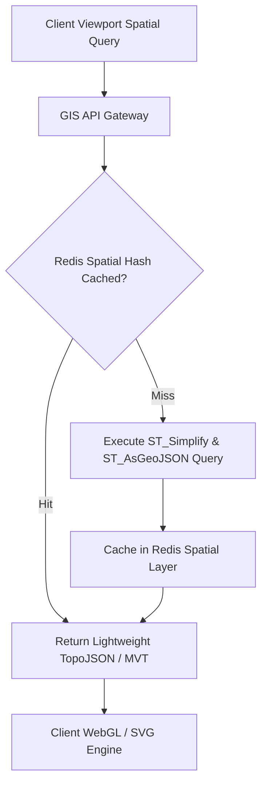
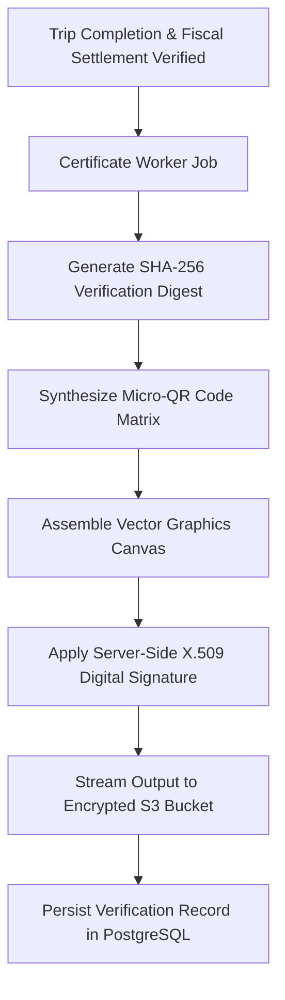
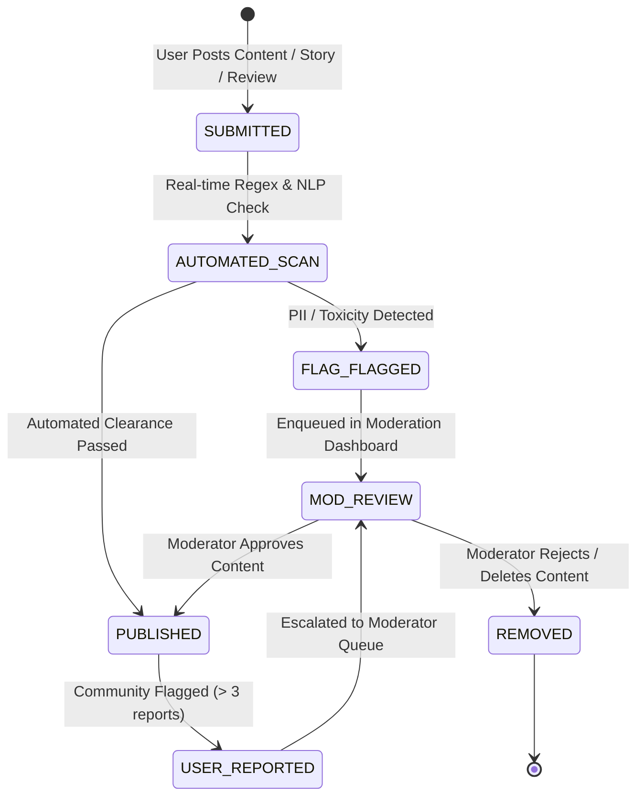

# Explore Bharat Safar — Detailed Requirements Document (DRD)

- **Document Identifier**: EBS-DOC-05-DRD
- **Version**: 1.0.0
- **Status**: Approved
- **Author**: Enterprise Architecture & Solutions Engineering Team
- **Target Audience**: Technical Product Managers, System Architects, Core Backend/Frontend Engineers, QA Automation Leads, Infrastructure Engineers
- **Related Documents**:
  - `02-specification.md`
  - `03-architecture.md`
  - `09-api-design.md`
  - `10-database-design.md`
  - `14-booking-system.md`
  - `21-payment-system.md`
  - `26-business-rules.md`
- **Last Updated**: 2026-09-28

---

## 1. Document Overview & Engineering Scope

The **Detailed Requirements Document (DRD)** translates the functional product vision and specifications into concrete, mathematically precise engineering requirements. It defines technical constraints, data schemas, mathematical formulations, concurrency models, state machine transitions, and automated verification criteria across all subsystems of **Explore Bharat Safar**.

---

## 2. Subsystem 1: GIS Map Engine & Spatial Precision Requirements



### 2.1 Cartographic Precision & Spatial Projections
- **Coordinate Reference System**: All geospatial coordinates must be ingested, stored, and computed in EPSG:4326 (WGS 84 spatial reference) and projected on the client side via EPSG:3857 (Web Mercator).
- **Simplification Thresholds**: To prevent excessive DOM node generation and GPU memory thrashing on mobile clients, polygon geometry must be simplified dynamically based on viewport zoom level using the Douglas-Peucker algorithm via PostGIS:

$$\text{Geometry Output} = \text{ST\_SimplifyPreserveTopology}(\text{geom}, \epsilon)$$

| Exploration Level | Target Zoom Band ($z$) | Tolerance Metric ($\epsilon$ in degrees) | Maximum GeoJSON Payload per Request | Target Frame Rate |
| :--- | :--- | :--- | :--- | :--- |
| **National Level (India)** | $4 \le z \le 6$ | $\epsilon = 0.015$ | $\le 1.8\text{ MB}$ (Gzipped: $\le 450\text{ KB}$) | $60\text{ fps}$ |
| **State Level** | $7 \le z \le 9$ | $\epsilon = 0.005$ | $\le 900\text{ KB}$ (Gzipped: $\le 220\text{ KB}$) | $60\text{ fps}$ |
| **District Level** | $10 \le z \le 12$ | $\epsilon = 0.001$ | $\le 450\text{ KB}$ (Gzipped: $\le 110\text{ KB}$) | $60\text{ fps}$ |
| **Taluka & Cadastral** | $13 \le z \le 18$ | $\epsilon = 0.0001$ (High fidelity) | $\le 250\text{ KB}$ per Taluka cluster | $60\text{ fps}$ |

### 2.2 Landmark Visualization Performance Rules
- **Coordinate Clamping**: All miniature 3D landmark icons must be pinned to immutable coordinate pairs stored in the database.
- **Occlusion & Dynamic Clustering**: If two or more landmark markers fall within a $48\text{px}$ radius on the active viewport, the client-side engine must automatically bundle them into a unified cluster node displaying the total count. Expanding or zooming past zoom level 11 must smoothly de-cluster the tokens using GSAP spring physics.

---

## 3. Subsystem 2: Village Information System Data Requirements

### 3.1 Hierarchical Validation Rules
No village record may exist without complete, unbroken foreign-key ancestry connecting it to a Taluka, District, and State:

$$\forall v \in \text{Villages}, \quad \exists ! \, t \in \text{Talukas}, \, d \in \text{Districts}, \, s \in \text{States} \quad \text{such that} \quad v \rightarrow t \rightarrow d \rightarrow s$$

### 3.2 Field Level Specifications & Data Contracts

```typescript
export interface IVillageDataContract {
  id: string; // UUID v4
  lgdCode: string; // Unique Local Government Directory (Census) Code (Length: 6-8 digits)
  nameEn: string; // English Romanized Name (Regex: /^[a-zA-Z\s\.\-']{2,100}$/)
  nameLocal: string; // Native Script Name (Devanagari / Regional, Max length: 150)
  talukaId: string; // Foreign Key to Taluka Aggregate
  pincode: string; // Standard Postal Index Number (Regex: /^[1-9][0-9]{5}$/)
  centroid: {
    latitude: number; // Range: 6.000000 to 38.000000
    longitude: number; // Range: 68.000000 to 98.000000
  };
  boundaryPolygon?: GeoJSON.Polygon; // PostGIS MultiPolygon / Polygon
  populationMetrics: {
    totalResidents: number; // Non-negative integer
    censusYear: number; // e.g., 2011, 2021, 2026
  };
  governance: {
    gramPanchayatName: string;
    gramSevakOfficePhone?: string; // Standard E.164 or Landline format
    policePatilContact?: string;
    officeTimings: string; // e.g., "10:00 - 17:00 Mon-Fri"
  };
  publicFacilities: {
    hasPrimaryHealthCentre: boolean;
    hasAmbulancePoint: boolean;
    hasPotableWaterSupply: boolean;
    hasElectricityGrid: boolean;
    roadConnectivityGrade: 'ASPHALT_PMGSY' | 'GRAVEL' | 'UNPAVED' | 'SEASONAL';
    mobileSignalCoverage: {
      provider: string; // 'Jio' | 'Airtel' | 'BSNL' | 'Vi'
      strength: 'NONE' | '2G_3G' | '4G' | '5G';
    }[];
  };
  approvalStatus: 'DRAFT' | 'PENDING_APPROVAL' | 'MODERATOR_APPROVED' | 'PUBLISHED' | 'REJECTED';
}
```

---

## 4. Subsystem 3: High-Concurrency Booking & Inventory Locking Engine

To completely eliminate overbooking conditions during flash registration events (e.g., highly anticipated winter treks or summer high-altitude batches), the booking subsystem implements an atomic, two-phase distributed inventory reservation model.

```mermaid
sequenceDiagram
    autonumber
    actor T as Traveller
    participant API as Booking API Gateway
    participant R as Redis Distributed Lock (Redlock)
    participant DB as PostgreSQL Database
    participant PG as Payment Gateway (Razorpay/Stripe)

    T->>API: POST /api/v1/bookings/reserve { batchId, slotsRequested: 2 }
    API->>R: Execute Atomic Lua Script (Check & Lock Slots)
    alt Slots Not Available
        R-->>API: Error: INSUFFICIENT_INVENTORY
        API-->>T: 409 Conflict ("Requested slots no longer available")
    else Slots Available
        R->>R: Decrement available_slots; Set Lock Key with 15-min TTL
        R-->>API: Reservation Token: 'RES_TOKEN_9A8F'
        API->>DB: Insert Booking Record (Status: 'PENDING_PAYMENT')
        API-->>T: 201 Created { bookingId, advancePayable, expiryTimestamp }
        
        opt Payment Succeeded within 15 mins
            T->>PG: Complete Payment Transaction
            PG-->>API: Webhook: 'payment.captured' (Signed Signature)
            API->>DB: Update Booking (Status: 'CONFIRMED' / 'PARTIALLY_PAID')
            API->>R: Commit Reservation (Delete Lock Key, Permanent Count Saved)
            API-->>T: Notification: "Booking Confirmed"
        end

        opt Lock Expired (> 15 mins without payment)
            R->>R: TTL Expiration triggers Keyspace Notification
            R->>R: Increment available_slots by 2
            R->>DB: Mark Booking as 'EXPIRED'
        end
    end
```

### 4.1 Redis Atomic Slot Reservation Script (Lua)
The slot reservation logic must execute as an indivisible atomic operation on the primary Redis cluster node:

```lua
-- Keys: KEYS[1] = "batch:inventory:{batchId}"
-- Args: ARGV[1] = requestedSlots, ARGV[2] = reservationId, ARGV[3] = ttlSeconds

local currentSlots = redis.call('GET', KEYS[1])
if not currentSlots then
    return redis.error_reply("BATCH_NOT_FOUND")
end

if tonumber(currentSlots) >= tonumber(ARGV[1]) then
    redis.call('DECRBY', KEYS[1], ARGV[1])
    local lockKey = "lock:booking:" .. ARGV[2]
    redis.call('SETEX', lockKey, tonumber(ARGV[3]), ARGV[1])
    return 1 -- SUCCESS
else
    return 0 -- INSUFFICIENT_CAPACITY
end
```

---

## 5. Subsystem 4: Financial Ledger & Dynamic Payment Allocation

### 5.1 Financial Formula Specifications
The booking pricing model enforces complete transparency and rigorous rounding precision (handled strictly via arbitrary-precision decimal mathematics, e.g., `Decimal.js` or SQL `numeric(12,2)`). Floating point binary arithmetic (`float` / `double`) is strictly prohibited.

$$\text{Base Ticket Total } (BTT) = \sum_{i=1}^{n} \text{TierPrice}(\text{Participant}_i)$$

$$\text{Addon Total } (AT) = \sum_{j=1}^{m} \text{AddonPrice}_j$$

$$\text{Subtotal } (ST) = BTT + AT - \text{DiscountAmount}$$

$$\text{Goods \& Services Tax } (GST) = \text{Round}_{2}\left( ST \times \frac{\text{GST Rate}}{100} \right)$$

$$\text{Total Booking Amount } (TBA) = ST + GST$$

$$\text{Mandatory Upfront Payment } (MUP) = \text{Round}_{2}\left( TBA \times \frac{\text{Admin Upfront Percentage}}{100} \right)$$

$$\text{Outstanding Balance Due } (OBD) = TBA - \text{Amount Paid To Date}$$

### 5.2 Ledger Invariants
1. **Invariant 1**: $\text{Total Amount Paid} + \text{Outstanding Balance Due} \equiv \text{Total Booking Amount}$.
2. **Invariant 2**: A booking cannot transition to `FULLY_PAID` unless $\text{Outstanding Balance Due} == 0.00$.
3. **Invariant 3**: A digital completion certificate cannot be generated or downloaded unless $\text{Outstanding Balance Due} == 0.00$ and attendance is verified.

---

## 6. Subsystem 5: Digital Certificate Synthesis Engine

### 6.1 Cryptographic Integrity & Dynamic Watermarking
Every issued certificate is synthesized dynamically as an immutable vector PDF document ($297\text{mm} \times 210\text{mm}$, A4 Landscape) adhering to PDF/A-1b archiving standards.



### 6.2 Certificate Cryptographic Verification Hash
The verification digest ensures that fraudulent tampering of participant names or completion dates can be detected instantly:

$$\text{Verification Digest} = \text{HMAC-SHA256}\left(\text{CertSecretKey}, \, \text{CertNum} \,\|\, \text{ParticipantName} \,\|\, \text{ExpId} \,\|\, \text{Date}\right)$$

- **Verification Endpoint**: Resolves at `https://explorebharatsafar.in/verify/{CertNum}`.
- **Embedded Security Elements**:
  - Guilloche vector border patterns resistant to digital recreation.
  - Micro-printed text containing the unique verification hash.
  - Machine-readable high-contrast QR code resolving to the live platform verification record.

---

## 7. Subsystem 6: Social Platform & Content Moderation

### 7.1 Moderation State Machine



### 7.2 Temporary Story Lifespan & Garbage Collection
- **Retention Period**: Ephemeral stories have an absolute lifespan of exactly $86,400\text{ seconds}$ (24 hours) from the timestamp of successful publication (`published_at`).
- **Archival Protocol**: An automated background worker executing every 10 minutes queries all records where `status == 'ACTIVE' AND published_at <= NOW() - INTERVAL '24 HOURS'`, updates their status to `'ARCHIVED'`, invalidates the CDN edge cache, and transitions the media files to low-cost cold object storage.

---

## 8. Verification & Acceptance Testing Protocol

| Subsystem | Test Scenario | Expected Engineering Behavior | Verification Method |
| :--- | :--- | :--- | :--- |
| **GIS Engine** | Rapid viewport panning across 5 state boundaries in $< 2\text{ seconds}$. | Zero frame drops below $55\text{ fps}$; memory footprint remains $< 120\text{ MB}$; stale tile requests aborted via `AbortController`. | Chrome DevTools Performance Profiler & WebGL Inspector. |
| **Booking Engine** | 1,000 concurrent checkout attempts for a batch having exactly 10 available slots. | Exactly 10 reservations succeed with `201 Created`; 990 requests receive `409 Conflict`; zero negative inventory recorded. | Distributed Load Test using k6 / Artillery scripts. |
| **Payment Ledger** | Partial payment of 25% executed on a ₹4,000 order; balance remains ₹3,000. Certificate requested. | System returns `403 Forbidden` (`CERT_BALANCE_DUE`); certificate generation job rejected by queue worker. | Automated Integration Test Suite (Jest / Supertest). |
| **Village Admin** | Unauthorized user attempts direct write to `POST /api/v1/villages/{id}/publish`. | API Gateway intercepts request, detects lack of Super/Sub Admin permission, rejects with `403 Forbidden`, and writes security audit log. | End-to-End API Security Test Suite (OWASP ZAP). |

---

## 9. Summary & Downstream Alignment

This Detailed Requirements Document provides the rigorous technical blueprints necessary for backend, frontend, database, and DevOps implementation. Every technical threshold, cryptographic routine, and database invariant specified here directly informs the database design in `10-database-design.md`, the API specifications in `09-api-design.md`, and the business rules in `26-business-rules.md`.
