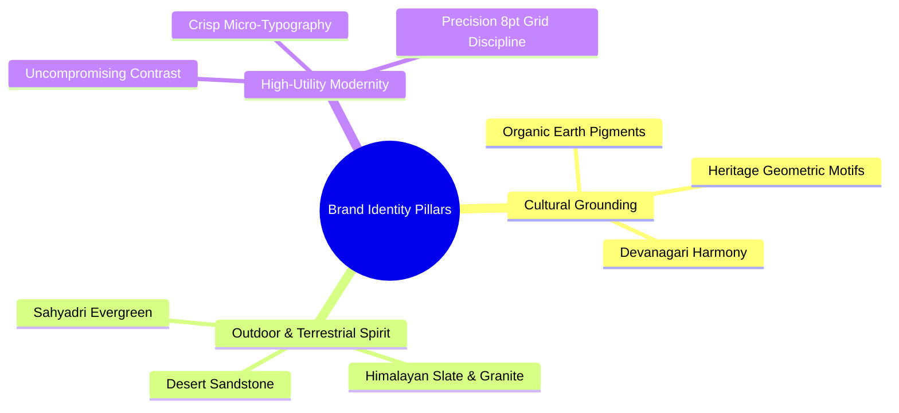
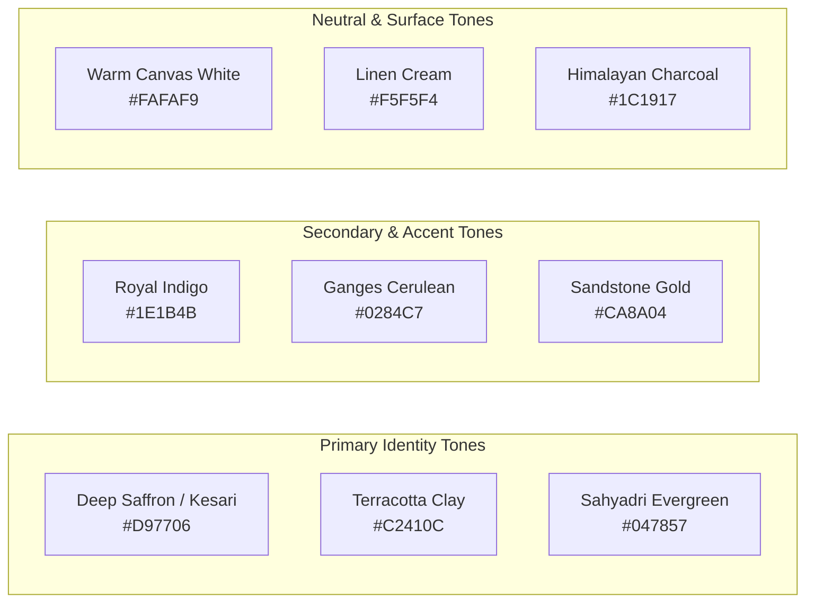
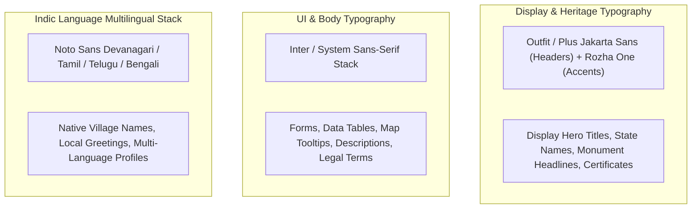
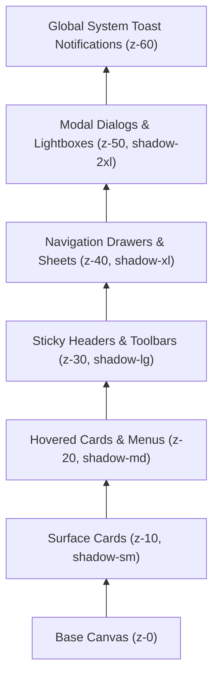

# Explore Bharat Safar — Visual Design System, Brand Identity & Style Guide

- **Document Identifier**: EBS-DOC-06-STYLE
- **Version**: 1.0.0
- **Status**: Approved
- **Author**: Enterprise Architecture & Solutions Engineering Team
- **Target Audience**: UI Designers, Brand Strategists, Frontend Engineers, Mobile Developers, Design System Engineers
- **Related Documents**:
  - `01-idea.md`
  - `04-ui-ux.md`
  - `16-map-engine.md`
  - `17-animation.md`
  - `27-folder-structure.md`
- **Last Updated**: 2026-09-28

---

## 1. Brand Identity & Visual Philosophy

The brand identity of **Explore Bharat Safar** balances the timeless cultural richness, architectural grandeur, and organic rural textures of India with the clean, sophisticated ergonomics of modern enterprise interface design.



### 1.1 Brand Archetype & Tone of Voice
- **Archetype**: The Wise Explorer & Guardian of Heritage (*Rishi-Margadarshak*).
- **Voice**: Respectful, knowledgeable, welcoming, clear, and adventurous.
- **Tone**: Authoritative without being bureaucratic; poetic without sacrificing operational precision.

---

## 2. Color Architecture & Design Tokens

The color palette is derived directly from the geological and cultural geography of Bharat: the terracotta clay of the Indus Valley, the deep evergreen of the Western Ghats rainforests, the sandstone of Rajasthan, and the sacred saffron ochre of historical banners.



### 2.1 Color Palette Specifications & Token Mappings

| Color Token Name | Hex Code | HSL Value | WCAG Contrast on Light Surface | Primary Usage & Application |
| :--- | :--- | :--- | :--- | :--- |
| `--color-saffron-primary` | `#D97706` | $37^\circ, 94\%, 44\%$ | $4.62:1$ (AA Pass) | Primary CTAs, active map boundaries, milestone highlights. |
| `--color-saffron-dark` | `#B45309` | $35^\circ, 91\%, 37\%$ | $6.12:1$ (AAA Pass) | Interactive hover states, primary link highlights, text emphasis. |
| `--color-terracotta` | `#C2410C` | $17^\circ, 88\%, 40\%$ | $5.38:1$ (AAA Pass) | Cultural badges, fort categories, temporary story rings. |
| `--color-evergreen` | `#047857` | $160^\circ, 94\%, 24\%$ | $6.85:1$ (AAA Pass) | Eco-tourism markers, nature trails, verified attendance tags. |
| `--color-indigo-slate` | `#1E1B4B` | $244^\circ, 47\%, 20\%$ | $12.45:1$ (AAA Pass) | Primary typography, headers, dark admin sidebar surfaces. |
| `--color-ganges-blue` | `#0284C7` | $200^\circ, 98\%, 39\%$ | $4.81:1$ (AA Pass) | River routes, lake markers, information callouts. |
| `--color-sandstone` | `#CA8A04` | $42^\circ, 96\%, 40\%$ | $4.55:1$ (AA Pass) | Star ratings, premium expedition badges, warning notices. |

### 2.2 Semantic & Feedback Palette

| Semantic Token | Hex Code | Application Context | Associated Icon |
| :--- | :--- | :--- | :--- |
| `--color-success-bg` / `--text` | `#DCFCE7` / `#15803D` | Payment completed, booking confirmed, certificate verified. | `CheckCircle2` |
| `--color-warning-bg` / `--text` | `#FEF3C7` / `#B45309` | Low slot availability, pending moderation, weather advisory. | `AlertTriangle` |
| `--color-danger-bg` / `--text` | `#FEE2E2` / `#B91C1C` | Payment failed, booking cancelled, session expired, form error. | `XCircle` |
| `--color-info-bg` / `--text` | `#E0F2FE` / `#0369A1` | Travel tips, gear guidelines, route advisories. | `Info` |

---

## 3. Typography Hierarchy & Font Stacks

To communicate both historical dignity and operational clarity, Explore Bharat Safar utilizes a paired font system: a stately serif for cultural headlines and an ultra-legible geometric sans-serif for UI controls, data grids, and mobile readability.



### 3.1 Modular Type Scale (Based on 1.250 Major Third)

| Typography Level | CSS Class / Token | Font Weight | Desktop Size / Line-Height | Mobile Size / Line-Height | Tracking / Spacing |
| :--- | :--- | :--- | :--- | :--- | :--- |
| **Display 1** | `text-display-1` | 800 (ExtraBold) | $56\text{px} / 64\text{px}$ | $36\text{px} / 44\text{px}$ | `-0.025em` |
| **Heading 1** | `text-h1` | 700 (Bold) | $40\text{px} / 48\text{px}$ | $28\text{px} / 36\text{px}$ | `-0.02em` |
| **Heading 2** | `text-h2` | 700 (Bold) | $32\text{px} / 40\text{px}$ | $24\text{px} / 32\text{px}$ | `-0.015em` |
| **Heading 3** | `text-h3` | 600 (SemiBold) | $24\text{px} / 32\text{px}$ | $20\text{px} / 28\text{px}$ | `-0.01em` |
| **Heading 4** | `text-h4` | 600 (SemiBold) | $20\text{px} / 28\text{px}$ | $18\text{px} / 24\text{px}$ | `0.00em` |
| **Body Large** | `text-body-lg` | 400 / 500 | $18\text{px} / 28\text{px}$ | $16\text{px} / 24\text{px}$ | `0.00em` |
| **Body Regular** | `text-body-base` | 400 (Regular) | $16\text{px} / 24\text{px}$ | $14\text{px} / 20\text{px}$ | `0.00em` |
| **Body Small** | `text-body-sm` | 400 / 500 | $14\text{px} / 20\text{px}$ | $12\text{px} / 16\text{px}$ | `+0.01em` |
| **Caption / Meta**| `text-caption` | 500 (Medium) | $12\text{px} / 16\text{px}$ | $11\text{px} / 14\text{px}$ | `+0.02em` |

---

## 4. Spacing System, Elevation & Border Radii

Layouts strictly conform to an **8-point linear grid** ($8\text{px}, 16\text{px}, 24\text{px}, 32\text{px}, 40\text{px}, 48\text{px}, 64\text{px}, 96\text{px}$).

### 4.1 Elevation Shadows & Z-Index Layering



- **`shadow-sm`**: `0 1px 2px 0 rgba(28, 25, 23, 0.05)`
- **`shadow-md`**: `0 4px 6px -1px rgba(28, 25, 23, 0.08), 0 2px 4px -2px rgba(28, 25, 23, 0.05)`
- **`shadow-lg`**: `0 10px 15px -3px rgba(28, 25, 23, 0.10), 0 4px 6px -4px rgba(28, 25, 23, 0.05)`
- **`shadow-saffron-glow`**: `0 0 20px 2px rgba(217, 119, 6, 0.35)` (Reserved for selected map landmarks).

---

## 5. Component Design Standards

### 5.1 Interactive Buttons

```text
1. Primary Saffron Button:
   [ Background: #D97706 | Text: #FFFFFF (Bold) | Radius: 8px | Padding: 12px 24px ]
   Hover: #B45309 | Active: Scale(0.98) | Focus: 2px ring #D97706 with 2px offset

2. Secondary Terracotta Button:
   [ Background: #F5F5F4 | Border: 1px solid #D6D3D1 | Text: #1C1917 | Radius: 8px ]
   Hover: Border #C2410C & Text #C2410C

3. Ghost / Map Control Button:
   [ Background: rgba(255, 255, 255, 0.85) (Glassmorphism) | Border: 1px solid #E7E5E4 ]
   Hover: Background: #FFFFFF | Shadow: shadow-md

4. Destructive Action Button:
   [ Background: #DC2626 | Text: #FFFFFF | Radius: 8px ]
   Hover: #B91C1C
```

### 5.2 Badges & Geographic Status Pills
- **Category Badge**: Rounded pill (`rounded-full`), height $24\text{px}$, padding $4\text{px} \times 10\text{px}$, font size $12\text{px}$ (SemiBold).
  - *Fort*: Border `#F97316`, Background `#FFF7ED`, Text `#C2410C`.
  - *Temple*: Border `#EAB308`, Background `#FEFCE8`, Text `#854D0E`.
  - *Waterfall*: Border `#0EA5E9`, Background `#F0F9FF`, Text `#0369A1`.
  - *Wildlife*: Border `#10B981`, Background `#ECFDF5`, Text `#047857`.

---

## 6. Iconography System & Cultural Visual Motifs

- **Primary Icon Library**: Lucide-react (vector SVG stroked at $1.75\text{px}$, $20\text{px} \times 20\text{px}$ default bounding box).
- **Custom Cultural Vector Motifs**:
  - *Fort Bastion*: Stylized stone parapet icon for hill and sea forts.
  - *Temple Shikhara*: Sacred spire silhouette for heritage shrines.
  - *Village Chaupal*: Traditional banyan tree outline for rural knowledge records.
  - *Trekking Compass*: Mountain peak intersecting an eight-point compass rose.
  - *Certificate Seal*: Twelve-petaled Ashoka lotus rosette encircling the platform monogram.

---

## 7. Tailwind CSS Configuration Implementation

```typescript
// tailwind.config.ts
import type { Config } from 'tailwindcss';

const config: Config = {
  darkMode: ['class'],
  content: ['./src/**/*.{ts,tsx,mdx}'],
  theme: {
    extend: {
      colors: {
        saffron: {
          50: '#FFFBEB',
          100: '#FEF3C7',
          500: '#F59E0B',
          600: '#D97706', // Primary Brand Color
          700: '#B45309',
          900: '#78350F',
        },
        terracotta: {
          500: '#EA580C',
          600: '#C2410C', // Secondary Brand Color
          700: '#9A3412',
        },
        evergreen: {
          500: '#10B981',
          600: '#059669',
          700: '#047857', // Nature / Conservation Token
        },
        earth: {
          50: '#FAFAF9',
          100: '#F5F5F4',
          800: '#292524',
          900: '#1C1917', // Primary Dark Typography
          950: '#0C0A09',
        },
      },
      fontFamily: {
        sans: ['var(--font-inter)', 'sans-serif'],
        display: ['var(--font-outfit)', 'sans-serif'],
        heritage: ['var(--font-rozha)', 'serif'],
        devanagari: ['var(--font-noto-devanagari)', 'sans-serif'],
      },
      boxShadow: {
        'saffron-glow': '0 0 20px 2px rgba(217, 119, 6, 0.35)',
        'glass-panel': '0 8px 32px 0 rgba(28, 25, 23, 0.08)',
      },
      borderRadius: {
        card: '12px',
        button: '8px',
        drawer: '20px',
      },
    },
  },
  plugins: [require('@tailwindcss/typography'), require('@tailwindcss/forms')],
};

export default config;
```

---

## 8. Summary & Downstream Alignment

This style guide establishes the definitive visual identity and design system for Explore Bharat Safar. All UI components, animation parameters, and front-end stylesheets must directly consume these tokens. It works hand-in-hand with `04-ui-ux.md` for layouts and `17-animation.md` for motion curves.
