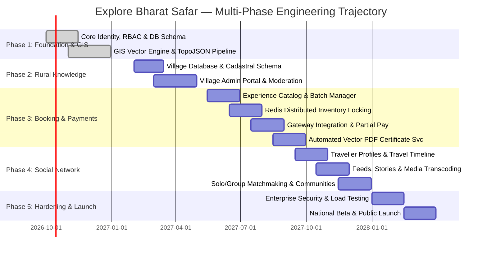
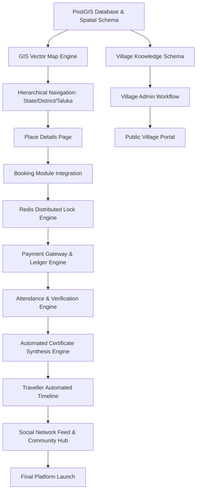
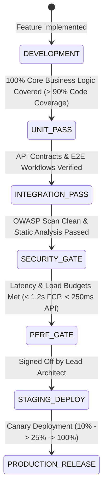

# Explore Bharat Safar — Engineering Roadmap, Phased Milestones & Release Strategy

- **Document Identifier**: EBS-DOC-07-ROADMAP
- **Version**: 1.0.0
- **Status**: Approved
- **Author**: Enterprise Architecture & Solutions Engineering Team
- **Target Audience**: Program Directors, Technical Product Managers, Engineering Leads, Scrum Masters, Release Managers, Key Stakeholders
- **Related Documents**:
  - `01-idea.md`
  - `02-specification.md`
  - `03-architecture.md`
  - `22-deployment.md`
  - `24-testing.md`
  - `38-project-checklist.md`
  - `39-future-updates.md`
- **Last Updated**: 2026-09-28

---

## 1. Roadmap Vision & Phasing Philosophy

The realization of **Explore Bharat Safar** requires a disciplined, multi-phase engineering trajectory. Due to the interconnected nature of GIS vector mapping, rural knowledge governance, high-concurrency booking locks, and social networking, development is structured into sequentially gated phases. Each phase establishes an immutable, production-tested foundation for subsequent modules.

---

## 2. Detailed Breakdown of Engineering Phases

### Phase 1: Core Foundation & Bharat Discovery Engine (Months 1–5)
- **Objective**: Establish the enterprise software foundation, relational schemas, authentication infrastructure, and the national-to-taluka GIS spatial drilldown.
- **Key Deliverables**:
  1. Base Kubernetes VPC, CI/CD pipeline, and PostgreSQL 16 + PostGIS cluster setup.
  2. Identity & Access Management (OAuth2, JWT rotation, multi-role RBAC enforcement).
  3. Interactive India Vector Map rendering 28 States and 8 Union Territories with 60fps WebGL/SVG performance.
  4. Hierarchical spatial drilldown ($India \rightarrow State \rightarrow District \rightarrow Taluka \rightarrow Place$).
  5. 3D Landmark miniature visualization layer anchored with hover drawers and preview tooltips.
  6. Dedicated Section 1 isolated search engine.

### Phase 2: Village Information & Rural Bharat Knowledge System (Months 5–8)
- **Objective**: Deploy the rural knowledge repository, administrative directories, and two-tier content approval governance pipeline.
- **Key Deliverables**:
  1. Village data schema storing cadastral polygons, LGD census codes, and demographic telemetry.
  2. Scoped Village Admin portal enabling local representatives to submit historical chronicles, events, and photos.
  3. Two-tier review-and-publish workflow for regional Sub-Admins and Super Admins.
  4. Public Village directory featuring Gram Panchayat profiles, healthcare facilities, and local homestay listings.
  5. Isolated Section 2 search index restricted strictly to rural settlements.

### Phase 3: Travel Booking, Adventure & Experience Management System (Months 8–12)
- **Objective**: Launch the high-concurrency booking engine, dynamic partial-payment ledger, and cryptographic certificate synthesis service.
- **Key Deliverables**:
  1. Experience catalog supporting multi-day treks, heritage walks, and rural immersion camps.
  2. High-concurrency Redis-backed slot reservation engine with 15-minute lock timeouts.
  3. Super Admin-controlled upfront payment percentage engine ($10\% - 100\%$) and balance settlement workflows.
  4. Payment gateway integration (UPI, NetBanking, Cards) with automated webhook signature validation.
  5. Automated vector-grade PDF certificate generation service embedding unique verification digests and QR codes.
  6. Real-time slot availability synchronization across active sessions via WebSockets.

### Phase 4: Traveller Social Network & Community Platform (Months 12–15)
- **Objective**: Cultivate the community platform connecting conscious travellers, solo journeyers, and regional cultural guilds.
- **Key Deliverables**:
  1. Traveller profile management featuring visited-place metrics and automated travel timelines.
  2. Activity feed supporting multi-photo carousels, elevation charts, and expedition logs.
  3. Ephemeral 24-hour travel stories with automated garbage collection and archival workers.
  4. Solo traveller matching engine based on departure dates, trek difficulty ratings, and language preferences.
  5. Moderated community groups and verified place review submission pipelines.

### Phase 5: Hardening, Security Audits & National Production Launch (Months 15–18)
- **Objective**: Execute enterprise-grade security penetration tests, simulated flash-sale load testing, accessibility audits, and public launch.
- **Key Deliverables**:
  1. Distributed stress-testing with k6 simulating 2,500 simultaneous checkout operations and 50,000 active map viewers.
  2. Comprehensive third-party security audit and OWASP Top 10 penetration remediation.
  3. WCAG 2.1 AA accessibility sign-off across all web and mobile breakpoints.
  4. Disaster recovery and point-in-time database restoration drill ($RPO \le 5\text{ mins}, RTO \le 30\text{ mins}$).
  5. Production launch across all 28 States and 8 Union Territories.

---

## 3. Critical Path & Dependency Flow

---

## 4. Engineering Squad Structure & Resource Allocation

| Engineering Squad | Core Responsibilities | Headcount & Roles |
| :--- | :--- | :--- |
| **Squad Alpha: GIS & Discovery** | Vector tile rendering, spatial PostGIS queries, TopoJSON pipelines, 3D landmark WebGL shaders. | 1 Tech Lead, 2 GIS Engineers, 2 Frontend Specialists. |
| **Squad Beta: Rural Knowledge & CMS** | Village data models, Panchayat portals, editorial approval pipelines, media management. | 1 Tech Lead, 2 Fullstack Engineers, 1 UX Designer. |
| **Squad Gamma: Booking & Fintech** | High-concurrency slot locking, partial payment ledgers, gateway integrations, PDF certificate engine. | 1 Lead Architect, 2 Backend Engineers, 1 Frontend Engineer, 1 QA Automation Engineer. |
| **Squad Delta: Social & Community** | Real-time feeds, ephemeral stories, solo traveller matching, moderation dashboards, WebSockets. | 1 Tech Lead, 2 Fullstack Engineers, 1 Mobile/PWA Specialist. |
| **Squad Epsilon: DevOps & SecOps** | Kubernetes clusters, CI/CD pipelines, WAF, Redis clustering, monitoring, disaster recovery drills. | 1 DevOps Lead, 2 SREs, 1 Cybersecurity Engineer. |

---

## 5. Quality Gates & Release Management Criteria

Every milestone must successfully pass rigorous quality gates before promotion to the subsequent stage:

---

## 6. Summary & Downstream Alignment

This engineering roadmap defines the non-negotiable milestones, dependencies, and gating standards for Explore Bharat Safar. Every technical squad must execute in alignment with these timelines, referencing `08-context.md` for architectural domain boundaries, `22-deployment.md` for continuous delivery pipelines, and `38-project-checklist.md` for completion verification.
