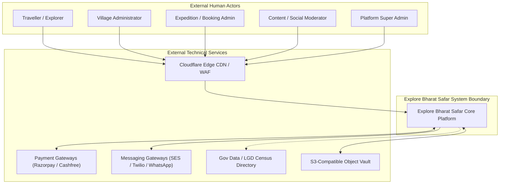
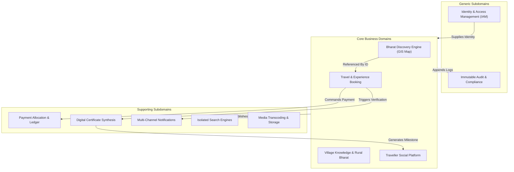
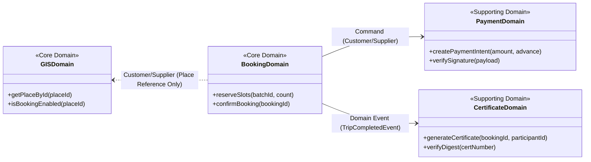
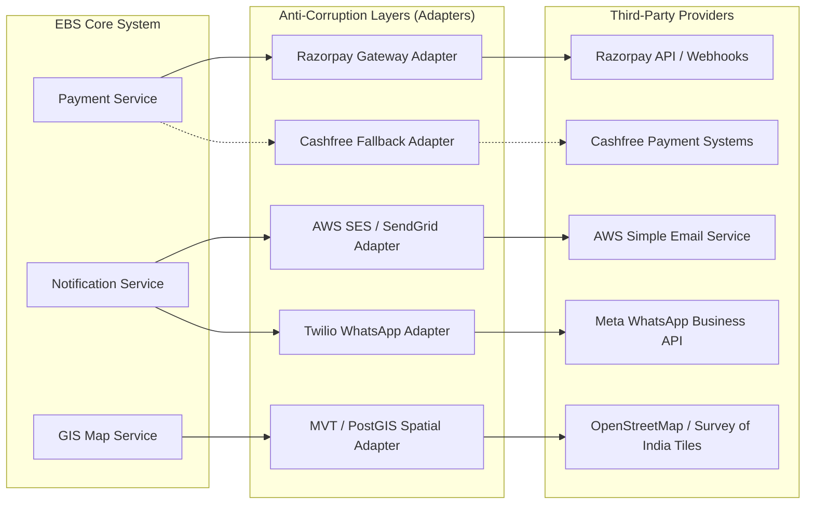

# Explore Bharat Safar — System Context, Domain Boundaries & Architectural Landscape

- **Document Identifier**: EBS-DOC-08-CONTEXT
- **Version**: 1.0.0
- **Status**: Approved
- **Author**: Enterprise Architecture & Solutions Engineering Team
- **Target Audience**: Enterprise Solution Architects, Domain Leads, Security Officers, Systems Integrators, Technical Product Managers
- **Related Documents**:
  - `01-idea.md`
  - `02-specification.md`
  - `03-architecture.md`
  - `09-api-design.md`
  - `10-database-design.md`
  - `26-business-rules.md`
  - `29-third-party-services.md`
- **Last Updated**: 2026-09-28

---

## 1. System Context & Environmental Landscape

**Explore Bharat Safar** exists at the intersection of geographical information systems (GIS), rural knowledge preservation, experiential adventure tourism, and social community networking.

To preserve operational stability and prevent monolithic coupling, the platform enforces strict **Domain-Driven Design (DDD)** bounded contexts. Each domain encapsulates its own business logic, domain entities, and data access rules, communicating with adjacent domains exclusively via well-defined internal APIs, domain events, or Anti-Corruption Layers (ACL).

---

## 2. Bounded Context Map (Domain-Driven Design)

The system is classified into **Core Domains**, **Supporting Domains**, and **Generic Domains**.

### 2.1 Domain Classifications & Strategic Value

| Domain Name | Category | Strategic Purpose & Business Value | Primary Aggregates |
| :--- | :--- | :--- | :--- |
| **Bharat Discovery Engine** | **Core Domain** | Provides the hierarchical, vectorized exploration of India down to taluka and attraction levels. High competitive differentiation. | `State`, `District`, `Taluka`, `Place`, `Landmark` |
| **Village Knowledge System** | **Core Domain** | Digitally archives and empowers over 600,000 rural villages and Gram Panchayats with multi-tier governance. | `Village`, `PanchayatProfile`, `PublicFacility`, `LocalDirectory` |
| **Experience Booking Engine**| **Core Domain** | High-concurrency batch scheduling, inventory locks, participant medical telemetry, and custom deposit rules. | `Experience`, `Batch`, `Booking`, `Participant` |
| **Traveller Social Platform**| **Core Domain** | Community engagement, travel journals, temporary stories, and verified traveller matchmaking. | `TravellerProfile`, `Post`, `Story`, `Community` |
| **Payment & Billing** | Supporting | Handles upfront partial payment math, payment gateway webhooks, refunds, and tax invoicing. | `PaymentTransaction`, `Invoice`, `LedgerEntry` |
| **Certificate Synthesis** | Supporting | Automated vector-grade PDF generation, HMAC signing, and public QR code verification. | `Certificate`, `VerificationDigest` |
| **Search Engine** | Supporting | Provides isolated, domain-specific text and spatial auto-complete without cross-domain bleed. | `SearchIndex`, `AutocompleteIndex` |
| **Identity & Access (IAM)** | Generic | Token issuance, password hashing, multi-factor authentication, and role authorization. | `User`, `Role`, `Permission`, `Session` |
| **Audit Logging** | Generic | Immutable system-wide trail recording all administrative mutations and security events. | `AuditLog` |

---

## 3. Inter-Domain Relationships & Integration Patterns

### 3.1 Formal Integration Contracts
1. **GIS Discovery $\leftrightarrow$ Booking Engine**:
   - The Place Details page in Section 1 references booking opportunities via the immutable `is_booking_enabled` boolean flag and an optional `experience_id` reference.
   - **Crucial Rule**: The GIS Place entity contains **zero** booking logic, pricing calculators, or batch inventory data. It simply provides a navigational bridge to the Booking Domain.
2. **Booking Engine $\rightarrow$ Payment Ledger**:
   - The Booking Engine creates an order and requests a payment intent from the Payment Domain.
   - The Payment Domain calculates the mandatory upfront deposit based on the Super Admin's configuration and manages external gateway communication via an Anti-Corruption Layer (ACL).
3. **Booking Engine $\rightarrow$ Certificate Engine**:
   - Upon completion of a trip batch, the Booking Admin verifies attendance.
   - The Booking Domain emits a `TripAttendanceVerifiedEvent`.
   - The Certificate Engine validates that `Outstanding Balance Due == 0.00` before triggering the asynchronous PDF generation worker.
4. **Certificate Engine $\rightarrow$ Traveller Social Profile**:
   - When a certificate is minted, a `CertificateIssuedEvent` is dispatched.
   - The Social Domain intercepts this event to automatically record a verified milestone badge onto the traveller's public travel timeline.

---

## 4. External Dependencies & Boundary Adaptations

---

## 5. Domain Invariants & Isolation Rules

- **Zero Search Cross-Bleed**: A search query originating in Section 1 (GIS Discovery) must never query tables or indexes belonging to Section 2 (Villages), Section 3 (Bookings), or Section 4 (Social).
- **Zero Direct Cross-Schema Writes**: The Social service cannot directly mutate tables belonging to the Booking or Identity schemas. All inter-domain state modifications must occur through validated API contracts or asynchronous event listeners.
- **Village Administration Sandbox**: A Village Admin's token provides access restricted to their assigned village record. They are completely quarantined from accessing or modifying any other village, booking record, or system configuration.

---

## 6. Summary & Downstream Alignment

This context document formally establishes the bounded contexts, interaction rules, and external boundaries of Explore Bharat Safar. These definitions dictate the REST/GraphQL endpoint structures in `09-api-design.md`, the relational schema boundaries in `10-database-design.md`, and the business rules in `26-business-rules.md`.
