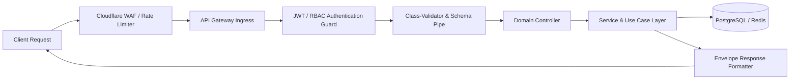
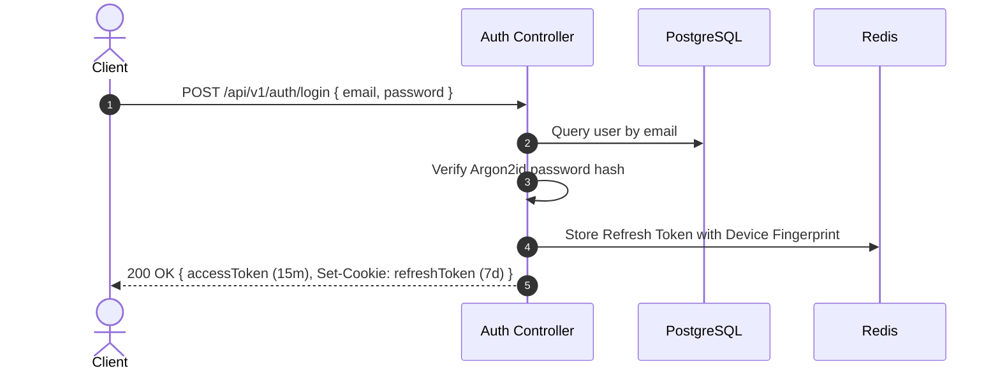
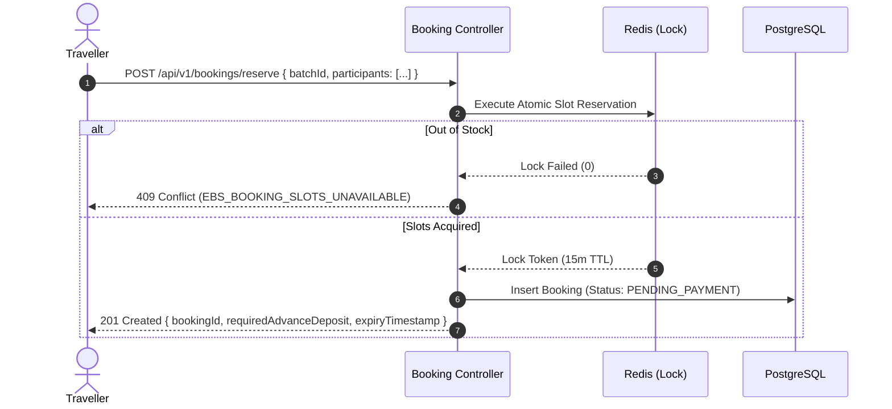

# Explore Bharat Safar — Enterprise API Architecture & Endpoint Specification

- **Document Identifier**: EBS-DOC-09-API
- **Version**: 1.0.0
- **Status**: Approved
- **Author**: Enterprise Architecture & Solutions Engineering Team
- **Target Audience**: Backend Engineers, Frontend Engineers, Mobile Developers, API Integration Partners, QA Automation Engineers
- **Related Documents**:
  - `02-specification.md`
  - `03-architecture.md`
  - `10-database-design.md`
  - `11-security.md`
  - `12-authentication.md`
  - `26-business-rules.md`
- **Last Updated**: 2026-09-28

---

## 1. API Architecture & Standard Protocols

The **Explore Bharat Safar** API tier is designed as an enterprise-grade RESTful application programming interface adhering to OpenAPI 3.1 standards. All communication is strictly encrypted via TLS 1.3, stateless, versioned, and strictly typed.



### 1.1 Universal Design Rules
- **Base URI Structure**: `https://api.explorebharatsafar.in/api/v1/{module}/{resource}`
- **Data Serialization**: JSON (`application/json; charset=utf-8`) across all endpoints.
- **Stateless Authentication**: Authenticated endpoints require an `Authorization: Bearer <JWT>` header containing an RS256-signed JSON Web Token.
- **Idempotency**: All mutation requests (`POST`, `PATCH`, `DELETE`) supporting financial or booking modifications accept an `Idempotency-Key: <UUIDv4>` header.
- **Correlation Tracking**: Every incoming request is stamped with an `X-Correlation-ID: <UUIDv4>` header to ensure end-to-end distributed tracing across microservice logs.

---

## 2. Standard Request & Response Envelopes

### 2.1 Standard Success Envelope
All successful API responses return HTTP 2xx and adhere to the following unified schema:

```json
{
  "success": true,
  "statusCode": 200,
  "data": {},
  "meta": {
    "timestamp": "2026-09-28T12:00:00.000Z",
    "correlationId": "8f3a21e4-9b2c-4e12-8812-7a6c9d0124b8",
    "pagination": {
      "page": 1,
      "limit": 20,
      "totalRecords": 1420,
      "totalPages": 71
    }
  }
}
```

### 2.2 Standard Error Envelope
All error responses return HTTP 4xx or 5xx with a standardized, actionable payload:

```json
{
  "success": false,
  "statusCode": 409,
  "error": {
    "errorCode": "EBS_BOOKING_SLOTS_UNAVAILABLE",
    "message": "The requested batch has insufficient available capacity.",
    "details": [
      {
        "field": "slotsRequested",
        "issue": "Requested 3 slots, but only 1 slot remains available."
      }
    ]
  },
  "meta": {
    "timestamp": "2026-09-28T12:00:05.120Z",
    "correlationId": "8f3a21e4-9b2c-4e12-8812-7a6c9d0124b8",
    "path": "/api/v1/bookings/reserve"
  }
}
```

---

## 3. Global HTTP Status Code & Error Taxonomy

| HTTP Code | Platform Semantic Usage | Error Code Prefix | Description / Resolution |
| :--- | :--- | :--- | :--- |
| **200 OK** | Standard successful read / update. | `N/A` | Request executed successfully. |
| **201 Created** | Successful creation of a new entity. | `N/A` | Resource provisioned; returns entity payload. |
| **202 Accepted** | Asynchronous job enqueued (PDF, Media). | `N/A` | Job processing in background; returns status URL. |
| **400 Bad Request** | Schema validation failure, malformed JSON. | `EBS_VALIDATION_*` | Correct payload fields according to validation errors. |
| **401 Unauthorized** | Missing, expired, or malformed JWT token. | `EBS_AUTH_EXPIRED` | Re-authenticate via `/auth/refresh` or login. |
| **403 Forbidden** | Role permission check failed. | `EBS_PERM_DENIED` | Authenticated user lacks required role / scope. |
| **404 Not Found** | Target resource ID does not exist. | `EBS_RESOURCE_NOT_FOUND` | Verify UUID and endpoint resource path. |
| **409 Conflict** | Concurrency conflict, inventory lock failed. | `EBS_LOCK_CONFLICT` | Resource locked or overbooked; retry with backoff. |
| **422 Unprocessable**| Semantic business rule violation. | `EBS_RULE_VIOLATION` | Payload syntactically valid but breaks business rule. |
| **429 Too Many Req** | Rate limiting threshold exceeded. | `EBS_RATE_EXCEEDED` | Slow down requests; inspect `Retry-After` header. |
| **500 Server Error** | Unhandled internal runtime exception. | `EBS_INTERNAL_ERROR` | System logged error; report correlation ID. |

---

## 4. Rate Limiting Specifications (Redis Sliding Window)

| API Scope / Route | Rate Limit Threshold | Window Period | Action upon Violation |
| :--- | :--- | :--- | :--- |
| **Public Discovery Read** (`/discovery/*`) | 120 Requests | 60 Seconds | HTTP 429; `Retry-After: 60` |
| **Isolated Search Endpoints** (`/search`) | 30 Requests | 60 Seconds | HTTP 429; `Retry-After: 30` |
| **Authentication & Login** (`/auth/login`) | 5 Attempts | 300 Seconds | HTTP 429; IP/Account temporary block |
| **Booking Reservation** (`/bookings/reserve`)| 10 Requests | 60 Seconds | HTTP 429; Bot protection challenge |
| **Payment Transactions** (`/payments/*`) | 15 Requests | 60 Seconds | HTTP 429; Gateway abuse prevention |
| **Social Content Creation** (`/social/posts`) | 6 Posts | 3600 Seconds | HTTP 429; Spam mitigation policy |

---

## 5. Domain API Catalog & Endpoint Declarations

### 5.1 Authentication & Identity Subsystem (`/api/v1/auth`)



#### Endpoints
- `POST /api/v1/auth/register`: Public registration for new Travellers.
- `POST /api/v1/auth/login`: Authenticate credentials, issue access JWT and HttpOnly refresh cookie.
- `POST /api/v1/auth/refresh`: Rotate refresh token and mint fresh 15-minute access JWT.
- `POST /api/v1/auth/logout`: Revoke active session token in Redis blacklist.
- `POST /api/v1/auth/forgot-password`: Initiate secure password reset email with temporary HMAC token.
- `POST /api/v1/auth/reset-password`: Complete password change using validated token.

---

### 5.2 Section 1: Bharat Discovery Engine API (`/api/v1/discovery`)

#### 1. Get States Directory
- **`GET /api/v1/discovery/states`**
- **Auth**: Public (Guest)
- **Response**: Array of states with ISO codes, sovereign boundaries flag, capital, and thumbnail.

#### 2. Get State Details & Embedded Districts
- **`GET /api/v1/discovery/states/{stateId}`**
- **Auth**: Public (Guest)
- **Query Params**: `includeDistricts=true`, `includeLandmarks=true`
- **Response**: Comprehensive state dossier, climate summary, culture, and district list.

#### 3. Get District Details & Embedded Talukas
- **`GET /api/v1/discovery/districts/{districtId}`**
- **Auth**: Public (Guest)
- **Response**: District topography, attractions count, and list of constituent talukas.

#### 4. Get Taluka Details & Places Registry
- **`GET /api/v1/discovery/talukas/{talukaId}`**
- **Auth**: Public (Guest)
- **Response**: Taluka headquarters, constituent places, and nearby villages.

#### 5. Get Complete Place Details
- **`GET /api/v1/discovery/places/{placeId}`**
- **Auth**: Public (Guest)
- **Response**: Full encyclopedic dossier, architecture notes, operating hours, coordinates, reviews, and `isBookingEnabled` status flag.

#### 6. Isolated Section 1 Search
- **`GET /api/v1/discovery/search?q={query}&level={state|district|taluka|place}`**
- **Auth**: Public (Guest)
- **Crucial Rule**: Strictly returns entities belonging to Section 1. Zero village or booking results.

---

### 5.3 Section 2: Rural Bharat & Village Knowledge API (`/api/v1/villages`)

#### 1. Search Villages (Isolated Section 2 Search)
- **`GET /api/v1/villages/search?name={name}&pincode={pincode}&talukaId={talukaId}`**
- **Auth**: Public (Guest)
- **Crucial Rule**: Returns exclusively village records, Gram Panchayat names, and census codes.

#### 2. Get Village Dossier
- **`GET /api/v1/villages/{villageId}`**
- **Auth**: Public (Guest)
- **Response**: Complete socio-cultural profile, Gram Panchayat governance, public utilities, local business directory, and PostGIS boundary geometry.

#### 3. Submit Village Profile Update (Village Admin)
- **`POST /api/v1/villages/{villageId}/updates`**
- **Auth**: Required (`Role: VILLAGE_ADMIN`)
- **Payload**:

```json
{
  "updateType": "PUBLIC_FACILITY_MODIFICATION",
  "changeData": {
    "hasPrimaryHealthCentre": true,
    "phcContactLandline": "+912144223101",
    "ambulanceAvailable": true
  },
  "editorialNotes": "Updated following construction of new government PHC center in Kudale."
}
```

- **Response**: `202 Accepted` with `ticketId`. Record created with `status: "PENDING_APPROVAL"`.

#### 4. Review & Moderate Village Update
- **`PATCH /api/v1/villages/moderation/{ticketId}`**
- **Auth**: Required (`Role: MODERATOR` or `SUPER_ADMIN`)
- **Payload**: `{ "action": "APPROVE" | "REJECT", "comments": "Verified with Gram Sevak records." }`
- **Response**: `200 OK` (Updates published to production or rejected with comments).

---

### 5.4 Section 3: Travel Booking & Experience Engine API (`/api/v1/bookings`)



#### 1. Reserve Batch Slots (Initiate Booking)
- **`POST /api/v1/bookings/reserve`**
- **Auth**: Required (`Role: TRAVELLER`)
- **Payload**:

```json
{
  "batchId": "b18a24e0-7c21-419b-a012-6a7f8e9124a1",
  "participants": [
    {
      "fullName": "Amitabh Sharma",
      "age": 28,
      "gender": "MALE",
      "emergencyPhone": "+919820123456",
      "medicalDeclaration": "None"
    },
    {
      "fullName": "Pooja Sharma",
      "age": 26,
      "gender": "FEMALE",
      "emergencyPhone": "+919820123456",
      "medicalDeclaration": "Asthma (Mild, carries inhaler)"
    }
  ],
  "addOnIds": ["add-on-sleeping-bag-rental"],
  "termsAccepted": true,
  "termsVersion": "2026.1"
}
```

- **Response**: `201 Created`

```json
{
  "bookingId": "ebs-ord-2026-88129",
  "status": "PENDING_PAYMENT",
  "pricing": {
    "basePriceTotal": 3600.00,
    "addOnsTotal": 400.00,
    "taxesGST": 200.00,
    "totalBookingAmount": 4200.00,
    "adminUpfrontPercentage": 25,
    "mandatoryAdvanceDeposit": 1050.00,
    "outstandingBalanceDue": 3150.00
  },
  "lockExpiresAt": "2026-09-28T12:15:00.000Z"
}
```

#### 2. Confirm Booking via Payment Intent
- **`POST /api/v1/bookings/{bookingId}/confirm-payment`**
- **Auth**: Required (`Role: TRAVELLER`)
- **Payload**: `{ "paymentTransactionId": "pay_O7g9a8F123z", "signature": "hmac_sig_..." }`
- **Response**: `200 OK` (Status updated to `CONFIRMED` or `PARTIALLY_PAID`).

---

### 5.5 Section 3: Digital Certificate Subsystem API (`/api/v1/certificates`)

#### 1. Public Certificate Verification Endpoint
- **`GET /api/v1/certificates/verify/{certificateNumber}`**
- **Auth**: Public (Zero authentication required)
- **Response**:

```json
{
  "isValid": true,
  "certificateNumber": "EBS-CERT-2026-HARISH-8F3A21",
  "participantName": "Amitabh Sharma",
  "experienceTitle": "Harishchandragad Monsoon Escarpment Trek",
  "highestAltitudeMeters": 1422,
  "completionDate": "2026-08-15",
  "verificationDigest": "7f8b91a2...sha256",
  "issuedBy": "Explore Bharat Safar Official Expedition Guild"
}
```

#### 2. Download Certificate Vector PDF
- **`GET /api/v1/certificates/{id}/download`**
- **Auth**: Required (Owner `TRAVELLER` or `SUPER_ADMIN`)
- **Response**: Binary stream `application/pdf` with `Content-Disposition: attachment; filename="EBS-Certificate-Amitabh-Sharma.pdf"`.

---

### 5.6 Section 4: Traveller Social Network API (`/api/v1/social`)

- **`GET /api/v1/social/feed?page=1&limit=20`**: Paginated feed of expedition journals and stories.
- **`POST /api/v1/social/posts`**: Create a new journey journal with image attachments and geotags.
- **`POST /api/v1/social/stories`**: Upload a 24-hour ephemeral travel story snippet.
- **`POST /api/v1/social/posts/{postId}/reactions`**: Toggle reaction (`INSPIRING`, `ADVENTUROUS`, `RESPECT`).
- **`POST /api/v1/social/posts/{postId}/comments`**: Threaded discussion reply.
- **`GET /api/v1/social/profile/{username}`**: Public traveller dossier with visited-count metrics and automated travel timeline.

---

### 5.7 Super Admin Governance API (`/api/v1/admin`)

- **`GET /api/v1/admin/metrics/overview`**: Real-time platform pulse (active users, total bookings, revenue, pending reviews).
- **`PATCH /api/v1/admin/config/payment-percentage`**: Set global or trip-specific mandatory deposit percentage ($10\% - 100\%$).
- **`PUT /api/v1/admin/config/navigation-tree`**: Reorder, rename, or toggle visibility of frontend navigation sections without code changes.
- **`PATCH /api/v1/admin/places/{placeId}/toggle-booking`**: Enable or disable the "Book Now" CTA on specific Section 1 place pages.

---

## 6. Summary & Downstream Alignment

This API specification defines the complete programmatic interface of Explore Bharat Safar. Every frontend data fetch, mobile query, and external integration must strictly implement these endpoints, status codes, and payload contracts. Relational database backings for these endpoints are fully detailed in `10-database-design.md`.
