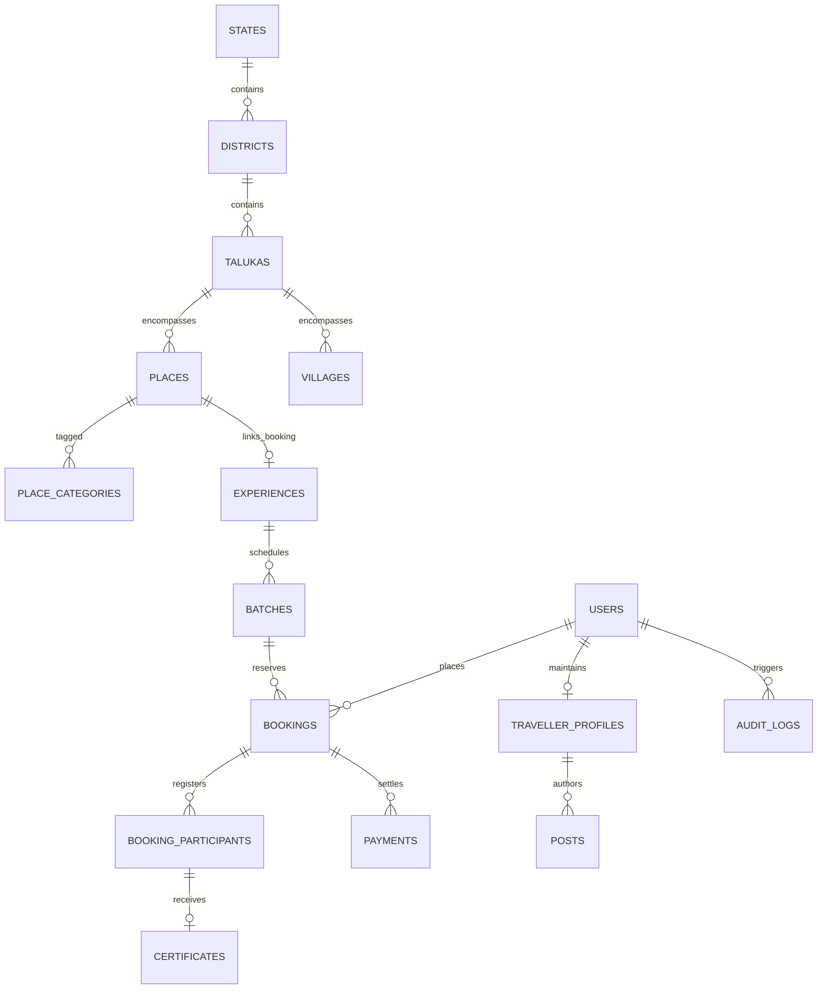

# Explore Bharat Safar — Enterprise Relational & Spatial Database Architecture

- **Document Identifier**: EBS-DOC-10-DATA
- **Version**: 1.0.0
- **Status**: Approved
- **Author**: Enterprise Architecture & Solutions Engineering Team
- **Target Audience**: Database Administrators, Backend Engineers, Data Engineers, Solutions Architects, Compliance Officers
- **Related Documents**:
  - `02-specification.md`
  - `03-architecture.md`
  - `05-drd.md`
  - `09-api-design.md`
  - `11-security.md`
  - `26-business-rules.md`
  - `33-er-diagram.md`
- **Last Updated**: 2026-09-28

---

## 1. Database Philosophy & Architectural Strategy

The persistence tier of **Explore Bharat Safar** is architected to deliver ACID guarantees for financial transactions and booking locks, native spatial intelligence for geographic exploration, and horizontal scalability for millions of village and social records.

```mermaid
graph TD
    AppTier[Application Services Tier] --> PgPool[PgBouncer Connection Pooler]
    PgPool --> PrimaryDB[PostgreSQL 16 Primary Master (Read/Write)]
    PrimaryDB -->|Streaming Wal Replication| Replica1[PostgreSQL Read Replica 1]
    PrimaryDB -->|Streaming Wal Replication| Replica2[PostgreSQL Read Replica 2]
    PrimaryDB --> PostGISExt[PostGIS 3.4 Spatial Engine]
    
    AppTier <--> RedisCluster[Redis 7 Cluster (Locks, Cache, Sessions)]
    AppTier <--> S3Storage[S3 Object Vault (Media, PDFs, GeoJSON)]
```

### 1.1 Core Database Tenets
- **Single Source of Truth**: PostgreSQL 16+ serving as the unified relational and spatial data store.
- **Strict Spatial Modeling**: Geographic boundaries and coordinate centroids are stored using PostGIS spatial types (`geometry(MultiPolygon, 4326)` and `geometry(Point, 4326)`) indexed via GiST (Generalized Search Trees).
- **Auditability & Traceability**: Every table enforces audit columns (`created_at`, `updated_at`, `created_by`, `updated_by`) and soft-delete capabilities (`deleted_at TIMESTAMP WITH TIME ZONE NULL`).
- **Data Partitioning**: High-volume tables (`audit_logs`, `notifications`, `payment_transactions`) are range-partitioned by month and year to maintain peak query execution performance.

---

## 2. Complete Entity-Relationship (ER) Overview



---

## 3. Schema Catalog & Table Definitions (DDL)

### 3.1 Schema: `identity_schema` (Authentication & Access Control)

```sql
CREATE SCHEMA IF NOT EXISTS identity_schema;

CREATE TABLE identity_schema.users (
    id UUID PRIMARY KEY DEFAULT gen_random_uuid(),
    email VARCHAR(255) UNIQUE NOT NULL,
    password_hash VARCHAR(255) NOT NULL,
    phone_number VARCHAR(20) UNIQUE NULL,
    is_email_verified BOOLEAN DEFAULT FALSE NOT NULL,
    is_phone_verified BOOLEAN DEFAULT FALSE NOT NULL,
    status VARCHAR(50) DEFAULT 'ACTIVE' NOT NULL, -- 'ACTIVE', 'SUSPENDED', 'LOCKED'
    failed_login_attempts INT DEFAULT 0 NOT NULL,
    locked_until TIMESTAMP WITH TIME ZONE NULL,
    created_at TIMESTAMP WITH TIME ZONE DEFAULT CURRENT_TIMESTAMP NOT NULL,
    updated_at TIMESTAMP WITH TIME ZONE DEFAULT CURRENT_TIMESTAMP NOT NULL,
    deleted_at TIMESTAMP WITH TIME ZONE NULL
);

CREATE TABLE identity_schema.roles (
    id UUID PRIMARY KEY DEFAULT gen_random_uuid(),
    code VARCHAR(50) UNIQUE NOT NULL, -- 'GUEST', 'TRAVELLER', 'VILLAGE_ADMIN', 'BOOKING_ADMIN', 'SUPER_ADMIN'
    name VARCHAR(100) NOT NULL,
    description TEXT,
    created_at TIMESTAMP WITH TIME ZONE DEFAULT CURRENT_TIMESTAMP NOT NULL
);

CREATE TABLE identity_schema.user_roles (
    user_id UUID NOT NULL REFERENCES identity_schema.users(id) ON DELETE CASCADE,
    role_id UUID NOT NULL REFERENCES identity_schema.roles(id) ON DELETE CASCADE,
    assigned_at TIMESTAMP WITH TIME ZONE DEFAULT CURRENT_TIMESTAMP NOT NULL,
    PRIMARY KEY (user_id, role_id)
);

CREATE INDEX idx_users_email_active ON identity_schema.users(email) WHERE deleted_at IS NULL;
CREATE INDEX idx_users_phone ON identity_schema.users(phone_number) WHERE deleted_at IS NULL;
```

---

### 3.2 Schema: `geo_spatial_schema` (Bharat Discovery Engine)

```sql
CREATE SCHEMA IF NOT EXISTS geo_spatial_schema;
CREATE EXTENSION IF NOT EXISTS postgis;

CREATE TABLE geo_spatial_schema.states (
    id UUID PRIMARY KEY DEFAULT gen_random_uuid(),
    name VARCHAR(100) UNIQUE NOT NULL,
    iso_code VARCHAR(10) UNIQUE NOT NULL, -- e.g., 'IN-MH', 'IN-RJ'
    capital VARCHAR(100) NOT NULL,
    official_languages TEXT[] NOT NULL,
    boundary_geom geometry(MultiPolygon, 4326) NOT NULL,
    centroid_geom geometry(Point, 4326) NOT NULL,
    overview_dossier JSONB NOT NULL, -- Cultural, climate, travel summary
    created_at TIMESTAMP WITH TIME ZONE DEFAULT CURRENT_TIMESTAMP NOT NULL,
    updated_at TIMESTAMP WITH TIME ZONE DEFAULT CURRENT_TIMESTAMP NOT NULL,
    deleted_at TIMESTAMP WITH TIME ZONE NULL
);

CREATE TABLE geo_spatial_schema.districts (
    id UUID PRIMARY KEY DEFAULT gen_random_uuid(),
    state_id UUID NOT NULL REFERENCES geo_spatial_schema.states(id) ON DELETE RESTRICT,
    name VARCHAR(100) NOT NULL,
    headquarters VARCHAR(100) NOT NULL,
    boundary_geom geometry(MultiPolygon, 4326) NOT NULL,
    centroid_geom geometry(Point, 4326) NOT NULL,
    emergency_directory JSONB NOT NULL,
    created_at TIMESTAMP WITH TIME ZONE DEFAULT CURRENT_TIMESTAMP NOT NULL,
    updated_at TIMESTAMP WITH TIME ZONE DEFAULT CURRENT_TIMESTAMP NOT NULL,
    deleted_at TIMESTAMP WITH TIME ZONE NULL,
    CONSTRAINT uq_state_district UNIQUE (state_id, name)
);

CREATE TABLE geo_spatial_schema.talukas (
    id UUID PRIMARY KEY DEFAULT gen_random_uuid(),
    district_id UUID NOT NULL REFERENCES geo_spatial_schema.districts(id) ON DELETE RESTRICT,
    name VARCHAR(100) NOT NULL,
    boundary_geom geometry(MultiPolygon, 4326) NOT NULL,
    centroid_geom geometry(Point, 4326) NOT NULL,
    created_at TIMESTAMP WITH TIME ZONE DEFAULT CURRENT_TIMESTAMP NOT NULL,
    updated_at TIMESTAMP WITH TIME ZONE DEFAULT CURRENT_TIMESTAMP NOT NULL,
    deleted_at TIMESTAMP WITH TIME ZONE NULL,
    CONSTRAINT uq_district_taluka UNIQUE (district_id, name)
);

CREATE TABLE geo_spatial_schema.categories (
    id UUID PRIMARY KEY DEFAULT gen_random_uuid(),
    slug VARCHAR(100) UNIQUE NOT NULL, -- 'fort', 'waterfall', 'unesco-site', 'temple'
    name VARCHAR(100) NOT NULL,
    icon_token VARCHAR(50) NOT NULL,
    parent_id UUID NULL REFERENCES geo_spatial_schema.categories(id)
);

CREATE TABLE geo_spatial_schema.places (
    id UUID PRIMARY KEY DEFAULT gen_random_uuid(),
    taluka_id UUID NOT NULL REFERENCES geo_spatial_schema.talukas(id) ON DELETE RESTRICT,
    name VARCHAR(255) NOT NULL,
    slug VARCHAR(255) UNIQUE NOT NULL,
    category_ids UUID[] NOT NULL,
    coordinates geometry(Point, 4326) NOT NULL,
    elevation_meters INT,
    historical_overview TEXT NOT NULL,
    architecture_notes TEXT,
    operating_hours JSONB,
    entry_tariffs JSONB,
    is_booking_enabled BOOLEAN DEFAULT FALSE NOT NULL, -- Controlled exclusively by Super Admin
    linked_experience_id UUID NULL, -- Foreign key reference to booking schema
    average_rating NUMERIC(3,2) DEFAULT 0.00 NOT NULL,
    review_count INT DEFAULT 0 NOT NULL,
    created_at TIMESTAMP WITH TIME ZONE DEFAULT CURRENT_TIMESTAMP NOT NULL,
    updated_at TIMESTAMP WITH TIME ZONE DEFAULT CURRENT_TIMESTAMP NOT NULL,
    deleted_at TIMESTAMP WITH TIME ZONE NULL
);

CREATE TABLE geo_spatial_schema.landmarks_3d (
    id UUID PRIMARY KEY DEFAULT gen_random_uuid(),
    place_id UUID NOT NULL REFERENCES geo_spatial_schema.places(id) ON DELETE CASCADE,
    name VARCHAR(100) NOT NULL,
    model_asset_uri VARCHAR(512) NOT NULL, -- glTF / GLB 3D model
    coordinates geometry(Point, 4326) NOT NULL,
    render_scale NUMERIC(4,2) DEFAULT 1.00 NOT NULL,
    bounding_radius_px INT DEFAULT 48 NOT NULL
);

CREATE INDEX idx_states_geom ON geo_spatial_schema.states USING GIST(boundary_geom);
CREATE INDEX idx_districts_geom ON geo_spatial_schema.districts USING GIST(boundary_geom);
CREATE INDEX idx_talukas_geom ON geo_spatial_schema.talukas USING GIST(boundary_geom);
CREATE INDEX idx_places_coords ON geo_spatial_schema.places USING GIST(coordinates);
CREATE INDEX idx_places_taluka ON geo_spatial_schema.places(taluka_id) WHERE deleted_at IS NULL;
```

---

### 3.3 Schema: `rural_bharat_schema` (Village Knowledge System)

```sql
CREATE SCHEMA IF NOT EXISTS rural_bharat_schema;

CREATE TABLE rural_bharat_schema.villages (
    id UUID PRIMARY KEY DEFAULT gen_random_uuid(),
    taluka_id UUID NOT NULL REFERENCES geo_spatial_schema.talukas(id) ON DELETE RESTRICT,
    lgd_code VARCHAR(20) UNIQUE NOT NULL, -- Census / Local Government Directory Code
    name_en VARCHAR(150) NOT NULL,
    name_local VARCHAR(150) NOT NULL,
    pincode VARCHAR(10) NOT NULL,
    centroid geometry(Point, 4326) NOT NULL,
    cadastral_boundary geometry(MultiPolygon, 4326) NULL,
    population_count INT DEFAULT 0,
    elevation_meters INT,
    historical_chronicles TEXT,
    etymology_meaning TEXT,
    approval_status VARCHAR(50) DEFAULT 'PUBLISHED' NOT NULL,
    assigned_admin_user_id UUID NULL REFERENCES identity_schema.users(id),
    created_at TIMESTAMP WITH TIME ZONE DEFAULT CURRENT_TIMESTAMP NOT NULL,
    updated_at TIMESTAMP WITH TIME ZONE DEFAULT CURRENT_TIMESTAMP NOT NULL,
    deleted_at TIMESTAMP WITH TIME ZONE NULL
);

CREATE TABLE rural_bharat_schema.village_panchayats (
    id UUID PRIMARY KEY DEFAULT gen_random_uuid(),
    village_id UUID UNIQUE NOT NULL REFERENCES rural_bharat_schema.villages(id) ON DELETE CASCADE,
    gram_panchayat_name VARCHAR(150) NOT NULL,
    gram_sevak_name VARCHAR(150),
    office_phone VARCHAR(50),
    office_address TEXT,
    office_timings VARCHAR(100),
    updated_at TIMESTAMP WITH TIME ZONE DEFAULT CURRENT_TIMESTAMP NOT NULL
);

CREATE TABLE rural_bharat_schema.village_updates_staging (
    id UUID PRIMARY KEY DEFAULT gen_random_uuid(),
    village_id UUID NOT NULL REFERENCES rural_bharat_schema.villages(id) ON DELETE CASCADE,
    submitted_by UUID NOT NULL REFERENCES identity_schema.users(id),
    update_type VARCHAR(100) NOT NULL, -- 'FACILITY_UPDATE', 'HISTORY_EDIT', 'MEDIA_UPLOAD'
    payload JSONB NOT NULL,
    status VARCHAR(50) DEFAULT 'PENDING_APPROVAL' NOT NULL, -- 'PENDING_APPROVAL', 'APPROVED', 'REJECTED'
    reviewed_by UUID NULL REFERENCES identity_schema.users(id),
    review_comments TEXT,
    submitted_at TIMESTAMP WITH TIME ZONE DEFAULT CURRENT_TIMESTAMP NOT NULL,
    reviewed_at TIMESTAMP WITH TIME ZONE NULL
);

CREATE INDEX idx_villages_coords ON rural_bharat_schema.villages USING GIST(centroid);
CREATE INDEX idx_villages_pincode ON rural_bharat_schema.villages(pincode);
CREATE INDEX idx_villages_taluka ON rural_bharat_schema.villages(taluka_id) WHERE deleted_at IS NULL;
CREATE INDEX idx_village_staging_pending ON rural_bharat_schema.village_updates_staging(status) WHERE status = 'PENDING_APPROVAL';
```

---

### 3.4 Schema: `booking_schema` (Travel Booking & Experiences)

```sql
CREATE SCHEMA IF NOT EXISTS booking_schema;

CREATE TABLE booking_schema.experiences (
    id UUID PRIMARY KEY DEFAULT gen_random_uuid(),
    place_id UUID NULL REFERENCES geo_spatial_schema.places(id) ON DELETE SET NULL,
    title VARCHAR(255) NOT NULL,
    slug VARCHAR(255) UNIQUE NOT NULL,
    experience_type VARCHAR(50) NOT NULL, -- 'TREK', 'HERITAGE_WALK', 'RURAL_HOMESTAY', 'EXPEDITION'
    difficulty_level VARCHAR(50) NOT NULL, -- 'EASY', 'MODERATE', 'DIFFICULT', 'CHALLENGING'
    max_altitude_meters INT,
    base_price NUMERIC(10,2) NOT NULL,
    mandatory_upfront_percentage INT DEFAULT 25 NOT NULL, -- Configured by Super Admin (10-100)
    inclusions TEXT[] NOT NULL,
    exclusions TEXT[] NOT NULL,
    itinerary_daywise JSONB NOT NULL,
    is_active BOOLEAN DEFAULT TRUE NOT NULL,
    created_at TIMESTAMP WITH TIME ZONE DEFAULT CURRENT_TIMESTAMP NOT NULL,
    updated_at TIMESTAMP WITH TIME ZONE DEFAULT CURRENT_TIMESTAMP NOT NULL,
    deleted_at TIMESTAMP WITH TIME ZONE NULL
);

CREATE TABLE booking_schema.batches (
    id UUID PRIMARY KEY DEFAULT gen_random_uuid(),
    experience_id UUID NOT NULL REFERENCES booking_schema.experiences(id) ON DELETE RESTRICT,
    start_date DATE NOT NULL,
    end_date DATE NOT NULL,
    total_capacity INT NOT NULL,
    available_slots INT NOT NULL,
    batch_status VARCHAR(50) DEFAULT 'OPEN' NOT NULL, -- 'OPEN', 'FILLING_FAST', 'SOLD_OUT', 'COMPLETED'
    created_at TIMESTAMP WITH TIME ZONE DEFAULT CURRENT_TIMESTAMP NOT NULL,
    updated_at TIMESTAMP WITH TIME ZONE DEFAULT CURRENT_TIMESTAMP NOT NULL,
    CONSTRAINT chk_available_slots CHECK (available_slots >= 0 AND available_slots <= total_capacity)
);

CREATE TABLE booking_schema.bookings (
    id UUID PRIMARY KEY DEFAULT gen_random_uuid(),
    booking_number VARCHAR(50) UNIQUE NOT NULL, -- 'EBS-BK-2026-XXXXX'
    user_id UUID NOT NULL REFERENCES identity_schema.users(id) ON DELETE RESTRICT,
    batch_id UUID NOT NULL REFERENCES booking_schema.batches(id) ON DELETE RESTRICT,
    total_amount NUMERIC(10,2) NOT NULL,
    advance_amount_paid NUMERIC(10,2) DEFAULT 0.00 NOT NULL,
    balance_amount_due NUMERIC(10,2) NOT NULL,
    booking_status VARCHAR(50) DEFAULT 'PENDING_PAYMENT' NOT NULL, 
    -- 'PENDING_PAYMENT', 'PARTIALLY_PAID', 'FULLY_PAID', 'CANCELLED', 'TRIP_COMPLETED'
    terms_version VARCHAR(20) NOT NULL,
    terms_accepted_at TIMESTAMP WITH TIME ZONE NOT NULL,
    created_at TIMESTAMP WITH TIME ZONE DEFAULT CURRENT_TIMESTAMP NOT NULL,
    updated_at TIMESTAMP WITH TIME ZONE DEFAULT CURRENT_TIMESTAMP NOT NULL
);

CREATE TABLE booking_schema.booking_participants (
    id UUID PRIMARY KEY DEFAULT gen_random_uuid(),
    booking_id UUID NOT NULL REFERENCES booking_schema.bookings(id) ON DELETE CASCADE,
    full_name VARCHAR(150) NOT NULL,
    age INT NOT NULL,
    gender VARCHAR(20) NOT NULL,
    emergency_phone VARCHAR(20) NOT NULL,
    medical_notes TEXT,
    is_attendance_verified BOOLEAN DEFAULT FALSE NOT NULL,
    created_at TIMESTAMP WITH TIME ZONE DEFAULT CURRENT_TIMESTAMP NOT NULL
);

CREATE INDEX idx_batches_exp_date ON booking_schema.batches(experience_id, start_date);
CREATE INDEX idx_bookings_user ON booking_schema.bookings(user_id);
CREATE INDEX idx_bookings_status ON booking_schema.bookings(booking_status);
```

---

### 3.5 Schema: `payment_schema` (Fintech & Ledger)

```sql
CREATE SCHEMA IF NOT EXISTS payment_schema;

CREATE TABLE payment_schema.payment_transactions (
    id UUID PRIMARY KEY DEFAULT gen_random_uuid(),
    booking_id UUID NOT NULL REFERENCES booking_schema.bookings(id) ON DELETE RESTRICT,
    gateway_reference VARCHAR(255) UNIQUE NOT NULL, -- e.g., 'pay_O8g71h28f'
    payment_method VARCHAR(50) NOT NULL, -- 'UPI', 'NET_BANKING', 'CARD'
    amount_paid NUMERIC(10,2) NOT NULL,
    transaction_type VARCHAR(50) NOT NULL, -- 'ADVANCE_DEPOSIT', 'BALANCE_SETTLEMENT'
    transaction_status VARCHAR(50) NOT NULL, -- 'PENDING', 'SUCCESS', 'FAILED', 'REFUNDED'
    gateway_payload JSONB NOT NULL,
    created_at TIMESTAMP WITH TIME ZONE DEFAULT CURRENT_TIMESTAMP NOT NULL
);

CREATE TABLE payment_schema.invoices (
    id UUID PRIMARY KEY DEFAULT gen_random_uuid(),
    invoice_number VARCHAR(50) UNIQUE NOT NULL, -- 'EBS-INV-2026-XXXXX'
    booking_id UUID NOT NULL REFERENCES booking_schema.bookings(id) ON DELETE RESTRICT,
    subtotal NUMERIC(10,2) NOT NULL,
    cgst_amount NUMERIC(10,2) NOT NULL,
    sgst_amount NUMERIC(10,2) NOT NULL,
    grand_total NUMERIC(10,2) NOT NULL,
    pdf_vault_uri VARCHAR(512) NOT NULL,
    issued_at TIMESTAMP WITH TIME ZONE DEFAULT CURRENT_TIMESTAMP NOT NULL
);
```

---

### 3.6 Schema: `certificate_schema` (Digital Verification Engine)

```sql
CREATE SCHEMA IF NOT EXISTS certificate_schema;

CREATE TABLE certificate_schema.certificates (
    id UUID PRIMARY KEY DEFAULT gen_random_uuid(),
    certificate_number VARCHAR(50) UNIQUE NOT NULL, -- 'EBS-CERT-2026-EXP-XXXXXX'
    participant_id UUID UNIQUE NOT NULL REFERENCES booking_schema.booking_participants(id) ON DELETE RESTRICT,
    booking_id UUID NOT NULL REFERENCES booking_schema.bookings(id) ON DELETE RESTRICT,
    participant_name VARCHAR(150) NOT NULL,
    experience_title VARCHAR(255) NOT NULL,
    highest_altitude_meters INT,
    completion_date DATE NOT NULL,
    verification_hash VARCHAR(64) NOT NULL, -- HMAC-SHA256 digest
    pdf_vault_uri VARCHAR(512) NOT NULL,
    issued_at TIMESTAMP WITH TIME ZONE DEFAULT CURRENT_TIMESTAMP NOT NULL
);

CREATE INDEX idx_certs_number ON certificate_schema.certificates(certificate_number);
```

---

### 3.7 Schema: `social_schema` (Traveller Network & Community)

```sql
CREATE SCHEMA IF NOT EXISTS social_schema;

CREATE TABLE social_schema.traveller_profiles (
    id UUID PRIMARY KEY DEFAULT gen_random_uuid(),
    user_id UUID UNIQUE NOT NULL REFERENCES identity_schema.users(id) ON DELETE CASCADE,
    username VARCHAR(50) UNIQUE NOT NULL,
    display_name VARCHAR(100) NOT NULL,
    bio TEXT,
    adventure_grade VARCHAR(50) DEFAULT 'EXPLORER',
    visited_states_count INT DEFAULT 0 NOT NULL,
    visited_districts_count INT DEFAULT 0 NOT NULL,
    completed_expeditions_count INT DEFAULT 0 NOT NULL,
    is_profile_public BOOLEAN DEFAULT TRUE NOT NULL,
    created_at TIMESTAMP WITH TIME ZONE DEFAULT CURRENT_TIMESTAMP NOT NULL,
    updated_at TIMESTAMP WITH TIME ZONE DEFAULT CURRENT_TIMESTAMP NOT NULL
);

CREATE TABLE social_schema.posts (
    id UUID PRIMARY KEY DEFAULT gen_random_uuid(),
    profile_id UUID NOT NULL REFERENCES social_schema.traveller_profiles(id) ON DELETE CASCADE,
    post_type VARCHAR(50) NOT NULL, -- 'EXPEDITION_JOURNAL', 'PHOTO_SHOWCASE', 'TRAIL_ADVISORY'
    title VARCHAR(255),
    content TEXT NOT NULL,
    geotag_location geometry(Point, 4326) NULL,
    media_uris TEXT[] NOT NULL,
    reaction_count INT DEFAULT 0 NOT NULL,
    comment_count INT DEFAULT 0 NOT NULL,
    status VARCHAR(50) DEFAULT 'PUBLISHED' NOT NULL, -- 'PUBLISHED', 'FLAGGED', 'REMOVED'
    created_at TIMESTAMP WITH TIME ZONE DEFAULT CURRENT_TIMESTAMP NOT NULL,
    updated_at TIMESTAMP WITH TIME ZONE DEFAULT CURRENT_TIMESTAMP NOT NULL,
    deleted_at TIMESTAMP WITH TIME ZONE NULL
);

CREATE TABLE social_schema.temporary_stories (
    id UUID PRIMARY KEY DEFAULT gen_random_uuid(),
    profile_id UUID NOT NULL REFERENCES social_schema.traveller_profiles(id) ON DELETE CASCADE,
    media_uri VARCHAR(512) NOT NULL,
    caption VARCHAR(255),
    published_at TIMESTAMP WITH TIME ZONE DEFAULT CURRENT_TIMESTAMP NOT NULL,
    expires_at TIMESTAMP WITH TIME ZONE NOT NULL, -- Exactly published_at + 24 HOURS
    status VARCHAR(50) DEFAULT 'ACTIVE' NOT NULL -- 'ACTIVE', 'ARCHIVED'
);

CREATE INDEX idx_posts_profile ON social_schema.posts(profile_id) WHERE deleted_at IS NULL;
CREATE INDEX idx_stories_active ON social_schema.temporary_stories(status, expires_at) WHERE status = 'ACTIVE';
```

---

### 3.8 Schema: `audit_schema` (Enterprise Governance & Compliance)

```sql
CREATE SCHEMA IF NOT EXISTS audit_schema;

CREATE TABLE audit_schema.audit_logs (
    id UUID DEFAULT gen_random_uuid(),
    user_id UUID NULL,
    action VARCHAR(100) NOT NULL, -- 'VILLAGE_UPDATE_APPROVED', 'BOOKING_REFUND_ISSUED'
    module VARCHAR(50) NOT NULL, -- 'VILLAGE_SYSTEM', 'BOOKING_SYSTEM', 'SECURITY'
    entity_name VARCHAR(100) NOT NULL,
    entity_id VARCHAR(100) NOT NULL,
    old_values JSONB NULL,
    new_values JSONB NULL,
    ip_address INET NULL,
    user_agent TEXT NULL,
    created_at TIMESTAMP WITH TIME ZONE DEFAULT CURRENT_TIMESTAMP NOT NULL,
    PRIMARY KEY (id, created_at)
) PARTITION BY RANGE (created_at);

-- Example Monthly Partition Creation
CREATE TABLE audit_schema.audit_logs_2026_09 PARTITION OF audit_schema.audit_logs
    FOR VALUES FROM ('2026-09-01 00:00:00+00') TO ('2026-10-01 00:00:00+00');
```

---

## 4. Database Invariants, Integrity Triggers & Performance Tuning

1. **Available Slot Floor Constraint**: A database-level check constraint `CHECK (available_slots >= 0)` guarantees that race conditions can never drive inventory below zero.
2. **PostGIS Index Optimizations**: All spatial queries utilize GiST indexes with bounding box pre-filtering (`&&`) prior to executing expensive geometric intersection operations (`ST_Contains`, `ST_Intersects`).
3. **Audit Log Immutability**: `UPDATE` and `DELETE` permissions are revoked on `audit_schema.audit_logs` for all application database roles. Only append (`INSERT`) operations are authorized.

---

## 5. Summary & Downstream Alignment

This database architecture provides the definitive relational and spatial foundation for Explore Bharat Safar. Every API endpoint in `09-api-design.md`, security access rule in `11-security.md`, and booking lifecycle state in `14-booking-system.md` derives its operational consistency from these schema contracts.
