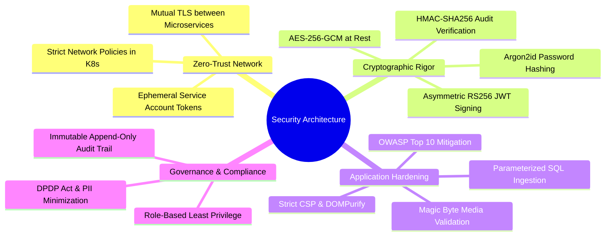
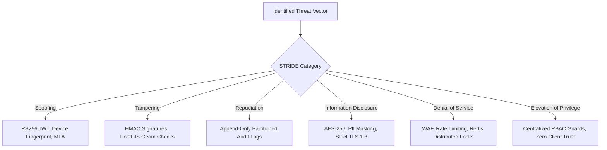
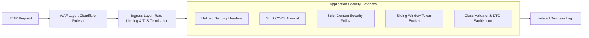
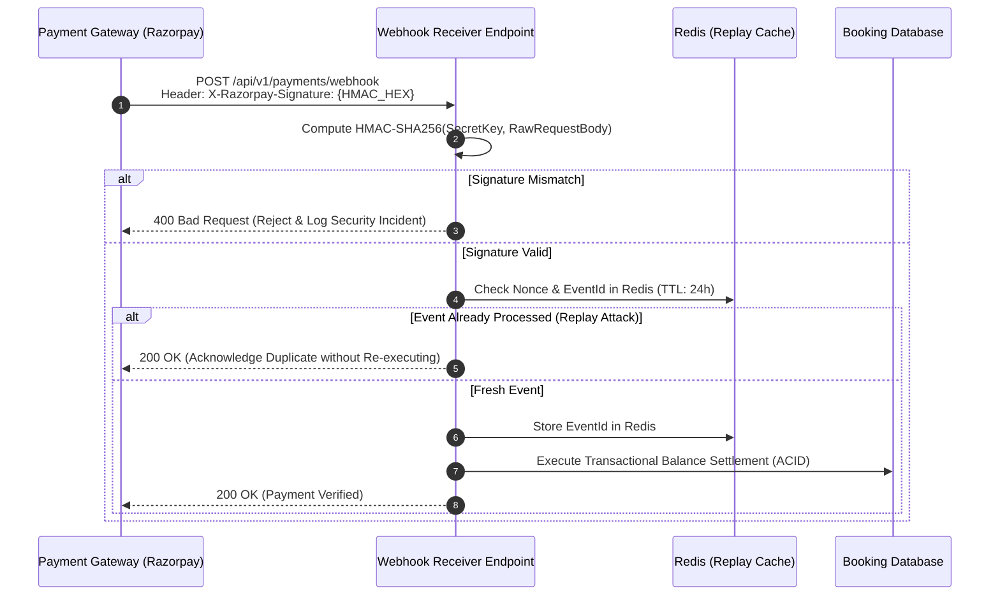
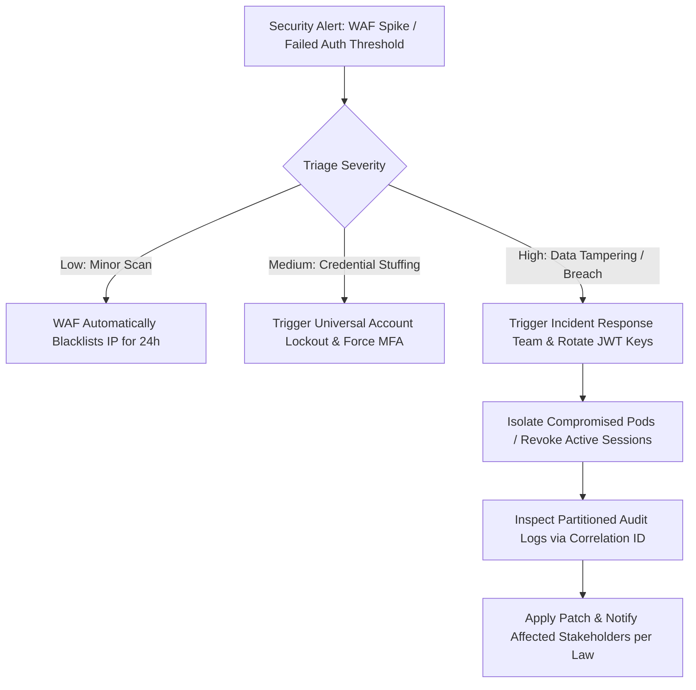

# Explore Bharat Safar — Enterprise Security Architecture, Hardening & Threat Mitigation

- **Document Identifier**: EBS-DOC-11-SEC
- **Version**: 1.0.0
- **Status**: Approved
- **Author**: Enterprise Architecture & Solutions Engineering Team
- **Target Audience**: Chief Information Security Officer (CISO), Security Architects, Lead Backend Engineers, DevOps/SecOps Engineers, Compliance Auditors
- **Related Documents**:
  - `02-specification.md`
  - `03-architecture.md`
  - `09-api-design.md`
  - `10-database-design.md`
  - `12-authentication.md`
  - `25-risk-analysis.md`
- **Last Updated**: 2026-09-28

---

## 1. Security Philosophy & Zero-Trust Posture

The **Explore Bharat Safar** ecosystem processes sensitive identity records, confidential medical declarations for adventure trekkers, real-time fiscal transactions, and authoritative municipal data for rural villages. Consequently, security is engineered as a foundational invariant rather than an external layer.



---

## 2. STRIDE Threat Modeling & Risk Mitigation Matrix

A comprehensive STRIDE analysis assesses vulnerabilities across all four core domains.



### 2.1 Threat Scenario Assessment & Engineering Defense

| Domain Module | STRIDE Category | Specific Threat Vector | Architectural Mitigation & Hardening Rule |
| :--- | :--- | :--- | :--- |
| **Section 1: GIS Discovery** | Information Disclosure | Unauthorized scraping of complete national PostGIS boundary datasets. | Rate-limiting geometry endpoints (30 req/min); dynamic Douglas-Peucker simplification; API key throttling. |
| **Section 2: Village System**| Elevation of Privilege | Rogue Village Admin attempts to publish unverified changes or edit neighboring villages. | Tenant scoping enforced in database query: `WHERE village_id = token.village_id AND status = 'PENDING_APPROVAL'`. |
| **Section 3: Booking Engine**| Denial of Service | Bot army initiates concurrent checkouts to lock all batch slots without paying. | CAPTCHA challenge on `/bookings/reserve`; Redis 15-minute hard TTL; IP rate limit (10 checkouts/min). |
| **Section 3: Payments** | Tampering | Malicious client alters upfront payment percentage or injects counterfeit gateway webhooks. | Server-side price calculation only; webhook payload verification via gateway secret HMAC-SHA256 signature. |
| **Section 3: Certificates** | Spoofing | Fraudulent traveler creates forged trek completion certificate. | Tamper-evident dynamic QR code resolving to public verification endpoint; HMAC verification hash check. |
| **Section 4: Social Network**| Tampering / XSS | Stored Cross-Site Scripting (XSS) payload injected into markdown travel journals. | Strict Content Security Policy (CSP); client/server sanitization via DOMPurify; Markdown rendered via AST. |

---

## 3. Cryptographic Standards & Key Management

### 3.1 Data in Transit
- **Enforced Protocol**: TLS 1.3 exclusively across all edge and internal ingress routers. Weak ciphers (RC4, 3DES, CBC) are completely disabled.
- **HSTS Header**: `Strict-Transport-Security: max-age=63072000; includeSubDomains; preload` injected on all HTTPS responses.

### 3.2 Data at Rest
- **Database Storage**: PostgreSQL transparent data encryption (TDE) utilizing AES-256-GCM.
- **Participant Medical PII**: Pre-existing medical conditions, blood groups, and emergency contacts are encrypted at the application level using envelope encryption before database insertion:

$$\text{Encrypted Payload} = \text{AES-GCM-256}\left(\text{DataKey}, \, \text{PlaintextPII}, \, \text{IV}\right)$$

### 3.3 Password Hashing Specification
User passwords must be hashed using **Argon2id** (the state-of-the-art memory-hard password derivation function) configured with the following minimum parameters:
- **Memory Cost ($m$)**: $65,536\text{ KiB}$ ($64\text{ MB}$)
- **Time Cost / Iterations ($t$)**: $3$
- **Parallelism ($p$)**: $1\text{ thread}$
- **Salt Length**: $16\text{ cryptographically secure random bytes}$
- **Key Length**: $32\text{ bytes}$

---

## 4. Application Hardening & OWASP Top 10 Mitigations



### 4.1 SQL Injection Prevention
- Zero raw SQL string concatenation allowed across the codebase.
- All database operations execute through an enterprise ORM (Prisma / TypeORM) using strictly parameterized SQL bindings.
- Spatial PostGIS operations utilize parameterized ST functions (`ST_Contains($1, ST_SetSRID(ST_Point($2, $3), 4326))`).

### 4.2 Cross-Site Scripting (XSS) & Content Security Policy (CSP)
All web responses emit a rigorous Content Security Policy header:

```http
Content-Security-Policy: default-src 'self'; script-src 'self' 'nonce-{RANDOM}'; style-src 'self' 'unsafe-inline'; img-src 'self' data: https://media.explorebharatsafar.in https://*.tile.openstreetmap.org; connect-src 'self' https://api.explorebharatsafar.in wss://api.explorebharatsafar.in https://api.razorpay.com; frame-src 'self' https://api.razorpay.com; object-src 'none'; base-uri 'self'; form-action 'self'; frame-ancestors 'none'; block-all-mixed-content; upgrade-insecure-requests;
```

### 4.3 Secure File Upload Pipeline
To prevent remote code execution (RCE) via malicious media files:
1. **Direct Upload Prohibition**: Files are never received as raw multi-part forms directly on application web servers.
2. **Pre-Signed Storage URLs**: The API issues temporary, pre-signed upload URLs restricted to designated S3 buckets with strict size limits ($\le 10\text{ MB}$ for images, $\le 50\text{ MB}$ for videos).
3. **Magic Byte Inspection**: A serverless worker intercepts uploaded assets to verify binary magic bytes (e.g., verifying `0xFF 0xD8 0xFF` for JPEG; `0x89 0x50 0x4E 0x47` for PNG). Any disguised executable or script is permanently purged.
4. **SVG Sanitization**: SVG uploads are sanitized to strip `<script>`, `onload`, and embedded `<iframe>` vectors before rendering.

---

## 5. Payment Webhook Security & Fraud Prevention

Payment confirmation relies entirely on asynchronous server-to-server webhooks signed with cryptographic message authentication codes:



---

## 6. Immutable Audit Logging Specification

Every administrative mutation, user role escalation, village profile approval, payment refund, and certificate generation writes an append-only audit event.

### 6.1 Audit Invariants
- **Write-Only Privilege**: The database user assigned to application services possesses only `INSERT` and `SELECT` grants on the `audit_schema.audit_logs` table. `UPDATE` and `DELETE` permissions are revoked.
- **Log Payload Minimum**:
  1. Timestamp ($UTC$)
  2. Actor User ID & Active Role
  3. Action Code (e.g., `VILLAGE_UPDATE_APPROVED`)
  4. Target Entity Name & Entity UUID
  5. JSON Diffs (`old_values` vs `new_values`)
  6. Client IP Address & Correlation ID

---

## 7. Security Incident Response & Forensics Playbook



---

## 8. Summary & Downstream Alignment

This enterprise security architecture defines the mandatory cryptographic, procedural, and network defenses of Explore Bharat Safar. All authentication mechanisms detailed in `12-authentication.md`, administrative consoles in `13-admin-panel.md`, and deployment configurations in `22-deployment.md` must comply strictly with these protocols.
