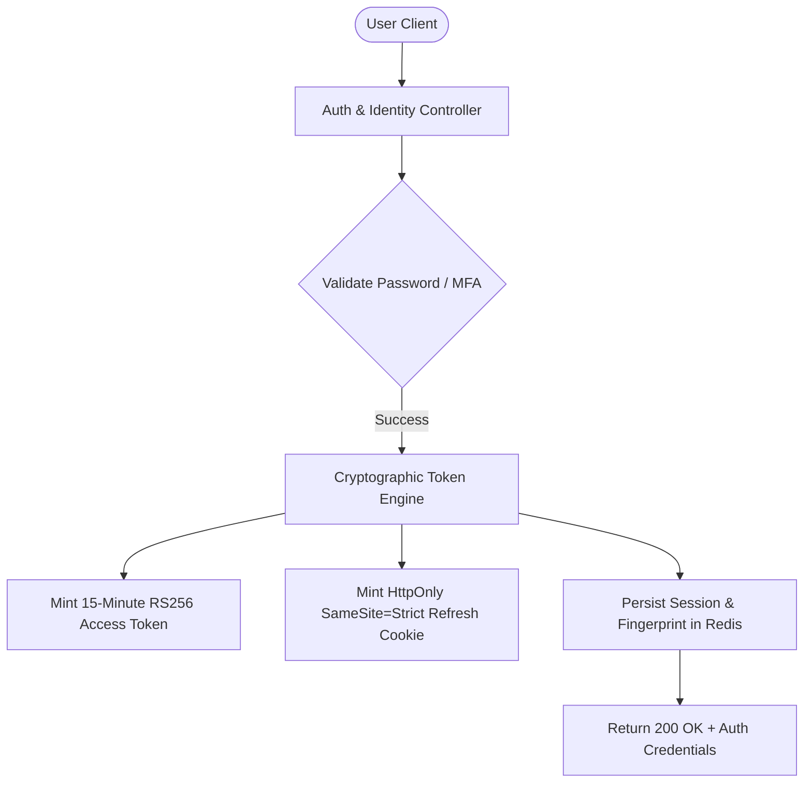
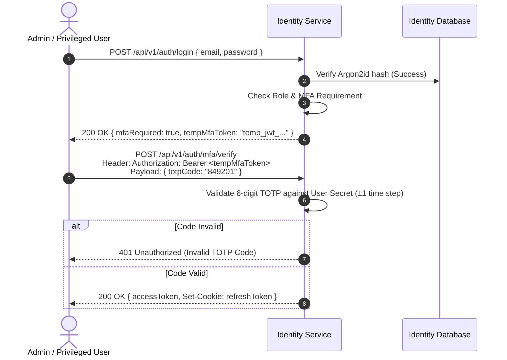

# Explore Bharat Safar — User Authentication, Authorization & Identity Lifecycle

- **Document Identifier**: EBS-DOC-12-AUTH
- **Version**: 1.0.0
- **Status**: Approved
- **Author**: Enterprise Architecture & Solutions Engineering Team
- **Target Audience**: Security Engineers, Backend Authentication Specialists, Frontend Developers, Mobile Engineers, Identity Access Managers
- **Related Documents**:
  - `02-specification.md`
  - `03-architecture.md`
  - `09-api-design.md`
  - `10-database-design.md`
  - `11-security.md`
  - `13-admin-panel.md`
  - `26-business-rules.md`
- **Last Updated**: 2026-09-28

---

## 1. Authentication Philosophy & Identity Architecture

Authentication in **Explore Bharat Safar** balances frictionless user onboarding for everyday cultural explorers with rigorous, multi-tiered credential protection for administrative, financial, and rural governance actors.



### 1.1 Core Tenets
- **Asymmetric Cryptography**: Access tokens are signed using private RSA keys (RS256) hosted exclusively within the Identity Service. Distributed domain microservices verify tokens locally using the public key without querying the central database.
- **Strict Token Rotation (RTR)**: Refresh tokens are single-use. If a previously consumed refresh token is presented, the system detects a potential token replay theft and automatically revokes the entire session family.
- **Mandatory MFA for Privileged Roles**: Multi-factor authentication (TOTP RFC 6238) is mandatory for Super Admin, Finance Admin, Booking Admin, and Content Moderator accounts.

---

## 2. JWT Access Token & Refresh Token Lifecycle

```mermaid
sequenceDiagram
    autonumber
    actor Client as Web / Mobile Client
    participant API as API Gateway / Microservice
    participant Auth as Identity Service
    participant R as Redis Session Store

    Note over Client,API: Normal Authenticated Request
    Client->>API: GET /api/v1/bookings/my-orders<br>Header: Authorization: Bearer <AccessJWT>
    API->>API: Verify Signature locally with RSA Public Key
    API-->>Client: 200 OK (Orders Returned)

    Note over Client,API: Access Token Expired (After 15 Mins)
    Client->>API: GET /api/v1/bookings/my-orders
    API-->>Client: 401 Unauthorized (EBS_AUTH_EXPIRED)

    Note over Client,Auth: Silent Token Refresh Flow
    Client->>Auth: POST /api/v1/auth/refresh<br>Cookie: refreshToken=ey...
    Auth->>R: Lookup Token UUID & Validate Device Fingerprint
    alt Token Invalid / Already Consumed
        Auth->>R: Invalidate All Sessions for this User (Family Revocation)
        Auth-->>Client: 401 Unauthorized (Force Complete Re-Login)
    else Token Valid
        Auth->>R: Invalidate Old Refresh Token; Store New Refresh Token
        Auth-->>Client: 200 OK { newAccessToken } + Set-Cookie: newRefreshToken
    end
```

### 2.1 Access Token Claims Payload Schema (RS256)

```json
{
  "iss": "https://auth.explorebharatsafar.in",
  "sub": "u_8f3a21e4-9b2c-4e12-8812-7a6c9d0124b8",
  "email": "amitabh.sharma@example.com",
  "roles": ["TRAVELLER"],
  "permissions": [
    "booking:create",
    "booking:read_self",
    "social:post_create",
    "review:submit"
  ],
  "sessionId": "sess_91a82f4e-128b-4c01-a189",
  "deviceHash": "sha256_browser_fingerprint",
  "iat": 1790596800,
  "exp": 1790597700
}
```

---

## 3. Password Policies & Account Defense

### 3.1 Password Composition Rules
1. Minimum length: **12 characters**; Maximum length: **128 characters**.
2. Must contain at least one uppercase letter ($A-Z$).
3. Must contain at least one lowercase letter ($a-z$).
4. Must contain at least one numerical digit ($0-9$).
5. Must contain at least one non-alphanumeric symbol ($!@\#\$\%\^\&\*\(\)\_\+\-\=[]\{\}\;\:\'\"\,\<\.\>\/\?$).
6. Evaluated against HaveIBeenPwned common compromised password dictionaries before acceptance.

### 3.2 Brute-Force & Credential Stuffing Throttling
- **Failed Attempt Threshold**: 5 consecutive invalid authentication attempts trigger a progressive defense mechanism:
  - *Attempts 1–3*: Standard failed credentials notification.
  - *Attempt 4*: Mandatory Cloudflare Turnstile / hCaptcha challenge.
  - *Attempt 5*: Account temporarily locked for **15 minutes**; automated security alert dispatched to registered email.
- **IP-Level Sliding Window**: The API Gateway restricts login submissions to a maximum of 5 attempts per 5 minutes per IP address via Redis token buckets.

---

## 4. Multi-Factor Authentication (TOTP RFC 6238)



### 4.1 MFA Enrollment & Emergency Recovery
- Privileged users scan an `otpauth://` QR code generated via a 256-bit cryptographically secure shared secret.
- **Emergency Backup Codes**: Upon MFA enrollment, the system issues 8 single-use, 10-character alphanumeric backup recovery codes (hashed via SHA-256 in the database).

---

## 5. Multi-Device Session Management

Users can inspect and revoke active sessions across multiple devices from their profile security dashboard.

| Device Field Captured | Storage Mechanism | Revocation Mechanism |
| :--- | :--- | :--- |
| **IP Address & Geolocation** | Captured at handshake and hashed for privacy. | User selects "Log out of this device" $\rightarrow$ Redis session key purged. |
| **User-Agent String** | Parsed into Browser & Operating System tags. | Token presented by revoked session returns HTTP 401. |
| **Last Active Timestamp** | Updated periodically (max once every 5 mins). | Stale sessions ($> 30\text{ days}$ inactivity) pruned automatically. |
| **Universal Logout** | Master session sequence counter incremented. | All active refresh tokens belonging to the user are invalidated immediately. |

---

## 6. Summary & Downstream Alignment

This authentication specification dictates the credential handling, session lifecycle, and cryptographic tokens for Explore Bharat Safar. It interfaces directly with the administrative consoles detailed in `13-admin-panel.md`, the booking workflows in `14-booking-system.md`, and the business access rules in `26-business-rules.md`.
