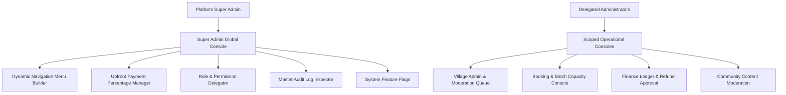
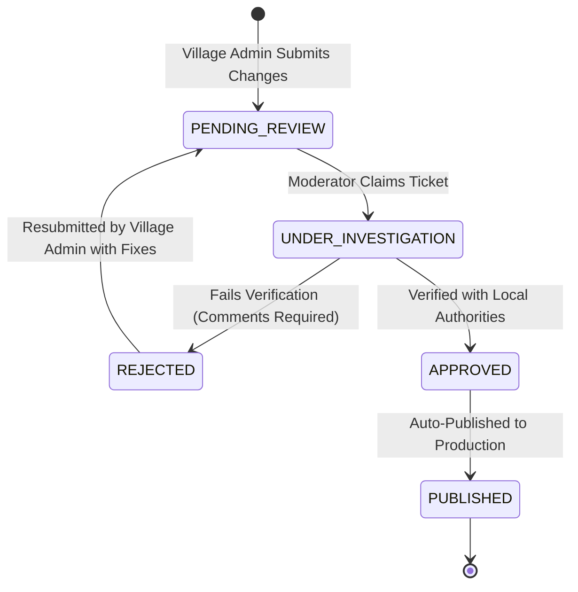

# Explore Bharat Safar — Enterprise Administration Console & Governance System

- **Document Identifier**: EBS-DOC-13-ADMIN
- **Version**: 1.0.0
- **Status**: Approved
- **Author**: Enterprise Architecture & Solutions Engineering Team
- **Target Audience**: System Administrators, Regional Sub-Admins, Booking Managers, Content Editors, Financial Controllers, Support Leads
- **Related Documents**:
  - `02-specification.md`
  - `03-architecture.md`
  - `09-api-design.md`
  - `10-database-design.md`
  - `11-security.md`
  - `14-booking-system.md`
  - `26-business-rules.md`
- **Last Updated**: 2026-09-28

---

## 1. Administration Philosophy & Governance Architecture

The **Explore Bharat Safar** administration platform is designed as a centralized, high-density operations console. It enables seamless operational governance across thousands of geographic territories, hundreds of thousands of village records, high-velocity booking batches, and community moderation workflows.



### 1.1 Core Tenets
- **Zero Hardcoding**: Navigation hierarchies, upfront deposit thresholds, category tags, and feature availability are dynamically driven by database configurations manageable via the UI without triggering code deployments.
- **Strict Least-Privilege Scoping**: Operational administrators access only the modules and geographic scopes explicitly granted by the Super Admin.
- **Complete Audit Accountability**: Every administrative mutation, state override, refund authorization, and content approval is permanently recorded in the append-only audit ledger.

---

## 2. Administration Modules & Role Access Matrix

| Administration Module | Super Admin | Booking Admin | Finance Admin | Village Admin | Moderator | Content Editor |
| :--- | :--- | :--- | :--- | :--- | :--- | :--- |
| **Global System Settings & Toggles** | Full Access | No Access | No Access | No Access | No Access | No Access |
| **Dynamic Navigation Menu Builder** | Full Access | No Access | No Access | No Access | No Access | No Access |
| **Upfront Payment % Configuration** | Full Access | Read-Only | Read-Only | No Access | No Access | No Access |
| **Place Booking Toggle (`is_enabled`)**| Full Access | Read-Only | No Access | No Access | No Access | No Access |
| **Experience Catalog & Batch Manager**| Full Access | Full Access | Read-Only | No Access | No Access | Read-Only |
| **Attendance & Manual Cert Clearance**| Full Access | Full Access | No Access | No Access | No Access | No Access |
| **Transaction Ledger & Refund Approvals**| Full Access | No Access | Full Access | No Access | No Access | No Access |
| **Village Submission Approval Queue** | Full Access | No Access | No Access | Submit Only | Review & Vote | No Access |
| **Flagged Social Posts & Review Queue**| Full Access | No Access | No Access | No Access | Full Access | No Access |
| **Master Audit Log Inspector** | Full Access | No Access | No Access | No Access | No Access | No Access |

---

## 3. High-Priority Governance Modules

### 3.1 Dynamic Navigation Menu Builder
The Super Admin can restructure the entire navigation tree of Section 3 (Booking Engine) and Section 1 (Discovery Engine) directly from the console:

```mermaid
sequenceDiagram
    autonumber
    actor SA as Super Admin
    participant AdminUI as Admin Web Console
    participant API as Admin Configuration API
    participant DB as System Settings Database
    participant CDN as Edge CDN Cache

    SA->>AdminUI: Reorder "Winter Himalayan Treks" to Position 1; Add "Monsoon Fort Expeditions"
    AdminUI->>API: PUT /api/v1/admin/config/navigation-tree { jsonTreePayload }
    API->>API: Validate Tree Structure & Cycle Prevention
    API->>DB: Persist New Navigation Hierarchy in config_store
    API->>CDN: Invalidate Edge Navigation Cache (/api/v1/navigation/*)
    API-->>AdminUI: 200 OK ("Navigation Updated Globally")
```

### 3.2 Upfront Payment Percentage Manager
The Super Admin defines the mandatory deposit required to confirm an expedition slot.
- **Global Default**: Set globally (e.g., $25\%$).
- **Per-Experience Overrides**: Can override specific high-demand or high-overhead expeditions to $50\%$ or $100\%$.
- **Validation Engine**: Prevents configuration of percentages $< 10\%$ or $> 100\%$. Automatically updates the checkout calculation engine in real-time.

```text
+-----------------------------------------------------------------------------------+
|  UPFRONT PAYMENT PERCENTAGE CONTROLLER                                            |
+-----------------------------------------------------------------------------------+
|  Global Default Upfront Percentage: [  25%  ]  [ Update Global Rule ]             |
|                                                                                   |
|  EXPEDITION OVERRIDES:                                                            |
|  - Harishchandragad Trek:       [ 25% ] (Global Default Applied)                  |
|  - Chadar Frozen River Trek:    [ 50% ] [ Edit ] [ Reset to Global ]              |
|  - Valley of Flowers Explorer:  [ 25% ] (Global Default Applied)                  |
|  - Everest Base Camp (Bharat):  [ 100% ] [ Edit ] [ Reset to Global ]             |
+-----------------------------------------------------------------------------------+
```

### 3.3 Place "Book Now" Control
On each Place Details record within Section 1, the Super Admin maintains a dedicated toggle:
- `is_booking_enabled: TRUE` $\rightarrow$ Place displays the prominent "Book Now" CTA linking to the corresponding Section 3 adventure package.
- `is_booking_enabled: FALSE` $\rightarrow$ The "Book Now" button is completely removed from the DOM with zero empty space reservation.

---

## 4. Village Moderation & Review Workflow Queue

Village Admins submit grassroots updates that are queued in the regional moderation dashboard:



### 4.1 Moderation Interface Specifications
> **Illustration Required: Admin Dashboard & Village Dashboard**  
> *Interface Structure*: A two-column split-pane review interface:
> - Left Column: Current live village production data.
> - Right Column: Proposed changes highlighted with visual diffs (green additions, strikethrough deletions).
> - Action Toolbar: "Approve and Publish", "Reject with Feedback", "Request Formal Documentation", "Escalate to Super Admin".

---

## 5. Attendance Verification & Manual Certificate Release

Certificates are normally generated automatically upon batch completion and balance clearance. However, Booking Admins possess a specialized interface to resolve edge cases:
- **On-Trail Attendance Verification**: Checkbox roster enabling trek leaders to mark participants as `PRESENT` or `ABSENT`.
- **Manual Balance Clearance**: If a traveller pays their outstanding balance via cash or POS machine at the base camp, the Booking Admin / Finance Admin marks the transaction as settled (`BALANCE_SETTLED_OFFLINE`), immediately unlocking automated certificate generation.

---

## 6. Summary & Downstream Alignment

This administration specification details the governance tools and management interfaces of Explore Bharat Safar. It interfaces directly with the booking engine in `14-booking-system.md`, security rules in `11-security.md`, and business logic rules in `26-business-rules.md`.
