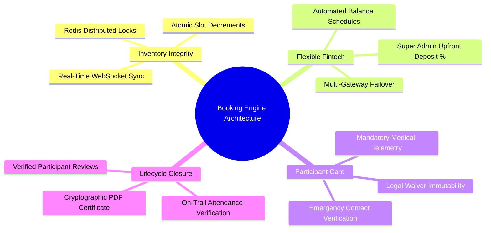
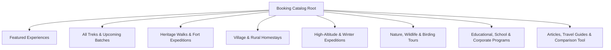
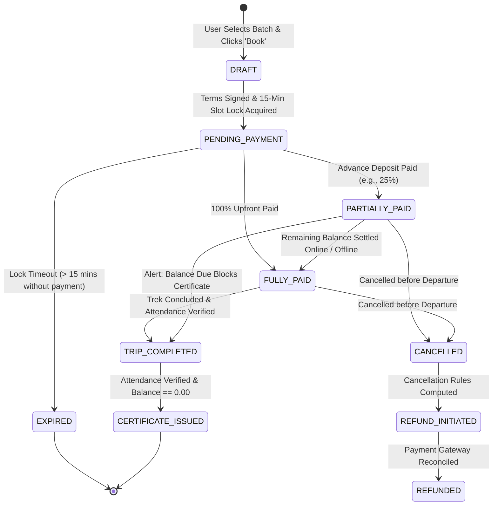

# Explore Bharat Safar — Travel Booking, Adventure & Experience Management System

- **Document Identifier**: EBS-DOC-14-BOOKING
- **Version**: 1.0.0
- **Status**: Approved
- **Author**: Enterprise Architecture & Solutions Engineering Team
- **Target Audience**: Booking Engine Architects, Backend Engineers, Financial Systems Leads, Frontend Checkout Developers, Operational Coordinators
- **Related Documents**:
  - `02-specification.md`
  - `03-architecture.md`
  - `09-api-design.md`
  - `10-database-design.md`
  - `20-certificate-system.md`
  - `21-payment-system.md`
  - `26-business-rules.md`
- **Last Updated**: 2026-09-28

---

## 1. Booking System Mission & Architectural Scope

The **Travel Booking, Adventure & Experience Management System** represents the transactional core of **Explore Bharat Safar**. It is not a generic hotel or airline reservation utility; it is an expedition-grade management platform specifically engineered for complex, multi-day Himalayan ascents, Sahyadri monsoon treks, cultural heritage walks, and rural village immersions.



---

## 2. Dynamic Booking Module & Navigation Catalog

The booking homepage supports flexible, Super Admin-configured category navigation sections that can be reorganized without application re-deployment:



---

## 3. Experience Details Page Structure & Technical Telemetry

Every published adventure experience exposes a comprehensive technical and cultural dossier:

| Specification Block | Data Telemetry & Functional Requirements |
| :--- | :--- |
| **Technical Grade & Elevation** | Difficulty grade (`EASY`, `MODERATE`, `DIFFICULT`, `CHALLENGING`, `TECHNICAL`); Maximum Altitude in meters ($MAM$); Daily elevation gain/loss ($\Delta h$ in meters); Total trail distance ($km$). |
| **Physical Benchmark** | Explicit fitness prerequisites (e.g., capability to complete $5\text{ km}$ jog in $30\text{ mins}$ without dyspnea); age bounds ($MinAge - MaxAge$). |
| **Day-Wise Schedule** | Detailed chronological itinerary with altitude markers, meal provisions, base camp coordinates, and water refill points. |
| **Inclusions / Exclusions** | Strict tabular listing of tents, sleeping bags, certified mountaineering guides, forest permits, porters, and meals provided. |
| **Logistics & Assembly** | Meeting point landmark, reporting timestamp, transit instructions from nearest railhead/airport, and packing checklist. |
| **Real-Time Batch Calendar** | Live calendar rendering batch dates, total capacity, remaining slots, and dynamic price indicators. |

---

## 4. End-to-End Booking Lifecycle & State Machine



### 4.1 Step-by-Step Checkout Process
1. **User Authentication**: Mandatory login; guest checkout is prohibited to guarantee identity binding for legal waivers.
2. **Batch Selection & Capacity Check**: User selects departure batch. System queries Redis cache for real-time slot availability.
3. **Atomic Slot Lock**: Client initiates checkout; backend executes an atomic Redis Lua script reserving the requested slots with a **15-minute Time-to-Live (TTL)**.
4. **Participant Telemetry Registration**:
   - Full legal name (matching government ID).
   - Age, gender, emergency contact phone number.
   - Mandatory medical disclosure (respiratory, cardiovascular, or joint conditions; allergies).
5. **Optional Add-on Selection**: Rental equipment (sleeping bags, trekking poles), personal porter assistance, organic meal packages.
6. **Terms & Legal Waiver Execution**: Immutable capture of legal acceptance (`terms_version`, `user_id`, `timestamp`, `ip_address`).
7. **Payment Calculation**: Automatic computation of mandatory upfront deposit according to the Super Admin's configured percentage.
8. **Gateway Execution**: Redirection to Razorpay / UPI gateway. Upon capture, webhook transitions order to `CONFIRMED` (`PARTIALLY_PAID` or `FULLY_PAID`).
9. **Post-Trip Settlement & Certification**:
   - Trek leader verifies participant attendance on-trail.
   - Any outstanding balance is cleared.
   - Vector-grade digital certificate is synthesized automatically.

---

## 5. Distributed Inventory Locking & Race Condition Prevention

To guarantee zero overbooking when hundreds of users register simultaneously for a popular batch:

```mermaid
sequenceDiagram
    autonumber
    actor UserA as Explorer A
    actor UserB as Explorer B
    participant R as Redis Cluster (Master)
    participant DB as PostgreSQL Database

    Note over R: Batch #102: Available Slots = 1
    UserA->>R: Lock Request (1 Slot) via Lua Script
    R->>R: Slots (1) >= Requested (1) -> Slots becomes 0; Lock Key Set (TTL: 900s)
    R-->>UserA: Lock Acquired (Token: 'LOCK_A_991')
    
    UserB->>R: Lock Request (1 Slot) via Lua Script
    R->>R: Slots (0) < Requested (1) -> Lock Rejected
    R-->>UserB: Lock Failed (INSUFFICIENT_INVENTORY)
    
    UserA->>DB: Persist Booking Record (PENDING_PAYMENT)
    UserA-->>UserA: Proceed to Payment Gateway
```

---

## 6. Upfront Partial Payment & Balance Settlement Rules

$$\text{Upfront Percentage } (P_{\text{up}}) \in [10\%, 100\%] \quad \text{Configured by Super Admin}$$

$$\text{Total Price } (TP) = (\text{Base Price} \times N_{\text{participants}}) + \text{Addons} + \text{GST}$$

$$\text{Mandatory Advance Deposit} = \text{Round}_{2}\left(TP \times \frac{P_{\text{up}}}{100}\right)$$

$$\text{Outstanding Balance Due} = TP - \text{Advance Paid}$$

- **Balance Due Settlement Window**: The remaining balance must be cleared online at least 48 hours prior to the batch start date, or settled offline at base camp via the Booking Admin console.
- **Zero Balance Enforcement**: A traveller with an unsettled balance cannot receive a certificate or submit a verified review.

---

## 7. Cancellation & Refund Policy Engine

| Cancellation Window Prior to Departure | Refund Percentage Applicable | Processing Deduction |
| :--- | :--- | :--- |
| $\ge 30\text{ Days}$ | $90\%$ of Total Booking Amount | $10\%$ administrative fee retained. |
| $15 - 29\text{ Days}$ | $50\%$ of Total Booking Amount | $50\%$ cancellation penalty. |
| $7 - 14\text{ Days}$ | $25\%$ of Total Booking Amount | $75\%$ cancellation penalty. |
| $< 7\text{ Days}$ / No Show | $0\%$ Refund | Non-refundable due to pre-booked permits and porters. |

---

## 8. Summary & Downstream Alignment

This booking system specification defines the operational and transactional mechanics of Explore Bharat Safar's commercial engine. It connects directly with the certificate generation pipeline in `20-certificate-system.md`, payment gateway architecture in `21-payment-system.md`, and business rules in `26-business-rules.md`.
