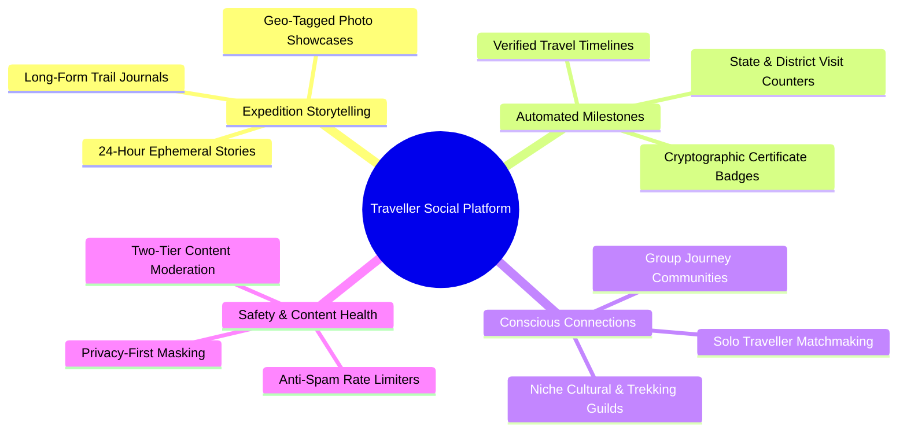
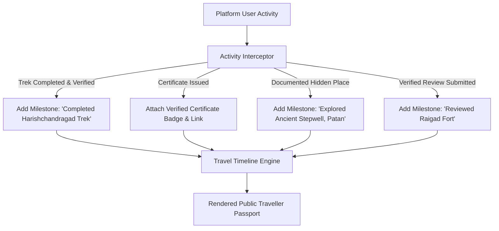
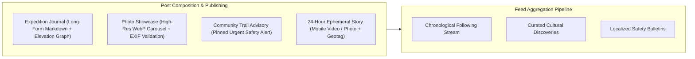
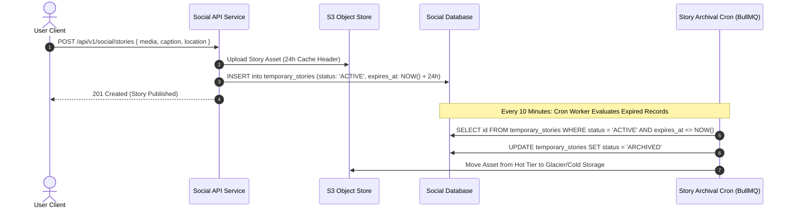
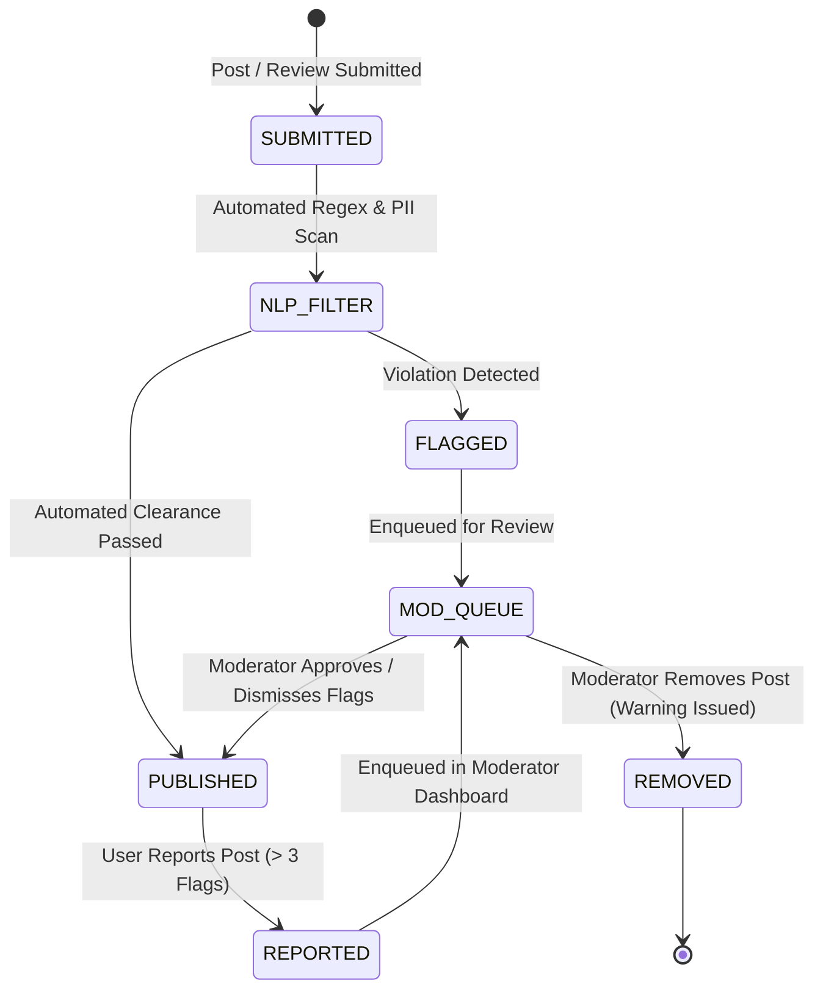

# Explore Bharat Safar — Traveller Social Network & Community Platform

- **Document Identifier**: EBS-DOC-15-SOCIAL
- **Version**: 1.0.0
- **Status**: Approved
- **Author**: Enterprise Architecture & Solutions Engineering Team
- **Target Audience**: Social Platform Engineers, Community Managers, Content Moderators, Mobile Frontend Developers, Security Specialists
- **Related Documents**:
  - `02-specification.md`
  - `03-architecture.md`
  - `04-ui-ux.md`
  - `09-api-design.md`
  - `10-database-design.md`
  - `19-notification-system.md`
  - `26-business-rules.md`
- **Last Updated**: 2026-09-28

---

## 1. Social Platform Vision & Community Philosophy

The **Traveller Social Network** within **Explore Bharat Safar** is purposefully decoupled from generic, attention-extractive social networks. It is an intentional, outdoors- and heritage-focused community platform designed to foster authentic travel journaling, ethical exploration, peer safety advisories, and meaningful connections between verified travellers across Bharat.

---

## 2. Traveller Profiles & Automated Travel Timeline

Every registered user maintains a dedicated traveller profile that serves as their personal exploration passport.

### 2.1 Profile Attributes & Verified Metrics
- **Identity & Bio**: Display Name, Unique `@username`, Avatar, Cover Photo, Regional Languages Spoken, Adventure Grade (`EXPLORER`, `TREKKER`, `MOUNTAINEER`, `CULTURAL_HISTORIAN`).
- **Verified Counters (Database Driven)**:
  - Total States & Union Territories Explored.
  - Total Administrative Districts Documented.
  - Completed Verified Expeditions & Treks.
  - Official Certificates Earned.
- **Privacy Controls**: Profile visibility configurable as `PUBLIC` (visible to all verified travellers) or `CONNECTIONS_ONLY`. Private contact details (phone, email) are permanently masked.

---

## 3. Home Feed Architecture & Post Formats

The social feed delivers a high-signal stream of verified travel narratives, trail advisories, and cultural discoveries.

### 3.1 Post Content Models
1. **Expedition Journal**: Structured Markdown log supporting elevation gain diagrams, GPX trail previews, packing retrospectives, and water-source updates.
2. **Photo Showcase**: Progressive image carousels with validated latitude/longitude EXIF tags anchored to existing Section 1 place records.
3. **Community Trail Advisory**: High-priority safety updates (e.g., landslide road closures, seasonal river surges, forest department permit freezes) requiring moderator fast-track approval.
4. **Temporary Stories**: 24-hour disappearing media clips displaying active trail moments with location stickers.

---

## 4. Ephemeral Stories & Garbage Collection Architecture

Temporary stories expire automatically after 24 hours to prevent media storage bloat:

---

## 5. Solo & Group Traveller Connection Engine

### 5.1 Solo Traveller Matchmaking Algorithm
To help solo explorers discover compatible companions without broadcasting private contact details:
- **Match Parameters**:
  - Target Destination / Region (e.g., *Kinnaur Valley, Himachal Pradesh*)
  - Planned Departure Window (Date $\pm 3\text{ days}$)
  - Trek Difficulty Rating & Pacing
  - Gender Preferences (e.g., *Women-Only Solo Circles*)
- **Safety Mechanism**: The system facilitates in-app introductions via double opt-in messaging. Personal phone numbers or external handles are screened by automated regex filters to prevent unsolicited spam.

### 5.2 Niche Travel Communities & Guilds
Specialized community boards organized by geographic and activity interest:
- *Western Ghats Monsoon Trekkers*
- *Himalayan High-Altitude Mountaineers*
- *Ancient Temple Architecture & Inscriptions Guild*
- *Rural Homestay & Agro-Tourism Enthusiasts*
- *Bicycle Touring Bharat*

---

## 6. Content Moderation & Safety Architecture

### 6.1 Verified Reviews Enforcement
- Only travellers who have a completed booking (`status == 'TRIP_COMPLETED'`) with verified on-ground attendance can submit verified reviews for trips and experiences.
- Reviews evaluate distinct operational facets: Guide Expertise, Trail Safety, Food Quality, Camp Cleanliness, and Value for Money.

---

## 7. Summary & Downstream Alignment

This social network specification defines the community dynamics, media lifecycles, and safety protocols of Explore Bharat Safar. It integrates directly with the notification system in `19-notification-system.md`, certificate system in `20-certificate-system.md`, and business rules in `26-business-rules.md`.
