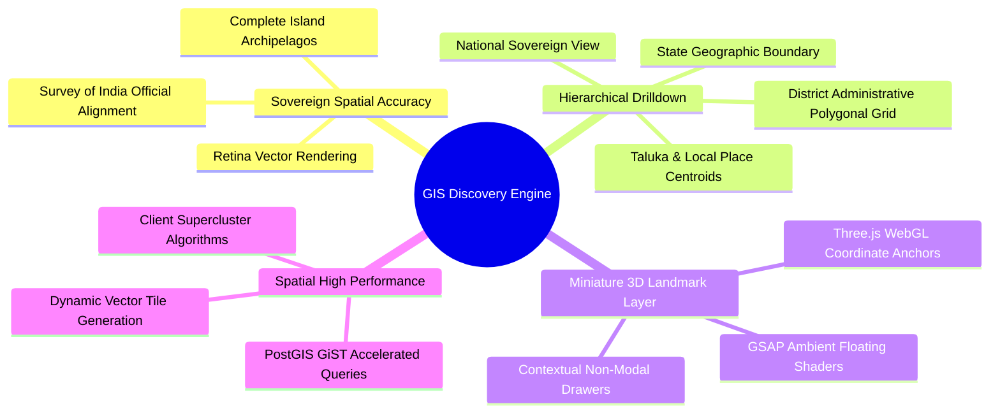
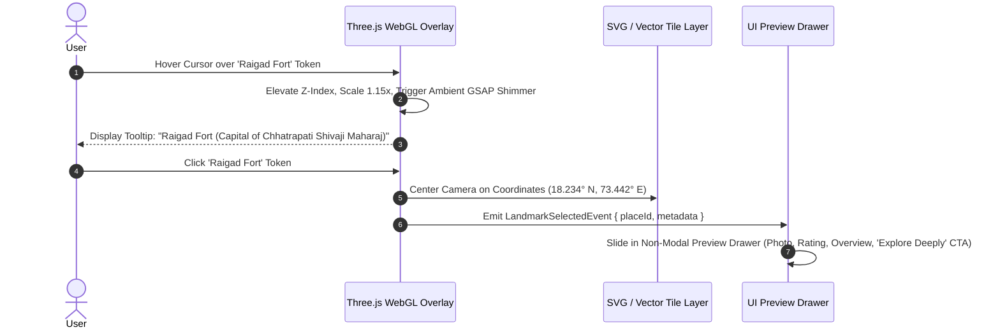

# Explore Bharat Safar — Bharat Discovery Engine (GIS Map Architecture & Spatial Specifications)

- **Document Identifier**: EBS-DOC-16-MAP
- **Version**: 1.0.0
- **Status**: Approved
- **Author**: Enterprise Architecture & Solutions Engineering Team
- **Target Audience**: GIS Specialists, Spatial Database Architects, WebGL/Three.js Engineers, Frontend Map Developers, Cartographic Compliance Leads
- **Related Documents**:
  - `02-specification.md`
  - `03-architecture.md`
  - `04-ui-ux.md`
  - `05-drd.md`
  - `10-database-design.md`
  - `17-animation.md`
  - `26-business-rules.md`
- **Last Updated**: 2026-09-28

---

## 1. Cartographic Mission & Spatial Philosophy

The **Bharat Discovery Engine** represents the flagship interface of **Explore Bharat Safar**. It is designed to be the world's most interactive, culturally rich, and mathematically precise digital map dedicated to the sovereign territory of Bharat.

Rather than presenting sterile highway networks or commercial road turn-by-turn guidance, the engine celebrates the geographical relief, historical bastions, sacred river confluences, high-altitude passes, and administrative subdivisions of India.



---

## 2. Hierarchical Spatial Drilldown Architecture

```mermaid
flowchart TD
    NationalMap[National India Map (Zoom: 4 - 6)] -->|Click State Polygon| StateMap[State Exploration Map (Zoom: 7 - 9)]
    StateMap -->|Click District Polygon| DistrictMap[District Exploration Map (Zoom: 10 - 12)]
    DistrictMap -->|Click Taluka Polygon| TalukaMap[Taluka Exploration Map (Zoom: 13 - 15)]
    TalukaMap -->|Click Place Pin| PlaceDetail[Place Details Dossier]
    PlaceDetail -->|If Enabled by Super Admin| BookNowCTA[Redirect to Experience Booking Engine]
```

### 2.1 Drilldown Interaction Specifications
1. **Level 0 (National Sovereign Overview)**:
   - Displays all 28 States and 8 Union Territories with official international and state borders, coastlines, and islands (Andaman & Nicobar, Lakshadweep).
   - High-level miniature 3D landmark icons positioned at prominent heritage points across India.
2. **Level 1 (State Exploration)**:
   - Selecting a state triggers a smooth, hardware-accelerated camera zoom into the state's bounding box (`ST_Envelope`).
   - Unselected states gracefully fade into subtle grayscale ($30\%$ opacity).
   - The state's internal district polygons are dynamically loaded from PostGIS.
3. **Level 2 (District Exploration)**:
   - Displays all constituent taluka/tehsil boundaries with terrain hill-shading and primary river basins.
4. **Level 3 (Taluka & Place Directory)**:
   - High-density rendering of historical monuments, forts, waterfalls, temples, caves, camping grounds, and rural villages.

---

## 3. Miniature 3D Landmark Visualization Layer

Instead of flat, standard map pins, the engine renders optimized 3D isometric or stylized vector landmark tokens anchored to geographic coordinates.



### 3.1 Landmark Asset Specifications
- **Format**: glTF 2.0 / Binary GLB format optimized via Draco mesh compression.
- **Polycount Ceiling**: Maximum $\le 3,500$ triangles per landmark model.
- **Texture Budgets**: Single $512\times512\text{px}$ diffuse/ambient occlusion map per model.
- **Memory Footprint**: Total combined 3D landmark memory allocation capped at $\le 45\text{ MB}$ VRAM.

---

## 4. PostGIS Spatial Database Pipeline & Query Optimization

All spatial boundary queries utilize PostGIS spatial primitives indexed via Generalized Search Trees (GiST).

```mermaid
graph TD
    ClientCoord[Client Viewport Bounding Box] --> API[GIS Spatial Controller]
    API --> PostGISDB[PostgreSQL 16 + PostGIS]
    PostGISDB --> GiSTIndex[GiST Spatial Index Search (&&)]
    GiSTIndex --> IntersectCheck[ST_Intersects / ST_Contains]
    IntersectCheck --> SimplifyGeom[ST_SimplifyPreserveTopology(geom, epsilon)]
    SimplifyGeom --> TopoJSONFormat[ST_AsGeoJSON / MVT Serialization]
    TopoJSONFormat --> RedisCache[Cache in Redis Spatial Layer (TTL: 24h)]
    RedisCache --> ClientCoord
```

### 4.1 Production PostGIS Dynamic Boundary Query (SQL)

```sql
-- Fetch simplified boundaries for visible viewport to optimize network transfer
SELECT 
    d.id,
    d.name AS district_name,
    s.name AS state_name,
    ST_AsGeoJSON(
        ST_SimplifyPreserveTopology(d.boundary_geom, $1) -- $1 = epsilon tolerance based on zoom
    )::jsonb AS geometry
FROM geo_spatial_schema.districts d
JOIN geo_spatial_schema.states s ON d.state_id = s.id
WHERE d.boundary_geom && ST_MakeEnvelope($2, $3, $4, $5, 4326) -- Bounding Box Pre-filter
  AND d.deleted_at IS NULL;
```

---

## 5. Supercluster Marker Clustering Algorithm

To prevent browser DOM freezing when displaying thousands of heritage monuments, caves, and village points in a single district:
- The engine implements the **K-D Tree Supercluster Algorithm** executed in a client-side Web Worker thread.
- Points within a $48\text{px}$ cluster radius are grouped into aggregate numeric pills (`[ 14 ]`).
- Clicking or zooming into a cluster smoothly splits the points using a radial spiral expansion animated via GSAP.

---

## 6. Cartographic Compliance & Legal Standards

- **Survey of India Alignment**: All national boundaries, state lines, and territorial demarcations must adhere to the official guidelines issued by the Survey of India and the Ministry of Home Affairs.
- **Island Archipelagos**: The Union Territories of Andaman & Nicobar and Lakshadweep must be prominently and accurately positioned with dedicated viewport focus toggles.

---

## 7. Summary & Downstream Alignment

This GIS Map Engine specification governs the spatial, cartographic, and 3D visualization layers of Explore Bharat Safar. It interfaces directly with the animation engine in `17-animation.md`, database design in `10-database-design.md`, and place booking links in `14-booking-system.md`.
