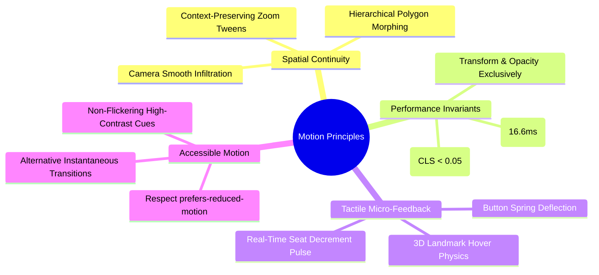
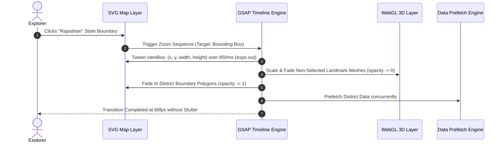

# Explore Bharat Safar — Animation Architecture, Motion Design & WebGL Specifications

- **Document Identifier**: EBS-DOC-17-ANIM
- **Version**: 1.0.0
- **Status**: Approved
- **Author**: Enterprise Architecture & Solutions Engineering Team
- **Target Audience**: Motion Designers, Frontend Animation Engineers, WebGL/Three.js Developers, Performance Engineers, Accessibility Specialists
- **Related Documents**:
  - `04-ui-ux.md`
  - `06-styleguide.md`
  - `16-map-engine.md`
  - `24-testing.md`
- **Last Updated**: 2026-09-28

---

## 1. Motion Design Philosophy & Performance Invariants

Motion in **Explore Bharat Safar** is not decorative embellishment; it is an ergonomic navigational instrument. It provides spatial continuity during geographical drilldowns, provides tactile confirmation during high-stakes booking operations, and elevates cultural storytelling through elegant, hardware-accelerated animations.



---

## 2. Core Animation Libraries & Technology Stack

- **GreenSock Animation Platform (GSAP 3.x)**: Primary timeline orchestration engine handling DOM transitions, SVG morphs, camera tweens, and scroll-triggered reveals (`ScrollTrigger`).
- **Three.js (r160+)**: WebGL canvas engine managing 3D miniature landmark token rotations, ambient lighting, and shader levitation effects.
- **Tailwind Transitions**: Applied for basic micro-interactions (color shifts, focus outlines, button hover backgrounds).

---

## 3. Easing Curves & Timing Standards

To evoke organic, physical realism, animation timing curves strictly adhere to the following mathematical cubic-bezier profiles:

| Motion Type | Duration ($\text{ms}$) | Easing Function | GSAP Syntax | Use Case & Application |
| :--- | :--- | :--- | :--- | :--- |
| **Map Zoom Tween** | $850\text{ ms}$ | `cubic-bezier(0.16, 1, 0.3, 1)` | `expo.out` | Seamless camera zoom into state/district boundaries. |
| **Drawer Slide In** | $450\text{ ms}$ | `cubic-bezier(0.22, 1, 0.36, 1)` | `power3.out` | Preview drawers emerging from bottom or right canvas. |
| **Token Hover Bounce**| $300\text{ ms}$ | `cubic-bezier(0.34, 1.56, 0.64, 1)`| `back.out(1.7)` | 3D landmark scale and levitation upon mouse cursor entry. |
| **Modal Scale In** | $250\text{ ms}$ | `cubic-bezier(0.16, 1, 0.3, 1)` | `power2.out` | Booking confirmation modals and legal waiver sheets. |
| **Seat Flash Pulse** | $600\text{ ms}$ | `cubic-bezier(0.4, 0, 0.6, 1)` | `sine.inOut` | Ambient pulse when remaining batch slots update live. |

---

## 4. Map Zoom & Camera Orchestration (GSAP Pipeline)



---

## 5. WebGL 3D Landmark Levitation Shader & Physics

All miniature landmark tokens execute a lightweight, non-blocking sinusoidal floating animation rendered inside a shared WebGL canvas:

$$y(t) = y_0 + A \cdot \sin(\omega t + \phi)$$

Where:
- Amplitude ($A$) = $3.5\text{ pixels}$
- Angular Frequency ($\omega$) = $1.8\text{ rad/s}$
- Phase Offset ($\phi$) = Randomized per landmark to prevent synchronized, artificial movement across multiple markers.

---

## 6. Accessibility & Reduced Motion Handling

When the operating system or browser detects `prefers-reduced-motion: reduce`:
- All zoom animations switch to instantaneous opacity cross-fades ($150\text{ms}$).
- Sinusoidal 3D landmark levitation is halted; models remain static at rest coordinates.
- Drawer animations bypass sliding transforms, appearing immediately with clean alpha fading.

```css
@media (prefers-reduced-motion: reduce) {
  *, *::before, *::after {
    animation-duration: 0.01ms !important;
    animation-iteration-count: 1 !important;
    transition-duration: 0.01ms !important;
    scroll-behavior: auto !important;
  }
}
```

---

## 7. Summary & Downstream Alignment

This animation specification dictates the motion choreography, WebGL rendering parameters, and frame-rate invariants for Explore Bharat Safar. Frontend engineers must implement all motion scripts according to these curves, ensuring full synchronization with `16-map-engine.md` and performance verification in `24-testing.md`.
