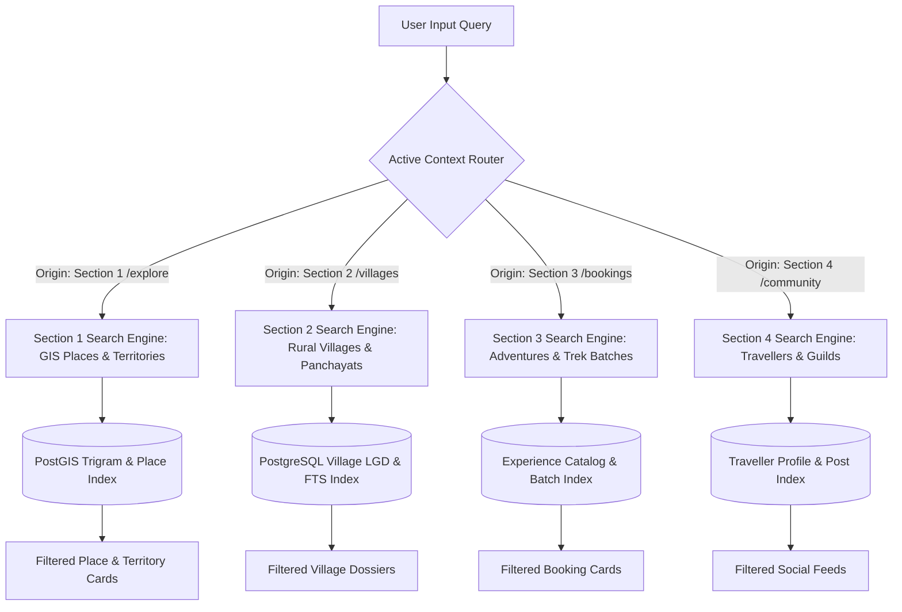
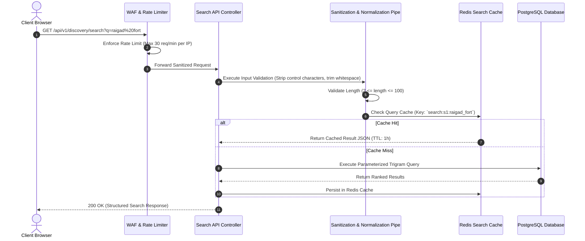

# Explore Bharat Safar — Isolated Search Architecture & Query Processing Engine

- **Document Identifier**: EBS-DOC-18-SEARCH
- **Version**: 1.0.0
- **Status**: Approved
- **Author**: Enterprise Architecture & Solutions Engineering Team
- **Target Audience**: Search Infrastructure Engineers, Backend Developers, Data Platform Architects, QA Performance Leads
- **Related Documents**:
  - `02-specification.md`
  - `03-architecture.md`
  - `08-context.md`
  - `09-api-design.md`
  - `10-database-design.md`
  - `26-business-rules.md`
- **Last Updated**: 2026-09-28

---

## 1. Search Philosophy & Mandatory Section Isolation

Search in **Explore Bharat Safar** is architected as four dedicated, logically isolated search sub-engines. A strict platform mandate prohibits global multi-domain search bleed: a user exploring heritage places must never receive village records, commercial trek batches, or personal social feeds in their discovery search bar.

### 1.1 Strict Domain Isolation Matrix

| Search Context | Target Route | Permitted Result Entities | Strictly Prohibited Entities |
| :--- | :--- | :--- | :--- |
| **Section 1 Discovery** | `/api/v1/discovery/search` | States, Districts, Talukas, Forts, Waterfalls, Temples, Monuments. | Village profiles, Trek bookings, Batch slots, Traveller usernames, Social media posts. |
| **Section 2 Villages** | `/api/v1/villages/search` | Village names, Gram Panchayats, PIN codes, Taluka village rosters. | Trek bookings, State tourism summaries, Social media stories, Discussion threads. |
| **Section 3 Bookings** | `/api/v1/bookings/search` | Trek packages, Heritage tours, Expedition batches, Departure dates. | Administrative village directories, Sovereign GIS boundaries, Personal user feeds. |
| **Section 4 Community** | `/api/v1/social/search` | Traveller usernames, Community groups, Post tags, Expedition hashtags. | Commercial booking inventories, Official Gram Panchayat documents, GIS polygons. |

---

## 2. Search Subsystem Architectures & Index Specifications

### 2.1 Section 1: Spatial & Trigram Search Engine (PostgreSQL `pg_trgm`)
- **Indexing Strategy**: GIN indexes applied over concatenated trigram vectors: `gin(name gin_trgm_ops)`.
- **Proximity Boosting**: If client coordinates are provided via geolocation headers, results within $50\text{ km}$ receive a logarithmic proximity score boost:

$$\text{Final Score} = \text{Similarity}(q, \text{name}) + \left( \frac{1}{1 + \ln(1 + \text{Distance}_{\text{km}})} \times 0.25 \right)$$

### 2.2 Section 2: Village LGD & Text Index
- **Indexing Strategy**: Full-text search `tsvector` combining Village Name (English & Devanagari), Gram Panchayat, and PIN code.
- **Prefix Matching**: Uses `to_tsquery('simple', query || ':*')` to support rapid sub-50ms autocomplete as rural users type village names.

### 2.3 Subsystem 3 & 4: Commercial & Social Inverted Indexes
- Redisearch in-memory trie structures caching active adventure experiences and popular community guilds for instant typeahead suggestions.

---

## 3. Query Sanitization & Security Pipeline

---

## 4. Typo Tolerance & Fuzzy Matching Rules

- **Levenshtein Distance**: Permitted edit distance is dynamically set based on query string length ($L$):
  - $L < 4$: Exact prefix match only (Distance = 0).
  - $4 \le L \le 7$: Distance = 1 (Handles single-letter typos, e.g., *"Hrishchandragad"* $\rightarrow$ *"Harishchandragad"*).
  - $L > 7$: Distance = 2.
- **Diacritic Normalization**: Accented and regional script transliterations are normalized to standard UTF-8 NFC representation before index lookup.

---

## 5. Summary & Downstream Alignment

This search engine specification enforces the mandatory domain isolation and sub-second query performance of Explore Bharat Safar. It connects directly with the discovery endpoints in `09-api-design.md`, database indexes in `10-database-design.md`, and business rules in `26-business-rules.md`.
