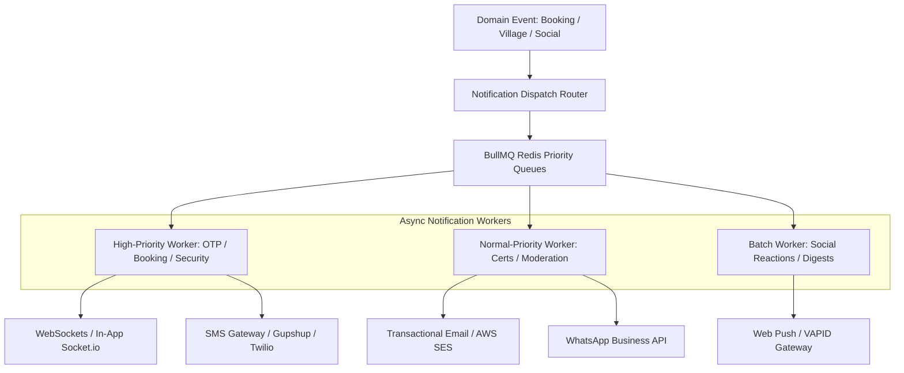
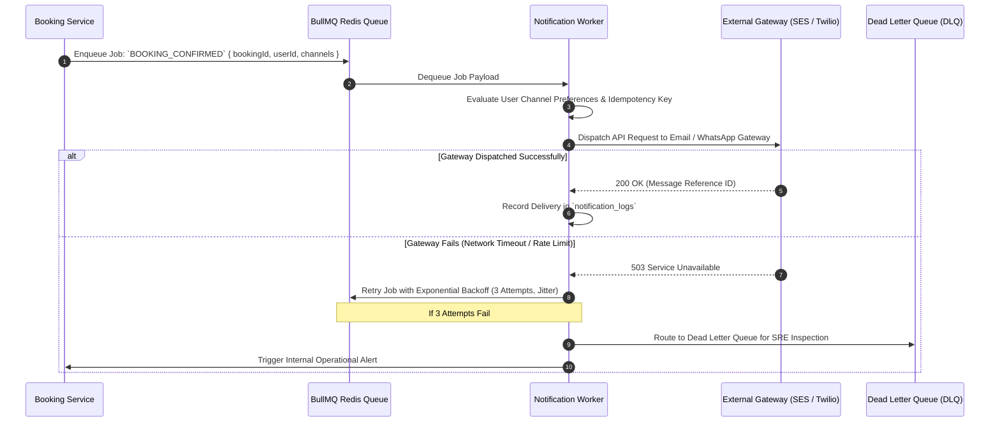

# Explore Bharat Safar — Multi-Channel Notification Architecture & Delivery Pipeline

- **Document Identifier**: EBS-DOC-19-NOTIF
- **Version**: 1.0.0
- **Status**: Approved
- **Author**: Enterprise Architecture & Solutions Engineering Team
- **Target Audience**: Backend Notification Engineers, DevOps SREs, Messaging Integrators, Frontend WebSocket Developers, Security Analysts
- **Related Documents**:
  - `02-specification.md`
  - `03-architecture.md`
  - `09-api-design.md`
  - `14-booking-system.md`
  - `15-social-media.md`
  - `20-certificate-system.md`
  - `29-third-party-services.md`
- **Last Updated**: 2026-09-28

---

## 1. Notification Mission & Architecture Overview

The **Notification System** of **Explore Bharat Safar** delivers critical transactional, operational, community, and security alerts across five coordinated communication channels. It guarantees that time-critical booking confirmations, emergency trail advisories, village moderation tickets, and completion certificates reach stakeholders reliably and without delay.



---

## 2. Multi-Channel Dispatch Taxonomy

| Notification Category | In-App WebSocket | Transactional Email | SMS Gateway | WhatsApp API | Web Push |
| :--- | :--- | :--- | :--- | :--- | :--- |
| **Authentication OTP & Security Alerts** | No | Yes (Instant) | Yes (Priority 1) | No | No |
| **Booking Advance Payment Confirmed** | Yes (Toast) | Yes (PDF Invoice)| Yes (Short SMS) | Yes (PDF Ticket) | Yes |
| **Trip Departure Countdown (48h/24h)** | Yes | Yes (Packing List) | Yes | Yes (Location Pin)| Yes |
| **Certificate Generated & Ready** | Yes (Badge) | Yes (PDF Attached)| No | Yes (Direct Link)| Yes |
| **Village Update Approved / Rejected**| Yes (Admin UI)| Yes (Formal Log) | No | No | No |
| **Social Follow / Comment / Reaction**| Yes (Drawer) | No (Or Daily Digest)| No | No | Optional |

---

## 3. Asynchronous Queue Architecture & Reliability (BullMQ)



### 3.1 Idempotency & Deduplication Engine
To prevent duplicate alerts during network retries or concurrent webhook handling, every notification generates a deterministic deduplication key stored in Redis with a 5-minute expiration:

$$\text{Dedup Key} = \text{MD5}\left(\text{UserId} \,\|\, \text{EventType} \,\|\, \text{EntityId} \,\|\, \text{Channel}\right)$$

If an incoming job matches an active deduplication key in Redis, it is acknowledged and discarded without re-sending.

---

## 4. User Notification Preference Matrix

Travellers maintain granular control over non-essential communications via their profile settings:

```typescript
export interface INotificationPreferences {
  userId: string;
  channels: {
    email: boolean;
    sms: boolean;
    whatsapp: boolean;
    inApp: boolean;
    webPush: boolean;
  };
  categories: {
    bookingAlerts: boolean; // Mandatory True (Cannot be disabled)
    trailSafetyAdvisories: boolean; // Mandatory True
    socialInteractions: boolean; // Follows, comments, reactions
    communityAnnouncements: boolean;
    weeklyCulturalNewsletter: boolean;
  };
}
```

---

## 5. Summary & Downstream Alignment

This notification architecture specification ensures reliable, multi-channel alerting across Explore Bharat Safar. It interfaces directly with the booking engine in `14-booking-system.md`, the certificate synthesis engine in `20-certificate-system.md`, and third-party integrations in `29-third-party-services.md`.
