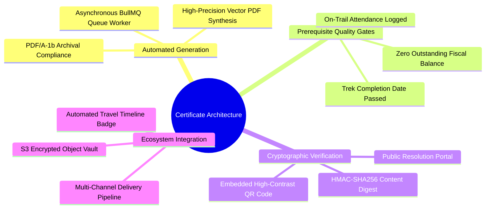
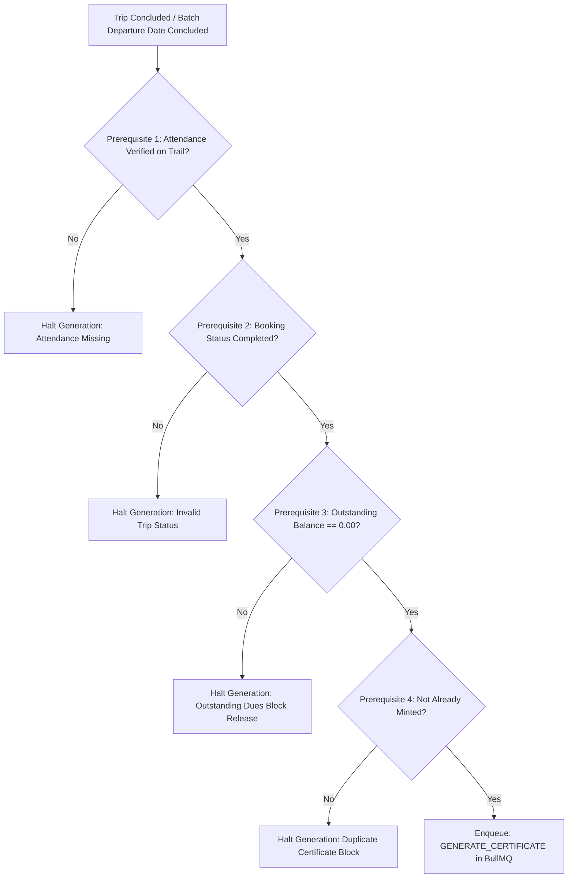
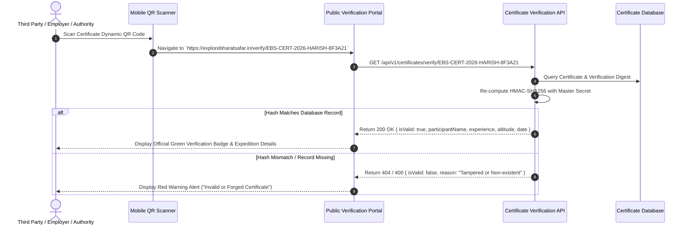
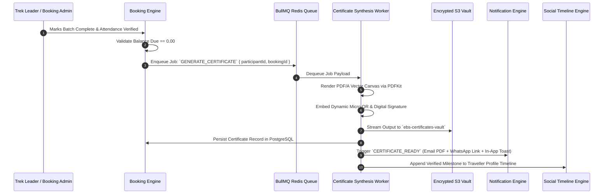

# Explore Bharat Safar — Digital Certificate System & Cryptographic Verification Architecture

- **Document Identifier**: EBS-DOC-20-CERT
- **Version**: 1.0.0
- **Status**: Approved
- **Author**: Enterprise Architecture & Solutions Engineering Team
- **Target Audience**: Backend Engineers, Cryptographic Security Specialists, Document Rendering Leads, QA Automation Engineers
- **Related Documents**:
  - `02-specification.md`
  - `03-architecture.md`
  - `05-drd.md`
  - `09-api-design.md`
  - `10-database-design.md`
  - `14-booking-system.md`
  - `26-business-rules.md`
- **Last Updated**: 2026-09-28

---

## 1. Certificate Mission & Architectural Scope

The **Digital Certificate System** of **Explore Bharat Safar** automates the generation, cryptographic sealing, distribution, and verification of digital certificates awarded to participants who successfully complete verified trekking expeditions, high-altitude mountaineering ascents, heritage restoration walks, or rural cultural workshops.

Unlike ordinary image templates or unauthenticated raster attachments, every certificate minted by the platform is a legally compliant, tamper-evident vector document conforming to **PDF/A-1b (ISO 19005-1)** archiving standards.

---

## 2. Strict Pre-requisite Quality Gates

Certificates are never generated prematurely or on demand. The asynchronous generation pipeline executes **if and only if** all four non-negotiable systemic criteria evaluate to `TRUE`:

### 2.1 Gate Invariants
- **Gate 1: On-Trail Attendance Verification**: The appointed trek leader or expedition administrator must explicitly verify the participant's physical presence at the summit, pass, or base camp via the Booking Admin roster.
- **Gate 2: Fiscal Ledger Balance Due Check**:
  $$\text{Outstanding Balance Due} \equiv \text{Total Price} - \text{Total Amount Paid} == 0.00$$
  If a booking is partially paid (e.g., $25\%$ advance deposit with balance outstanding), the certificate engine refuses execution and flags the record for financial settlement.

---

## 3. Certificate Visual & Architectural Specifications

> **Illustration Required: Certificate Layout**  
> *Vector Canvas Architecture*:
> - **Orientation & Dimensions**: Landscape A4 ($297\text{mm} \times 210\text{mm}$).
> - **Decorative Border**: Classical Indian guilloche geometric lace border printed in Sandstone Gold (`#CA8A04`) and Deep Saffron (`#D97706`).
> - **Embossed Header**: Central Ashoka lotus rosette emblem enclosing the official Explore Bharat Safar monogram.
> - **Typography Stack**: Headings rendered in stately serif font (*Rozha One* / *Cinzel*); participant names typeset in bold high-contrast calligraphic display face.
> - **Core Data Attributes**:
>   1. Unique Certificate Number: `EBS-CERT-2026-HARISH-8F3A21`
>   2. Participant Full Legal Name
>   3. Expedition Title & Cultural Territory (e.g., *Harishchandragad Monsoon Escarpment Trek, Taluka Akole, District Ahmednagar, Maharashtra*)
>   4. Maximum Altitude Reached (e.g., *1,422 Meters Above Mean Sea Level*)
>   5. Date of Completion ($DD\text{ Month }YYYY$)
>   6. Authorizing Signatures: Chief Expedition Leader & Platform Director
>   7. Embedded Machine-Readable QR Code (bottom-left corner)
>   8. Micro-printed cryptographic verification hash

---

## 4. Cryptographic Hashing & Verification Protocol

To prevent fraudulent duplication or digital manipulation of participant names:

$$\text{Verification Digest} = \text{HMAC-SHA256}\left(\text{MasterSecretKey}, \, C_{\text{num}} \,\|\, P_{\text{name}} \,\|\, E_{\text{id}} \,\|\, D_{\text{comp}}\right)$$

---

## 5. End-to-End Automated Issuance Workflow

---

## 6. Summary & Downstream Alignment

This certificate system specification details the automated synthesis, cryptographic validation, and delivery pipeline of Explore Bharat Safar. It interfaces directly with the booking engine in `14-booking-system.md`, notification system in `19-notification-system.md`, and business rules in `26-business-rules.md`.
