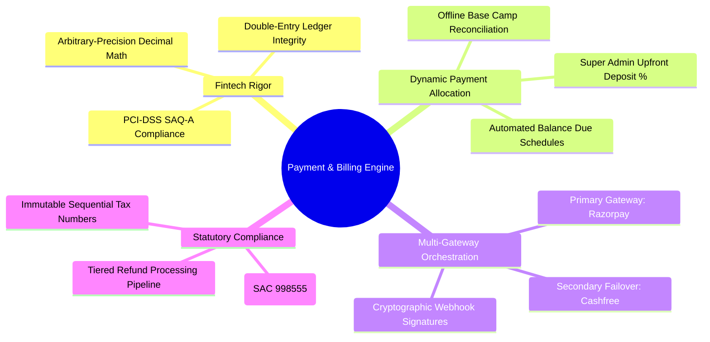
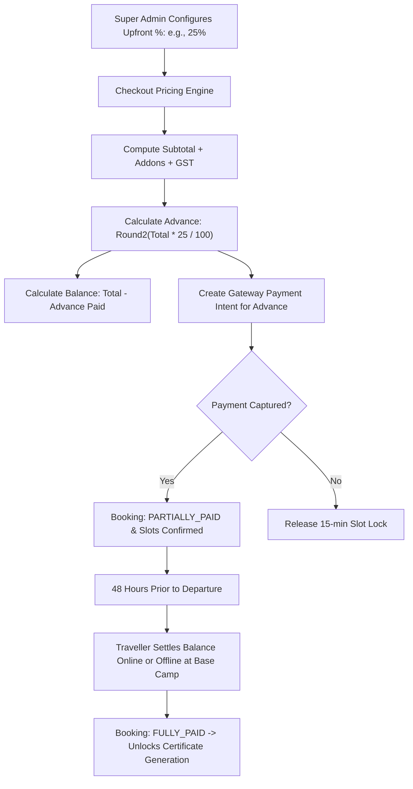
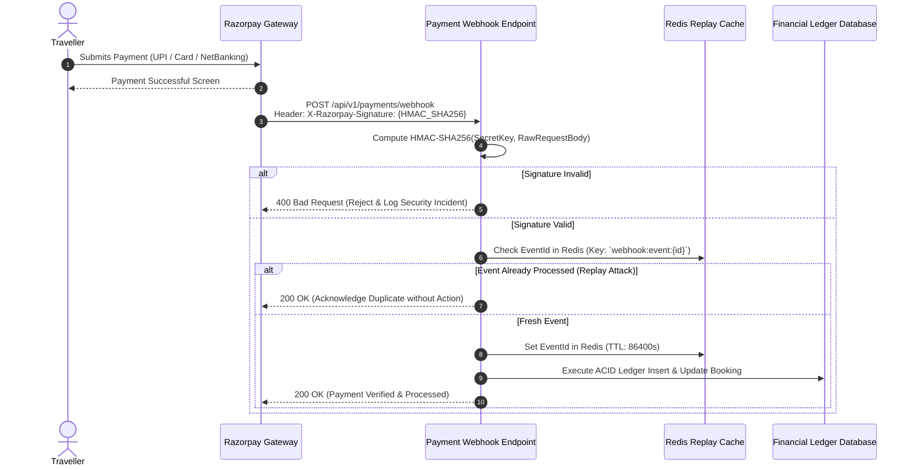
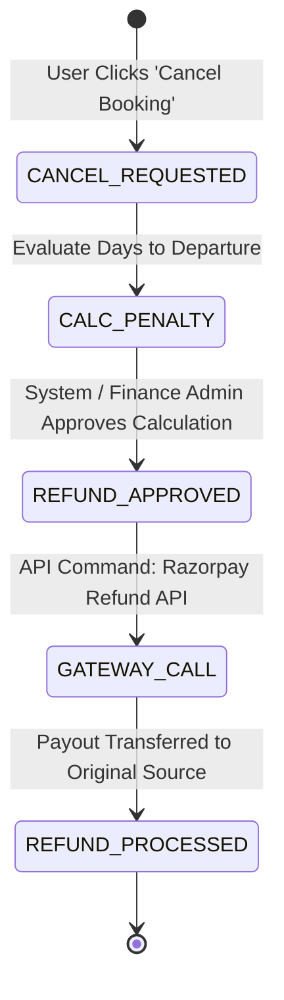

# Explore Bharat Safar — Payment Gateway Architecture, Partial Payment Engine & Financial Ledger

- **Document Identifier**: EBS-DOC-21-PAY
- **Version**: 1.0.0
- **Status**: Approved
- **Author**: Enterprise Architecture & Solutions Engineering Team
- **Target Audience**: Fintech Engineers, Backend Payment Leads, Financial Controllers, Billing Operations Specialists, Compliance Auditors
- **Related Documents**:
  - `02-specification.md`
  - `03-architecture.md`
  - `05-drd.md`
  - `09-api-design.md`
  - `10-database-design.md`
  - `14-booking-system.md`
  - `26-business-rules.md`
- **Last Updated**: 2026-09-28

---

## 1. Financial Philosophy & Ledger Rigor

The payment infrastructure of **Explore Bharat Safar** enforces strict banking-grade accounting principles, double-entry ledger bookkeeping, and zero-floating-point arithmetic. Every transaction, advance deposit, balance settlement, and cancellation refund is recorded immutably to guarantee absolute financial reconciliation.

---

## 2. Dynamic Upfront Payment Percentage Architecture

A central innovation of the platform is the Super Admin-configured upfront payment engine. Rather than forcing users to commit 100% upfront for expensive expeditions, the system dynamically accepts partial deposits while enforcing balance settlement rules prior to departure.

### 2.1 Pricing & Tax Mathematical Specifications
All monetary operations execute via SQL `numeric(12,2)` or JavaScript `Decimal.js` to eliminate binary floating-point rounding drifts:

$$\text{Subtotal } (ST) = \sum (\text{Base Price} \times N) + \sum (\text{Addons}) - \text{Discount}$$

$$\text{GST Tax } (5\% \text{ for Tour Services}) = \text{Round}_{2}\left(ST \times 0.05\right)$$

$$\text{Total Booking Amount } (TBA) = ST + \text{GST Tax}$$

$$\text{Mandatory Advance Deposit } (MAD) = \text{Round}_{2}\left(TBA \times \frac{P_{\text{admin}}}{100}\right)$$

$$\text{Outstanding Balance Due } (OBD) = TBA - \text{Total Amount Paid}$$

---

## 3. Payment Gateway Webhook Verification & Replay Defense

Payment confirmations are strictly processed via asynchronous, cryptographically signed webhooks to handle mobile dropouts, slow bank redirections, and network timeouts.

---

## 4. GST-Compliant Automated Invoicing Engine

Following payment clearance, an automated worker synthesizes a legally compliant GST tax invoice conforming to the Central Goods and Services Tax (CGST) Act rules:
- **Services Accounting Code (SAC)**: `998555` (Tour Operator Services).
- **Sequential Invoicing Pattern**: `EBS-INV-[FISCAL_YEAR]-[SEQUENTIAL_6_DIGIT]` (e.g., `EBS-INV-2026-004812`).
- **Tax Breakdown**: Clear demarcation of CGST ($2.5\%$) and SGST ($2.5\%$) for intra-state bookings, or IGST ($5\%$) for inter-state transactions.
- **Delivery**: Automatically archived in the secure S3 vault and dispatched to the traveller via email and WhatsApp.

---

## 5. Cancellation & Tiered Refund Ledger Processing

When a cancellation is submitted, the system automatically evaluates the departure threshold and computes the refund ledger payload:

| Time to Batch Departure | Refund Allocation | Cancellation Fee Retained |
| :--- | :--- | :--- |
| $\ge 30\text{ Days}$ | $90\%$ of Total Booking Price | $10\%$ administrative fee |
| $15 - 29\text{ Days}$ | $50\%$ of Total Booking Price | $50\%$ operational penalty |
| $7 - 14\text{ Days}$ | $25\%$ of Total Booking Price | $75\%$ operational penalty |
| $< 7\text{ Days}$ / No Show | $0\%$ Refund | $100\%$ penalty (Non-refundable) |

---

## 6. Summary & Downstream Alignment

This payment specification governs the financial calculations, gateway integrations, and tax accounting for Explore Bharat Safar. It interfaces directly with the booking system in `14-booking-system.md`, certificate system in `20-certificate-system.md`, and business rules in `26-business-rules.md`.
