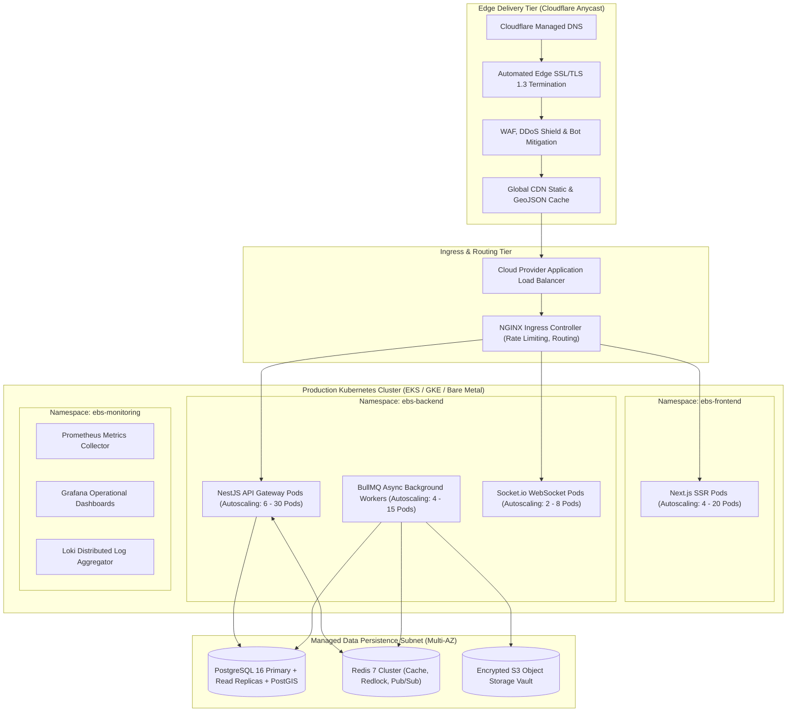
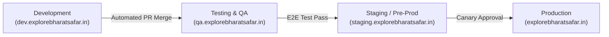

# Explore Bharat Safar — Production Deployment Architecture & Infrastructure Orchestration

- **Document Identifier**: EBS-DOC-22-DEPLOY
- **Version**: 1.0.0
- **Status**: Approved
- **Author**: Enterprise Architecture & Solutions Engineering Team
- **Target Audience**: DevOps Engineers, Site Reliability Engineers (SREs), Cloud Architects, Systems Administrators, Security Operations
- **Related Documents**:
  - `03-architecture.md`
  - `11-security.md`
  - `23-devops.md`
  - `24-testing.md`
  - `28-environment.md`
- **Last Updated**: 2026-09-28

---

## 1. Deployment Philosophy & Cloud-Native Topology

The deployment infrastructure of **Explore Bharat Safar** is architected to be cloud-agnostic, highly available across multiple availability zones, fully containerized via Docker, and orchestrated through declarative Kubernetes manifests. It guarantees zero-downtime deployments and rapid disaster recovery.



---

## 2. Environment Topology & Promotion Pipeline

The platform maintains four isolated environments to ensure comprehensive validation prior to production release:



| Environment Name | Purpose & Scope | Target Audience | Data Isolation | Scaling Configuration |
| :--- | :--- | :--- | :--- | :--- |
| **Development** | Continuous feature integration and rapid iteration. | Internal Developers | Synthetic seeded database. | Minimal (1 Pod per service). |
| **QA / Testing** | Automated end-to-end testing, QA test cases. | QA Engineers, Automation | Sanitized snapshot data. | Fixed (2 Pods per service). |
| **Staging** | Production mirror for performance benchmarks and pre-flight sign-off. | Product Leads, Auditors | Anonymized production replica. | Scaled (4 Pods, Multi-AZ). |
| **Production** | Live production traffic across Bharat. | Global Travellers & Admins | Live encrypted production DB. | HPA Dynamic (4 to 30 Pods). |

---

## 3. Multi-Stage Dockerfile Specifications

All application containers utilize multi-stage builds on lightweight Alpine / Debian-slim bases to minimize attack surface and image size ($\le 120\text{ MB}$).

```dockerfile
# Production Dockerfile for NestJS API Service
FROM node:20-alpine AS builder
WORKDIR /app
RUN apk add --no-cache libc6-compat
COPY package.json pnpm-lock.yaml ./
RUN npm install -g pnpm && pnpm install --frozen-lockfile
COPY . .
RUN pnpm build && pnpm prune --prod

FROM node:20-alpine AS runner
WORKDIR /app
ENV NODE_ENV=production
RUN addgroup --system --gid 1001 nodejs && adduser --system --uid 1001 appuser
COPY --from=builder /app/dist ./dist
COPY --from=builder /app/node_modules ./node_modules
COPY --from=builder /app/package.json ./package.json

USER appuser
EXPOSE 4000
CMD ["node", "dist/main.js"]
```

---

## 4. Kubernetes Deployment Manifest (API Service Sample)

```yaml
apiVersion: apps/v1
kind: Deployment
metadata:
  name: ebs-api-deployment
  namespace: ebs-backend
  labels:
    app.kubernetes.io/name: ebs-api
spec:
  replicas: 6
  revisionHistoryLimit: 5
  strategy:
    type: RollingUpdate
    rollingUpdate:
      maxSurge: 25%
      maxUnavailable: 0
  selector:
    matchLabels:
      app: ebs-api
  template:
    metadata:
      labels:
        app: ebs-api
    spec:
      containers:
      - name: api-container
        image: registry.explorebharatsafar.in/ebs-api:1.0.0
        resources:
          requests:
            cpu: "500m"
            memory: "512Mi"
          limits:
            cpu: "2000m"
            memory: "2048Mi"
        livenessProbe:
          httpGet:
            path: /health/liveness
            port: 4000
          initialDelaySeconds: 15
          periodSeconds: 10
        readinessProbe:
          httpGet:
            path: /health/readiness
            port: 4000
          initialDelaySeconds: 5
          periodSeconds: 5
        envFrom:
        - secretRef:
            name: ebs-api-secrets
        - configMapRef:
            name: ebs-api-config
```

---

## 5. Horizontal Pod Autoscaling (HPA) Policy

To gracefully handle burst traffic during trek opening announcements:
- **Target Metrics**: Target average CPU utilization: $70\%$; Target memory utilization: $80\%$.
- **Scale-Up Stabilization**: Instantaneous evaluation ($0\text{s}$ stabilization window) with $100\%$ pod doubling rate per 60 seconds.
- **Scale-Down Stabilization**: $300\text{s}$ cooldown to prevent pod flapping during fluctuating traffic spikes.

---

## 6. Summary & Downstream Alignment

This deployment specification establishes the containerization, Kubernetes orchestration, and environment topology of Explore Bharat Safar. It works hand-in-hand with `23-devops.md` for CI/CD automation pipelines, `28-environment.md` for environment variables, and `11-security.md` for container security standards.
