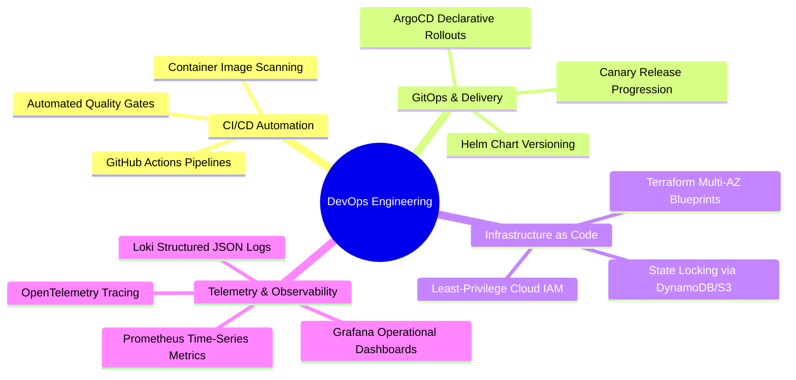

# Explore Bharat Safar — DevOps Automation, CI/CD Pipelines & Observability Architecture

- **Document Identifier**: EBS-DOC-23-DEVOPS
- **Version**: 1.0.0
- **Status**: Approved
- **Author**: Enterprise Architecture & Solutions Engineering Team
- **Target Audience**: DevOps Leads, Site Reliability Engineers, Platform Architects, CI/CD Engineers, Security Operations Specialists
- **Related Documents**:
  - `03-architecture.md`
  - `11-security.md`
  - `22-deployment.md`
  - `24-testing.md`
  - `28-environment.md`
- **Last Updated**: 2026-09-28

---

## 1. DevOps Philosophy & Operational Rigor

The DevOps practice of **Explore Bharat Safar** is founded on declarative **GitOps**, comprehensive automated testing gates, immutable infrastructure as code (IaC), and end-to-end distributed observability. Every release is fully automated, auditable, and capable of instantaneous rollback.



---

## 2. CI/CD Pipeline Architecture (GitHub Actions)

Every pull request and merge to `main` undergoes a rigorous, multi-stage automated pipeline:

```mermaid
flowchart TD
    PR[Developer Pull Request] --> Stage1[Stage 1: Linting, Formatting & Type-Check]
    Stage1 --> Stage2[Stage 2: Static Analysis & Secret Scanning (Trivy, GitGuardian)]
    Stage2 --> Stage3[Stage 3: Automated Unit & Integration Tests (Jest)]
    Stage3 --> Merge[Merge to Main Branch]
    
    Merge --> Stage4[Stage 4: Multi-Stage Container Build & OCI Push]
    Stage4 --> Stage5[Stage 5: Deploy to Staging via ArgoCD]
    Stage5 --> Stage6[Stage 6: Automated Smoke & E2E Tests (Playwright)]
    Stage6 --> Stage7{Pre-Flight Gate Passed?}
    Stage7 -- Yes --> Stage8[Stage 7: Production Canary Rollout (10% -> 50% -> 100%)]
    Stage7 -- No --> Rollback[Automatic Canary Abort & Instant Rollback]
```

### 2.1 Pipeline Stage Requirements
1. **Lint & Security**: ESLint, Prettier, TypeScript strict check, and GitGuardian scanning for exposed API keys or private certificates.
2. **Container Scanning**: Trivy scanner inspects image layers for CVE vulnerabilities. Builds fail if any `CRITICAL` or `HIGH` vulnerabilities are detected.
3. **Canary Deployment**: Production updates roll out to $10\%$ of traffic for 15 minutes. Prometheus monitors 5xx HTTP error rates and latency. If error rates exceed $0.5\%$, ArgoCD automatically aborts and rolls back to the prior stable release tag.

---

## 3. Infrastructure as Code (Terraform Topology)

All cloud resources are provisioned declaratively via Terraform modules with remote state storage in an encrypted S3 bucket backed by DynamoDB state locking:

```text
infrastructure/terraform/
├── environments/
│   ├── dev/
│   ├── staging/
│   └── prod/
│       ├── main.tf
│       ├── variables.tf
│       └── terraform.tfvars
└── modules/
    ├── vpc/             # Multi-AZ VPC, Public/Private/Database Subnets
    ├── eks/             # Kubernetes Managed Node Groups, OIDC Roles
    ├── rds_postgis/     # PostgreSQL 16 Multi-AZ, Automated Backups, PostGIS
    ├── redis_cluster/   # ElastiCache Redis 7 Multi-Node Cluster
    ├── s3_vaults/       # Encrypted Buckets (Media, Certs, Backups)
    └── cloudflare/      # WAF rules, DNS records, Page Rules
```

---

## 4. Observability Stack: Metrics, Logs & Distributed Tracing

```mermaid
graph TD
    AppPods[Application Pods (Frontend, API, Workers)] --> OTelSidecar[OpenTelemetry Collector Sidecar]
    
    OTelSidecar -->|Metrics Scraping| Prometheus[Prometheus Cluster]
    OTelSidecar -->|Structured JSON Logs| Loki[Grafana Loki Storage]
    OTelSidecar -->|Distributed Spans| Jaeger[Jaeger Tracing Backend]

    Prometheus --> Grafana[Grafana Master Operations Console]
    Loki --> Grafana
    Jaeger --> Grafana

    Prometheus --> Alertmanager[Prometheus Alertmanager]
    Alertmanager --> PagerDuty[PagerDuty On-Call Alerts]
    Alertmanager --> Slack[Slack #ops-incident Channel]
```

### 4.1 Key Performance & Health Alert Thresholds

| Metric Identifier | PromQL Query Expression | Alert Severity | Notification Channel | Operational Action |
| :--- | :--- | :--- | :--- | :--- |
| **API Error Rate** | `rate(http_requests_total{status=~"5.."}[2m]) > 0.01` | **P1 - Critical** | PagerDuty | SRE immediately triages pod logs via Loki. |
| **P95 Latency Spike** | `histogram_quantile(0.95, rate(http_request_duration_seconds_bucket[5m])) > 0.5` | **P2 - High** | Slack `#ops-high` | Scale out API replica pods via HPA. |
| **Database Pool Saturation**| `pg_stat_activity_count / pg_settings_max_connections > 0.85` | **P1 - Critical** | PagerDuty | Inspect long-running locks; scale PgBouncer. |
| **Redis Memory Limit** | `redis_memory_used_bytes / redis_memory_max_bytes > 0.80` | **P2 - High** | Slack `#ops-high` | Flush expired lock keys; evaluate eviction. |

---

## 5. Automated Backup & Disaster Recovery (DR) Blueprint

- **Point-in-Time Recovery (PITR)**: Continuous PostgreSQL Write-Ahead Log (WAL) archiving streamed directly to an off-region S3 cold vault.
- **Automated Snapshots**: Full automated daily database snapshots retained for 30 days; weekly snapshots retained for 1 year.
- **Recovery Targets**:
  - **Recovery Point Objective (RPO)**: $\le 5\text{ minutes}$ (maximum acceptable data loss in catastrophic disaster).
  - **Recovery Time Objective (RTO)**: $\le 30\text{ minutes}$ (maximum time to restore fully operational status in alternate cloud zone).
- **Quarterly Disaster Drills**: Simulated complete cloud zone failure executed every 90 days to verify automated snapshot restoration.

---

## 6. Summary & Downstream Alignment

This DevOps and SRE specification establishes the deployment automation, infrastructure provisioning, and production monitoring for Explore Bharat Safar. It works in lockstep with `22-deployment.md` for container specs, `24-testing.md` for automated quality test suites, and `28-environment.md` for configuration management.
