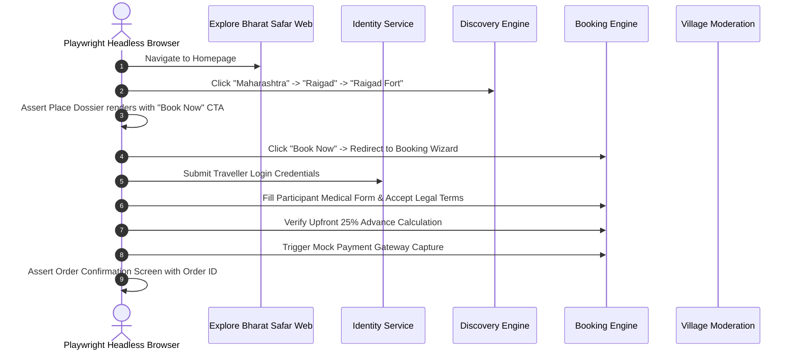

# Explore Bharat Safar — Quality Assurance Strategy, Test Automation & Load Verification

- **Document Identifier**: EBS-DOC-24-TEST
- **Version**: 1.0.0
- **Status**: Approved
- **Author**: Enterprise Architecture & Solutions Engineering Team
- **Target Audience**: QA Leads, Automation Engineers, Backend/Frontend Developers, Performance Engineers, Security Auditors
- **Related Documents**:
  - `02-specification.md`
  - `03-architecture.md`
  - `05-drd.md`
  - `09-api-design.md`
  - `14-booking-system.md`
  - `23-devops.md`
- **Last Updated**: 2026-09-28

---

## 1. Quality Assurance Philosophy & Testing Pyramid

The testing strategy of **Explore Bharat Safar** enforces strict multi-layered verification to ensure zero transactional discrepancies, zero inventory race conditions, zero cross-domain search leakage, and high accessibility compliance across all mobile and web viewports.

```mermaid
graph BT
    Manual[Exploratory & Accessibility Screen-Reader Testing] --> E2E[End-to-End User Journeys (Playwright)]
    E2E --> Perf[Performance, Load & Concurrency Stress Testing (k6)]
    Perf --> Integration[API Integration & Contract Testing (Supertest)]
    Integration --> Unit[Unit & Domain Logic Tests (Jest / Vitest)]
```

### 1.1 Quality Metrics & Coverage Targets
- **Unit Test Coverage**: Minimum $\ge 90\%$ code coverage on all core financial calculations, upfront payment percentage math, and validation pipes.
- **Integration Test Coverage**: $100\%$ of all published REST endpoints and WebSocket channels tested under positive and negative failure modes.
- **Flaky Test Ceiling**: Zero flaky tests permitted in the merge-to-main gating pipeline. Any test exhibiting non-deterministic behavior is immediately quarantined.

---

## 2. Testing Layers & Automation Tooling

| Testing Level | Scope & Target Subsystem | Primary Automation Framework | Execution Cadence |
| :--- | :--- | :--- | :--- |
| **Unit Tests** | Pricing math, tax calculations, JWT validation, validation regex. | Jest / Vitest | Pre-commit hook & Every Pull Request. |
| **Integration Tests** | REST API endpoints, Redis locks, PostGIS spatial queries, Webhooks. | Supertest / Testcontainers | Every Pull Request & Staging Build. |
| **End-to-End (E2E)** | Full checkout journeys, map drilldowns, village approval workflows. | Playwright (Headless Chromium/WebKit) | Nightly Staging Runs & Pre-Release. |
| **Concurrency Load** | Flash-sale booking concurrency, slot locks, high-volume map tiles. | k6 / Distributed Cluster | Bi-weekly & Prior to National Releases. |
| **Security Scanning** | Static code analysis, dependency audits, OWASP Top 10 penetration. | SonarQube, Trivy, OWASP ZAP | Continuous CI & Monthly Penetration Audit. |
| **Accessibility (a11y)**| WCAG 2.1 AA compliance, focus traps, screen reader semantics. | axe-core / Lighthouse CI | Automated in E2E Pipeline. |

---

## 3. High-Concurrency Stress Testing (k6 Test Scripts)

To empirically verify that race conditions cannot cause negative inventory during high-demand expedition batch releases:

```javascript
// k6-load-test-booking-concurrency.js
import http from 'k6/http';
import { check, sleep } from 'k6';

export const options = {
  scenarios: {
    flash_booking_burst: {
      executor: 'per-vu-iterations',
      vus: 1000, // 1,000 concurrent virtual users
      iterations: 1,
      maxDuration: '30s',
    },
  },
};

export default function () {
  const payload = JSON.stringify({
    batchId: 'b18a24e0-7c21-419b-a012-6a7f8e9124a1', // Batch has exactly 10 slots
    slotsRequested: 1,
    participants: [{ fullName: 'Test Explorer', age: 25, emergencyPhone: '+919820000000' }],
    termsAccepted: true,
  });

  const params = {
    headers: {
      'Content-Type': 'application/json',
      'Authorization': 'Bearer ' + __ENV.TEST_USER_TOKEN,
    },
  };

  const res = http.post('https://staging.explorebharatsafar.in/api/v1/bookings/reserve', payload, params);

  // Exactly 10 requests must succeed with 201 Created; 990 must be rejected with 409 Conflict
  check(res, {
    'is status 201 or 409': (r) => r.status === 201 || r.status === 409,
    'zero 500 internal errors': (r) => r.status !== 500,
  });
}
```

---

## 4. End-to-End (E2E) Test Suite Scenarios (Playwright)



---

## 5. Security & Penetration Testing Protocols

1. **Broken Object Level Authorization (BOLA / IDOR)**:
   - Automated scripts test whether `User A` can read or mutate the bookings, certificates, or draft village updates belonging to `User B` by manipulating UUIDs in API paths.
2. **SQL Injection Fuzzing**:
   - Every text input field (search bars, bio, village historical notes) is fuzzed with complex SQL syntax payloads (`' OR 1=1 --`, `UNION SELECT`). The system must return 400 Bad Request or sanitized text without database runtime errors.
3. **Cross-Domain Search Leakage Verification**:
   - Automated integration tests execute search queries across all endpoints verifying that `/api/v1/discovery/search` never returns results containing village census IDs or commercial booking packages.

---

## 6. Summary & Downstream Alignment

This quality assurance specification defines the verification protocols, test suites, and load benchmarks for Explore Bharat Safar. It interfaces directly with CI/CD automation in `23-devops.md`, detailed requirements in `05-drd.md`, and business rules in `26-business-rules.md`.
