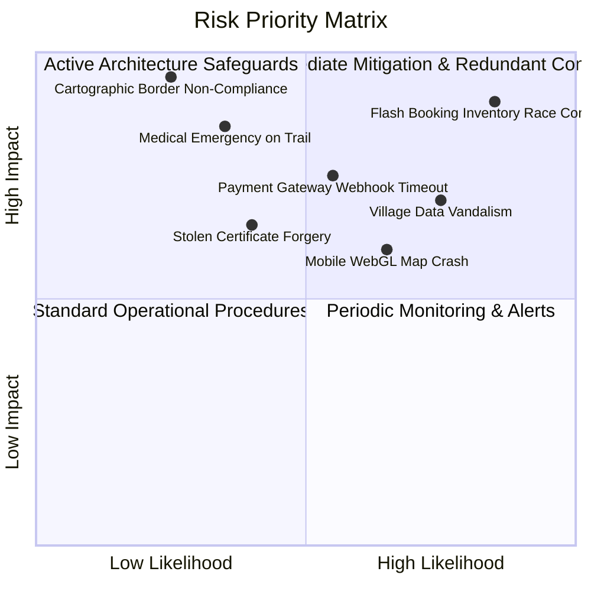

# Explore Bharat Safar — Comprehensive Risk Analysis, Threat Matrix & Mitigation Blueprint

- **Document Identifier**: EBS-DOC-25-RISK
- **Version**: 1.0.0
- **Status**: Approved
- **Author**: Enterprise Architecture & Solutions Engineering Team
- **Target Audience**: Risk Committees, Chief Technology Officer, Legal Counsel, Chief Information Security Officer, Operational Directors
- **Related Documents**:
  - `02-specification.md`
  - `03-architecture.md`
  - `11-security.md`
  - `14-booking-system.md`
  - `16-map-engine.md`
  - `26-business-rules.md`
- **Last Updated**: 2026-09-28

---

## 1. Risk Governance Philosophy & Methodology

The realization of an ecosystem as vast and culturally vital as **Explore Bharat Safar** exposes the enterprise to multidimensional risk vectors. Risk management is approached through systematic evaluation of **Likelihood** ($1 - 5$) and **Impact** ($1 - 5$), yielding a comprehensive **Risk Priority Number (RPN)** ($1 - 25$).



---

## 2. Comprehensive Enterprise Risk Matrix

| Risk Identifier | Risk Category | Threat Description | Likelihood (1-5) | Impact (1-5) | RPN (1-25) | Engineered Mitigation & Controls |
| :--- | :--- | :--- | :--- | :--- | :--- | :--- |
| **RSK-LEGAL-01** | Legal / Sovereign | Inadvertent misrepresentation of India's international borders violating Survey of India regulations. | 2 | 5 | **10** (Critical) | Ingestion of certified Survey of India GIS boundary shapefiles only; automated CI cartographic vector validation gate. |
| **RSK-TECH-01** | Technical | High-concurrency race condition causing double-booking / negative batch inventory. | 4 | 5 | **20** (Critical) | Distributed Redis Redlock with atomic Lua scripts; PostgreSQL DB check constraint `CHECK (available_slots >= 0)`. |
| **RSK-DATA-01** | Operational | Unverified user or rogue Village Admin vandalizes rural historical or administrative data. | 4 | 4 | **16** (High) | Strict two-tier approval workflow; mandatory moderator sign-off before publishing; immutable audit diffs. |
| **RSK-FIN-01** | Financial | Payment gateway webhook drops, causing user to pay without booking confirmation. | 3 | 4 | **12** (High) | 15-minute slot lock; background reconciliation worker polling gateway API for pending transactions. |
| **RSK-OPS-01** | Operational | Serious participant medical emergency during remote high-altitude expedition. | 2 | 5 | **10** (Critical) | Mandatory medical self-declaration; certified mountaineering leaders; satellite emergency protocol; mandatory insurance add-on. |
| **RSK-PERF-01** | Technical | Mobile devices crash or stutter when loading complex vector maps with thousands of markers. | 4 | 3 | **12** (High) | Dynamic PostGIS Douglas-Peucker simplification; Supercluster K-D Tree marker grouping; WebGL SVG fallback. |
| **RSK-TRUST-01** | Brand / Trust | Malicious actor counterfeits an expedition completion certificate for fraudulent credentials. | 2 | 4 | **8** (Medium) | Server-side HMAC-SHA256 verification hash; embedded high-contrast QR resolving to public real-time platform ledger. |
| **RSK-COMP-01** | Compliance | Violation of India's Digital Personal Data Protection (DPDP) Act regarding participant medical data. | 2 | 5 | **10** (Critical) | AES-256 application-level envelope encryption for medical fields; strict purpose limitation; automated data erasure workflows. |

---

## 3. Deep-Dive Mitigation Strategies

```mermaid
graph TD
    subgraph LegalCompliance["Legal & Regulatory Defense"]
        L1[Official Survey of India TopoJSON Sources] --> L2[Automated Vector Boundary Integrity Tests in CI]
        L2 --> L3[Legal Sign-Off on Map Tiles Prior to Production]
    end

    subgraph InventoryIntegrity["High-Concurrency Inventory Defense"]
        I1[1,000+ Concurrent Checkouts] --> I2[Atomic Redis Lua Script Decr]
        I2 --> I3{Slot Available?}
        I3 -- Yes --> I4[Lock Acquired (15m TTL)]
        I3 -- No --> I5[Instant 409 Conflict Response]
    end

    subgraph RuralGovernance["Village Data Protection"]
        V1[Village Admin Submits Change] --> V2[Staged in Isolated Table]
        V2 --> V3[Regional Moderator Verified]
        V3 --> V4[Published to Public Directory]
    end
```

### 3.1 Cartographic Border Compliance (Survey of India Standards)
- **Regulatory Framework**: The Criminal Law Amendment Act and official mapping guidelines issued by the Ministry of Home Affairs mandate the accurate depiction of Jammu & Kashmir, Ladakh, and Arunachal Pradesh.
- **Enforced Strategy**: Vector boundary files are sourced directly from verified national open geospatial data repositories. Automated unit tests in CI verify that coordinate extremes and boundary topologies match sovereign benchmark coordinates with zero deviance.

### 3.2 Medical Telemetry & Trail Safety Invariants
- Treks classified as `CHALLENGING` or exceeding $3,000\text{ meters}$ elevation mandate:
  1. Mandatory medical declaration reviewed by the expedition coordinator.
  2. Certified Wilderness First Responder (WFR) guide on-trail with pulse oximeters and oxygen cylinders.
  3. Pre-defined emergency evacuation coordinates and tie-ups with district disaster response forces.

---

## 4. Crisis Management & Business Continuity Plan (BCP)

In the event of a catastrophic regional cloud outage, database corruption, or security event:
1. **P1 Response Team Mobilization**: Automated PagerDuty escalation triggers the on-call incident commander, lead database administrator, and security lead within 5 minutes.
2. **Read-Only Degradation Mode**: If the primary database encounters failover delay, the API Gateway immediately transitions to read-only mode, serving cached discovery and village pages from Redis and CDN replicas while queuing booking attempts.
3. **Point-in-Time Recovery Execution**: If data corruption occurs, PITR procedures restore the relational cluster from S3 continuous WAL archives to the last verified uncorrupted transaction ($RTO \le 30\text{ mins}$).

---

## 5. Summary & Downstream Alignment

This risk analysis identifies the primary threats facing Explore Bharat Safar and specifies their structural mitigations. It informs the security architecture in `11-security.md`, business rules in `26-business-rules.md`, and operational procedures in `38-project-checklist.md`.
