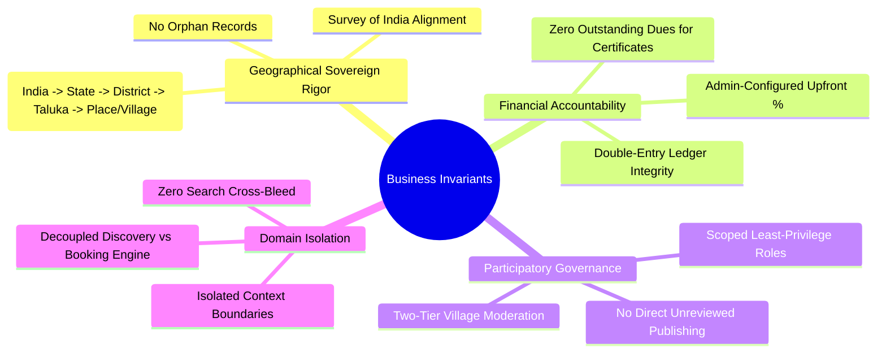
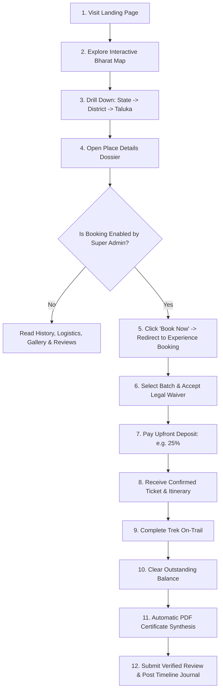
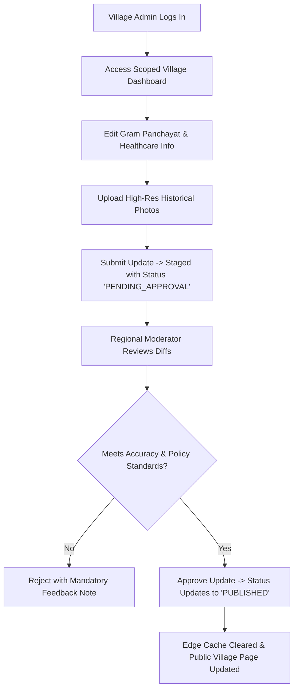

# Explore Bharat Safar — Comprehensive Business Rules, Domain Invariants & Governance Logic

- **Document Identifier**: EBS-DOC-26-RULES
- **Version**: 1.0.0
- **Status**: Approved
- **Author**: Enterprise Architecture & Solutions Engineering Team
- **Target Audience**: Business Analysts, Lead Architects, Product Managers, Backend/Frontend Developers, QA Automation Engineers, Compliance Officers
- **Related Documents**:
  - `01-idea.md`
  - `02-specification.md`
  - `05-drd.md`
  - `10-database-design.md`
  - `14-booking-system.md`
  - `20-certificate-system.md`
  - `21-payment-system.md`
- **Last Updated**: 2026-09-28

---

## 1. Business Philosophy & Foundational Mission

All functional implementations, database queries, interface interactions, and administrative decisions within **Explore Bharat Safar** must strictly align with the overarching enterprise mission:

> *"Discover Bharat. Experience Bharat. Understand Bharat."*

The platform exists to preserve cultural dignity, elevate grassroots village knowledge, foster conscious outdoor exploration, and maintain uncompromising data integrity across the geography of India.

---

## 2. The Ten Canonical Global Business Rules

These ten foundational business rules govern the entire system and take absolute precedence over any convenience or localized implementation choices:

```mermaid
graph TD
    R1["Rule 1: Exactly One Account per User"]
    R2["Rule 2: One Account -> Multiple Bookings"]
    R3["Rule 3: One Account -> Multiple Posts"]
    R4["Rule 4: One Account -> Multiple Reviews"]
    R5["Rule 5: One Booking -> Exactly One Experience"]
    R6["Rule 6: One Experience -> Many Bookings"]
    R7["Rule 7: One Certificate -> Exactly One Participant"]
    R8["Rule 8: One Participant -> Multiple Certificates over Time"]
    R9["Rule 9: Sovereign Geo Hierarchy (India -> State -> District -> Taluka -> Place)"]
    R10["Rule 10: Village Geo Hierarchy (State -> District -> Taluka -> Village)"]
```

### Rule 1: Account Uniqueness
Every natural person or entity registered on the platform must possess **exactly one** primary account tied to a unique, verified email address and phone number. Multi-account creation for fraudulent reviews or artificial batch holding is strictly prohibited.

### Rule 2: Booking Multiplicity
A single verified user account may place **multiple bookings** across distinct experiences, batches, and geographical regions over time.

### Rule 3: Content Creation Multiplicity
A single verified user account may author and publish **multiple social posts**, expedition journals, and community advisories subject to rate limits.

### Rule 4: Review Multiplicity
A single verified user account may submit **multiple reviews**, provided each review is tied to a distinct, completed travel experience or visited destination.

### Rule 5: Booking-Experience Cardinality
Every individual booking record must belong to **exactly one** parent experience package. Multi-experience composite carts are decoupled into discrete booking orders.

### Rule 6: Experience Batch Capacity
A single published adventure experience can encompass **many batches** and accommodate **many distinct bookings** across calendar seasons.

### Rule 7: Certificate-Participant Invariant
Every generated digital completion certificate belongs to **exactly one unique participant record**. Group or shared certificates are strictly prohibited.

### Rule 8: Participant Milestone Accumulation
A single participant may earn **multiple completion certificates** over their lifetime as they complete different verified expeditions.

### Rule 9: Sovereign Geographical Hierarchy Invariant
Every documented destination, monument, waterfall, temple, or fort must belong to an immutable, top-down administrative hierarchy:

$$\text{India (Sovereign Nation)} \longrightarrow \text{State / UT} \longrightarrow \text{District} \longrightarrow \text{Taluka} \longrightarrow \text{Place}$$

No place entity can exist without complete parent foreign keys. This hierarchy must never be violated or bypassed.

### Rule 10: Village Administrative Hierarchy Invariant
Every documented rural village record must strictly reside within the administrative territorial hierarchy:

$$\text{State / UT} \longrightarrow \text{District} \longrightarrow \text{Taluka} \longrightarrow \text{Village}$$

Village records cannot exist as orphaned entities or outside their designated Taluka boundary.

---

## 3. Role-Based Access Control (RBAC) Governance Rules

```mermaid
classDiagram
    class Guest {
        +Browse public destinations()
        +Read articles()
        +Search places()
        -Cannot book()
        -Cannot review()
    }
    class Traveller {
        +Book trips()
        +Make payments()
        +Publish posts & reviews()
        +Download certificates()
        -Cannot approve content()
    }
    class VillageAdmin {
        +Edit assigned village()
        +Upload village media()
        +Submit updates for review()
        -Cannot publish directly()
        -Cannot access bookings()
    }
    class BookingAdmin {
        +Manage batches & capacity()
        +Verify on-trail attendance()
        +Issue manual corrections()
        -Cannot modify system settings()
    }
    class FinanceAdmin {
        +Reconcile transactions()
        +Approve refunds()
        +Generate tax invoices()
        -Cannot edit cultural content()
    }
    class Moderator {
        +Review flagged posts()
        +Moderate village updates()
        +Triage community abuse()
        -Cannot change financial rules()
    }
    class SuperAdmin {
        +Unrestricted global access()
        +Configure navigation tree()
        +Set upfront payment %()
        +Toggle place booking CTAs()
    }
```

---

## 4. End-to-End User Journey Specifications

### 4.1 Traveller Exploration & Booking Journey

### 4.2 Village Admin & Moderation Journey

---

## 5. Comprehensive Input Validation Matrices

### 5.1 Identity & Form Validation Rules

| Field Identifier | Required | Minimum Length | Maximum Length | Allowed Character Pattern / Regex | Error Message upon Violation |
| :--- | :--- | :--- | :--- | :--- | :--- |
| **User Email** | Yes | 5 | 255 | `^[a-zA-Z0-9._%+-]+@[a-zA-Z0-9.-]+\.[a-zA-Z]{2,}$` | *"Please enter a valid email address."* |
| **User Password**| Yes | 12 | 128 | Complex (Upper, Lower, Digit, Symbol) | *"Password must be at least 12 chars with mixed types."* |
| **Phone Number** | Yes | 10 | 15 | `^\+?[1-9]\d{9,14}$` (E.164 compliant) | *"Please enter a valid contact phone number."* |
| **Participant Age**| Yes | $1$ | $3$ | Numerical: Integer $5 \le \text{Age} \le 85$ | *"Participant age must be between 5 and 85."* |
| **Village PIN** | Yes | 6 | 6 | `^[1-9][0-9]{5}$` (Indian Postal Index) | *"PIN code must be a valid 6-digit postal code."* |
| **Post Journal** | Yes | 20 | 10,000 | UTF-8 Text / Markdown (Sanitized) | *"Expedition journal must be at least 20 characters."* |

---

## 6. Summary & Downstream Alignment

These business rules represent the definitive operational guidelines and behavioral invariants of Explore Bharat Safar. Every database constraint in `10-database-design.md`, API controller logic in `09-api-design.md`, and test scenario in `24-testing.md` must enforce compliance with these standards.
