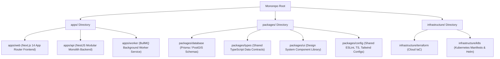

# Explore Bharat Safar — Enterprise Repository Architecture & Codebase Folder Structure

- **Document Identifier**: EBS-DOC-27-STRUCT
- **Version**: 1.0.0
- **Status**: Approved
- **Author**: Enterprise Architecture & Solutions Engineering Team
- **Target Audience**: Lead Software Architects, Fullstack Engineers, DevOps Leads, Engineering Managers
- **Related Documents**:
  - `03-architecture.md`
  - `04-ui-ux.md`
  - `06-styleguide.md`
  - `09-api-design.md`
  - `10-database-design.md`
  - `22-deployment.md`
- **Last Updated**: 2026-09-28

---

## 1. Codebase Architecture & Monorepo Strategy

The production software implementation of **Explore Bharat Safar** is architected as an enterprise monorepo orchestrated via **Turborepo** and **pnpm workspaces**. This ensures shared type safety between frontend and backend services, atomic versioning, cached compilation pipelines, and clean separation of concerns.

> **Important Operational Note**:  
> This document specifies the *future application code repository structure* to be implemented by software engineering teams. It does not alter or modify the current documentation directory layout.



---

## 2. Comprehensive Directory Tree Specification

```text
explore-bharat-safar/
├── .github/
│   ├── workflows/
│   │   ├── ci-pipeline.yml               # Lint, type-check, unit tests
│   │   ├── container-scan.yml            # Trivy image vulnerability scan
│   │   └── deploy-staging.yml            # Automated staging rollout
│   └── pull_request_template.md
├── apps/
│   ├── web/                              # Next.js 14+ App Router Frontend
│   │   ├── public/
│   │   │   ├── geo/                      # Cached national TopoJSON files
│   │   │   ├── models/                   # 3D landmark GLB models (Draco compressed)
│   │   │   └── brand/                    # Logos, emblems, favicons
│   │   ├── src/
│   │   │   ├── app/                      # Next.js App Router directory
│   │   │   │   ├── (auth)/               # Route group: login, register, reset-password
│   │   │   │   ├── (discovery)/          # Section 1: /explore, /states, /places
│   │   │   │   ├── (villages)/           # Section 2: /villages, /gram-panchayat
│   │   │   │   ├── (bookings)/           # Section 3: /experiences, /checkout
│   │   │   │   ├── (social)/             # Section 4: /feed, /profile, /communities
│   │   │   │   ├── (admin)/              # Administrative consoles & moderation
│   │   │   │   ├── api/                  # BFF / Webhook receiver proxy endpoints
│   │   │   │   ├── layout.tsx            # Global app shell with accessibility provider
│   │   │   │   └── page.tsx              # Homepage with full-screen interactive India map
│   │   │   ├── components/
│   │   │   │   ├── map/                  # GIS vector canvas, SVG renderer, Three.js overlay
│   │   │   │   ├── booking/              # Checkout wizard, slot lock timer, price summary
│   │   │   │   ├── village/              # Panchayat directory card, public utilities grid
│   │   │   │   └── social/               # Post card, story circle, timeline milestone
│   │   │   ├── hooks/                    # useMapViewport, useBatchLock, useWebSocket
│   │   │   └── styles/                   # globals.css, tailwind base layers
│   │   ├── Dockerfile
│   │   ├── next.config.mjs
│   │   └── package.json
│   │
│   ├── api/                              # NestJS Modular Backend
│   │   ├── src/
│   │   │   ├── modules/
│   │   │   │   ├── auth/                 # Identity, JWT rotation, MFA, RBAC guards
│   │   │   │   ├── discovery/            # GIS queries, PostGIS boundary simplification
│   │   │   │   ├── villages/             # Village registry, staging queue, moderation
│   │   │   │   ├── bookings/             # Inventory engine, Redlock, checkout logic
│   │   │   │   ├── payments/             # Gateway adapters, upfront % math, refunds
│   │   │   │   ├── certificates/         # PDFKit vector rendering, HMAC verification
│   │   │   │   ├── social/               # Feeds, stories, reactions, comments, guilds
│   │   │   │   └── admin/                # Dynamic navigation, global toggles, audit logs
│   │   │   ├── common/
│   │   │   │   ├── filters/              # Global HttpExceptionFilter envelope
│   │   │   │   ├── interceptors/         # TransformInterceptor, CorrelationInterceptor
│   │   │   │   └── guards/               # RolesGuard, WAFRateLimitGuard
│   │   │   ├── main.ts
│   │   │   └── app.module.ts
│   │   ├── Dockerfile
│   │   └── package.json
│   │
│   └── worker/                           # BullMQ Background Job Worker
│       ├── src/
│       │   ├── processors/
│       │   │   ├── certificate.processor.ts # High-fidelity vector PDF synthesis
│       │   │   ├── media.processor.ts       # Image WebP resizing & video transcoding
│       │   │   ├── notification.processor.ts# SES emails, WhatsApp API, Gupshup SMS
│       │   │   └── story-archival.processor.ts # 24-hour ephemeral story cleanup
│       │   └── worker.ts
│       ├── Dockerfile
│       └── package.json
│
├── packages/
│   ├── database/                         # Relational Persistence Layer
│   │   ├── prisma/                       # Schema definitions & migrations
│   │   │   ├── schema.prisma
│   │   │   └── migrations/
│   │   ├── src/
│   │   │   ├── client.ts                 # Extended client with PostGIS raw extensions
│   │   │   └── seed/                     # Seeders for 28 States, UTs & sample places
│   │   └── package.json
│   │
│   ├── types/                            # Shared Type Definitions & DTOs
│   │   ├── src/
│   │   │   ├── discovery.types.ts
│   │   │   ├── village.types.ts
│   │   │   ├── booking.types.ts
│   │   │   └── social.types.ts
│   │   └── package.json
│   │
│   ├── ui/                               # Shared Tailwind Design System
│   │   ├── src/
│   │   │   ├── button.tsx
│   │   │   ├── modal.tsx
│   │   │   ├── badge.tsx
│   │   │   └── drawer.tsx
│   │   └── package.json
│   │
│   └── config/                           # Shared Tooling Configs
│       ├── eslint/
│       ├── tailwind/
│       └── typescript/
│
├── infrastructure/
│   ├── terraform/                        # Infrastructure as Code
│   │   ├── environments/                 # dev, staging, prod configurations
│   │   └── modules/                      # vpc, eks, rds_postgis, redis, s3
│   └── k8s/                              # Kubernetes Manifests & Helm
│       ├── base/                         # Base deployments, services, ingress
│       └── overlays/                     # Staging & Production Kustomize overlays
│
├── pnpm-workspace.yaml
├── turbo.json
└── package.json
```

---

## 3. Modular Monolith Boundary Rules

1. **Circular Dependency Ban**: Packages inside `packages/*` must never import code from `apps/*`.
2. **Type Single Source of Truth**: All API contract interfaces and request/response DTOs reside in `packages/types` to ensure zero drift between frontend and backend.
3. **Database Encapsulation**: Application components never connect to raw database sockets; all database interactions execute through `packages/database`.

---

## 4. Summary & Downstream Alignment

This folder structure specification guides software engineering squads in scaffolding and maintaining the production codebase of Explore Bharat Safar. It works in lockstep with the architecture in `03-architecture.md` and configuration standards in `28-environment.md`.
