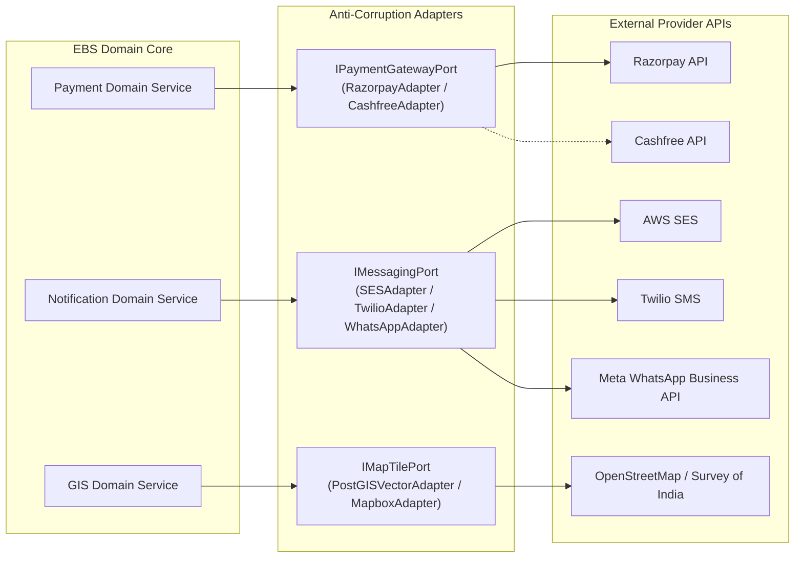
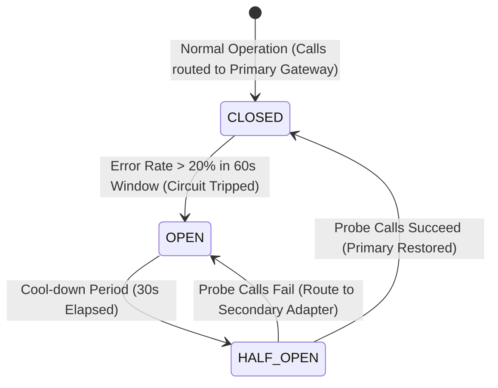

# Explore Bharat Safar — Third-Party Services, External Integrations & Fallback SLA Protocols

- **Document Identifier**: EBS-DOC-29-SERVICES
- **Version**: 1.0.0
- **Status**: Approved
- **Author**: Enterprise Architecture & Solutions Engineering Team
- **Target Audience**: Systems Integrators, Backend Engineers, Cloud Architects, Procurement Leads, SREs
- **Related Documents**:
  - `03-architecture.md`
  - `08-context.md`
  - `09-api-design.md`
  - `19-notification-system.md`
  - `21-payment-system.md`
- **Last Updated**: 2026-09-28

---

## 1. Integration Philosophy & Anti-Corruption Layers (ACL)

To guarantee high availability and prevent hard vendor lock-in, **Explore Bharat Safar** encapsulates every external third-party service behind formal **Anti-Corruption Layers (ports and adapters pattern)**. External data structures and failure modes are translated at the boundary into standardized internal domain contracts.

---

## 2. Comprehensive Third-Party Provider Registry

| Category | Primary Service Provider | Secondary Fallback Provider | SLA Target | Primary Operational Role |
| :--- | :--- | :--- | :--- | :--- |
| **Payment Gateway** | **Razorpay** | **Cashfree** | $99.95\%$ | UPI Intent, Cards, NetBanking, Automated Webhooks, Refunds. |
| **Transactional Email** | **AWS SES (ap-south-1)** | **SendGrid** | $99.90\%$ | Booking confirmations, tax invoices, password reset tokens. |
| **SMS Gateway (OTP)** | **Gupshup Enterprise** | **Twilio** | $99.99\%$ | High-priority mobile OTPs, emergency trail advisories. |
| **WhatsApp Business API**| **Twilio WhatsApp API** | **Direct Meta Cloud API**| $99.50\%$ | Dispatch of PDF tickets, certificates, and departure countdowns. |
| **Object Storage Vault** | **AWS S3 (Multi-AZ)** | **Cloudflare R2** | $99.99\%$ | Encrypted storage for media, PDF certificates, and backups. |
| **Edge CDN & WAF** | **Cloudflare Enterprise** | **AWS CloudFront** | $99.99\%$ | Anycast DNS, DDoS shielding, vector tile edge caching. |
| **Government Geo Registry**| **LGD Directory (Gov.in)** | **Local Seed Cache** | $98.00\%$ | Verification of official rural Gram Panchayat and village census codes. |

---

## 3. Circuit Breaker & Failover Architecture

To prevent third-party API latency from backing up internal application threads:

### 3.1 Resilience Invariants
- **Strict Outbound Timeouts**: All external HTTP API requests terminate after a maximum of **$3,500\text{ ms}$**; hung sockets are aggressively destroyed.
- **Exponential Backoff with Full Jitter**: Retries execute at intervals:
  $$t_{\text{retry}} = \text{random}(0, \min(M, B \cdot 2^{\text{attempt}}))$$
  preventing thundering herd synchronization during third-party recovery.

---

## 4. Summary & Downstream Alignment

This third-party integration blueprint dictates external vendor abstraction, SLA governance, and automated failover for Explore Bharat Safar. It interfaces directly with the payment engine in `21-payment-system.md`, notification system in `19-notification-system.md`, and deployment setup in `22-deployment.md`.
