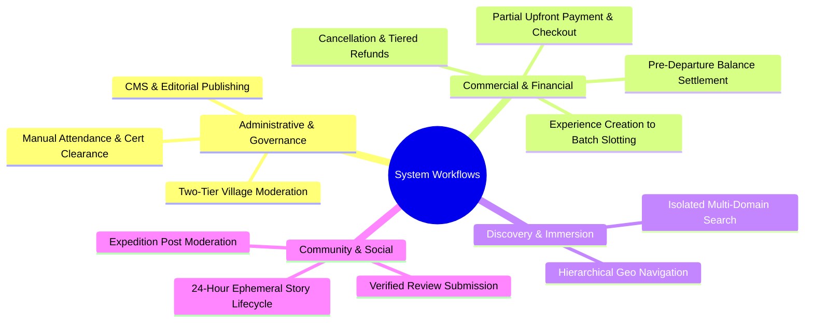
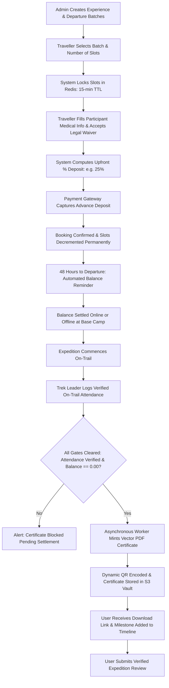
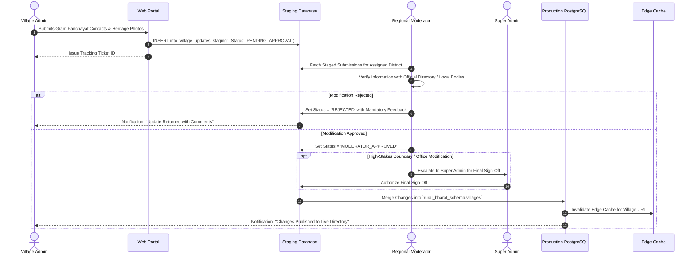
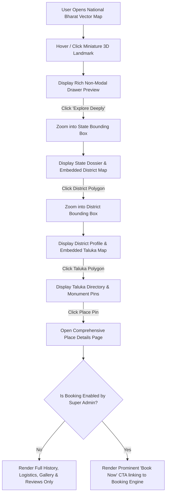
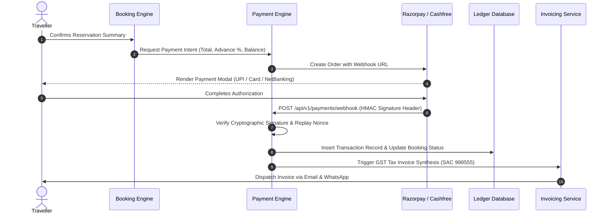
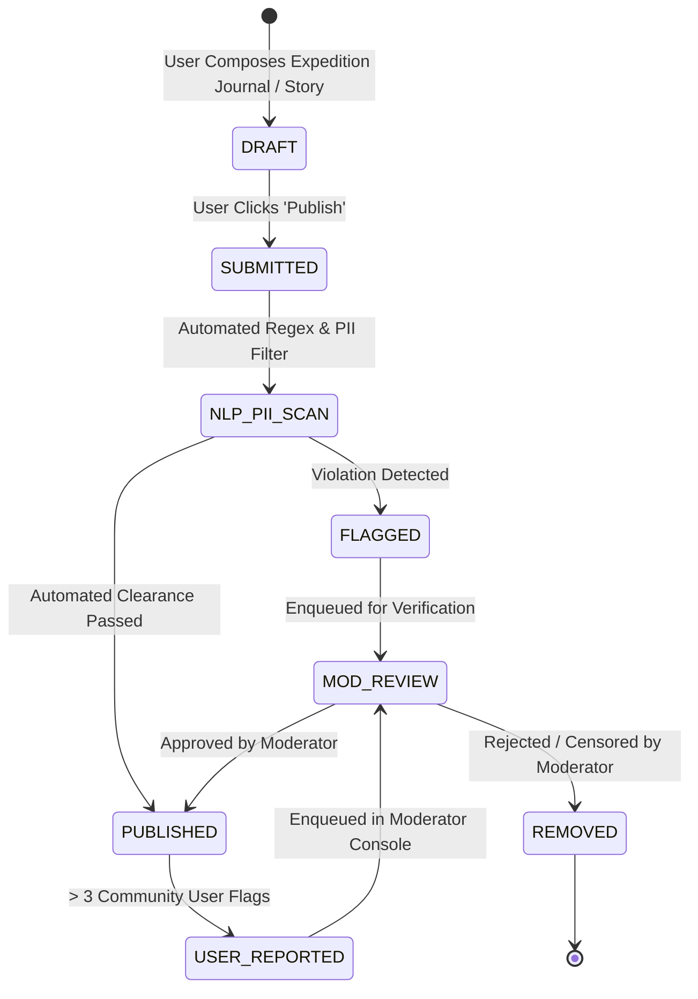

# Explore Bharat Safar — End-to-End System Workflows & Operational Process Specifications

- **Document Identifier**: EBS-DOC-30-WORKFLOWS
- **Version**: 1.0.0
- **Status**: Approved
- **Author**: Enterprise Architecture & Solutions Engineering Team
- **Target Audience**: Business Analysts, Systems Architects, Operations Leads, Fullstack Engineers, QA Engineers
- **Related Documents**:
  - `02-specification.md`
  - `03-architecture.md`
  - `13-admin-panel.md`
  - `14-booking-system.md`
  - `20-certificate-system.md`
  - `26-business-rules.md`
- **Last Updated**: 2026-09-28

---

## 1. Workflow Architecture & Process Philosophy

This document defines the canonical operational workflows, cross-functional lifecycles, and governance state machines of **Explore Bharat Safar**. Every interaction—from a user discovering an ancient fort on the GIS map to a Village Admin curating local heritage or a trekker receiving a cryptographic certificate—is modeled as a deterministic, auditable workflow.

---

## 2. Core Operational Workflows

### 2.1 The Master Booking & Expedition Lifecycle Workflow

---

### 2.2 The Village Knowledge Curation & Approval Workflow

---

### 2.3 The Bharat Discovery Engine Hierarchical Map Flow

---

### 2.4 The Payment & Financial Settlement Workflow

---

### 2.5 The Social Content Publishing & Moderation Workflow

---

## 3. Summary & Downstream Alignment

These system workflows define the exact operational sequences and decision branches for Explore Bharat Safar. They provide the structural blueprints for the sequence diagrams in `31-sequence-diagrams.md`, activity diagrams in `32-activity-diagrams.md`, and business rules in `26-business-rules.md`.
