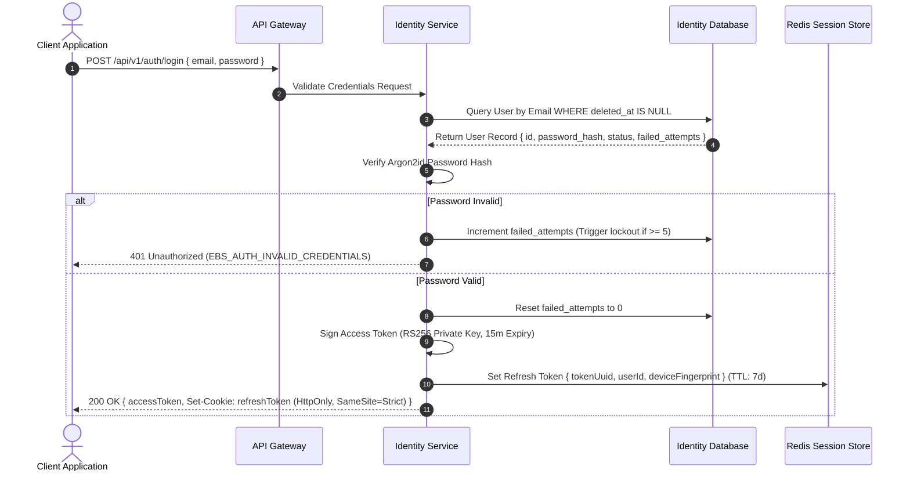
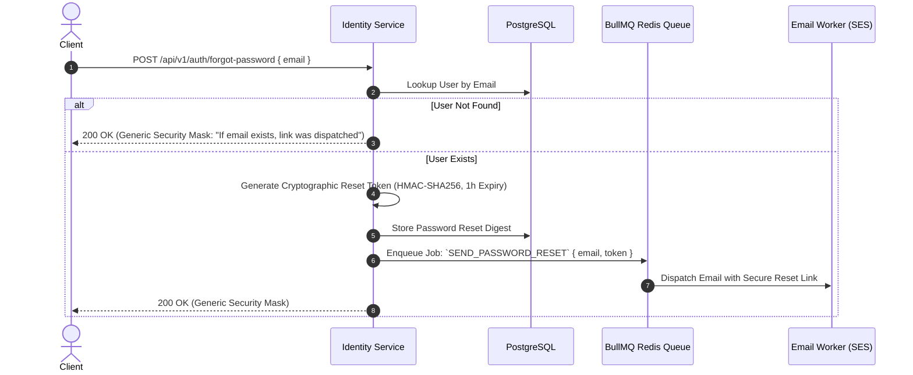
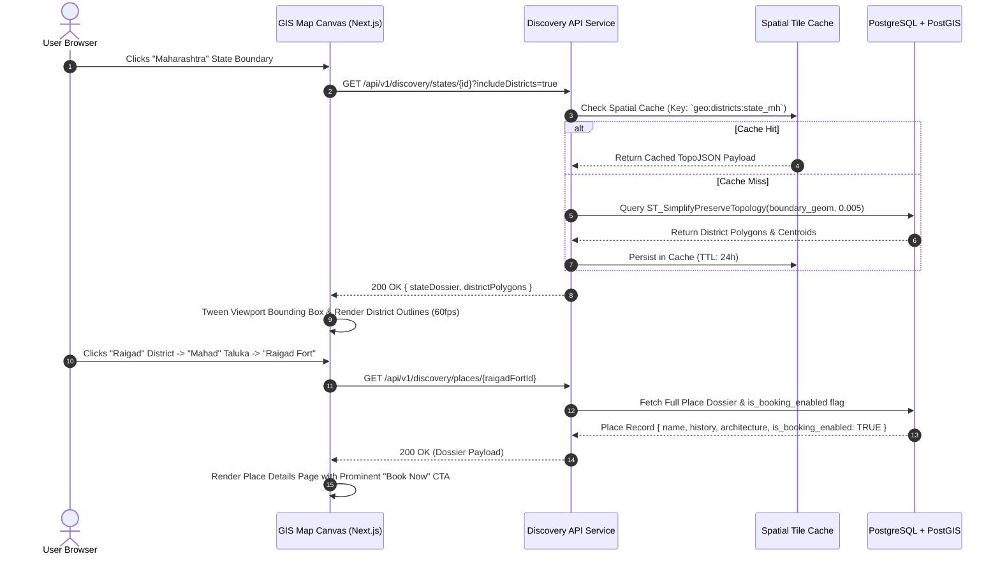

# Explore Bharat Safar — Comprehensive System Sequence Diagrams

- **Document Identifier**: EBS-DOC-31-SEQUENCE
- **Version**: 1.0.0
- **Status**: Approved
- **Author**: Enterprise Architecture & Solutions Engineering Team
- **Target Audience**: Systems Engineers, Backend Architects, Frontend Integrators, QA Automation Teams
- **Related Documents**:
  - `02-specification.md`
  - `03-architecture.md`
  - `09-api-design.md`
  - `14-booking-system.md`
  - `20-certificate-system.md`
  - `30-workflows.md`
- **Last Updated**: 2026-09-28

---

## 1. Document Overview & Sequence Modeling Standards

This document specifies the exact temporal message-exchange sequences, participant interactions, asynchronous processing loops, and database mutations across all core subsystems of **Explore Bharat Safar**. Every diagram conforms strictly to Mermaid sequence diagram syntax.

---

## 2. Authentication & Identity Sequences

### 2.1 User Login & RS256 Token Issuance



### 2.2 Forgot Password & Secure Recovery Flow



---

## 3. Bharat Discovery Engine (GIS Map) Sequences

### 3.1 Hierarchical Drilldown: State $\rightarrow$ District $\rightarrow$ Taluka $\rightarrow$ Place



---

## 4. Experience Booking & Checkout Sequences

### 4.1 High-Concurrency Slot Reservation & Advance Payment Flow

```mermaid
sequenceDiagram
    autonumber
    actor T as Traveller
    participant API as Booking API
    participant Redlock as Redis Distributed Lock
    participant DB as Booking Database
    participant PG as Payment Gateway (Razorpay)

    T->>API: POST /api/v1/bookings/reserve { batchId, participants: 2, termsAccepted: true }
    API->>Redlock: Execute Atomic Lua Script (Check & Decrement Slots)
    alt Insufficient Inventory
        Redlock-->>API: Return 0 (Failed)
        API-->>T: 409 Conflict (EBS_BOOKING_SLOTS_UNAVAILABLE)
    else Slots Reserved
        Redlock->>Redlock: Decrement available_slots; Set Lock Key (15-min TTL)
        Redlock-->>API: Return Lock Token
        API->>DB: INSERT into `bookings` (Status: 'PENDING_PAYMENT')
        API->>PG: Create Payment Intent for Upfront Deposit (e.g. 25% = ₹1,000)
        PG-->>API: Order ID: `order_O8g71h28f`
        API-->>T: 201 Created { bookingId, upfrontAmount: 1000, balanceDue: 3000, lockExpiresAt }
        
        T->>PG: Completes Payment on Gateway Modal
        PG->>API: Webhook: `payment.captured` (Signed Signature)
        API->>API: Verify HMAC-SHA256 Signature
        API->>DB: UPDATE booking SET status = 'PARTIALLY_PAID', advance_amount_paid = 1000
        API->>Redlock: Commit Reservation (Delete Temp Lock, Finalize Inventory Count)
        API-->>T: Broadcast WebSocket Event: `BOOKING_CONFIRMED`
    end
```

---

## 5. Digital Certificate Synthesis Sequence

### 5.1 Verification, Rendering & Delivery Flow

```mermaid
sequenceDiagram
    autonumber
    actor Admin as Trek Leader / Booking Admin
    participant Core as Booking Engine
    participant Q as BullMQ Redis Queue
    participant Worker as Certificate Synthesis Worker
    participant S3 as Encrypted S3 Vault
    participant Notif as Notification Engine
    participant Social as Social Timeline Engine

    Admin->>Core: PATCH /api/v1/bookings/{id}/verify-attendance { participantId, isPresent: true }
    Core->>Core: Evaluate: Is Trip Concluded AND Balance Due == 0.00?
    alt Balance Due > 0.00
        Core-->>Admin: 200 OK (Attendance Recorded; Certificate Blocked: Balance Due)
    else Balance Clean (0.00)
        Core->>Q: Enqueue Job: `GENERATE_CERTIFICATE` { participantId, bookingId }
        Core-->>Admin: 200 OK (Attendance Recorded; Certificate Generation Triggered)
        
        Q->>Worker: Dequeue Job Payload
        Worker->>Worker: Calculate HMAC-SHA256 Verification Digest
        Worker->>Worker: Synthesize Vector PDF/A-1b Canvas via PDFKit
        Worker->>Worker: Embed Dynamic Micro-QR Code resolving to Public Verification URL
        Worker->>S3: Stream Output to `ebs-certificates-vault`
        S3-->>Worker: Return Object URI
        Worker->>Core: INSERT into `certificate_schema.certificates`
        Worker->>Notif: Trigger `CERTIFICATE_READY` (Email PDF + WhatsApp Message)
        Worker->>Social: Append Verified Milestone to Public Traveller Profile
    end
```

---

## 6. Village Knowledge Submission & Moderation Sequence

```mermaid
sequenceDiagram
    autonumber
    actor VA as Village Admin
    participant Portal as Village Portal
    participant API as Village API Controller
    participant DB as PostgreSQL Database
    actor Mod as Regional Moderator

    VA->>Portal: Edits Primary Health Centre Contact & Uploads Historic Photo
    Portal->>API: POST /api/v1/villages/{id}/updates { updateType, changePayload }
    API->>API: Verify Role == 'VILLAGE_ADMIN' AND assigned_village_id == target_id
    API->>DB: INSERT into `village_updates_staging` (Status: 'PENDING_APPROVAL')
    API-->>Portal: 202 Accepted { ticketId, status: "PENDING_APPROVAL" }

    Mod->>API: GET /api/v1/villages/moderation/queue?districtId={id}
    API->>DB: Query Pending Updates for District
    DB-->>API: Return Pending Staged Tickets
    API-->>Mod: Display Diffs in Moderation Console

    Mod->>API: PATCH /api/v1/villages/moderation/{ticketId} { action: 'APPROVE' }
    API->>DB: BEGIN TRANSACTION; Update Village Master; Mark Ticket 'APPROVED'; COMMIT;
    API->>API: Invalidate CDN Edge Cache for Village URL
    API-->>Mod: 200 OK (Changes Published to Live Directory)
```

---

## 7. Summary & Downstream Alignment

These sequence diagrams provide the definitive execution trace for all primary system transactions. They work directly with the activity diagrams in `32-activity-diagrams.md`, component diagrams in `35-component-diagram.md`, and API design contracts in `09-api-design.md`.
