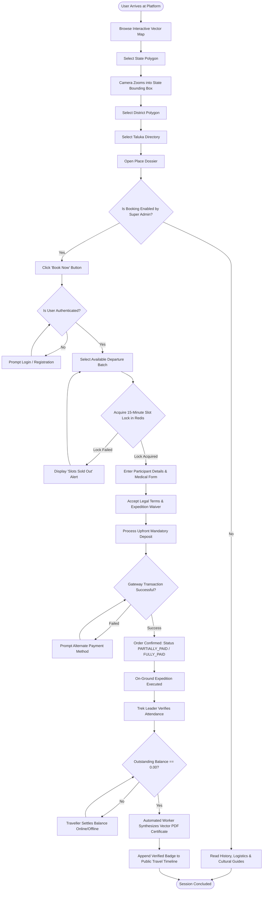
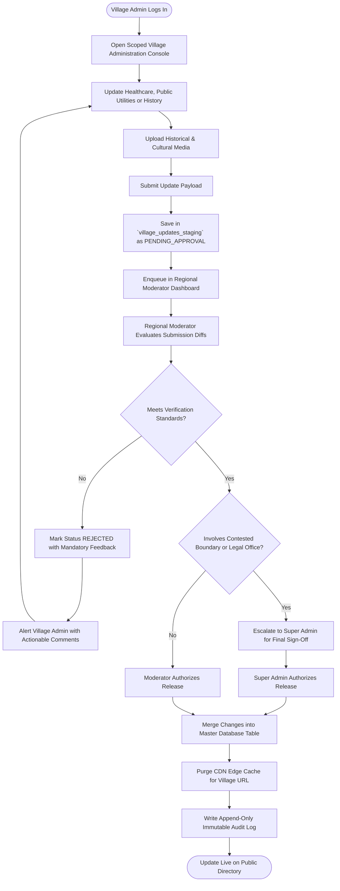
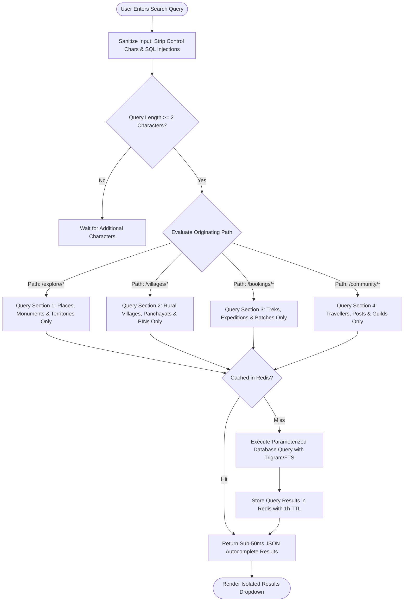

# Explore Bharat Safar — System Activity Diagrams & Process Logic Flows

- **Document Identifier**: EBS-DOC-32-ACTIVITY
- **Version**: 1.0.0
- **Status**: Approved
- **Author**: Enterprise Architecture & Solutions Engineering Team
- **Target Audience**: Business Analysts, Systems Engineers, UX Researchers, QA Automation Engineers
- **Related Documents**:
  - `02-specification.md`
  - `03-architecture.md`
  - `14-booking-system.md`
  - `20-certificate-system.md`
  - `30-workflows.md`
  - `31-sequence-diagrams.md`
- **Last Updated**: 2026-09-28

---

## 1. Document Overview & Modeling Conventions

This document specifies the system activity diagrams for **Explore Bharat Safar**, illustrating the internal control logic, decision branching, parallel fork/join operations, and state transformations across all major functional modules. All diagrams conform to Mermaid flowchart and activity syntax.

---

## 2. Core Functional Activity Diagrams

### 2.1 Complete Traveller Exploration & Booking Activity

---

### 2.2 Village Knowledge Curation & Approval Activity

---

### 2.3 Isolated Search Subsystem Activity

---

## 3. Summary & Downstream Alignment

These activity diagrams detail the internal state progressions and decision gates of Explore Bharat Safar. They work in tandem with `30-workflows.md` for operational processes, `31-sequence-diagrams.md` for messaging sequences, and `26-business-rules.md` for governance rules.
