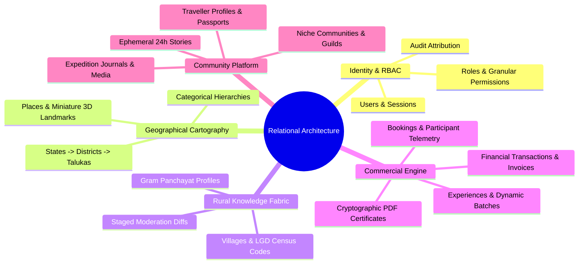
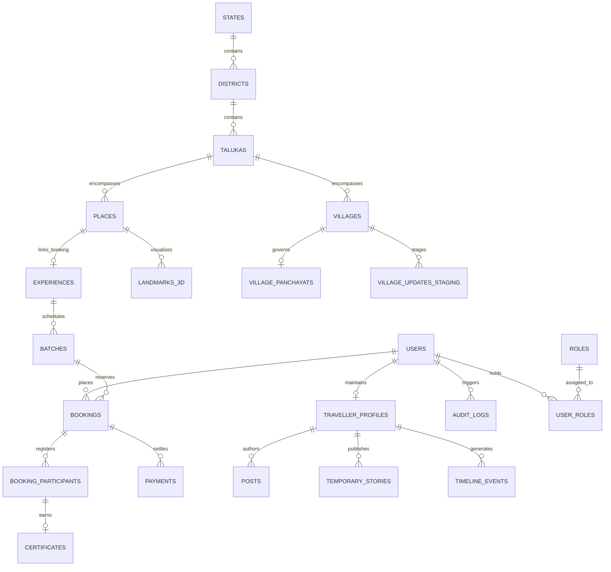
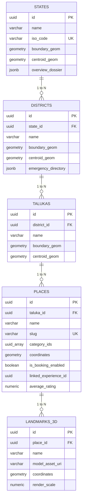
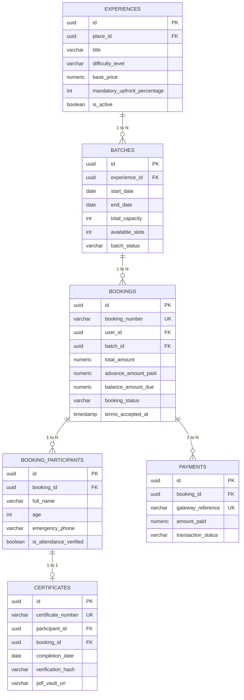
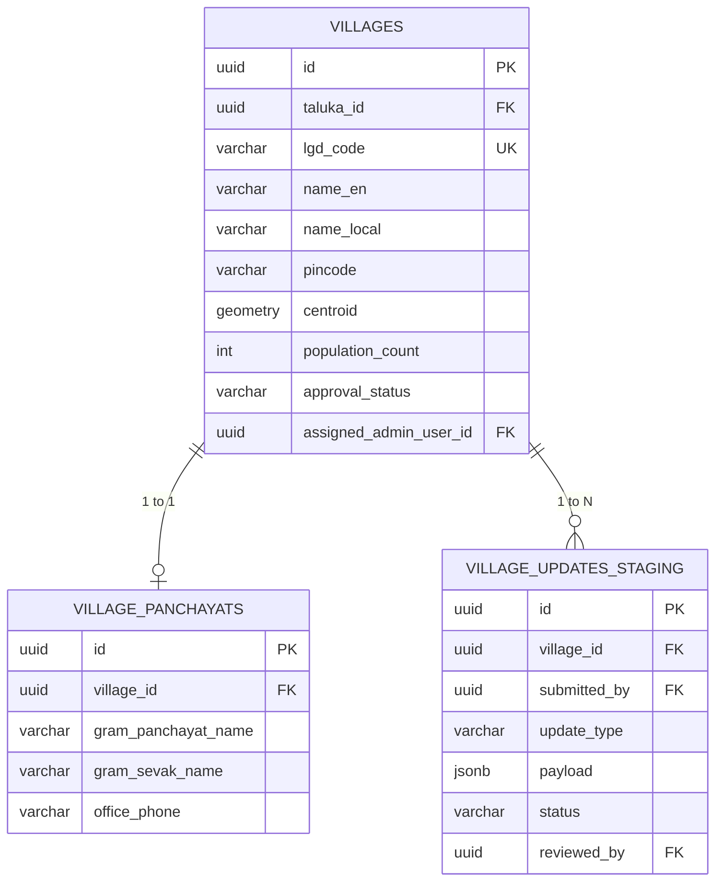

# Explore Bharat Safar — Entity-Relationship (ER) Diagram & Schema Specifications

- **Document Identifier**: EBS-DOC-33-ERD
- **Version**: 1.0.0
- **Status**: Approved
- **Author**: Enterprise Architecture & Solutions Engineering Team
- **Target Audience**: Database Administrators, Data Architects, Backend Engineers, Analytics Leads
- **Related Documents**:
  - `03-architecture.md`
  - `05-drd.md`
  - `10-database-design.md`
  - `26-business-rules.md`
- **Last Updated**: 2026-09-28

---

## 1. Relational Modeling Philosophy & Entity Scope

This document details the complete relational architecture, entity cardinalities, foreign key mappings, and PostGIS spatial integrations for **Explore Bharat Safar**. The persistence model enforces strict referential integrity, normalizes administrative hierarchies into Third Normal Form (3NF), and supports zero-downtime schema migrations.

---

## 2. High-Level Domain Relationship Map

---

## 3. Detailed Entity Schema & Attribute Specification

### 3.1 Spatial & Discovery Entities

---

### 3.2 Booking, Fintech & Certification Entities

---

### 3.3 Rural Bharat & Village Entities

---

## 4. Key Cardinality Constraints & Invariants

1. **Foreign Key Integrity**: All foreign keys strictly enforce `ON DELETE RESTRICT` for geographical entities (`states`, `districts`, `talukas`) and financial ledgers (`bookings`, `payments`) to prevent accidental cascade destruction of historical records.
2. **One-to-One Certificate Mapping**: `certificate_schema.certificates.participant_id` enforces a unique constraint (`UNIQUE NOT NULL`), ensuring that a participant can never be issued duplicate certificates for the same completed expedition.
3. **Soft-Delete Filtering**: All primary tables contain a `deleted_at TIMESTAMP WITH TIME ZONE NULL` column. Unique indexes must include the `WHERE deleted_at IS NULL` predicate to allow re-use of slugs or emails if a prior record is soft-deleted.

---

## 5. Summary & Downstream Alignment

This entity-relationship specification establishes the structural schema and integrity rules for Explore Bharat Safar. It works directly with the database DDL in `10-database-design.md`, API contracts in `09-api-design.md`, and business rules in `26-business-rules.md`.
