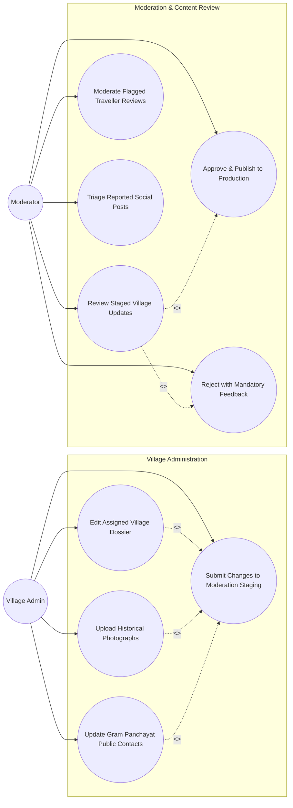
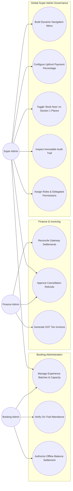

# Explore Bharat Safar — System Use Case Diagrams & Actor Interaction Models

- **Document Identifier**: EBS-DOC-34-USECASE
- **Version**: 1.0.0
- **Status**: Approved
- **Author**: Enterprise Architecture & Solutions Engineering Team
- **Target Audience**: Product Managers, Functional Analysts, Software Engineers, UI/UX Designers, QA Engineers
- **Related Documents**:
  - `02-specification.md`
  - `03-architecture.md`
  - `12-authentication.md`
  - `13-admin-panel.md`
  - `26-business-rules.md`
- **Last Updated**: 2026-09-28

---

## 1. Actor Hierarchy & System Boundary

This document formally specifies the complete use case model for **Explore Bharat Safar**, categorizing interactions across all human actors, administrative roles, and automated system daemons.

```mermaid
graph TD
    UserRoot[Generic User Actor] --> Guest[Guest Explorer (Unauthenticated)]
    UserRoot --> AuthenticatedUser[Authenticated User]
    
    AuthenticatedUser --> Traveller[Traveller]
    AuthenticatedUser --> VillageAdmin[Village Admin]
    AuthenticatedUser --> Moderator[Content Moderator]
    AuthenticatedUser --> BookingAdmin[Booking Admin]
    AuthenticatedUser --> FinanceAdmin[Finance Admin]
    AuthenticatedUser --> ContentEditor[Content Editor]
    AuthenticatedUser --> SuperAdmin[Platform Super Admin]
```

---

## 2. Comprehensive Use Case Diagrams

### 2.1 Guest & Traveller Use Cases (Discovery, Booking & Social)

```mermaid
graph LR
    subgraph DiscoveryScope["Bharat Discovery & Village Knowledge"]
        UC_BrowseMap((Browse Interactive India Map))
        UC_DrillDown((Drill Down: State to Taluka))
        UC_ViewPlace((View Rich Place Dossier))
        UC_SearchDiscovery((Search Places & Territories))
        UC_SearchVillages((Search Rural Village Records))
        UC_ViewVillage((View Village Administration & Facilities))
    end

    subgraph BookingScope["Experience Booking & Checkout"]
        UC_ReserveSlot((Reserve Batch Slots))
        UC_AcceptWaiver((Accept Legal Terms & Medical Waiver))
        UC_PayDeposit((Pay Upfront Advance Deposit))
        UC_SettleBalance((Settle Remaining Balance))
        UC_DownloadCert((Download Digital Completion Certificate))
        UC_SubmitReview((Submit Verified Expedition Review))
    end

    subgraph SocialScope["Traveller Social Platform"]
        UC_CreatePost((Publish Expedition Journal))
        UC_UploadStory((Upload 24-Hour Ephemeral Story))
        UC_JoinCommunity((Join Specialized Travel Guild))
        UC_FollowUser((Follow Other Travellers))
    end

    GuestActor((Guest)) --> UC_BrowseMap
    GuestActor --> UC_DrillDown
    GuestActor --> UC_ViewPlace
    GuestActor --> UC_SearchDiscovery
    GuestActor --> UC_SearchVillages
    GuestActor --> UC_ViewVillage

    TravellerActor((Traveller)) --> UC_BrowseMap
    TravellerActor --> UC_ReserveSlot
    TravellerActor --> UC_AcceptWaiver
    TravellerActor --> UC_PayDeposit
    TravellerActor --> UC_SettleBalance
    TravellerActor --> UC_DownloadCert
    TravellerActor --> UC_SubmitReview
    TravellerActor --> UC_CreatePost
    TravellerActor --> UC_UploadStory
    TravellerActor --> UC_JoinCommunity
    TravellerActor --> UC_FollowUser

    UC_ReserveSlot -.->|<<include>>| UC_AcceptWaiver
    UC_ReserveSlot -.->|<<include>>| UC_PayDeposit
    UC_DownloadCert -.->|<<extend>>| UC_SettleBalance
```



---

### 2.2 Village Admin & Moderation Use Cases



---

### 2.3 Booking, Finance & Super Admin Governance Use Cases



---

## 3. Actor Permission & Boundary Enforcement Summary

| System Actor | Permitted Action Scope | Explicitly Forbidden Action Scope |
| :--- | :--- | :--- |
| **Guest** | Read public GIS discovery, public village profiles, travel articles. | Cannot book, review, comment, post, or access admin interfaces. |
| **Traveller** | Full checkout, payments, certificate download, social feed, reviews. | Cannot approve content, edit municipal records, or alter pricing rules. |
| **Village Admin** | Edit assigned village records; submit updates to staging queue. | Cannot publish directly without moderator sign-off; zero cross-village access. |
| **Moderator** | Approve/reject staged village updates, moderate flagged reviews/posts. | Cannot modify core financial rules, booking fees, or database schemas. |
| **Booking Admin** | Manage departure batches, verify on-trail attendance, manual clearances. | Cannot alter global system settings, modify GIS boundaries, or edit tax rules. |
| **Finance Admin** | View transactions, approve refunds, issue invoices, reconcile payouts. | Cannot edit destination dossiers, publish articles, or alter batch itineraries. |
| **Super Admin** | Unrestricted global authority across navigation, payments %, RBAC, and logs. | Bound strictly by immutable audit logging (all operations are permanently logged). |

---

## 4. Summary & Downstream Alignment

This use case specification details all human and automated actor interactions across Explore Bharat Safar. It interfaces directly with the component diagrams in `35-component-diagram.md`, state diagrams in `36-state-diagram.md`, and business rules in `26-business-rules.md`.
