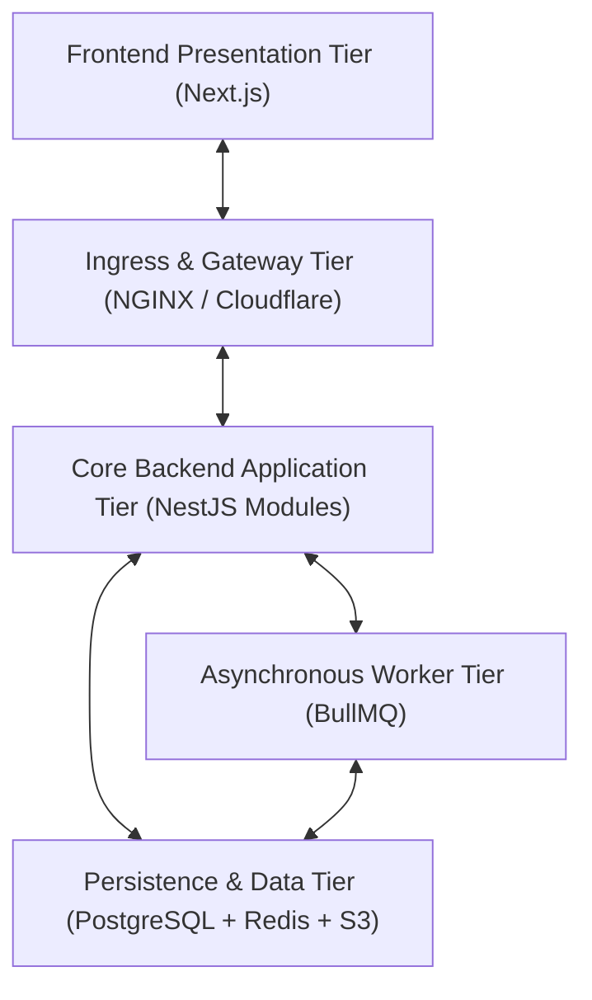
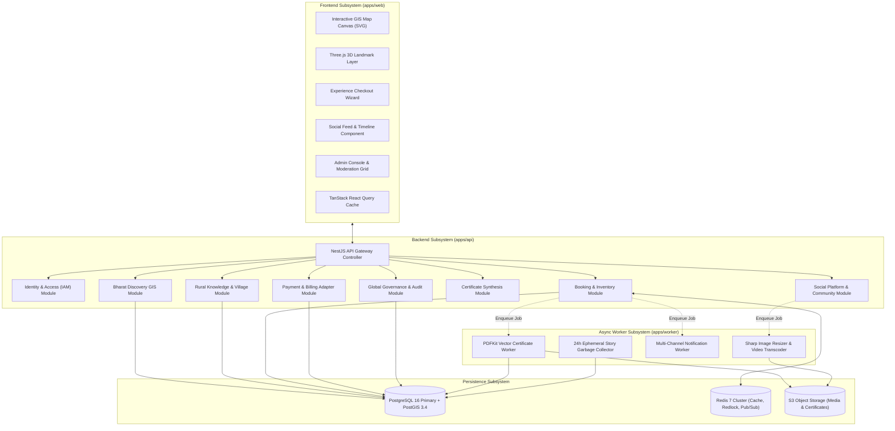

# Explore Bharat Safar — System Component Architecture & Subsystem Specifications

- **Document Identifier**: EBS-DOC-35-COMPONENT
- **Version**: 1.0.0
- **Status**: Approved
- **Author**: Enterprise Architecture & Solutions Engineering Team
- **Target Audience**: Software Architects, Lead Component Engineers, Frontend/Backend Integrators, DevOps Specialists
- **Related Documents**:
  - `03-architecture.md`
  - `09-api-design.md`
  - `10-database-design.md`
  - `14-booking-system.md`
  - `16-map-engine.md`
  - `20-certificate-system.md`
- **Last Updated**: 2026-09-28

---

## 1. Component Architecture Philosophy

This document defines the structural component model of **Explore Bharat Safar**, illustrating the boundaries, internal ports, provided interfaces, and required dependencies across the entire distributed system.

---

## 2. High-Level System Component Diagram

---

## 3. Subsystem Component Breakdown & Interface Contracts

### 3.1 Bharat Discovery Engine Component (GIS Map)
- **Provided Interface**: `IGISDiscoveryService`
  - `getStatesDirectory(): Promise<StateSummaryDTO[]>`
  - `getStateBoundaries(stateId: string): Promise<GeoJSON.FeatureCollection>`
  - `getSimplifiedDistricts(stateId: string, zoom: number): Promise<GeoJSON.FeatureCollection>`
  - `getPlaceDossier(placeId: string): Promise<PlaceDossierDTO>`
- **Internal Dependencies**:
  - `PostGISGeometryAdapter`: Executes `ST_SimplifyPreserveTopology` queries.
  - `RedisSpatialCache`: Caches TopoJSON vector boundaries with a 24-hour TTL.

### 3.2 Experience Booking & Inventory Component
- **Provided Interface**: `IBookingService`
  - `reserveBatchSlots(batchId: string, count: number): Promise<ReservationTokenDTO>`
  - `confirmBookingPayment(bookingId: string, paymentRef: string): Promise<BookingConfirmationDTO>`
  - `verifyAttendance(bookingId: string, participantId: string): Promise<void>`
- **Internal Dependencies**:
  - `RedlockDistributedLock`: Manages atomic Redis slot reservation Lua scripts.
  - `PaymentGatewayPort`: Dispatches payment intents to external gateway adapters.

### 3.3 Digital Certificate Synthesis Component
- **Provided Interface**: `ICertificateService`
  - `triggerCertificateGeneration(bookingId: string, participantId: string): Promise<void>`
  - `verifyCertificateDigest(certNumber: string): Promise<CertificateVerificationDTO>`
- **Internal Dependencies**:
  - `PDFKitVectorRenderer`: Generates PDF/A-1b compliant vector documents.
  - `QRCodeMatrixEncoder`: Synthesizes embedded high-contrast dynamic QR codes.
  - `S3VaultUploader`: Streams finished PDF binaries to encrypted storage buckets.

---

## 4. Component Coupling & Port Invariants

1. **Zero Direct Database Cross-Access**: Components cannot query another domain's database tables directly. Inter-domain data retrieval executes exclusively through published domain service interfaces.
2. **Asynchronous Decoupling**: High-overhead tasks (video transcoding, PDF synthesis, transactional emailing) are strictly decoupled via BullMQ message queues.
3. **Pluggable Payment Adapters**: The `PaymentModule` implements the generic `IPaymentGatewayPort`, allowing hot-swapping between Razorpay and Cashfree without modifying core booking logic.

---

## 5. Summary & Downstream Alignment

This component architecture defines the modular structural blocks and interface boundaries of Explore Bharat Safar. It works in lockstep with the class diagrams in `37-class-diagram.md`, state diagrams in `36-state-diagram.md`, and API contracts in `09-api-design.md`.
