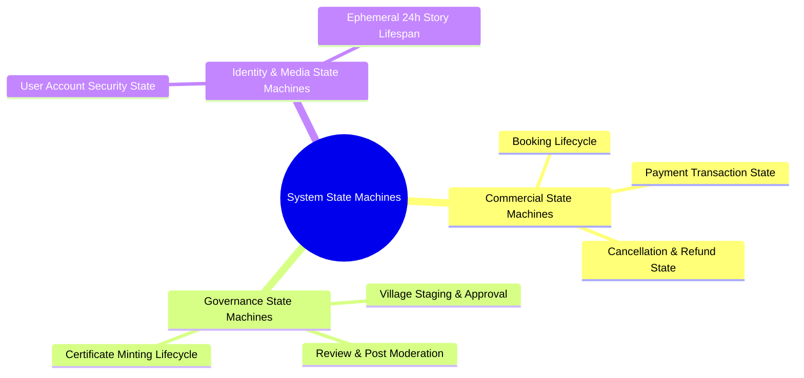
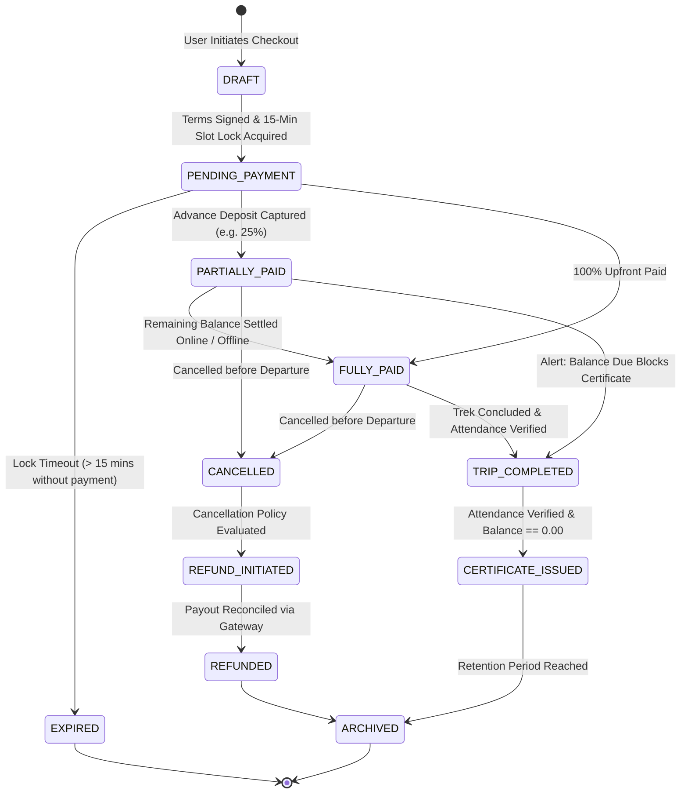
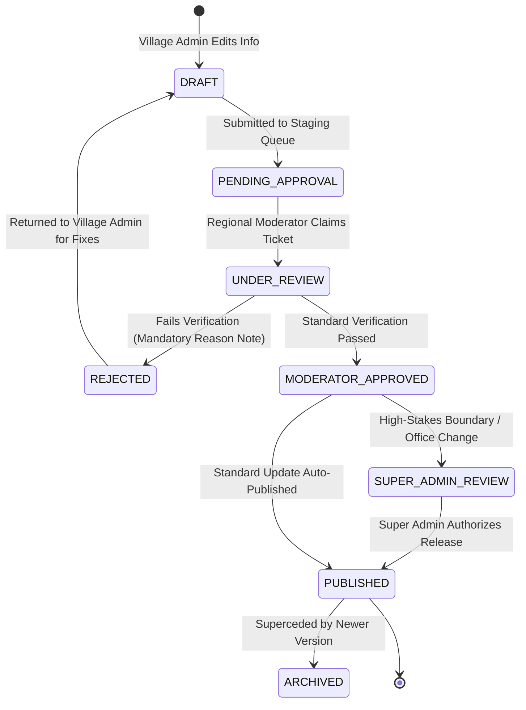
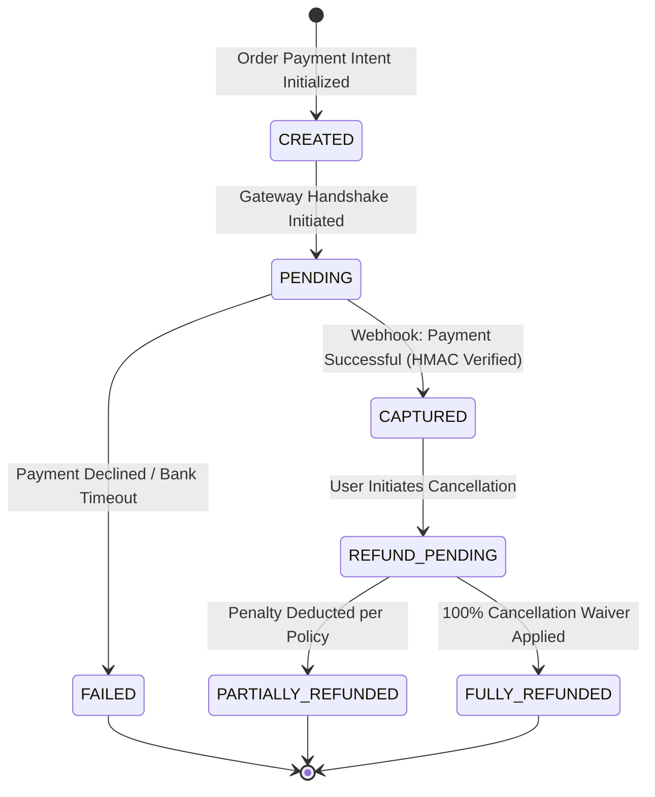
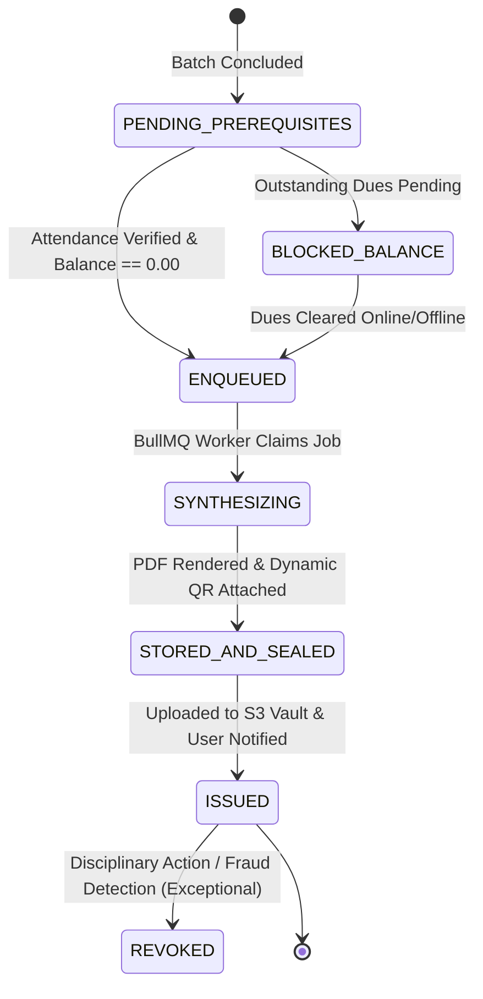
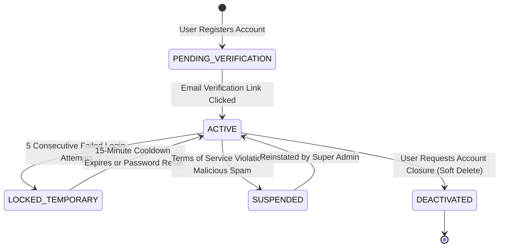
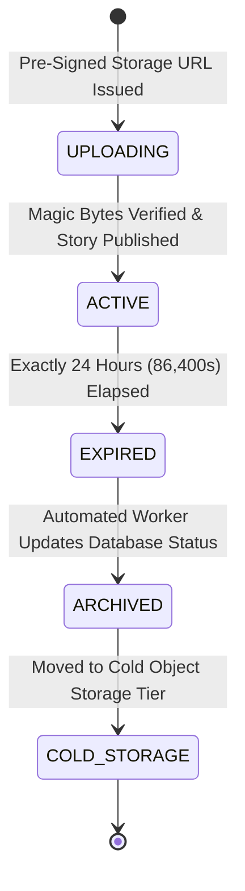

# Explore Bharat Safar — System State Machine Diagrams & Lifecycle Specifications

- **Document Identifier**: EBS-DOC-36-STATE
- **Version**: 1.0.0
- **Status**: Approved
- **Author**: Enterprise Architecture & Solutions Engineering Team
- **Target Audience**: Backend State Machine Engineers, Quality Assurance Leads, Workflow Specialists, Database Architects
- **Related Documents**:
  - `02-specification.md`
  - `03-architecture.md`
  - `14-booking-system.md`
  - `20-certificate-system.md`
  - `21-payment-system.md`
  - `26-business-rules.md`
- **Last Updated**: 2026-09-28

---

## 1. State Machine Modeling Philosophy

Every critical entity within **Explore Bharat Safar** transitions through finite, deterministic state machines. State changes are guarded by strict business rules, require authorized role triggers, and write immutable audit records upon every mutation.

---

## 2. Core State Machine Diagrams

### 2.1 Booking Status Lifecycle

---

### 2.2 Village Submission & Approval Lifecycle

---

### 2.3 Payment Transaction Lifecycle

---

### 2.4 Digital Certificate Lifecycle

---

### 2.5 User Account Lifecycle & Security States

---

### 2.6 Ephemeral 24-Hour Story Lifecycle

---

## 3. Comprehensive State Transition Guard Matrix

| Entity | Current State | Target State | Triggering Event / Action | Mandatory Guard Condition |
| :--- | :--- | :--- | :--- | :--- |
| **Booking** | `PENDING_PAYMENT` | `PARTIALLY_PAID` | Gateway Webhook Received | HMAC signature valid; advance deposit amount matched; lock active. |
| **Booking** | `PARTIALLY_PAID` | `FULLY_PAID` | Balance Payment Cleared | `Outstanding Balance Due == 0.00`. |
| **Booking** | `TRIP_COMPLETED` | `CERTIFICATE_ISSUED`| Async Certificate Job | Attendance verified by Trek Leader; `Balance Due == 0.00`. |
| **Village Update**| `PENDING_APPROVAL` | `PUBLISHED` | Moderator / Super Admin Sign-Off | Verified with official records; audit log generated. |
| **Certificate** | `ENQUEUED` | `STORED_AND_SEALED` | PDFKit Synthesis Worker | HMAC verification hash embedded; valid S3 URI returned. |
| **Story** | `ACTIVE` | `ARCHIVED` | Scheduled Cron Job | `published_at <= NOW() - INTERVAL '24 HOURS'`. |

---

## 4. Summary & Downstream Alignment

This state diagram specification establishes the deterministic lifecycles and validation guards across Explore Bharat Safar. It interfaces directly with database triggers in `10-database-design.md`, business rules in `26-business-rules.md`, and class models in `37-class-diagram.md`.
