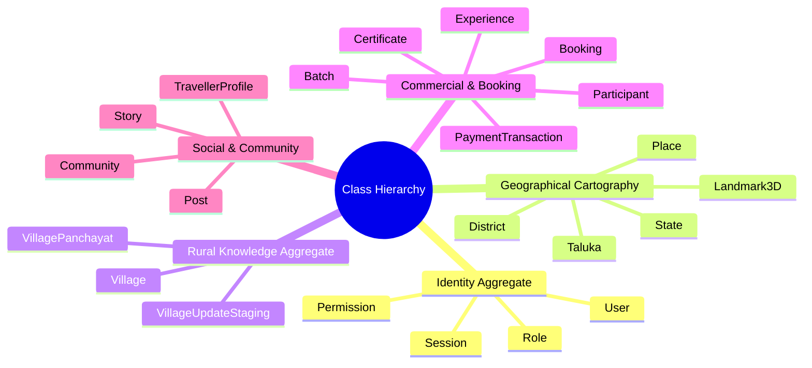
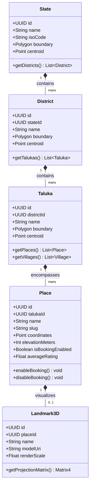
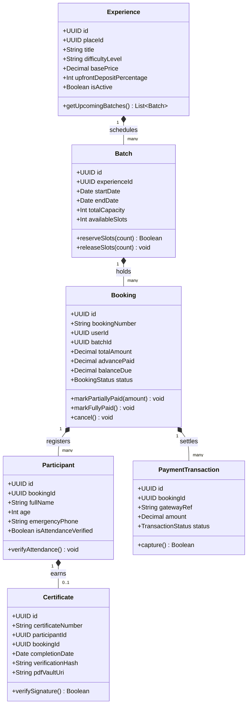
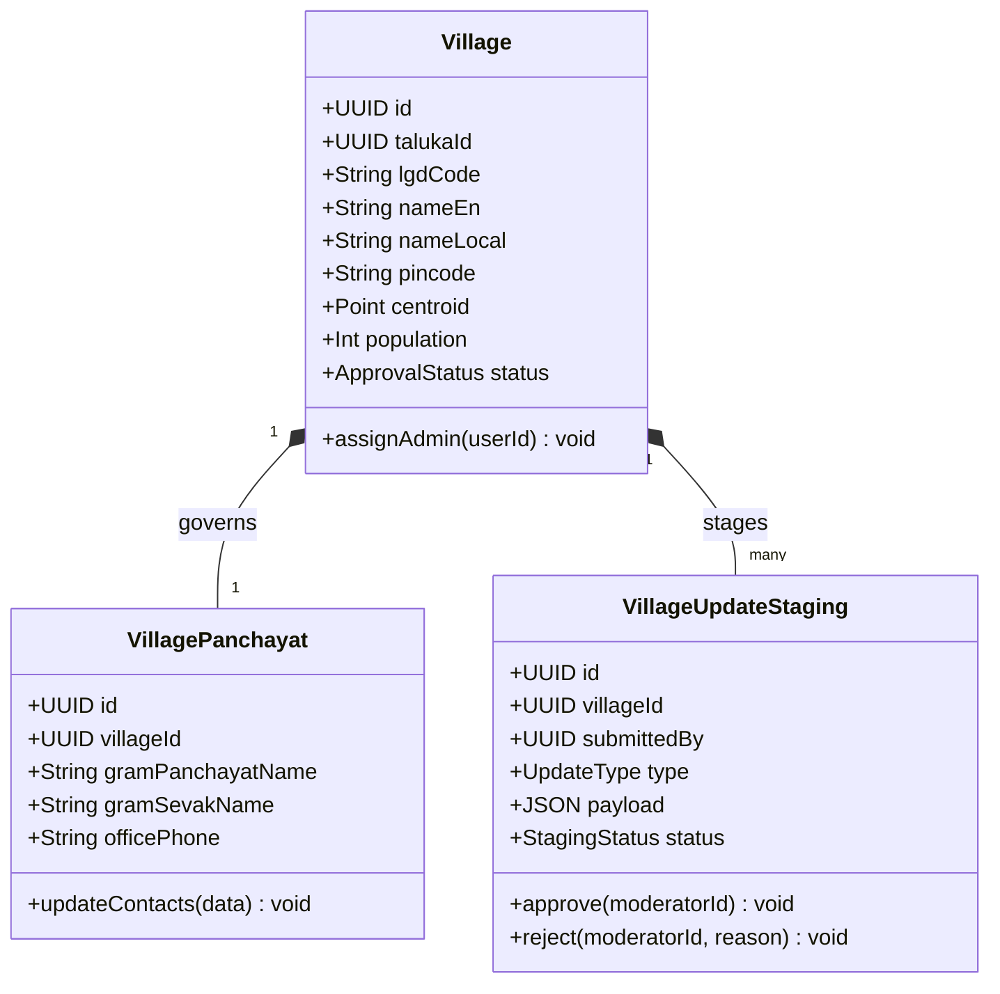
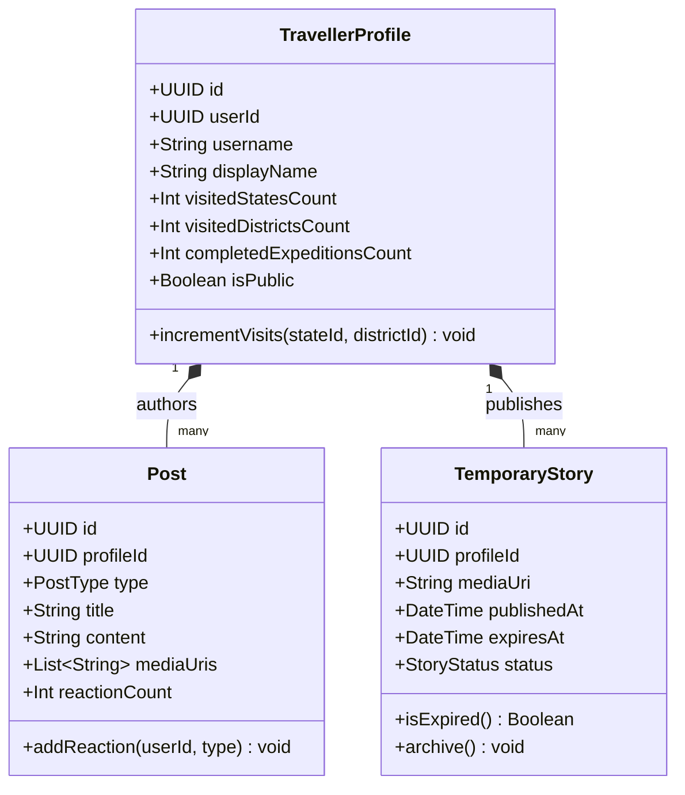

# Explore Bharat Safar — System Class Diagrams & Object Domain Models

- **Document Identifier**: EBS-DOC-37-CLASS
- **Version**: 1.0.0
- **Status**: Approved
- **Author**: Enterprise Architecture & Solutions Engineering Team
- **Target Audience**: Backend Engineers, Software Architects, Domain Modeling Specialists, QA Engineers
- **Related Documents**:
  - `03-architecture.md`
  - `05-drd.md`
  - `09-api-design.md`
  - `10-database-design.md`
  - `26-business-rules.md`
- **Last Updated**: 2026-09-28

---

## 1. Domain Modeling Philosophy & Class Architecture

This document specifies the object-oriented domain classes, aggregates, value objects, and repository interfaces across all subsystems of **Explore Bharat Safar**. Models enforce strict encapsulation, domain-driven invariants, and decoupled persistence abstractions.

---

## 2. Comprehensive Subsystem Class Diagrams

### 2.1 Geographical Discovery Aggregate

---

### 2.2 Booking, Financial & Certificate Aggregates

---

### 2.3 Rural Bharat Village Aggregate

---

### 2.4 Traveller Social Aggregate

---

## 3. Summary & Downstream Alignment

This class diagram specification provides the object-oriented structure and method contracts for Explore Bharat Safar. It interfaces directly with database tables in `10-database-design.md`, component architecture in `35-component-diagram.md`, and business logic rules in `26-business-rules.md`.
