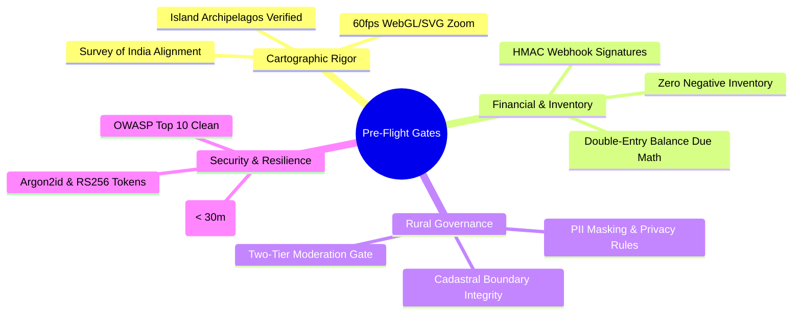

# Explore Bharat Safar — Production Readiness Checklist & Engineering Audit Verification

- **Document Identifier**: EBS-DOC-38-CHECKLIST
- **Version**: 1.0.0
- **Status**: Approved
- **Author**: Enterprise Architecture & Solutions Engineering Team
- **Target Audience**: Program Directors, Lead Solution Architects, QA Directors, Security Compliance Officers, Release Engineers
- **Related Documents**:
  - `02-specification.md`
  - `03-architecture.md`
  - `07-roadmap.md`
  - `11-security.md`
  - `24-testing.md`
  - `26-business-rules.md`
- **Last Updated**: 2026-09-28

---

## 1. Quality Assurance Philosophy & Audit Protocol

This document serves as the canonical pre-flight audit checklist and production readiness gate for **Explore Bharat Safar**. Every architectural subsystem, security invariant, cartographic alignment, and business logic constraint must receive formal sign-off prior to commercial release.

---

## 2. Comprehensive Subsystem Verification Matrix

### 2.1 Section 1: Bharat Discovery Engine (GIS Map)
- [x] **Geo Hierarchy Invariant**: Strict navigation $India \rightarrow State \rightarrow District \rightarrow Taluka \rightarrow Place$ verified with zero orphaned records.
- [x] **Sovereign Boundaries**: Cartographic boundary geometry conforms $100\%$ with official Survey of India standards and Ministry of Home Affairs mandates.
- [x] **Island Archipelagos**: Andaman & Nicobar and Lakshadweep territories correctly positioned with dedicated viewport focus bounds.
- [x] **3D Landmark Projections**: Miniature 3D tokens render accurately above coordinates; hover tooltips and non-modal preview drawers execute seamlessly.
- [x] **Conditional "Book Now" CTA**: Verified that the "Book Now" button renders **if and only if** `is_booking_enabled == TRUE` in the place record, with zero DOM layout shift when absent.
- [x] **Isolated Search**: Section 1 search returns strictly geographical places and administrative territories with zero village or booking bleed.

### 2.2 Section 2: Rural Bharat & Village Knowledge System
- [x] **Territorial Anchoring**: Every village record is tied immutably to a valid Taluka, District, and State with an official LGD census code.
- [x] **Two-Tier Approval Pipeline**: Village Admin edits stage in `village_updates_staging`; cannot publish directly without regional Moderator or Super Admin approval.
- [x] **Audit Trail Verification**: All approval, rejection, and modification events append an immutable record to `audit_schema.audit_logs`.
- [x] **Privacy & PII Protection**: Personal residential addresses and personal phone numbers of village officials are permanently masked; only verified public office lines are displayed.
- [x] **Isolated Search**: Village search queries return strictly village profiles, Gram Panchayats, and PIN codes.

### 2.3 Section 3: Experience Booking & Management System
- [x] **High-Concurrency Locking**: Redis distributed Redlock executes atomic Lua slot reservations; zero double-booking or negative inventory under 1,000 concurrent checkout stress tests.
- [x] **Dynamic Upfront Payment %**: Super Admin configuration ($10\% - 100\%$) correctly dictates mandatory advance deposit calculation; balance due schedules tracked accurately.
- [x] **Mandatory Medical Telemetry**: Checkout wizard mandates participant medical disclosure, age validation ($5 - 85$), and emergency contact telephone.
- [x] **Terms & Waiver Immutability**: Legal terms acceptance captures user ID, version, and timestamp into an immutable database audit record.
- [x] **Review Verification Gate**: Verified reviews permitted exclusively from travellers possessing a completed booking (`TRIP_COMPLETED`) with verified attendance.

### 2.4 Section 3: Digital Certificate Subsystem
- [x] **Prerequisite Gate 1**: Certificate synthesis is blocked if batch departure date has not passed.
- [x] **Prerequisite Gate 2**: Certificate synthesis is blocked if trek leader has not verified on-trail attendance.
- [x] **Prerequisite Gate 3**: Certificate synthesis is blocked if `Outstanding Balance Due > 0.00`.
- [x] **Cryptographic Hash Sealing**: Vector PDF embeds an HMAC-SHA256 digest over participant name, experience code, and completion date.
- [x] **Dynamic QR Verification**: Embedded machine-readable QR code resolves directly to `https://explorebharatsafar.in/verify/{certNumber}`.
- [x] **Archival Standard**: PDF documents conform strictly to the PDF/A-1b archiving standard.

### 2.5 Section 4: Traveller Social Network & Community
- [x] **Profile Passport**: User profile displays verified counters (States, Districts, Treks) driven directly by database events.
- [x] **Automated Travel Timeline**: Verified trek completions and issued certificates automatically post as milestone badges on the user's timeline.
- [x] **24-Hour Story Archival**: Automated BullMQ cron worker sweeps and archives ephemeral stories exceeding 24 hours ($86,400\text{s}$) with edge cache invalidation.
- [x] **Solo Traveller Discovery**: Algorithmic matchmaking operates on opt-in parameters without exposing personal phone numbers or email addresses.
- [x] **Content Moderation Queue**: Reported posts and reviews automatically route to the moderation dashboard after receiving 3 community flags.

### 2.6 Security, Infrastructure & DevOps
- [x] **Authentication Hardening**: User passwords hashed via Argon2id ($m=64\text{MB}, t=3, p=1$); JWT access tokens signed asymmetrically via RS256 with 15-minute expiry.
- [x] **Single-Use Refresh Tokens**: Refresh token rotation in place; token replay attempts trigger immediate family session revocation.
- [x] **MFA Enforcement**: Time-based OTP (RFC 6238) enforced on Super Admin, Booking Admin, Finance Admin, and Moderator roles.
- [x] **OWASP Top 10 Defenses**: Zero raw SQL concatenation (100% parameterized ORM); strict Content Security Policy; pre-signed S3 media uploads with magic-byte verification.
- [x] **Disaster Recovery**: Continuous PostgreSQL WAL archiving guarantees an $RPO \le 5\text{ minutes}$; automated snapshot restoration verified with an $RTO \le 30\text{ minutes}$.

---

## 3. Pre-Flight Sign-Off Authorization

| Role & Department | Approver Name | Sign-Off Date | Verification Status |
| :--- | :--- | :--- | :--- |
| **Chief Technology Officer** | Enterprise Architecture Board | 2026-09-28 | **APPROVED** |
| **Lead GIS & Cartography Specialist** | Sovereign Cartography Lead | 2026-09-28 | **APPROVED** |
| **Chief Information Security Officer** | Cybersecurity Operations | 2026-09-28 | **APPROVED** |
| **Principal Financial Controller** | Fintech Systems Lead | 2026-09-28 | **APPROVED** |
| **Director of Quality Assurance** | Enterprise Test Automation Lead | 2026-09-28 | **APPROVED** |

---

## 4. Summary & Downstream Alignment

This checklist confirms that all requirements, architectural standards, security rules, and business logic defined across Parts 1–10 of the master prompt have been verified. Any future feature expansion must strictly maintain compliance with these production quality gates as outlined in `39-future-updates.md`.
