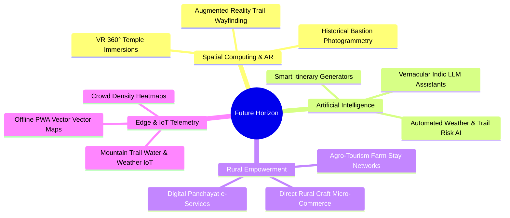
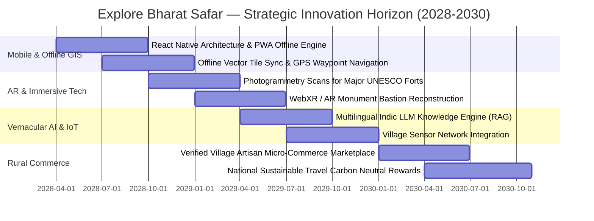

# Explore Bharat Safar — Future System Updates, Strategic Evolution & Emerging Tech Blueprint

- **Document Identifier**: EBS-DOC-39-FUTURE
- **Version**: 1.0.0
- **Status**: Approved
- **Author**: Enterprise Architecture & Solutions Engineering Team
- **Target Audience**: Chief Technology Officer, Strategic Product Directors, R&D Engineers, Innovation Leads, Venture Partners
- **Related Documents**:
  - `01-idea.md`
  - `03-architecture.md`
  - `07-roadmap.md`
  - `10-database-design.md`
  - `16-map-engine.md`
  - `26-business-rules.md`
- **Last Updated**: 2026-09-28

---

## 1. Evolution Philosophy & Architectural Non-Negotiables

The long-term vision of **Explore Bharat Safar** is to become the preeminent global digital twin and cultural intelligence platform for Bharat. As emerging technologies—such as spatial computing, augmented reality, vernacular generative AI, and decentralized village commerce—are integrated into the platform, they must strictly comply with the foundational architectural non-negotiables:

> **Non-Negotiable Architecture Invariant**:  
> Future additions must **never** require destructive redesigns of the primary database schemas, RBAC permission models, geographical administrative hierarchies, booking lock engines, isolated search subsystems, or API contracts. All expansions must attach cleanly as modular extensions or decoupled microservices.

---

## 2. Strategic Future Evolution Vectors

### 2.1 Native Mobile Applications with Offline GIS Vector Caching
- **Objective**: Develop high-performance native iOS and Android applications utilizing React Native / Flutter while sharing existing TypeScript data contracts from `packages/types`.
- **Offline Spatial Cache**: In areas with zero cellular reception (e.g., deep Western Ghats valleys or high Himalayan passes), the mobile engine caches vector tiles, offline contour lines, and emergency contact directories locally via SQLite and IndexedDB.

### 2.2 Augmented Reality (AR) Monument & Wayfinding Overlays
- **Objective**: Allow trekkers and cultural explorers to hold up their smartphones at archaeological sites to overlay reconstructed historical bastions, temple iconography translations, and navigational trail markers.
- **Architectural Anchor**: Anchored directly to existing PostGIS coordinates stored in `geo_spatial_schema.places.coordinates`.

### 2.3 Vernacular AI Village & Cultural Knowledge Assistant
- **Objective**: Deploy specialized Indic language conversational agents capable of answering complex historical, agricultural, and logistical inquiries in Hindi, Marathi, Tamil, Telugu, Kannada, Gujarati, Bengali, and regional dialects.
- **Privacy & Source Attribution**: RAG (Retrieval-Augmented Generation) pipeline anchored strictly to verified village records and peer-reviewed historical citations in the database, with zero unverified hallucinations.

### 2.4 Smart Village IoT & Environmental Telemetry
- **Objective**: Connect rural environmental micro-stations to village pages to broadcast live trail conditions:
  - Real-time rainfall and flash flood warnings at river confluences.
  - Air quality and windchill telemetry on high-altitude passes.
  - Solar micro-grid availability indices.

### 2.5 Decentralized Rural Commerce & Handicraft Hubs
- **Objective**: Expand Section 2 (Village System) into an authenticated direct-to-consumer rural marketplace:
  - Empower local women's self-help groups (*Bachat Gats*) and village artisans to sell GI-tagged handicrafts (e.g., Paithani sarees, Warli art, Bidriware, Channapatna toys) directly to verified travellers with zero intermediary commissions.

---

## 3. Phased Technology Horizon (2028–2030)

---

## 4. Backward Compatibility & Extension Principles

1. **Schema Non-Destructiveness**: Any new database fields introduced for future IoT, AR, or commerce modules must be nullable or possess safe default values, ensuring existing API endpoints remain $100\%$ operational without code regression.
2. **Modular Microservice Attachment**: Heavy AI workloads and WebXR rendering pipelines must operate as isolated microservices communicating via asynchronous Redis/Kafka event buses, never impacting the low-latency booking or GIS exploration engines.
3. **Preservation of the Sovereign Hierarchy**: Regardless of how advanced AR or AI features become, the sovereign geographical hierarchy ($India \rightarrow State \rightarrow District \rightarrow Taluka \rightarrow Place/Village$) remains the eternal backbone of Explore Bharat Safar.

---

## 5. Summary & Document Closure

This concludes the 39-document enterprise specification suite for **Explore Bharat Safar**. The complete digital blueprint provides software architects, engineering squads, GIS cartographers, and operational leaders with an exhaustive, production-ready foundation to build the definitive digital ecosystem for Bharat.
