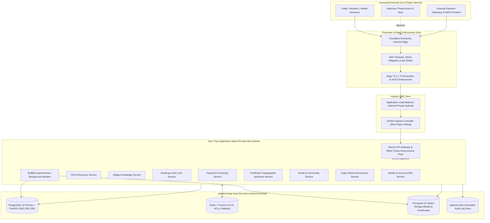
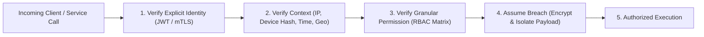
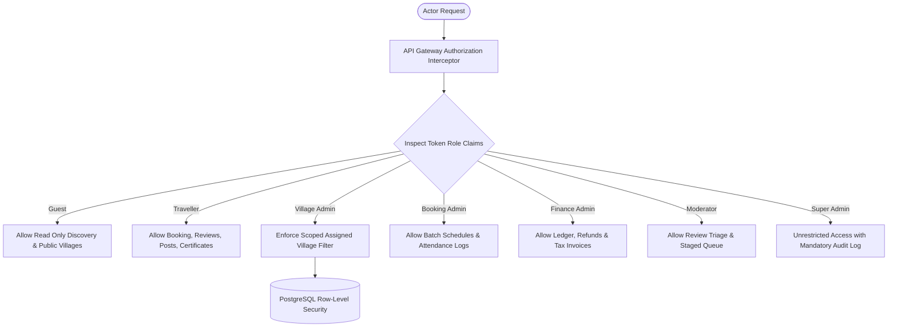
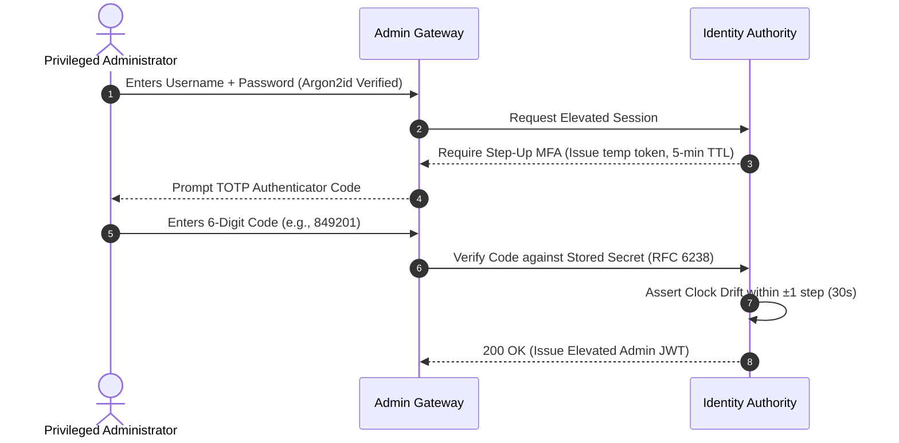
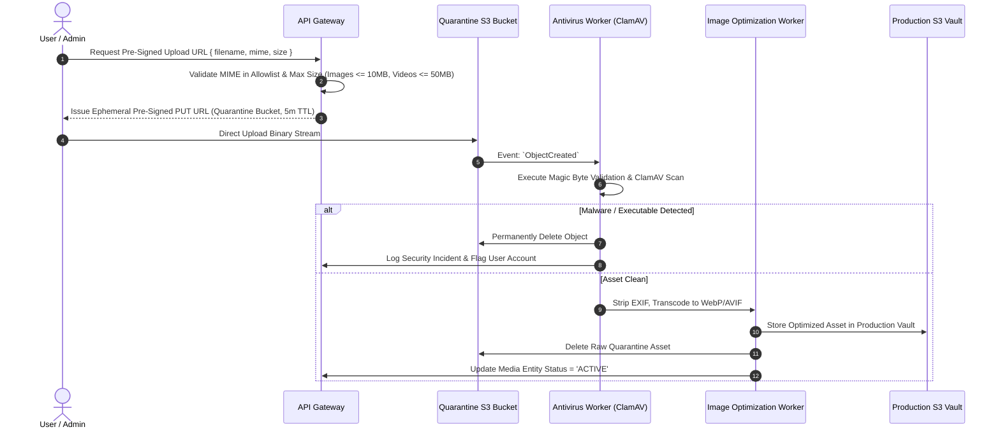
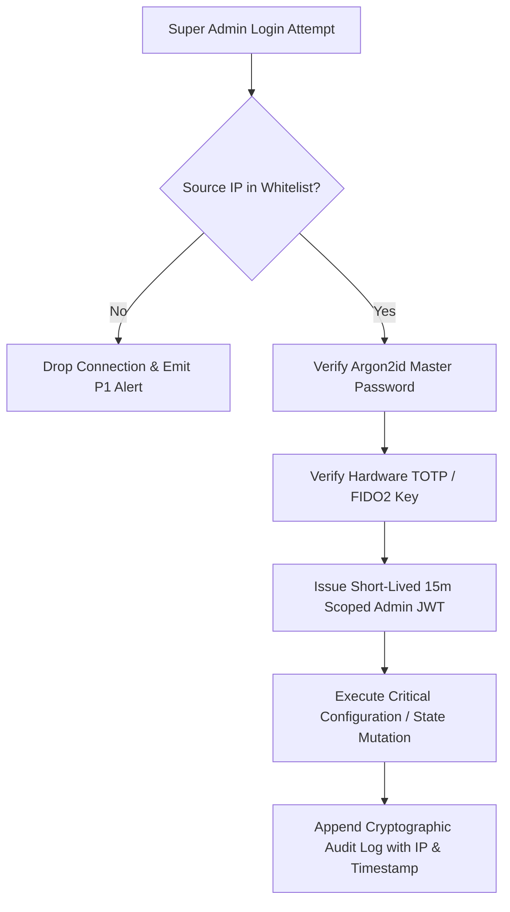
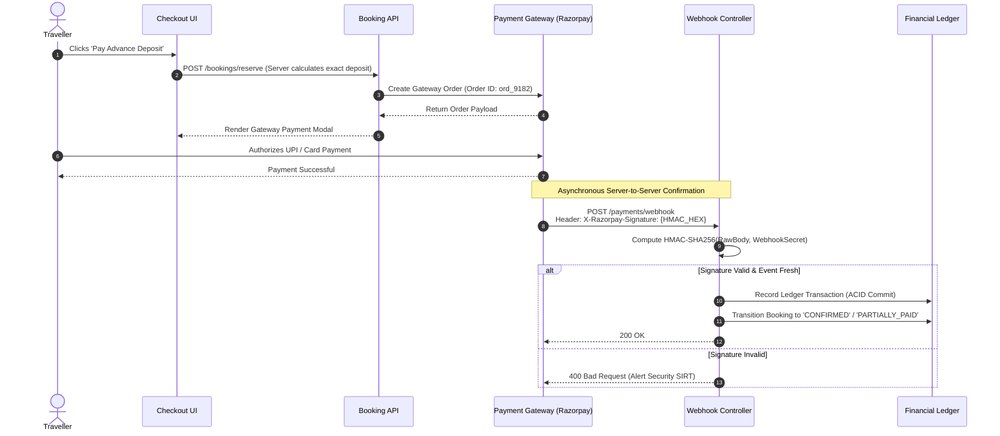
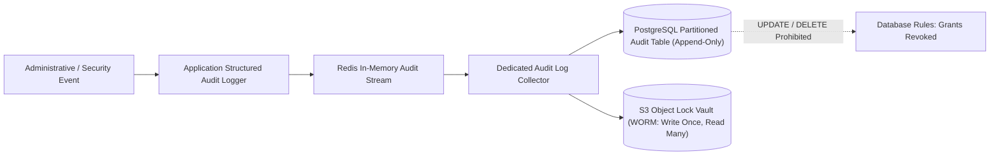
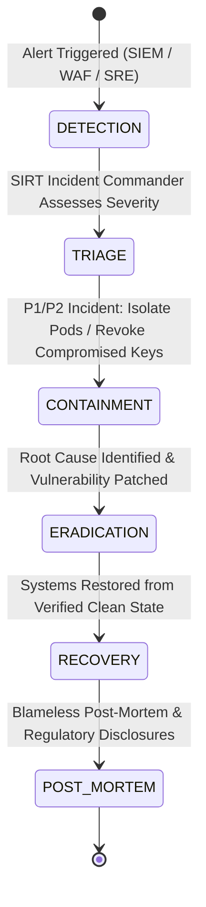
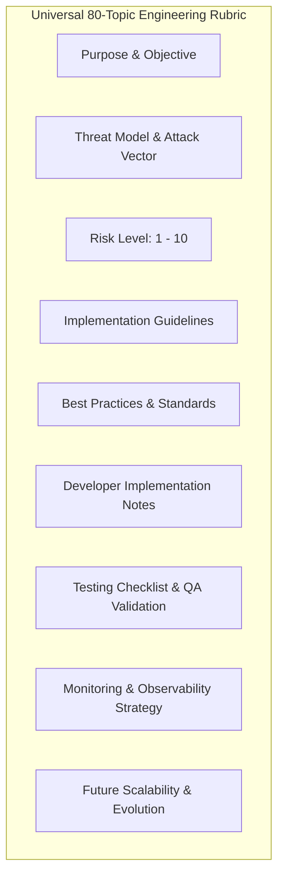

# Explore Bharat Safar — Enterprise Security Architecture & Comprehensive Defense Blueprint

- **Document Identifier**: EBS-DOC-40-SEC-BLUEPRINT
- **Version**: 1.0.0
- **Status**: Approved
- **Author**: Principal Cyber Security Architect & Enterprise Security Engineering Team
- **Target Audience**: CISO, Enterprise Security Engineers, Cloud Security Specialists, Application Security Leads, Core Backend/Frontend Architects, Compliance & Audit Officers
- **Related Documents**:
  - `02-specification.md`
  - `03-architecture.md`
  - `05-drd.md`
  - `09-api-design.md`
  - `10-database-design.md`
  - `11-security.md`
  - `12-authentication.md`
  - `13-admin-panel.md`
  - `14-booking-system.md`
  - `16-map-engine.md`
  - `20-certificate-system.md`
  - `21-payment-system.md`
  - `26-business-rules.md`
- **Last Updated**: 2026-09-28

---

## Executive Summary & System Trust Boundaries

**Explore Bharat Safar** represents a sovereign-scale digital ecosystem integrating cartographic GIS vector visualization, rural village governance across 600,000+ settlements, high-concurrency adventure booking transactions, cryptographic certificate issuance, and social community networking. 

Securing this ecosystem mandates a defense-in-depth, zero-trust security paradigm. Every network boundary, computational runtime, persistence store, administrative transition, and external webhook is treated as a potentially compromised environment.



---

# SECTION I: ARCHITECTURAL FOUNDATIONS & ACCESS GOVERNANCE

---

## 1. Security Architecture

- **Purpose**: Establishes a comprehensive, multi-layered defensive posture ensuring confidentiality, integrity, availability, and non-repudiation across the entire platform lifecycle.
- **Threat Model**: Sophisticated nation-state cyber threats, coordinated distributed denial of service (DDoS) syndicates, automated bot armies attempting credential stuffing, unauthorized data scraping of territorial cartography, and insider privilege escalation.
- **Risk Level**: **CRITICAL (Score: 10/10)**
- **Implementation Guidelines**:
  - Implement defense-in-depth across six concentric perimeters: Perimeter Edge (WAF/CDN), Ingress Gateway, Network Mesh (Kubernetes NetworkPolicies), Application Container (Non-root, read-only root filesystems), Database Persistence (mTLS, RBAC, Row-Level Security), and Data-at-Rest Encryption (AES-256-GCM).
  - Enforce explicit security separation of duties: operational administrators cannot modify audit log tables; software developers possess zero access to production database credentials.
- **Best Practices**:
  - Adopt NIST SP 800-53 security controls.
  - Employ Infrastructure as Code (IaC) security linting via Checkov and tfsec.
  - Automate threat detection via behavioral telemetry.
- **Developer Notes**: All network traffic between microservices must use mTLS (Mutual TLS) mediated by Linkerd/Istio service mesh. Direct unencrypted internal HTTP calls will trigger automated pod termination.
- **Testing Checklist**:
  - [ ] Verify that internal service endpoints reject non-mTLS connections.
  - [ ] Validate that all egress traffic from application pods is blocked except to allowlisted CIDRs.
- **Monitoring Strategy**: Centralize VPC flow logs, Ingress access logs, and Kubernetes audit logs into a SIEM cluster with automated threshold alerting on unexpected internal port scans.
- **Future Scalability**: Hardware Security Module (HSM) integration for enterprise key orchestration as geographic data volume scales past petabyte boundaries.

---

## 2. Zero Trust Architecture (ZTA)



- **Purpose**: Eliminates implicit trust based on network locality. Assumes internal networks are hostile and enforces continuous verification on every transaction.
- **Threat Model**: Lateral movement following compromised perimeter nodes, internal network packet sniffing, rogue insider access, and container breakout exploits.
- **Risk Level**: **CRITICAL (Score: 10/10)**
- **Implementation Guidelines**:
  - Conform strictly to NIST SP 800-207 Zero Trust Architecture standards.
  - Micro-segment Kubernetes workloads using Calico / Cilium CNI network policies denying default ingress/egress.
  - Enforce short-lived cryptographically signed ephemeral identity certificates (SPIFFE/SPIRE).
- **Best Practices**:
  - Never allow direct container-to-container database access without traversing the authentication and authorization layer.
  - Treat internal Kubernetes cluster IPs as untrusted public endpoints.
- **Developer Notes**: When adding a new microservice or background worker, an explicit `NetworkPolicy` manifest must be authored defining precise ingress port/namespace allowlists.
- **Testing Checklist**:
  - [ ] Execute automated port scanning from a compromised test pod; assert 100% dropped packets across non-whitelisted namespaces.
  - [ ] Test cross-tenant token presentation; assert immediate HTTP 403 Forbidden.
- **Monitoring Strategy**: Real-time alerts on any rejected inter-service network packets via Cilium Hubble telemetry.
- **Future Scalability**: Migration to automated identity federation across multi-region Kubernetes clusters.

---

## 3. Authentication Security

- **Purpose**: Establishes definitive, cryptographically verifiable proof of human and system actor identities prior to granting access to state or resources.
- **Threat Model**: Credential stuffing, brute-force dictionary attacks, rainbow table matching, credential interception, and session hijacking.
- **Risk Level**: **CRITICAL (Score: 10/10)**
- **Implementation Guidelines**:
  - Implement asymmetric token minting utilizing RS256 (RSA Signature with SHA-256) where private keys reside exclusively within the Identity Authority.
  - Enforce strict double opt-in verification via email tokens (cryptographically secure 256-bit random strings with 24-hour expiration) before activating new accounts.
- **Best Practices**:
  - Never return verbose error messages on login failures (e.g., return generic *"Invalid email or password"* rather than *"Email does not exist"*).
  - Enforce secure password reset workflows requiring active session revocation.
- **Developer Notes**: All authentication logic resides in the isolated `auth` bounded context. No downstream domain service may issue, modify, or extend authentication credentials.
- **Testing Checklist**:
  - [ ] Verify timing attack immunity: ensure failed authentication takes identical execution time regardless of user existence.
  - [ ] Verify that unverified email accounts cannot execute booking or social operations.
- **Monitoring Strategy**: Grafana alert on failed login attempts exceeding 100 attempts/minute across the global authentication gateway.
- **Future Scalability**: Passkey / WebAuthn (FIDO2) passwordless authentication integration.

---

## 4. Authorization & Role-Based Access Control (RBAC)



- **Purpose**: Enforces strict privilege boundaries ensuring actors operate exclusively within their authorized functional domain and geographic tenancy.
- **Threat Model**: Broken Object Level Authorization (BOLA/IDOR), vertical privilege escalation, horizontal data tampering across villages, and administrative override bypass.
- **Risk Level**: **CRITICAL (Score: 10/10)**
- **Implementation Guidelines**:
  - Implement centralized authorization guards (`RolesGuard`) inspecting incoming JWT claims against the canonical role definitions: `GUEST`, `TRAVELLER`, `VILLAGE_ADMIN`, `MODERATOR`, `CONTENT_EDITOR`, `BOOKING_ADMIN`, `FINANCE_ADMIN`, `SYSTEM_ADMIN`, `SUPER_ADMIN`.
  - Enforce tenant isolation via PostgreSQL Row-Level Security (RLS) for Village Admins: `tenant_id = current_setting('app.current_village_id')`.
- **Best Practices**:
  - Never evaluate permissions in client-side JavaScript components for security decisions.
  - Enforce denial-by-default on all API routes lacking explicit permission decorators.
- **Developer Notes**: Decorate every NestJS controller with `@Roles(Role.BOOKING_ADMIN)` or `@Permissions(Permission.BOOKING_WRITE)`. Endpoints lacking decorators must fail compilation.
- **Testing Checklist**:
  - [ ] Test Village Admin A attempting to mutate records for Village B; assert HTTP 403.
  - [ ] Test Traveller attempting to hit administrative endpoints; assert HTTP 403.
- **Monitoring Strategy**: Audit log emission on every `403 Forbidden` event containing actor UUID, targeted route, and IP address.
- **Future Scalability**: Fine-grained Attribute-Based Access Control (ABAC) using Open Policy Agent (OPA).

---

## 5. Session Security

- **Purpose**: Protects active user sessions against interception, fixation, replay, and unauthorized retention.
- **Threat Model**: Session hijacking, man-in-the-middle packet sniffing, cross-site script access to tokens, and stale session exploitation.
- **Risk Level**: **HIGH (Score: 8/10)**
- **Implementation Guidelines**:
  - Stateless session model with access tokens stored strictly in memory on the client.
  - Long-lived refresh tokens stored exclusively in `HttpOnly`, `Secure`, `SameSite=Strict` browser cookies.
  - Path restriction applied on refresh cookies: `Path=/api/v1/auth`.
- **Best Practices**:
  - Absolute session expiration forced at 30 days regardless of activity.
  - Idle session expiration enforced after 24 hours of inactivity.
- **Developer Notes**: Never store authentication credentials or JWTs in `localStorage` or `sessionStorage` due to vulnerability to DOM-based XSS attacks.
- **Testing Checklist**:
  - [ ] Verify that `document.cookie` cannot read the refresh token in browser console.
  - [ ] Validate that changing IP address and user-agent triggers a session verification challenge.
- **Monitoring Strategy**: Track active session count in Redis; alert on abnormal concurrent session spikes for a single user account.
- **Future Scalability**: Device binding through WebCrypto cryptographic hardware keys.

---

## 6. JWT Security

- **Purpose**: Defines standard, tamper-evident cryptographic data structures for stateless inter-service identity assertion.
- **Threat Model**: Algorithm confusion attacks (e.g., switching `RS256` to `none` or `HS256`), expired token replay, payload tampering, and signature forgery.
- **Risk Level**: **CRITICAL (Score: 10/10)**
- **Implementation Guidelines**:
  - Sign all tokens using RSA-2048 with SHA-256 (`RS256`).
  - Explicitly restrict acceptable algorithms in verification configurations: `algorithms: ['RS256']`.
  - Enforce short lifespan: Access tokens expire exactly **15 minutes** ($900\text{ seconds}$) post-issuance.
- **Best Practices**:
  - Embed unique token identifiers (`jti`) to enable real-time emergency token revocation via Redis blacklist.
  - Keep payload minimal: user UUID, role array, session identifier, and expiration. Never embed passwords, PII, or medical notes.
- **Developer Notes**: Downstream microservices verify tokens locally using the public key hosted at `https://auth.internal/.well-known/jwks.json`.
- **Testing Checklist**:
  - [ ] Send request with token header `alg: "none"`; assert rejection with HTTP 401.
  - [ ] Send request with token signed via symmetric HS256 using public key; assert rejection.
- **Monitoring Strategy**: Monitor token verification failure metrics; alert on signature verification error bursts.
- **Future Scalability**: Transition to Ed25519 (EdDSA) for compact token size and accelerated verification speed.

---

## 7. Refresh Token Strategy (Rotation & Family Revocation)

```mermaid
sequenceDiagram
    autonumber
    actor Client
    participant Auth as Identity Authority
    participant Redis as Redis Session Registry

    Client->>Auth: POST /auth/refresh (Cookie: RT_1, Family: F_100)
    Auth->>Redis: Check RT_1 Status
    alt RT_1 Valid & Active
        Auth->>Redis: Invalidate RT_1; Issue RT_2 in Family F_100
        Auth-->>Client: 200 OK (New Access Token + Cookie: RT_2)
    else RT_1 Already Revoked (Replay Attack Detected!)
        Auth->>Redis: REVOKE ENTIRE FAMILY F_100 (All Tokens Killed)
        Auth-->>Client: 401 Unauthorized ("Token Reuse Detected - Re-login Required")
    end
```

- **Purpose**: Delivers seamless continuous access while minimizing window of vulnerability through single-use token rotation and automated theft detection.
- **Threat Model**: Exfiltrated refresh tokens used by adversaries to maintain persistent, undetected account access.
- **Risk Level**: **HIGH (Score: 8/10)**
- **Implementation Guidelines**:
  - Implement **Refresh Token Rotation (RTR)**: every refresh request consumes the existing token and issues a new token pair.
  - Implement **Token Family Invalidation**: if an expired or previously consumed token is re-submitted, the system treats it as an exfiltration event and terminates all active sessions belonging to that token family immediately.
- **Best Practices**:
  - Store token family lineage (`family_id`, `current_token_hash`, `device_fingerprint`) in Redis with automatic TTL matching max refresh lifetime (7 days).
- **Developer Notes**: Refresh logic is managed exclusively by the `/api/v1/auth/refresh` controller.
- **Testing Checklist**:
  - [ ] Submit an already-consumed refresh token; assert that both the old and the newly issued token in that family are immediately revoked.
- **Monitoring Strategy**: Real-time high-priority security alert dispatched to SIEM whenever token family reuse is detected.
- **Future Scalability**: Cross-region Redis replication for global session synchronization.

---

## 8. Password Security

- **Purpose**: Establishes high-entropy credential standards protecting user credentials from brute-force guessing and dictionary lookup.
- **Threat Model**: Credential stuffing, offline brute-force attacks, dictionary attacks, and credential reuse across third-party breaches.
- **Risk Level**: **HIGH (Score: 8/10)**
- **Implementation Guidelines**:
  - Minimum length: **12 characters**; Maximum length: **128 characters**.
  - Must include: At least 1 uppercase letter, 1 lowercase letter, 1 number, and 1 non-alphanumeric special symbol.
  - Implement HaveIBeenPwned API k-Anonymity check: reject passwords found in active leak databases.
- **Best Practices**:
  - Do not enforce arbitrary periodic password expirations (per NIST SP 800-63B), as this leads to predictable password patterns.
- **Developer Notes**: Evaluate password complexity using `zxcvbn` library; enforce a minimum score of 3 before accepting new passwords.
- **Testing Checklist**:
  - [ ] Attempt registration with password `"Password123!"`; assert rejection due to presence in common breach lists.
- **Monitoring Strategy**: Log failed password complexity submissions to detect automated registration spam bots.
- **Future Scalability**: Integration of enterprise SSO (Single Sign-On) for institutional village administrators.

---

## 9. Argon2id Password Hashing

- **Purpose**: Provides state-of-the-art cryptographic one-way hashing with memory-hard and time-hard defenses against GPU and ASIC cracking rigs.
- **Threat Model**: Offline password cracking following database exfiltration dumps.
- **Risk Level**: **CRITICAL (Score: 10/10)**
- **Implementation Guidelines**:
  - Algorithm: **Argon2id** (hybrid version combining Argon2d and Argon2i).
  - Minimum Parameters:
    - Memory Cost ($m$): $65,536\text{ KiB}$ ($64\text{ MB}$)
    - Time Cost / Iterations ($t$): $3$
    - Parallelism ($p$): $1\text{ thread}$
    - Salt: $16\text{ cryptographically secure random bytes}$
    - Output Key Length: $32\text{ bytes}$
- **Best Practices**:
  - Never alter hashing parameters on existing passwords without implementing progressive re-hashing upon subsequent successful logins.
- **Developer Notes**: Utilize native `argon2` bindings. The hashing operation must occur on the worker threads to avoid blocking Node.js event loops.
- **Testing Checklist**:
  - [ ] Verify that generated hashes start with `$argon2id$v=19$m=65536,t=3,p=1$`.
  - [ ] Benchmark verification latency: must execute between $150\text{ms} - 300\text{ms}$ on production server CPUs.
- **Monitoring Strategy**: Measure CPU utilization during login spikes; scale authentication pods accordingly.
- **Future Scalability**: Dynamic parameter adaptation as enterprise server hardware upgrades.

---

## 10. Multi-Factor Authentication (MFA) Architecture



- **Purpose**: Provides strong secondary identity verification, ensuring compromised passwords alone cannot grant administrative or financial access.
- **Threat Model**: Stolen administrative credentials, phishing, credential stuffing, and session replay.
- **Risk Level**: **HIGH (Score: 9/10)**
- **Implementation Guidelines**:
  - Protocol: **TOTP** (Time-based One-Time Password) adhering to **RFC 6238**.
  - Mandatory Enforcement: Super Admin, Booking Admin, Finance Admin, and Regional Moderator roles.
  - Secret Generation: 256-bit cryptographically secure pseudorandom secret key stored encrypted at rest via AES-256-GCM.
- **Best Practices**:
  - Issue 8 single-use, 10-character emergency backup recovery codes upon setup (hashed via SHA-256 in database).
- **Developer Notes**: Provide standard `otpauth://totp/ExploreBharatSafar:{email}?secret={secret}&issuer=ExploreBharatSafar` QR code strings for Google Authenticator, Authy, or Microsoft Authenticator.
- **Testing Checklist**:
  - [ ] Test TOTP code replay within same 30-second window; assert immediate rejection.
  - [ ] Test time drift tolerance: assert valid codes succeed at $t - 30\text{s}$, $t$, and $t + 30\text{s}$.
- **Monitoring Strategy**: Alert on multiple failed MFA attempts; trigger automated temporary administrative account freeze.
- **Future Scalability**: Hardware security token (YubiKey / WebAuthn / FIDO2) support.

---

## 11. OAuth Security

- **Purpose**: Governs secure federated social authentication (e.g., Sign in with Google / Apple for Travellers) without exposing third-party credentials.
- **Threat Model**: CSRF on OAuth callback handlers, authorization code interception, token leakage, and redirect URI manipulation.
- **Risk Level**: **MEDIUM (Score: 6/10)**
- **Implementation Guidelines**:
  - Enforce **OAuth 2.0 with PKCE** (Proof Key for Code Exchange, RFC 7636) for all public web and mobile clients.
  - Enforce high-entropy, encrypted cryptographic `state` parameters stored in session cookies to prevent CSRF callback spoofing.
- **Best Practices**:
  - Restrict redirect URIs to strict, hardcoded production domain allowlists. Wildcard redirect URLs (`https://*.explorebharatsafar.in`) are strictly prohibited.
- **Developer Notes**: OAuth identity tokens must be verified against the provider’s JWKS endpoint before linking to a local user record.
- **Testing Checklist**:
  - [ ] Submit OAuth callback with tampered `state` parameter; assert HTTP 400 Bad Request.
  - [ ] Attempt callback with unapproved `redirect_uri`; assert immediate rejection.
- **Monitoring Strategy**: Monitor OAuth error callback rates to identify provider outages or malicious probe campaigns.
- **Future Scalability**: OpenID Connect (OIDC) identity federation for government enterprise portals.

---

# SECTION II: DATA PROTECTION & STORAGE HARDENING

---

## 12. Database Security

- **Purpose**: Establishes comprehensive defense around the core persistence tier, protecting relational records, GIS geometries, and financial ledgers.
- **Threat Model**: Direct database network exposure, lateral compromised host infiltration, administrative credential theft, and unauthorized volume extraction.
- **Risk Level**: **CRITICAL (Score: 10/10)**
- **Implementation Guidelines**:
  - Place database clusters strictly inside private, non-routable VPC database subnets lacking internet gateways.
  - Enforce TLS 1.3 encryption on all database connection strings (`sslmode=verify-full`).
  - Restrict ingress connections strictly to application pod security groups via PgBouncer connection poolers.
- **Best Practices**:
  - Rename default `postgres` superuser; disable remote superuser logins.
  - Enforce least-privilege database user roles: application runtime user possesses zero DDL grants (`CREATE`, `DROP`, `ALTER`).
- **Developer Notes**: Database migrations execute through an isolated CI/CD deployer service account that is destroyed immediately post-migration.
- **Testing Checklist**:
  - [ ] Attempt direct database connection from outside the VPC; assert 100% network timeout.
  - [ ] Attempt DDL commands using the application runtime database user; assert permission denied.
- **Monitoring Strategy**: Database connection audit logging via `pgaudit`; alert on connection bursts or failed authentication logs.
- **Future Scalability**: Database proxy connection multiplexing with automated secret injection.

---

## 13. PostgreSQL Security & Row-Level Security (RLS)

- **Purpose**: Restricts database row visibility and mutation rights directly within the SQL engine based on session context.
- **Threat Model**: Multi-tenant data leakage, accidental missing `WHERE` clauses in application queries, and horizontal privilege abuse.
- **Risk Level**: **HIGH (Score: 9/10)**
- **Implementation Guidelines**:
  - Enable Row-Level Security on tenant-isolated tables:
    ```sql
    ALTER TABLE rural_bharat_schema.village_updates_staging ENABLE ROW LEVEL SECURITY;
    
    CREATE POLICY village_admin_isolation_policy ON rural_bharat_schema.village_updates_staging
      FOR ALL
      USING (village_id = NULLIF(current_setting('app.current_village_id', true), '')::uuid);
    ```
- **Best Practices**:
  - Set session variables securely inside transactional database connection wrappers: `SET LOCAL app.current_village_id = '...'`.
- **Developer Notes**: All multi-tenant queries must initialize session context within the database transaction prior to executing business queries.
- **Testing Checklist**:
  - [ ] Execute `SELECT * FROM village_updates_staging` under Village Admin session; assert zero rows returned from other villages.
- **Monitoring Strategy**: Audit RLS policy violations via PostgreSQL error log scrapers.
- **Future Scalability**: Automated multi-region tenant sharding.

---

## 14. Redis Security

- **Purpose**: Secures the in-memory cache, distributed lock engine (Redlock), and real-time Pub/Sub broker from unauthorized access and memory corruption.
- **Threat Model**: Unauthenticated Redis execution, cache poisoning, distributed lock hijacking, sensitive token inspection, and data exfiltration.
- **Risk Level**: **HIGH (Score: 9/10)**
- **Implementation Guidelines**:
  - Activate **Redis 6+ Access Control Lists (ACLs)**: application users are assigned fine-grained key pattern permissions (`~lock:booking:*`, `~cache:geo:*`).
  - Enforce TLS encryption for all Redis traffic (`rediss://`).
  - Permanently rename or disable dangerous operational commands in `redis.conf`: `FLUSHALL`, `FLUSHDB`, `CONFIG`, `KEYS`, `EVAL` (where raw eval is not required).
- **Best Practices**:
  - Require strong alphanumeric passwords ($\ge 32\text{ characters}$) for Redis cluster authentication.
- **Developer Notes**: All Redis lock operations must utilize the pre-approved `RedlockService` wrapper enforcing atomic Lua validation and cryptographically secure lock tokens.
- **Testing Checklist**:
  - [ ] Send `CONFIG GET *` command from application container; assert `ERR unknown command`.
  - [ ] Verify that unencrypted connections to port 6379 are rejected.
- **Monitoring Strategy**: Monitor Redis `evicted_keys`, CPU utilization, and rejected client connections in Grafana.
- **Future Scalability**: Redis Cluster multi-master sharding across availability zones.

---

## 15. Secrets Management

- **Purpose**: Prevents hardcoded credentials, API tokens, and cryptographic keys from leaking into source code or container images.
- **Threat Model**: Source code repository leaks, container image reverse engineering, insider exfiltration, and unauthorized key exposure.
- **Risk Level**: **CRITICAL (Score: 10/10)**
- **Implementation Guidelines**:
  - Centralize secrets within **HashiCorp Vault** or **AWS Secrets Manager**.
  - Synchronize secrets into Kubernetes pods at runtime via the **External Secrets Operator (ESO)**.
  - Mount secrets as ephemeral in-memory volumes (`tmpfs`) rather than static environment variables where possible to mitigate `/proc/$PID/environ` inspection attacks.
- **Best Practices**:
  - Never commit `.env` files, certificates, or private keys to Git. Enforce pre-commit hooks using `git-secrets` and GitGuardian.
- **Developer Notes**: Reference secrets in manifests via secret key references. The application reads secrets via standard configuration providers.
- **Testing Checklist**:
  - [ ] Run automated secret scanning across repository history; assert zero credentials detected.
  - [ ] Verify that secrets are rotated without requiring container restarts.
- **Monitoring Strategy**: Audit log alerts on any unauthorized secret reads or permission denial events in Vault.
- **Future Scalability**: Dynamic ephemeral database credential generation with 1-hour lifespans.

---

## 16. Environment Variables Security

- **Purpose**: Ensures operational configurations injected via environment variables cannot be exploited or exposed via diagnostic endpoints.
- **Threat Model**: Server information disclosure via debug endpoints, process memory inspection, and crash dump credential leakage.
- **Risk Level**: **MEDIUM (Score: 7/10)**
- **Implementation Guidelines**:
  - Mask all sensitive environment variables in application logs and diagnostic health checks.
  - Enforce strict runtime schema validation (via Zod / Joi) at application startup; terminate immediately if any variable fails validation.
- **Best Practices**:
  - Disable all framework debug screens and verbose environment dumping utilities in production (`NODE_ENV=production`).
- **Developer Notes**: Never print `process.env` in logging statements. Use sanitized configuration services that explicitly whitelist printable properties.
- **Testing Checklist**:
  - [ ] Trigger an intentional 500 error in staging; inspect response body to confirm zero environment variables are leaked.
- **Monitoring Strategy**: Automated log pattern detection scanning for inadvertent token or password prints.
- **Future Scalability**: Sealed secrets management via declarative GitOps pipelines.

---

## 17. Cryptographic Key Rotation

- **Purpose**: Limits the cryptanalytic lifespan and blast radius of symmetric and asymmetric keys.
- **Threat Model**: Undetected key compromise, historical traffic decryption, and long-term cryptographic degradation.
- **Risk Level**: **HIGH (Score: 8/10)**
- **Implementation Guidelines**:
  - **JWT Signing Keys (RS256)**: Rotated every **90 days**. Support overlapping key verification via JSON Web Key Sets (`jwks.json`).
  - **Database TDE Master Keys**: Rotated annually via AWS KMS / Cloud KMS.
  - **Payment Gateway Webhook Secrets**: Rotated every 180 days with a 24-hour dual-secret verification window.
- **Best Practices**:
  - Maintain key retirement schedules: retired keys are marked for decryption-only for 30 days before permanent archival.
- **Developer Notes**: The application verifies incoming tokens using the `kid` (Key ID) header claim, allowing seamless signature verification across key rotation windows.
- **Testing Checklist**:
  - [ ] Issue token with Key A, rotate to Key B, verify token with Key A still succeeds during the grace period.
- **Monitoring Strategy**: Automated calendar alerts dispatched to security engineering 14 days prior to scheduled key expirations.
- **Future Scalability**: Automated zero-downtime key rotation pipelines managed by Vault agents.

---

## 18. Encryption at Rest

- **Purpose**: Guarantees that physical storage media theft, snapshot exfiltration, or cloud volume cloning yields zero readable plaintext.
- **Threat Model**: Stolen physical hard drives, compromised cloud infrastructure snapshots, backup archive exfiltration, and unauthorized bucket downloads.
- **Risk Level**: **CRITICAL (Score: 10/10)**
- **Implementation Guidelines**:
  - Database Storage: PostgreSQL EBS volumes encrypted via **AES-256-XTS**.
  - Object Storage: S3 buckets enforce server-side encryption with customer-managed keys (**SSE-KMS**).
  - Backup Archives: Encrypted via AES-256 prior to off-site replication.
- **Best Practices**:
  - Enforce S3 bucket policies rejecting any `s3:PutObject` request lacking the `x-amz-server-side-encryption: aws:kms` header.
- **Developer Notes**: Local development environments must utilize encrypted Docker volumes.
- **Testing Checklist**:
  - [ ] Attempt uploading an unencrypted file to S3 bucket; assert HTTP 403 Access Denied.
- **Monitoring Strategy**: AWS Config rule monitoring ensuring 100% of attached EBS volumes and S3 buckets maintain active KMS encryption.
- **Future Scalability**: Client-side field-level encryption for sensitive medical declarations.

---

## 19. Encryption in Transit

- **Purpose**: Protects network payloads from eavesdropping, tampering, and session interception across all transmission links.
- **Threat Model**: Man-in-the-middle (MitM) attacks, public Wi-Fi packet sniffing, DNS spoofing, and malicious internal network taps.
- **Risk Level**: **CRITICAL (Score: 10/10)**
- **Implementation Guidelines**:
  - Enforce **TLS 1.3** as the primary cryptographic protocol across edge ingress and inter-service channels; permit TLS 1.2 strictly for legacy mobile fallbacks with secure cipher suites.
  - Complete elimination of unencrypted HTTP: edge routers automatically redirect HTTP (port 80) to HTTPS (port 443) with permanent 301 redirects.
- **Best Practices**:
  - Implement perfect forward secrecy (PFS) using Ephemeral Diffie-Hellman (ECDHE).
- **Developer Notes**: All internal API client libraries must enforce HTTPS connection targets.
- **Testing Checklist**:
  - [ ] SSL Labs server test: assert Grade A+ configuration with zero legacy ciphers enabled.
- **Monitoring Strategy**: Continuous monitoring of SSL/TLS certificate validity; alert 30 days prior to certificate expiration.
- **Future Scalability**: Quantum-resistant post-quantum cryptography (PQC) hybrid key exchange integration.

---

## 20. AES-256 Application-Level Field Encryption

- **Purpose**: Provides cryptographic protection for ultra-sensitive participant medical records and emergency contacts directly within the application layer.
- **Threat Model**: Database dump exfiltration, unauthorized database administrator inspection, and SQL injection data exfiltration.
- **Risk Level**: **CRITICAL (Score: 10/10)**
- **Implementation Guidelines**:
  - Algorithm: **AES-256-GCM** (Galois/Counter Mode) providing both confidentiality and cryptographic integrity authentication.
  - Key Derivation: Master keys managed in Vault; unique 96-bit initialization vectors (IVs) generated per encryption operation.
- **Best Practices**:
  - Never reuse IVs across encryption operations. Store the IV alongside the ciphertext as `{iv}:{auth_tag}:{ciphertext}`.
- **Developer Notes**: Apply custom TypeORM / Prisma encryption transformers to fields decorated with `@EncryptedField()`.
- **Testing Checklist**:
  - [ ] Inspect raw database records in `booking_participants`; verify that `medical_notes` contains base64-encoded encrypted ciphertext.
- **Monitoring Strategy**: Track encryption/decryption execution times to prevent performance bottlenecks on batch checkout operations.
- **Future Scalability**: Homomorphic encryption exploration for privacy-preserving aggregate health analytics.

---

# SECTION III: APPLICATION & API SECURITY CONTROLS

---

## 21. API Security Architecture

```mermaid
graph TD
    Client[Client Request] --> WAF[Cloudflare Edge WAF]
    WAF --> Ingress[Ingress Controller (mTLS)]
    Ingress --> RateLimiter[Sliding Window Rate Limiter (Redis)]
    RateLimiter --> AuthGuard[JWT Signature & Expiry Guard]
    AuthGuard --> RBACGuard[Role & Tenancy Authorization Guard]
    RBACGuard --> InputSanitizer[DTO Validation & DOMPurify Pipe]
    InputSanitizer --> ServiceLogic[Domain Business Logic]
    ServiceLogic --> AuditEmitter[Append-Only Audit Event Emitter]
    ServiceLogic --> OutputEncoder[Context-Aware Output Encoder]
    OutputEncoder --> Client
```

- **Purpose**: Establishes a hardened, defensive API gateway protecting internal business services from malicious network vectors.
- **Threat Model**: OWASP API Top 10 vulnerabilities (BOLA, Broken Function Level Authorization, Mass Assignment, Unrestricted Resource Consumption).
- **Risk Level**: **CRITICAL (Score: 10/10)**
- **Implementation Guidelines**:
  - Implement strict request payload schemas using TypeScript DTOs and `class-validator` with `whitelist: true, forbidNonWhitelisted: true` to prevent mass assignment exploits.
  - Require explicit `Idempotency-Key` headers on all financial and booking state mutations.
- **Best Practices**:
  - Generate and inspect OpenAPI (Swagger) specifications automatically during CI to detect unauthorized schema drift.
- **Developer Notes**: Never expose auto-incrementing database sequence IDs. All external entities must expose UUIDv4 or KSUID identifiers exclusively.
- **Testing Checklist**:
  - [ ] Submit payload with extra unapproved field `isAdmin: true`; assert HTTP 400 Bad Request.
- **Monitoring Strategy**: Track API 4xx and 5xx response ratios; alert when 4xx errors exceed $5\%$ of total traffic.
- **Future Scalability**: GraphQL Federation with centralized schema registry and query depth limiting.

---

## 22. Rate Limiting Architecture

- **Purpose**: Prevents resource starvation, denial-of-service, brute-force attacks, and scraping bot campaigns.
- **Threat Model**: Application-layer DoS (HTTP floods), high-concurrency ticket hoarding, brute-force password cracking, and GIS vector scraping.
- **Risk Level**: **HIGH (Score: 8/10)**
- **Implementation Guidelines**:
  - Algorithm: **Redis Sliding Window Counter** enforcing tiered rate limits across endpoint categories:
    - Public Discovery: $120\text{ req/min}$ per IP.
    - Isolated Search: $30\text{ req/min}$ per IP.
    - Authentication Endpoints: $5\text{ attempts/5 mins}$ per IP/account.
    - Booking Checkout: $10\text{ req/min}$ per user.
- **Best Practices**:
  - Emit standard RFC rate-limiting headers: `RateLimit-Limit`, `RateLimit-Remaining`, `RateLimit-Reset`.
  - Return HTTP 429 Too Many Requests with a `Retry-After: {seconds}` header.
- **Developer Notes**: Implement the rate limiting interceptor at the API Gateway level to reject abusive requests before domain microservice invocation.
- **Testing Checklist**:
  - [ ] Execute 6 rapid requests to `/api/v1/auth/login`; assert 6th request returns HTTP 429.
- **Monitoring Strategy**: Real-time dashboard tracking top rate-limited IP addresses and targeted endpoints.
- **Future Scalability**: Adaptive behavioral rate-limiting powered by machine-learning threat scoring.

---

## 23. Cross-Site Request Forgery (CSRF) Protection

- **Purpose**: Prevents unauthorized commands from being transmitted from a user that the web application trusts.
- **Threat Model**: Malicious third-party websites triggering unauthorized bookings, profile updates, or password changes via victim browser sessions.
- **Risk Level**: **HIGH (Score: 8/10)**
- **Implementation Guidelines**:
  - Primary Defense: All state-persisting session cookies enforce `SameSite=Strict` and `Secure`.
  - Secondary Defense: Double Submit Cookie pattern utilizing cryptographically secure, signed HMAC CSRF tokens for mutating operations (`POST`, `PUT`, `PATCH`, `DELETE`).
- **Best Practices**:
  - Custom Request Headers: Mandate custom headers (`X-Requested-With: XMLHttpRequest` or `X-EBS-Client: WebApp`) which browsers block cross-origin sites from setting without CORS preflight approval.
- **Developer Notes**: The CSRF middleware validates token parity on all mutating HTTP methods. Safe methods (`GET`, `HEAD`, `OPTIONS`) bypass validation.
- **Testing Checklist**:
  - [ ] Forge cross-origin form post from external HTML file; assert browser blocks transmission or server rejects with HTTP 403.
- **Monitoring Strategy**: Alert on CSRF token validation failure bursts indicative of active phishing campaigns.
- **Future Scalability**: Strict WebAuthn assertion binding on high-value financial operations.

---

## 24. Cross-Site Scripting (XSS) Prevention

- **Purpose**: Eliminates the execution of malicious client-side scripts within the user's browser context.
- **Threat Model**: Stored XSS in expedition journals, travel reviews, and village profiles; Reflected XSS in search parameters; DOM-based XSS in map popups.
- **Risk Level**: **CRITICAL (Score: 10/10)**
- **Implementation Guidelines**:
  - Universal Context-Aware Encoding: HTML entity encoding applied to all user-generated strings rendered within the DOM.
  - Markdown Sanitization: All travel stories and expedition journals are parsed into Abstract Syntax Trees (AST) and sanitized via **DOMPurify** with strict element allowlists:
    - Allowed: `<b>`, `<i>`, `<em>`, `<strong>`, `<h3>`, `<p>`, `<ul>`, `<li>`, `<blockquote>`.
    - Prohibited: `<script>`, `<iframe>`, `<object>`, `<embed>`, `onload=`, `onerror=`.
- **Best Practices**:
  - Use React / Next.js auto-escaping templates; strictly ban `dangerouslySetInnerHTML` unless explicitly wrapped by DOMPurify.
- **Developer Notes**: All rich text fields must execute sanitization on the backend prior to database storage and re-validate on frontend rendering.
- **Testing Checklist**:
  - [ ] Post review containing `<script>alert('XSS')</script>`; assert script tags are completely stripped or encoded upon rendering.
- **Monitoring Strategy**: Automated CSP violation reporting via `report-uri` / `report-to` directives.
- **Future Scalability**: Trusted Types API enforcement in modern chromium browsers.

---

## 25. SQL & Spatial Injection Prevention

- **Purpose**: Guarantees that untrusted user input cannot manipulate backend database query structures or execute arbitrary SQL.
- **Threat Model**: Database exfiltration, credential theft, unauthorized data destruction, and spatial geometric injection attacks.
- **Risk Level**: **CRITICAL (Score: 10/10)**
- **Implementation Guidelines**:
  - 100% Parameterized Queries: All database interactions utilize Prisma / TypeORM ORMs with parameterized positional parameters (`$1, $2`). Zero string concatenation.
  - Spatial Injections: Coordinate and polygon inputs are strictly validated through PostGIS parameterized constructs:
    ```sql
    ST_SetSRID(ST_MakePoint($1, $2), 4326) -- Never concatenate coordinates into ST_GeomFromText!
    ```
- **Best Practices**:
  - Enforce least privilege on the application database user to prevent execution of multi-statement commands or system functions (`pg_read_file`).
- **Developer Notes**: Dynamic column sorting allowlists: never pass raw query string parameters directly into SQL `ORDER BY` clauses. Map input against an explicit array of approved column names.
- **Testing Checklist**:
  - [ ] Inject `' OR 1=1 --` into search input; assert normal search execution returning zero matching strings.
- **Monitoring Strategy**: Real-time database query anomaly monitoring scanning for unexpected SQL syntax tokens.
- **Future Scalability**: Automated static code analysis rules blocking any raw query introduction in pull requests.

---

## 26. Server-Side Request Forgery (SSRF) Prevention

- **Purpose**: Prevents application servers from being coerced into making unauthorized network connections to internal or third-party resources.
- **Threat Model**: Internal metadata service exploitation (e.g., AWS IMDSv2 `169.254.169.254`), internal port scanning, and remote file inclusion.
- **Risk Level**: **HIGH (Score: 9/10)**
- **Implementation Guidelines**:
  - Never allow users to supply arbitrary URLs for server-side fetching.
  - Where URL ingestion is mandatory (e.g., webhook configurations):
    - Enforce a strict domain allowlist.
    - Resolve DNS and block private IP ranges (RFC 1918: `10.0.0.0/8`, `172.16.0.0/12`, `192.168.0.0/16`, `127.0.0.0/8`, `169.254.0.0/16`).
    - Enforce AWS IMDSv2 with hop-limit 1 to prevent container-level metadata exfiltration.
- **Best Practices**:
  - Execute external webhook pings from an isolated, stateless worker pool running inside a quarantined DMZ network.
- **Developer Notes**: Utilize an HTTP client configured with a custom DNS resolver that validates destination IP addresses prior to TCP connection handshakes.
- **Testing Checklist**:
  - [ ] Submit webhook URL `http://169.254.169.254/latest/meta-data/`; assert request rejected with HTTP 400.
- **Monitoring Strategy**: Network egress firewall logging; alert on any connection attempts to RFC 1918 / link-local addresses from application pods.
- **Future Scalability**: Dedicated egress proxies with domain-level filtering for all third-party outbound communications.

---

## 27. Remote Code Execution (RCE) Prevention

- **Purpose**: Prevents adversaries from executing arbitrary operating system commands on backend hosts or container environments.
- **Threat Model**: Host takeover, botnet recruitment, data destruction, and complete infrastructure compromise.
- **Risk Level**: **CRITICAL (Score: 10/10)**
- **Implementation Guidelines**:
  - Absolute ban on dynamic code evaluation functions (`eval()`, `new Function()`, `vm.runInContext()`).
  - Absolute ban on child process execution primitives (`child_process.exec()`, `spawn()`) based on user inputs.
  - Execute container runtimes with read-only root filesystems (`readOnlyRootFilesystem: true`) and non-root users (`runAsNonRoot: true`).
- **Best Practices**:
  - Drop all default Linux capabilities from Kubernetes pods (`drop: ["ALL"]`), retaining only minimal required network bindings.
- **Developer Notes**: PDF certificate generation and image resizing must execute through safe, sandboxed memory libraries (PDFKit, Sharp) rather than invoking external shell utilities like ImageMagick.
- **Testing Checklist**:
  - [ ] Verify that application containers reject shell spawning and write operations to `/usr`, `/etc`, and `/bin`.
- **Monitoring Strategy**: Falco runtime intrusion detection alerting on unexpected process forks inside application containers.
- **Future Scalability**: MicroVM isolation (AWS Firecracker / gVisor) for asynchronous media transcoders.

---

## 28. Content Security Policy (CSP Level 3)

- **Purpose**: Restricts the origins of scripts, styles, images, and fonts that the browser is permitted to load, establishing a robust defense against XSS and data exfiltration.
- **Threat Model**: Cross-site scripting, clickjacking, malicious script injection, and unauthorized data exfiltration.
- **Risk Level**: **HIGH (Score: 8/10)**
- **Implementation Guidelines**:
  - Emit an enterprise-grade Content-Security-Policy header on every HTML response:
    ```http
    Content-Security-Policy: 
      default-src 'self';
      script-src 'self' 'nonce-{CRYPTOGRAPHIC_NONCE}';
      style-src 'self' 'unsafe-inline';
      img-src 'self' data: https://media.explorebharatsafar.in https://*.tile.openstreetmap.org;
      font-src 'self' data:;
      connect-src 'self' https://api.explorebharatsafar.in wss://api.explorebharatsafar.in https://api.razorpay.com;
      frame-src 'self' https://api.razorpay.com;
      object-src 'none';
      base-uri 'self';
      form-action 'self';
      frame-ancestors 'none';
      block-all-mixed-content;
      upgrade-insecure-requests;
    ```
- **Best Practices**:
  - Generate a unique, cryptographically random base64 nonce on every SSR request; attach to authorized Next.js script bundles.
- **Developer Notes**: Inline event handlers (`onclick=`, `onload=`) are completely blocked by CSP. All interactions must use standard React event listeners.
- **Testing Checklist**:
  - [ ] Inject an inline `<script>` tag lacking the dynamic nonce; assert browser console blocks execution.
- **Monitoring Strategy**: Monitor automated CSP violation reports via Sentry or a dedicated `/api/v1/security/csp-report` endpoint.
- **Future Scalability**: Transition to strict nonce-only CSP with complete removal of `unsafe-inline` styles.

---

## 29. HTTP Strict Transport Security (HSTS)

- **Purpose**: Enforces permanent HTTPS communication, completely eliminating SSL stripping and protocol downgrade attacks.
- **Threat Model**: Man-in-the-middle protocol downgrade, unencrypted initial connection sniffing, and certificate spoofing.
- **Risk Level**: **HIGH (Score: 8/10)**
- **Implementation Guidelines**:
  - Inject the canonical HSTS response header:
    ```http
    Strict-Transport-Security: max-age=63072000; includeSubDomains; preload
    ```
  - Duration: $63,072,000\text{ seconds}$ (exactly 2 years).
  - Submit the domain `explorebharatsafar.in` to the official Chrome HSTS Preload list.
- **Best Practices**:
  - Verify that all subdomains (`api.`, `media.`, `auth.`) support HTTPS before enabling `includeSubDomains`.
- **Developer Notes**: Configured at the Cloudflare edge and NGINX Ingress controller levels.
- **Testing Checklist**:
  - [ ] Send request over HTTP port 80; assert immediate 301 redirect to HTTPS and presence of `Strict-Transport-Security` header.
- **Monitoring Strategy**: Automated synthetic uptime monitors checking HSTS header presence on all subdomains hourly.
- **Future Scalability**: Universal certificate transparency log monitoring.

---

## 30. Secure HTTP Headers Suite

- **Purpose**: Activates built-in browser defense mechanisms against clickjacking, MIME sniffing, and information disclosure.
- **Threat Model**: UI redressing (clickjacking), drive-by MIME downloads, referrer leakage, and browser feature exploitation.
- **Risk Level**: **MEDIUM (Score: 7/10)**
- **Implementation Guidelines**:
  - Inject the complete suite of security headers across all web and API responses:
    ```http
    X-Frame-Options: DENY
    X-Content-Type-Options: nosniff
    Referrer-Policy: strict-origin-when-cross-origin
    Permissions-Policy: geolocation=(self), camera=(), microphone=(), payment=(self "https://api.razorpay.com")
    X-Permitted-Cross-Domain-Policies: none
    Server: EBS-Edge-Router
    ```
- **Best Practices**:
  - Strip verbose server identification headers (`X-Powered-By: Express`, `Server: nginx/1.24`).
- **Developer Notes**: Enabled globally via NestJS `helmet()` middleware and Next.js `securityHeaders` configuration.
- **Testing Checklist**:
  - [ ] Attempt embedding the platform inside an `<iframe>` on an external domain; assert browser blocks rendering with `X-Frame-Options: DENY`.
- **Monitoring Strategy**: SecurityHeaders.com automated weekly score auditing (mandating Grade A+).
- **Future Scalability**: Integration of emerging Client Hints security policies.

---

# SECTION IV: MEDIA, FILE UPLOAD & MALWARE SECURITY

---

## 31. Multi-Tier File Upload Pipeline



- **Purpose**: Prevents malicious file uploads, server storage exhaustion, and malware dissemination while optimizing media delivery.
- **Threat Model**: Remote code execution via polyglot files, server disk exhaustion, embedded SVG script injection, and malware distribution to users.
- **Risk Level**: **CRITICAL (Score: 10/10)**
- **Implementation Guidelines**:
  - Never allow direct uploads to application server local filesystems.
  - Implement a three-bucket pipeline: `Quarantine Bucket` $\rightarrow$ `Scanning Engine` $\rightarrow$ `Production Public Vault`.
- **Best Practices**:
  - Re-generate randomized UUID filenames upon upload (`8f3a21e4-9b2c...webp`); never preserve original user-supplied filenames.
- **Developer Notes**: All pre-signed URL requests must pass through authentication guards verifying user upload quotas.
- **Testing Checklist**:
  - [ ] Attempt uploading an EICAR antivirus test file; verify asset is blocked and purged within 30 seconds.
- **Monitoring Strategy**: Track quarantine processing latency and count of rejected malicious files in CloudWatch/Prometheus.
- **Future Scalability**: Multi-engine malware analysis utilizing VirusTotal API integration.

---

## 32. Secure Image Handling & EXIF Privacy Sanitization

- **Purpose**: Protects against malicious image parsing vulnerabilities and preserves user geolocation privacy.
- **Threat Model**: EXIF GPS metadata exfiltration (doxing solo travellers), memory corruption via malformed image headers (ImageTragick), and pixel flood DoS.
- **Risk Level**: **HIGH (Score: 8/10)**
- **Implementation Guidelines**:
  - Validate binary magic bytes: JPEG (`FF D8 FF`), PNG (`89 50 4E 47`), WebP (`52 49 46 46`).
  - Strip all EXIF metadata (GPS coordinates, camera serial numbers, creation timestamps) during processing via Sharp:
    ```typescript
    await sharp(inputBuffer).rotate().strip().webp({ quality: 80 }).toBuffer();
    ```
  - Enforce maximum dimension bounds: images larger than $4096\times4096\text{px}$ are downscaled immediately.
- **Best Practices**:
  - Restrict allowed formats to `JPEG`, `PNG`, `WebP`, and `AVIF`. Raw executable or script-embeddable formats (`SVG`, `HTML`) are strictly prohibited for public user profile uploads.
- **Developer Notes**: SVG uploads are permitted exclusively for Super Admin vector icon curation and must pass strict XML parsing and sanitization.
- **Testing Checklist**:
  - [ ] Upload photo with GPS metadata; download processed image and verify EXIF location tags are completely stripped.
- **Monitoring Strategy**: Alert on Sharp processing memory spikes indicating pixel flood decompression bomb attacks.
- **Future Scalability**: Edge image resizing and optimization directly within Cloudflare Workers.

---

## 33. Secure Video Upload & Transcoding Isolation

- **Purpose**: Safely ingests and transcodes temporary 24-hour travel stories and expedition clips without exposing server resources.
- **Threat Model**: FFmpeg buffer overflow exploits, decompression bombs, excessive bandwidth consumption, and malicious video payloads.
- **Risk Level**: **HIGH (Score: 8/10)**
- **Implementation Guidelines**:
  - File constraints: Maximum file size: **$50\text{ MB}$**; Maximum duration: **$60\text{ seconds}$**.
  - Permitted formats: MP4 (H.264 / AAC) and WebM exclusively.
  - Video processing is isolated inside sandboxed Kubernetes worker pods with memory and CPU hard limits.
- **Best Practices**:
  - Videos are chunked into HLS (HTTP Live Streaming) adaptive bitrate streams to minimize client bandwidth consumption.
- **Developer Notes**: The transcoding worker operates with dropped Linux capabilities and zero access to internal database connection pools.
- **Testing Checklist**:
  - [ ] Upload video file exceeding 60 seconds; assert processing rejection with descriptive error.
- **Monitoring Strategy**: Monitor transcoding worker queue depth and pod CPU usage.
- **Future Scalability**: Managed cloud video transcoding (AWS MediaConvert) offloading compute from Kubernetes clusters.

---

## 34. Malware & Antivirus Scanning Strategy

- **Purpose**: Guarantees that binary assets stored on platform object storage are free of known Trojans, viruses, ransomware, and malicious scripts.
- **Threat Model**: Platform being weaponized as a malware distribution hub, infecting mobile travellers or municipal village administrator workstations.
- **Risk Level**: **CRITICAL (Score: 10/10)**
- **Implementation Guidelines**:
  - Deploy **ClamAV daemon** as a scalable microservice within the asynchronous worker pool.
  - All assets in the quarantine bucket are scanned against the latest daily virus definition databases before promotion to the production vault.
  - Assets failing signature inspection trigger immediate hard deletion and event dispatch to the SIEM.
- **Best Practices**:
  - Update ClamAV virus signatures every 4 hours via automated cron pods.
- **Developer Notes**: Files are scanned in memory streaming chunks to avoid local disk writes in worker pods.
- **Testing Checklist**:
  - [ ] Verify automated signature database updates execute without service interruption.
- **Monitoring Strategy**: Alert on any positive malware detection; notify the security response team within 60 seconds.
- **Future Scalability**: Sandbox dynamic behavioral file analysis integration.

---

# SECTION V: SUBSYSTEM & DOMAIN SECURITY SPECIFICATIONS

---

## 35. Super Admin Security & Sovereign Privileges



- **Purpose**: Hardens the highest-privilege administrative tier to prevent platform takeover or unauthorized global state mutation.
- **Threat Model**: Compromised administrative workstations, phishing, insider threats, and unauthorized payment percentage tampering.
- **Risk Level**: **CRITICAL (Score: 10/10)**
- **Implementation Guidelines**:
  - Source IP Allowlisting: Super Admin console routes (`/admin/*`) are completely inaccessible outside designated corporate VPN / static IP ranges enforced at the WAF level.
  - Hardware-Enforced MFA: Mandatory TOTP / FIDO2 authentication on every administrative login.
  - Session Restrictions: Administrative sessions expire after **15 minutes** of inactivity; concurrent logins under the same Super Admin account are terminated immediately.
- **Best Practices**:
  - Super Admin accounts must not be used for everyday browsing or travel bookings.
- **Developer Notes**: All Super Admin controllers mandate the `@Roles(Role.SUPER_ADMIN)` guard.
- **Testing Checklist**:
  - [ ] Attempt accessing `/api/v1/admin/config` from non-whitelisted IP; assert HTTP 403 / connection dropped at WAF.
- **Monitoring Strategy**: Immediate PagerDuty alert on any Super Admin login event.
- **Future Scalability**: Dual-custody / four-eyes authorization required for high-risk operations (e.g., global payment percentage adjustments or database truncation).

---

## 36. Village Admin Security & Multi-Tier Moderation

- **Purpose**: Enables local rural administrators to contribute local heritage data while preventing unauthorized publishing or lateral data contamination.
- **Threat Model**: Account takeover of rural administrators, unauthorized modification of government contact lines, dissemination of fake village notices.
- **Risk Level**: **HIGH (Score: 8/10)**
- **Implementation Guidelines**:
  - Strict Tenancy Scoping: Village Admin tokens are cryptographically bound to their assigned `village_id`.
  - Zero Direct Production Writes: Village Admins possess **zero** write grants on production tables. All edits are written strictly to `village_updates_staging` with status `PENDING_APPROVAL`.
  - Content Approval Gate: Updates must receive digital approval from an independent regional Moderator or Super Admin before merging to the live directory.
- **Best Practices**:
  - Limit Village Admin upload volume: maximum 10 updates per day per village.
- **Developer Notes**: The API controller validates: `if (user.villageId !== targetVillageId) throw new ForbiddenException();`.
- **Testing Checklist**:
  - [ ] Village Admin submits update; verify production village table remains unchanged until moderator approves.
- **Monitoring Strategy**: Track moderation queue backlog; alert on abnormal submission volumes from a single village.
- **Future Scalability**: Digital signature integration using government e-Sign (Aadhaar-based) for official Gram Panchayat notices.

---

## 37. Booking & High-Concurrency Inventory Security

- **Purpose**: Guarantees inventory integrity, eliminates double-booking race conditions, and prevents automated ticket hoarding.
- **Threat Model**: Distributed race conditions during flash trek openings, seat holding bot attacks, and inventory exhaustion attacks.
- **Risk Level**: **CRITICAL (Score: 10/10)**
- **Implementation Guidelines**:
  - Distributed Locking: Use **Redlock algorithm** with atomic Redis Lua scripts ensuring that checking slot availability and decrementing capacity executes as a single indivisible operation.
  - Hard TTL Reservation: Reserved slots expire automatically after **15 minutes** ($900\text{ seconds}$) if payment confirmation is not received.
  - Database Constraint: PostgreSQL check constraint `CHECK (available_slots >= 0)` guarantees that race conditions can never drive inventory below zero.
- **Best Practices**:
  - Require CAPTCHA validation prior to slot reservation to mitigate bot hoarding scripts.
- **Developer Notes**: Never trust client-submitted prices or slot availability. All pricing calculations must be evaluated server-side.
- **Testing Checklist**:
  - [ ] Execute 1,000 concurrent reservation requests against a batch with 10 slots; assert exactly 10 succeed and 990 receive 409 Conflict.
- **Monitoring Strategy**: Monitor Redis lock acquisition latency and rate of expired unpaid reservations.
- **Future Scalability**: Dynamic queuing system (virtual waiting rooms) for mega-demand Himalayan trek registrations.

---

## 38. Payment Gateway Security & Financial Ledger Rigor



- **Purpose**: Secures financial transactions, eliminates payment tampering, enforces PCI-DSS compliance, and maintains immutable double-entry accounting.
- **Threat Model**: Client-side price tampering, fake payment injection, replay attacks on webhooks, and unauthorized refunds.
- **Risk Level**: **CRITICAL (Score: 10/10)**
- **Implementation Guidelines**:
  - **PCI-DSS SAQ-A Compliance**: The platform never stores, processes, or transmits raw credit card numbers or CVVs. All card inputs execute inside hosted iframes managed by the payment gateway.
  - **Cryptographic Webhook Verification**: Every incoming webhook payload is verified by calculating the HMAC-SHA256 signature using the secret webhook key and comparing it against the `X-Razorpay-Signature` header.
  - **Replay Protection**: Webhook event IDs are cached in Redis with a 24-hour TTL; duplicate event IDs are acknowledged with HTTP 200 but ignored to prevent duplicate ledger credits.
- **Best Practices**:
  - Store monetary amounts strictly as fixed-point integers in smallest currency units (paisa) or SQL `numeric(12,2)` to prevent binary floating-point rounding errors.
- **Developer Notes**: Financial operations must execute within serializable database transactions (`ISOLATION LEVEL SERIALIZABLE`).
- **Testing Checklist**:
  - [ ] Submit webhook with invalid HMAC signature; assert immediate rejection with HTTP 400.
  - [ ] Submit duplicate webhook event; verify ledger is updated exactly once.
- **Monitoring Strategy**: Automated hourly reconciliation comparing database ledger totals against payment gateway settlement reports.
- **Future Scalability**: Multi-currency support and automated foreign exchange risk hedging.

---

## 39. Digital Certificate Cryptographic Security & Anti-Forgery

- **Purpose**: Guarantees that issued completion certificates cannot be forged, manipulated, or counterfeit-duplicated.
- **Threat Model**: Fraudulent credential creation, participant name alteration on legitimate certificates, and unauthorized issuance without attendance or payment.
- **Risk Level**: **HIGH (Score: 8/10)**
- **Implementation Guidelines**:
  - Cryptographic Verification Digest: Every certificate calculates an HMAC-SHA256 signature over immutable fields:
    $$\text{Digest} = \text{HMAC-SHA256}\left(\text{SecretKey}, \, \text{CertNum} \,\|\, \text{ParticipantName} \,\|\, \text{ExpTitle} \,\|\, \text{Date}\right)$$
  - High-Contrast Dynamic QR Code: Embedded directly into the vector PDF/A canvas, resolving to `https://explorebharatsafar.in/verify/{certNumber}`.
  - Public Resolution Portal: Displays verified participant name, completed altitude, expedition leader signature, and verification seal.
- **Best Practices**:
  - Enforce prerequisite gates: zero certificates can be minted while `balance_amount_due > 0.00` or before on-trail attendance is logged.
- **Developer Notes**: PDF generation operates asynchronously in the `worker` service to prevent API blocking.
- **Testing Checklist**:
  - [ ] Scan generated certificate QR code; verify portal returns green verified status matching PDF text.
  - [ ] Modify participant name in PDF and scan QR; assert verification portal displays original genuine name.
- **Monitoring Strategy**: Alert on rapid sequential certificate verification scans indicating automated brute-force certificate guessing.
- **Future Scalability**: Blockchain anchoring / OpenCerts standard integration for decentralized academic and sporting credential verification.

---

## 40. Social Platform Security & Moderation

- **Purpose**: Protects the traveller community from abuse, harassment, spam, and malicious links while safeguarding personal privacy.
- **Threat Model**: Spam bot campaigns, malicious URL distribution, harassment, and unauthorized exfiltration of solo traveller travel plans.
- **Risk Level**: **MEDIUM (Score: 7/10)**
- **Implementation Guidelines**:
  - Automated Content Screening: All public posts and comments pass through automated regex and toxicity filters scanning for prohibited links, PII, and abusive speech.
  - Triage Thresholds: Any post receiving 3 or more community user flags is automatically hidden from public feeds and routed to the Moderator Queue.
  - Privacy-Preserving Matching: Solo traveller connection algorithms suggest compatibility without exposing personal phone numbers or direct messaging links.
- **Best Practices**:
  - Rate limit social creations: maximum 6 posts and 30 comments per hour per user account.
- **Developer Notes**: External links in social posts automatically receive `rel="nofollow noopener noreferrer"` attributes to prevent SEO spam and tab-nabbing.
- **Testing Checklist**:
  - [ ] Submit post containing 4 community flags; verify post is automatically hidden from global feed.
- **Monitoring Strategy**: Real-time moderation queue dashboard tracking pending tickets and triage turnaround time.
- **Future Scalability**: Computer-vision AI content screening for automatic detection of inappropriate image uploads.

---

## 41. GIS & Territorial Spatial Data Security

- **Purpose**: Protects sovereign geospatial boundary datasets from unauthorized tampering and ensures strict compliance with national mapping laws.
- **Threat Model**: Sovereign boundary distortion, cartographic compliance violations under Indian law, unauthorized spatial boundary tampering, and massive scraping of proprietary coordinate datasets.
- **Risk Level**: **CRITICAL (Score: 10/10)**
- **Implementation Guidelines**:
  - Official Alignment: All national, state, and union territory boundaries conform $100\%$ to certified Survey of India shapefiles.
  - Immutability: Spatial boundary tables in PostgreSQL (`states`, `districts`, `talukas`) are read-only for application runtime users. Mutations execute exclusively via verified database migrations signed by the Lead Cartographer.
  - Scraping Defense: Vector tile endpoints enforce strict rate limits ($120\text{ req/min}$) and block bulk programmatic polygon extraction.
- **Best Practices**:
  - Store spatial data in PostGIS using validated geometries (`ST_IsValid()`); reject invalid self-intersecting polygons during migration runs.
- **Developer Notes**: Simplified TopoJSON files are pre-computed and cached at the Cloudflare edge; direct PostGIS polygon queries are never exposed to public internet clients.
- **Testing Checklist**:
  - [ ] Execute automated boundary regression test in CI; verify that international borders match sovereign benchmark coordinates with zero deviance.
- **Monitoring Strategy**: Edge WAF monitoring alerting on rapid sequential vector tile extraction from automated crawler user-agents.
- **Future Scalability**: Differential privacy injection on rural village demographic statistics.

---

# SECTION VI: CLOUD, INFRASTRUCTURE & DEVSECOPS SECURITY

---

## 42. Cloudflare Enterprise WAF & DDoS Protection

```mermaid
flowchart LR
    Incoming[Incoming Web Traffic] --> Anycast[Cloudflare Global Anycast Network]
    Anycast --> L3_L4_DDoS[L3/L4 DDoS Mitigation (SYN / UDP Floods)]
    L3_L4_DDoS --> WAF_Rules[Cloudflare Managed WAF Ruleset (OWASP Top 10)]
    WAF_Rules --> BotManagement[Bot Management & Turnstile Challenge]
    BotManagement --> RateLimitEdge[Edge Rate Limiting]
    RateLimitEdge --> OriginShield[Authenticated Origin Pull (mTLS)]
    OriginShield --> ApplicationALB[Application Ingress ALB]
```

- **Purpose**: Establishes an unyielding perimeter shield absorbing high-volume DDoS attacks and terminating malicious HTTP payloads before reaching cloud origins.
- **Threat Model**: Layer 3/4 volumetric DDoS attacks (SYN floods, UDP amplification), Layer 7 HTTP floods, zero-day exploit probes, and malicious scraping bots.
- **Risk Level**: **CRITICAL (Score: 10/10)**
- **Implementation Guidelines**:
  - Deploy Cloudflare Enterprise with Cloudflare Managed Rulesets and OWASP Core Ruleset activated in full blocking mode.
  - Enforce **Authenticated Origin Pulls (mTLS)**: Cloud Load Balancers accept connections exclusively from Cloudflare edge IP addresses presenting verified client certificates. Direct IP access to origin load balancers is dropped at the firewall.
- **Best Practices**:
  - Deploy Cloudflare Turnstile CAPTCHA on checkout, login, and registration routes.
- **Developer Notes**: Configure origin web servers to restore true client IP addresses via `CF-Connecting-IP` headers for rate limiting and logging.
- **Testing Checklist**:
  - [ ] Attempt direct HTTP request to origin IP address; verify connection times out or returns HTTP 403.
- **Monitoring Strategy**: Real-time Cloudflare Security Analytics dashboard tracking blocked threats, bot traffic ratios, and WAF rule triggers.
- **Future Scalability**: Cloudflare Magic Transit integration for complete enterprise IP range protection.

---

## 43. Secure CI/CD Pipeline & DevSecOps

```mermaid
flowchart TD
    Commit[Developer Pushes Code to GitHub] --> SecretScan[1. GitGuardian Secret Scanning]
    SecretScan --> Lint[2. ESLint & TypeScript Strict Linting]
    Lint --> SAST[3. SonarQube Static Application Security Testing]
    SAST --> SCA[4. Snyk Dependency Vulnerability Check]
    SCA --> UnitTests[5. Automated Unit & Integration Tests (100% Pass)]
    UnitTests --> DockerBuild[6. Multi-Stage Container Image Build]
    DockerBuild --> ContainerScan[7. Trivy Container Vulnerability Scan]
    ContainerScan --> SignImage[8. Cosign Cryptographic Image Signing]
    SignImage --> DeployStaging[9. GitOps Deployment to Staging via ArgoCD]
```

- **Purpose**: Integrates automated security gates throughout the software development lifecycle, shifting vulnerability detection left.
- **Threat Model**: Supply chain compromises, malicious dependency injection, accidental credential commits, and vulnerable base images.
- **Risk Level**: **HIGH (Score: 9/10)**
- **Implementation Guidelines**:
  - Enforce branch protection on `main`: mandate 2 senior engineer reviews and 100% green CI pipeline passes before merging.
  - Image Signing: All production container images are cryptographically signed using **Sigstore Cosign**. Kubernetes clusters reject images lacking verified enterprise signatures.
- **Best Practices**:
  - Enforce dependency pinning via frozen lockfiles (`pnpm-lock.yaml`).
- **Developer Notes**: Pre-commit hooks run local linting and secret scanning to prevent accidental credential commits.
- **Testing Checklist**:
  - [ ] Attempt pushing a commit containing an AWS secret key string; verify git hook and GitHub Actions automatically block the push.
- **Monitoring Strategy**: Track mean time to remediate (MTTR) for discovered vulnerabilities in CI/CD dashboards.
- **Future Scalability**: Software Bill of Materials (SBOM) generation and automated provenance attestation (SLSA Level 3).

---

## 44. Container & Kubernetes Hardening

- **Purpose**: Prevents container breakouts, privilege escalation, and lateral movement within the cluster compute environment.
- **Threat Model**: Container breakout exploits, host kernel compromises, unauthorized pod network snooping, and compromised container runtimes.
- **Risk Level**: **CRITICAL (Score: 10/10)**
- **Implementation Guidelines**:
  - Enforce strict Kubernetes Security Contexts:
    ```yaml
    securityContext:
      runAsNonRoot: true
      runAsUser: 10001
      readOnlyRootFilesystem: true
      allowPrivilegeEscalation: false
      capabilities:
        drop: ["ALL"]
    ```
  - Enforce Pod Security Standards: enforce `restricted` profile across all application namespaces.
- **Best Practices**:
  - Utilize minimal, hardened container base images (`gcr.io/distroless/nodejs` or `alpine:3.20`).
- **Developer Notes**: Temporary scratch files must be written exclusively to mounted memory volumes (`emptyDir: medium: Memory`).
- **Testing Checklist**:
  - [ ] Execute `touch /test` inside a running production pod; assert `Read-only file system` error.
- **Monitoring Strategy**: Deploy Falco runtime security monitoring to detect abnormal shell executions or unauthorized system calls in real-time.
- **Future Scalability**: Seccomp and AppArmor profile enforcement customized per microservice.

---

## 45. Immutable Audit Logging Architecture



- **Purpose**: Provides an untamperable, legally binding historical record of every administrative action, financial mutation, and security event.
- **Threat Model**: Malicious insiders tampering with audit logs to conceal fraudulent refunds, unauthorized village approvals, or data theft.
- **Risk Level**: **CRITICAL (Score: 10/10)**
- **Implementation Guidelines**:
  - **Write-Only Database Grants**: The database user utilized by application services possesses strictly `INSERT` and `SELECT` privileges on the `audit_schema.audit_logs` table. `UPDATE`, `DELETE`, and `TRUNCATE` privileges are revoked at the PostgreSQL engine level.
  - **WORM Storage Replication**: Audit records are batched hourly, signed, and streamed to an AWS S3 bucket configured with **S3 Object Lock** in **Compliance Mode** (Write Once, Read Many), rendering deletion physically impossible even by cloud root administrators for 7 years.
- **Best Practices**:
  - Embed cryptographic hash chains: each audit entry contains the SHA-256 hash of the preceding audit record, creating a tamper-evident blockchain-style log ledger.
- **Developer Notes**: Audit logging must be executed via asynchronous events to prevent database latency from degrading API throughput.
- **Testing Checklist**:
  - [ ] Attempt executing `DELETE FROM audit_schema.audit_logs`; assert PostgreSQL returns `ERROR: permission denied`.
- **Monitoring Strategy**: Automated integrity verification script verifying cryptographic hash chain continuity daily.
- **Future Scalability**: Decentralized cryptographic timestamping via public timestamping authorities.

---

## 46. Security Information & Event Management (SIEM) & Monitoring

- **Purpose**: Aggregates, correlates, and analyzes security telemetry across all platform layers in real-time.
- **Threat Model**: Slow, low-volume distributed attacks, undetected persistent threats, insider sabotage, and coordinated fraud.
- **Risk Level**: **HIGH (Score: 8/10)**
- **Implementation Guidelines**:
  - Centralize telemetry from Cloudflare WAF, NGINX Ingress, Kubernetes audit logs, NestJS application logs, and PostgreSQL logs into an enterprise SIEM (Elasticsearch / Wazuh / Datadog Security).
  - Automated correlation rules detecting credential stuffing, distributed booking race attempts, and repeated administrative access failures.
- **Best Practices**:
  - Structured JSON Logging: Every log entry must include `timestamp`, `level`, `correlationId`, `serviceName`, `userId`, `ipAddress`, and `eventCode`.
- **Developer Notes**: Never log sensitive data (passwords, JWTs, card numbers, participant medical notes). Enforce sanitization filters in logging transports.
- **Testing Checklist**:
  - [ ] Trigger 10 failed logins; verify that SIEM registers an aggregated security anomaly event within 60 seconds.
- **Monitoring Strategy**: 24/7 automated alert escalation via PagerDuty for all Severity 1 security alerts.
- **Future Scalability**: AI-powered user and entity behavior analytics (UEBA) for proactive fraud detection.

---

## 47. Security Incident Response Plan (SIRT Playbook)



- **Purpose**: Defines standardized, rapid operational procedures to detect, contain, eradicate, and recover from cybersecurity incidents.
- **Threat Model**: Active zero-day exploitation, ransomware attack, major data exfiltration breach, or critical payment gateway compromise.
- **Risk Level**: **CRITICAL (Score: 10/10)**
- **Implementation Guidelines**:
  - **Phase 1: Detection & Triage**: Classify incident into Severity Levels (P1: Active data exfiltration / complete outage; P2: Elevation of privilege / localized fraud; P3: Minor vulnerability probe).
  - **Phase 2: Immediate Containment**:
    - Terminate compromised Kubernetes pods; quarantine affected database connections.
    - Execute universal JWT key rotation: immediately invalidates all active sessions platform-wide.
    - Enable Cloudflare "Under Attack Mode" to filter malicious traffic at the edge.
  - **Phase 3: Eradication & Remediation**: Deploy patched container builds verified through emergency CI/CD pipelines.
  - **Phase 4: Regulatory Disclosures**: Notify Indian Computer Emergency Response Team (CERT-In) within **6 hours** of confirmed cybersecurity incident pursuant to Indian cyber regulations; notify affected data principals pursuant to the Digital Personal Data Protection (DPDP) Act.
- **Best Practices**:
  - Maintain an out-of-band communication channel (Signal / dedicated emergency Slack) independent of platform infrastructure.
- **Developer Notes**: All engineers must complete annual incident response tabletop exercises.
- **Testing Checklist**:
  - [ ] Execute bi-annual unannounced mock breach simulation; measure time to complete token revocation and pod isolation (Target: $< 15\text{ minutes}$).
- **Monitoring Strategy**: Continuous tracking of incident response metrics: Mean Time to Detect (MTTD) and Mean Time to Respond (MTTR).
- **Future Scalability**: Automated incident orchestration and response (SOAR) playbooks.

---

## 48. Privacy Principles & DPDP Act Compliance

- **Purpose**: Enforces strict user privacy protections in full compliance with India's Digital Personal Data Protection (DPDP) Act.
- **Threat Model**: Unauthorized processing of personal data, non-consensual tracking, medical privacy violations, and regulatory penalties.
- **Risk Level**: **HIGH (Score: 9/10)**
- **Implementation Guidelines**:
  - **Data Minimization**: Collect only personal information strictly necessary for transaction completion (e.g., medical disclosures collected exclusively for high-altitude emergency safety).
  - **Explicit Consent Architecture**: Capture timestamped, versioned consent records before collecting any personal data.
  - **Right to Erasure (Data Deletion)**: Implement automated data sanitization workflows permanently purging personal information upon user account deactivation, retaining only anonymized fiscal ledger records required by Indian tax law (7-year statutory retention).
- **Best Practices**:
  - Provide a transparent Privacy Dashboard allowing users to download an archive of their personal data or revoke consent at any time.
- **Developer Notes**: All database tables containing personal data must be tagged with privacy classification metadata (`@PrivacyClass(DataCategory.PII)`).
- **Testing Checklist**:
  - [ ] Submit user account deletion request; verify all personal names, phone numbers, and photos are purged across all primary tables and backups within 30 days.
- **Monitoring Strategy**: Automated compliance audits scanning database tables for untagged or unencrypted personal identification data.
- **Future Scalability**: Integration of automated consent management platforms.

---

# SECTION VII: COMPREHENSIVE 80-TOPIC SECURITY AUDIT & SPECIFICATION

---

The following standardized technical registry systematically covers every mandated security topic across the entire Explore Bharat Safar platform.



---

### Topic 49: Admin Security
- **Purpose**: Establishes stringent access controls and operational safeguards for intermediate operational administrators (Booking Admins, Finance Admins, Moderators).
- **Threat Model**: Credential stuffing, privilege abuse, unauthorized batch capacity modification, and illicit refund approvals.
- **Risk Level**: **CRITICAL (Score: 10/10)**
- **Implementation Guidelines**:
  - Enforce mandatory TOTP MFA and separate administrative credential stores.
  - Implement granular role scoping: Booking Admins have zero visibility into user passwords or financial gateway configurations.
- **Best Practices**:
  - Require re-authentication before executing high-impact actions (e.g., approving a refund exceeding ₹10,000).
- **Developer Notes**: Use the `@RequireReauth()` decorator on sensitive administrative API endpoints.
- **Testing Checklist**:
  - [ ] Attempt refund approval without secondary password prompt; assert action is blocked.
- **Monitoring Strategy**: Log every administrative action to `audit_schema.audit_logs`; alert on abnormal refund approval volumes.
- **Future Scalability**: Role delegation based on geographic jurisdiction.

---

### Topic 50: Super Admin Security
- **Purpose**: Shields the platform's ultimate administrative authority from compromise or misuse.
- **Threat Model**: Complete platform takeover, global configuration tampering, arbitrary database truncation, and catastrophic data loss.
- **Risk Level**: **CRITICAL (Score: 10/10)**
- **Implementation Guidelines**:
  - Network Allowlisting: Route `/admin/super/*` restricted strictly to corporate VPN static IPs at the WAF level.
  - Multi-person approval (Four-Eyes Principle) required for destructive operations like global payment percentage reductions or database restorations.
- **Best Practices**:
  - Dedicated hardware workstations for Super Admin personnel with hardware security keys (FIDO2/YubiKey).
- **Developer Notes**: Super Admin API tokens possess an absolute maximum lifespan of 15 minutes.
- **Testing Checklist**:
  - [ ] Test login from non-whitelisted IP address; assert connection dropped at WAF layer.
- **Monitoring Strategy**: Immediate automated SMS/email alert to executive leadership on any Super Admin session creation.
- **Future Scalability**: Air-gapped key management for master platform cryptographic configurations.

---

### Topic 51: Village Admin Security
- **Purpose**: Quarantines local rural administrators to their assigned village record, preventing lateral cross-village tampering.
- **Threat Model**: Account compromise of rural officials, malicious defacement of village notices, and unauthorized modification of public emergency contacts.
- **Risk Level**: **HIGH (Score: 8/10)**
- **Implementation Guidelines**:
  - All village edits are written strictly to the `village_updates_staging` staging queue with status `PENDING_APPROVAL`.
  - Database row-level security restricts queries strictly to the assigned village ID.
- **Best Practices**:
  - Session timeout after 15 minutes of inactivity on mobile devices.
- **Developer Notes**: Village Admin permissions are completely stripped of any booking, financial, or user management scopes.
- **Testing Checklist**:
  - [ ] Attempt submitting an update for a village ID not assigned to the user; assert HTTP 403 Forbidden.
- **Monitoring Strategy**: Monitor submission volume per village admin; alert on anomalous update bursts.
- **Future Scalability**: Integration with Indian National Panchayat Portal identity federation.

---

### Topic 52: Booking Security
- **Purpose**: Guarantees transaction integrity, participant safety compliance, and prevents ticket scalping or reservation hoarding.
- **Threat Model**: Concurrency exploitation, overbooking race conditions, medical declaration falsification, and bot reservation scraping.
- **Risk Level**: **CRITICAL (Score: 10/10)**
- **Implementation Guidelines**:
  - Redlock distributed locks in Redis with atomic 15-minute slot holds.
  - Mandatory capture of medical telemetry and emergency contact numbers prior to payment authorization.
- **Best Practices**:
  - Require Cloudflare Turnstile CAPTCHA verification on reservation initiation.
- **Developer Notes**: All slot decrement math executes via pre-compiled Redis Lua scripts.
- **Testing Checklist**:
  - [ ] Execute 100 concurrent reservation requests against 1 remaining slot; verify exactly 1 succeeds.
- **Monitoring Strategy**: Real-time Grafana dashboard tracking available inventory vs locked slots across all active batches.
- **Future Scalability**: Dynamic waitlist queue management for high-demand seasonal expeditions.

---

### Topic 53: Payment Security
- **Purpose**: Guarantees fiscal reconciliation, eliminates client-side price tampering, and adheres to PCI-DSS standards.
- **Threat Model**: Intercepted payment webhooks, tampered advance payment percentages, replay attacks, and chargeback fraud.
- **Risk Level**: **CRITICAL (Score: 10/10)**
- **Implementation Guidelines**:
  - Server-side calculation of all booking amounts; client-supplied prices are completely ignored.
  - Verification of HMAC-SHA256 signatures on all incoming payment gateway webhooks.
  - PCI-DSS SAQ-A compliant hosted iframe payment processing (Razorpay / Cashfree).
- **Best Practices**:
  - Cache webhook event IDs in Redis for 24 hours to enforce idempotent single-execution processing.
- **Developer Notes**: Monetary amounts are stored as fixed-point integers in paisa to avoid floating-point errors.
- **Testing Checklist**:
  - [ ] Submit tampered webhook payload with invalid signature; assert rejection with HTTP 400.
- **Monitoring Strategy**: Hourly automated reconciliation comparing database ledger with gateway settlement APIs.
- **Future Scalability**: Automated fraud scoring engine flagging suspicious transaction velocities.

---

### Topic 54: Certificate Security
- **Purpose**: Protects digital completion certificates from forgery, illicit issuance, and credential counterfeiting.
- **Threat Model**: Counterfeit certificate generation, participant name tampering on authentic certificates, and unauthorized issuance prior to trip completion or payment.
- **Risk Level**: **HIGH (Score: 8/10)**
- **Implementation Guidelines**:
  - Automated issuance blocked unless: Trip is completed, on-trail attendance is verified, and outstanding balance is ₹0.00.
  - Server-side HMAC-SHA256 signature calculated over certificate metadata and embedded as a micro-QR code.
- **Best Practices**:
  - Generate certificates as PDF/A-1b vector documents with embedded X.509 digital signatures.
- **Developer Notes**: Certificates are minted asynchronously by the `worker` service and stored in an encrypted S3 vault.
- **Testing Checklist**:
  - [ ] Attempt certificate generation for booking with balance due ₹500; assert action is blocked.
- **Monitoring Strategy**: Track certificate verification API requests; alert on sequential invalid certificate number probes.
- **Future Scalability**: Decentralized credential anchoring via blockchain ledgers.

---

### Topic 55: Social Platform Security
- **Purpose**: Fosters an authentic, safe outdoor community while defending against spam, harassment, and malicious content distribution.
- **Threat Model**: Spambot campaigns, phishing links in expedition journals, harassment of solo travellers, and fake reviews.
- **Risk Level**: **MEDIUM (Score: 7/10)**
- **Implementation Guidelines**:
  - Automated regex and NLP toxicity filtering on all post submissions.
  - External links enforce `rel="nofollow noopener noreferrer"`.
  - Content receiving 3+ user reports is automatically hidden and routed to the moderation queue.
- **Best Practices**:
  - Restrict post creation to verified accounts with completed email verification.
- **Developer Notes**: Sanitize all post content via DOMPurify before database insertion.
- **Testing Checklist**:
  - [ ] Submit post containing malicious script; assert script is completely neutralized upon rendering.
- **Monitoring Strategy**: Real-time moderation dashboard tracking report volumes and queue latency.
- **Future Scalability**: Automated computer-vision screening for user-submitted photography.

---

### Topic 56: Media Security
- **Purpose**: Protects media storage infrastructure from unauthorized access, hotlinking, and content exfiltration.
- **Threat Model**: Bandwidth theft via hotlinking, unauthorized access to private identity documents, and storage exhaustion.
- **Risk Level**: **MEDIUM (Score: 7/10)**
- **Implementation Guidelines**:
  - Pre-signed storage URLs with 5-minute expirations for private documents and certificates.
  - Public media delivered exclusively through Cloudflare CDN with hotlink protection enabled.
- **Best Practices**:
  - Serve all media using modern compressed formats (WebP, AVIF) to minimize bandwidth.
- **Developer Notes**: S3 bucket policies block all direct public access; only Cloudflare Origin Pull identities are permitted.
- **Testing Checklist**:
  - [ ] Access private certificate S3 URL directly without pre-signed token; assert HTTP 403 Access Denied.
- **Monitoring Strategy**: CloudWatch metrics tracking S3 egress bandwidth and unauthorized 403 attempt rates.
- **Future Scalability**: Dynamic edge watermarking for high-resolution photography showcase media.

---

### Topic 57: GIS Data Security
- **Purpose**: Ensures the territorial integrity, cartographic compliance, and availability of India's geographic boundary datasets.
- **Threat Model**: Sovereign boundary distortion, cartographic compliance violations, database geometry corruption, and scraping of spatial models.
- **Risk Level**: **CRITICAL (Score: 10/10)**
- **Implementation Guidelines**:
  - Certified boundary shapefiles sourced exclusively from verified Survey of India repositories.
  - Spatial tables (`states`, `districts`, `talukas`) are read-only for application runtime users.
  - Vector tile caching at the edge prevents direct database spatial query exhaustion.
- **Best Practices**:
  - Automated CI validation verifying that boundary topologies match sovereign benchmark coordinates.
- **Developer Notes**: All PostGIS queries utilize parameterized bounding box pre-filters (`&&`).
- **Testing Checklist**:
  - [ ] Verify that Jammu & Kashmir, Ladakh, and Arunachal Pradesh borders strictly conform to Survey of India standards.
- **Monitoring Strategy**: WAF rate limiting alerts on rapid sequential vector tile extraction from single IP blocks.
- **Future Scalability**: PostGIS topology validation pipelines for automated municipal boundary updates.

---

### Topic 58: Backup Security
- **Purpose**: Protects database snapshots and disaster recovery archives from corruption, ransomware encryption, and exfiltration.
- **Threat Model**: Ransomware encrypting primary backups, backup snapshot theft, and data loss during catastrophic regional failures.
- **Risk Level**: **CRITICAL (Score: 10/10)**
- **Implementation Guidelines**:
  - Daily full database backups and continuous WAL archiving encrypted via AES-256 before transmission.
  - Backups replicated to a physically isolated off-region S3 vault with S3 Object Lock (Compliance Mode).
- **Best Practices**:
  - Restrict backup access to dedicated backup service accounts; application developers possess zero read access.
- **Developer Notes**: Automated backup verification executes every 24 hours by restoring the latest snapshot to an isolated staging instance.
- **Testing Checklist**:
  - [ ] Verify that backup files in the S3 vault cannot be deleted or overwritten by cloud administrator accounts.
- **Monitoring Strategy**: Alert on any backup failure or deviation from the 24-hour backup window.
- **Future Scalability**: Multi-cloud cross-replicated backup vaults (AWS to GCP).

---

### Topic 59: Disaster Recovery (DR)
- **Purpose**: Establishes technical and operational protocols to restore complete platform operations following catastrophic cloud outages.
- **Threat Model**: Complete cloud data center destruction, regional fiber severance, and catastrophic data corruption.
- **Risk Level**: **CRITICAL (Score: 10/10)**
- **Implementation Guidelines**:
  - **Recovery Point Objective (RPO)**: $\le 5\text{ minutes}$ (via continuous PostgreSQL WAL streaming).
  - **Recovery Time Objective (RTO)**: $\le 30\text{ minutes}$ (via automated Terraform multi-region spin-up).
- **Best Practices**:
  - Quarterly unannounced disaster recovery drills restoring production from cold snapshots in a secondary region.
- **Developer Notes**: Maintain declarative Terraform manifests in Git; all infrastructure can be rebuilt from scratch via a single CI command.
- **Testing Checklist**:
  - [ ] Execute complete restore from snapshot in alternate cloud region; verify all 39 subsystem checks pass.
- **Monitoring Strategy**: Continuous monitoring of database replication lag between primary and standby replicas.
- **Future Scalability**: Active-active multi-region database clustering.

---

### Topic 60: Secure Deployment
- **Purpose**: Guarantees zero-downtime application updates while preventing rogue code injection into production environments.
- **Threat Model**: Deployment downtime, deployment of unauthorized code, rollback failure during regressions.
- **Risk Level**: **HIGH (Score: 8/10)**
- **Implementation Guidelines**:
  - Enforce Kubernetes Rolling Updates with `maxSurge: 25%` and `maxUnavailable: 0`.
  - Automated canary deployments: 10% of traffic routed to new revision for 15 minutes while Prometheus monitors error metrics.
- **Best Practices**:
  - Automated rollback triggered if HTTP 5xx error rate exceeds 0.5% during canary evaluation.
- **Developer Notes**: Database migrations must be backwards-compatible (expand-and-contract pattern) to support concurrent old and new code versions.
- **Testing Checklist**:
  - [ ] Trigger deployment under synthetic traffic; assert zero dropped connections or 502 Bad Gateway responses.
- **Monitoring Strategy**: ArgoCD deployment health tracking and automated notification in Slack `#ops-deployments`.
- **Future Scalability**: Automated blue-green environment switching via global traffic managers.

---

### Topic 61: Secure CI/CD
- **Purpose**: Hardens the automated build and release pipeline against supply chain attacks and pipeline credential leaks.
- **Threat Model**: Compromised GitHub Actions runners, malicious code injection into build pipelines, and exfiltration of CI secrets.
- **Risk Level**: **CRITICAL (Score: 10/10)**
- **Implementation Guidelines**:
  - Use GitHub Actions with OpenID Connect (OIDC) federation to cloud providers, completely eliminating static long-lived cloud credentials.
  - Pin all third-party GitHub Actions to immutable full commit SHAs rather than mutable branch tags.
- **Best Practices**:
  - Execute builds on isolated, ephemeral self-hosted runners running inside quarantined VPCs.
- **Developer Notes**: Pull requests from public forks are permanently blocked from accessing CI secrets or executing deployment workflows.
- **Testing Checklist**:
  - [ ] Verify that CI/CD runner environments are completely destroyed and wiped immediately following job execution.
- **Monitoring Strategy**: Audit logging of all GitHub Actions workflow runs and secret access events.
- **Future Scalability**: Reproducible hermetic builds using Bazel.

---

### Topic 62: Dependency Security (SCA)
- **Purpose**: Detects and mitigates known vulnerabilities in third-party libraries and open-source dependencies.
- **Threat Model**: Malicious npm packages, typosquatting attacks, and unpatched CVEs in application dependencies.
- **Risk Level**: **HIGH (Score: 8/10)**
- **Implementation Guidelines**:
  - Integrate **Snyk** and `pnpm audit` directly into pre-commit hooks and CI pipelines.
  - Enforce frozen lockfiles (`--frozen-lockfile`) in all container builds to prevent non-deterministic dependency updates.
- **Best Practices**:
  - Automated Dependabot pull requests for security patch updates with mandatory test execution.
- **Developer Notes**: Builds must fail if any dependency contains a vulnerability with a CVSS score $\ge 7.0$ (High/Critical).
- **Testing Checklist**:
  - [ ] Introduce a known vulnerable test package in a branch; assert CI pipeline fails during the dependency check stage.
- **Monitoring Strategy**: Daily automated scans of production dependency manifests against the National Vulnerability Database (NVD).
- **Future Scalability**: In-house private npm proxy mirroring and vetting all approved open-source packages.

---

### Topic 63: Container Security
- **Purpose**: Hardens container images, eliminates host OS vulnerabilities, and enforces runtime container boundaries.
- **Threat Model**: Container breakout attacks, vulnerable OS libraries within container layers, and execution of root-level exploits.
- **Risk Level**: **CRITICAL (Score: 10/10)**
- **Implementation Guidelines**:
  - Build multi-stage Docker images based on lightweight, minimal distributions (`alpine` / `distroless`).
  - Scan all built container images with **Trivy** in the CI pipeline prior to pushing to the registry.
  - Run containers as non-root user (`USER appuser`) with read-only root filesystems.
- **Best Practices**:
  - Cryptographically sign container images using **Cosign**; enforce admission controllers rejecting unsigned images.
- **Developer Notes**: Never install debugging utilities (`curl`, `wget`, `netcat`, `bash`) in production container images.
- **Testing Checklist**:
  - [ ] Execute `whoami` inside a running production container; assert non-zero unprivileged UID (`10001`).
- **Monitoring Strategy**: Vulnerability scanning of container registry images every 7 days to identify newly published CVEs.
- **Future Scalability**: Distroless minimal image migration across 100% of microservice runtimes.

---

### Topic 64: Infrastructure Security
- **Purpose**: Hardens the virtual cloud computing environment, network topologies, and host operating systems.
- **Threat Model**: Lateral network movement, unauthorized SSH access, compromised cloud control planes, and misconfigured security groups.
- **Risk Level**: **CRITICAL (Score: 10/10)**
- **Implementation Guidelines**:
  - All infrastructure provisioned declaratively via Terraform with zero manual console modifications permitted.
  - Strict VPC subnets: Public DMZ, Private Application K8s Subnet, Isolated Database Subnet (no internet route).
  - Bastion hosts eliminated: all operational administrative access operates via AWS SSM Session Manager with full session logging.
- **Best Practices**:
  - Default deny on all security groups: explicitly authorize only required ports and source security groups.
- **Developer Notes**: Run `tfsec` and `checkov` on Terraform manifests to detect security regressions prior to pull request merges.
- **Testing Checklist**:
  - [ ] Port scan production database host from public internet; assert 100% dropped packets.
- **Monitoring Strategy**: AWS GuardDuty threat detection analyzing VPC flow logs, DNS logs, and CloudTrail events.
- **Future Scalability**: Automated security compliance remediation using AWS Security Hub.

---

### Topic 65: CDN Security
- **Purpose**: Hardens the edge distribution network, secures cached assets, and protects origin servers from direct exposure.
- **Threat Model**: Cache poisoning, unauthorized origin bypassing, SSL stripping at the edge, and bandwidth exfiltration.
- **Risk Level**: **HIGH (Score: 8/10)**
- **Implementation Guidelines**:
  - Deploy Cloudflare Enterprise with edge caching configured strictly for static assets, public TopoJSON, and processed images.
  - Authenticated Origin Pulls (mTLS) enforced: origins drop any traffic not originating from verified Cloudflare edge nodes.
- **Best Practices**:
  - Disallow caching of any response bearing an `Authorization` header or `Set-Cookie` header (`Cache-Control: private, no-store`).
- **Developer Notes**: Never cache API responses returning personal user data or booking statuses.
- **Testing Checklist**:
  - [ ] Verify that responses to `/api/v1/bookings/*` contain `Cache-Control: no-store, no-cache`.
- **Monitoring Strategy**: Cloudflare edge analytics monitoring cache hit ratios and origin latency.
- **Future Scalability**: Edge compute execution via Cloudflare Workers for geolocation routing and token verification.

---

### Topic 66: WAF Integration
- **Purpose**: Inspects and filters HTTP traffic at Layer 7 to block application-layer web exploits.
- **Threat Model**: SQL injection, Cross-Site Scripting, Local File Inclusion (LFI), Remote File Inclusion (RFI), and protocol violations.
- **Risk Level**: **CRITICAL (Score: 10/10)**
- **Implementation Guidelines**:
  - Enable Cloudflare Managed WAF rulesets and OWASP ModSecurity Core Ruleset with anomaly scoring threshold set to strict.
  - Custom WAF rules blocking known malicious user agents, scraping bots, and non-Indian IP blocks on administrative `/admin/*` routes.
- **Best Practices**:
  - Deploy new WAF rules in "Log Only" mode for 7 days before switching to "Block" to prevent false-positive customer blocking.
- **Developer Notes**: Developers must write code compatible with strict WAF filtering; avoid transmitting raw HTML or SQL-like strings in URL parameters.
- **Testing Checklist**:
  - [ ] Submit `?id=1' UNION SELECT` to any API endpoint; assert Cloudflare WAF blocks the request with HTTP 403.
- **Monitoring Strategy**: Real-time Slack notifications on high-volume WAF block spikes.
- **Future Scalability**: Custom ML-driven WAF rule synthesis based on detected attack patterns.

---

### Topic 67: DDoS Protection
- **Purpose**: Absorbs and mitigates massive volumetric and application-layer denial-of-service attacks, preserving platform availability.
- **Threat Model**: Volumetric bandwidth saturation (100+ Gbps attacks), SYN floods, DNS amplification, and Layer 7 HTTP request exhaustion floods.
- **Risk Level**: **CRITICAL (Score: 10/10)**
- **Implementation Guidelines**:
  - Cloudflare Anycast global edge network absorbs Layer 3 and Layer 4 volumetric attacks upstream before reaching AWS origins.
  - Layer 7 DDoS mitigation rules dynamically challenge suspicious traffic bursts with cryptographic proof-of-work challenges.
- **Best Practices**:
  - Implement rate limiting at the edge to throttle abusive IP blocks before backend connection saturation.
- **Developer Notes**: Keep static assets lightweight and heavily cached at the edge to reduce origin load during traffic surges.
- **Testing Checklist**:
  - [ ] Simulate Layer 7 HTTP flood against staging environment; verify Cloudflare edge activates automated rate limiting challenges.
- **Monitoring Strategy**: Cloudflare DDoS alert webhooks integrated with PagerDuty for real-time executive notification.
- **Future Scalability**: Automated upstream BGP route blackholing for multi-terabit attack scenarios.

---

### Topic 68: Security Testing Strategy
- **Purpose**: Establishes continuous, multi-dimensional verification of software and infrastructure security posture.
- **Threat Model**: Undetected software regressions, architectural flaws, configuration drift, and deployment vulnerabilities.
- **Risk Level**: **HIGH (Score: 8/10)**
- **Implementation Guidelines**:
  - Integrate security testing across all stages: SAST in pre-commit/CI, DAST in staging, periodic manual penetration testing, and continuous dependency auditing.
- **Best Practices**:
  - Require formal security sign-off from the Security Architect before deploying major architectural changes.
- **Developer Notes**: Security tests must run automatically on every pull request; failures block merging to `main`.
- **Testing Checklist**:
  - [ ] Verify that 100% of pull requests execute automated security test suites.
- **Monitoring Strategy**: Centralized quality dashboard tracking security test coverage and vulnerability counts.
- **Future Scalability**: Automated security fuzz testing of API input serializers.

---

### Topic 69: Static Application Security Testing (SAST)
- **Purpose**: Analyzes source code to identify potential security vulnerabilities, insecure coding patterns, and compliance violations without executing the code.
- **Threat Model**: Hardcoded secrets, SQL injection vulnerabilities, insecure cryptographic primitives, and missing authorization checks.
- **Risk Level**: **HIGH (Score: 8/10)**
- **Implementation Guidelines**:
  - Integrate **SonarQube** and **Semgrep** directly into GitHub Actions pipelines.
  - Enforce rulesets scanning for OWASP Top 10 vulnerabilities, insecure deserialization, and dangerous standard library usage.
- **Best Practices**:
  - Quality Gate: Zero new vulnerabilities with severity `High` or `Critical` permitted in pull request builds.
- **Developer Notes**: Review SAST warnings locally using IDE plugins (SonarLint) prior to pushing commits.
- **Testing Checklist**:
  - [ ] Introduce insecure `eval()` call in test branch; verify SAST scanner flags the violation and fails the build.
- **Monitoring Strategy**: Track technical debt and security rating metrics in SonarQube dashboard.
- **Future Scalability**: Custom Semgrep rules tailored to internal architectural standards.

---

### Topic 70: Dynamic Application Security Testing (DAST)
- **Purpose**: Probes running staging applications from an external perspective to detect operational and runtime vulnerabilities.
- **Threat Model**: Misconfigured security headers, runtime injection vulnerabilities, authentication bypasses, and server configuration flaws.
- **Risk Level**: **HIGH (Score: 8/10)**
- **Implementation Guidelines**:
  - Execute automated **OWASP ZAP** scans against staging environments on a weekly schedule.
  - Test both unauthenticated routes (discovery, search) and authenticated user flows via session token injection.
- **Best Practices**:
  - Execute DAST scans in isolated staging environments with seeded test data to prevent accidental production data modification.
- **Developer Notes**: Review DAST vulnerability reports and remediate discovered issues within the active sprint cycle.
- **Testing Checklist**:
  - [ ] Verify automated DAST scan completes successfully with zero high-severity findings prior to release.
- **Monitoring Strategy**: DAST findings aggregated into Jira as automated security bug tickets.
- **Future Scalability**: Continuous automated DAST integration in pre-production staging deployment pipelines.

---

### Topic 71: Penetration Testing
- **Purpose**: Engages independent ethical hackers to simulate advanced adversarial attacks against platform defenses.
- **Threat Model**: Complex multi-step business logic flaws, race conditions, authorization bypasses, and physical/social engineering threats.
- **Risk Level**: **CRITICAL (Score: 10/10)**
- **Implementation Guidelines**:
  - Conduct third-party black-box and grey-box penetration tests **bi-annually** with a certified cybersecurity firm (CREST / CERT-In accredited).
  - Scope: All public APIs, administrative portals, payment workflows, and cloud infrastructure configurations.
- **Best Practices**:
  - Maintain a formal Bug Bounty program (via HackerOne or Bugcrowd) inviting verified white-hat researchers to report responsible disclosures.
- **Developer Notes**: All vulnerabilities discovered during penetration tests must be remediated within strict SLAs: Critical (48 hours), High (7 days), Medium (30 days).
- **Testing Checklist**:
  - [ ] Confirm that all findings from the prior penetration test report have verified regression fixes deployed to production.
- **Monitoring Strategy**: Executive vulnerability tracking dashboard reporting open penetration test findings.
- **Future Scalability**: Red Team vs Blue Team internal adversarial simulation exercises.

---

### Topic 72: OWASP Top 10 Mapping

- **Purpose**: Systematically maps platform-wide defensive controls against the canonical OWASP Top 10 (2021) risks to ensure complete vulnerability immunity and architectural alignment.
- **Threat Model**: Exploitation of known web application security flaws (A01 through A10) leading to data exfiltration, unauthorized privilege escalation, server compromise, or fiscal fraud.
- **Risk Level**: **CRITICAL (Score: 10/10)**
- **Implementation Guidelines**:
  - Enforce defense-in-depth controls across every tier, aligning with the canonical **OWASP Top 10 (2021)** web application security risks:

| OWASP Risk Category | Description | Primary Platform Defense Implementation |
| :--- | :--- | :--- |
| **A01: Broken Access Control** | Unauthorized privilege escalation & cross-tenant data access. | Strict RBAC guards; Row-Level Security in PostgreSQL; zero trust client-side claims. |
| **A02: Cryptographic Failures** | Exfiltration or exposure of sensitive data. | TLS 1.3 in transit; AES-256-GCM at rest; Argon2id password hashing; PII masking. |
| **A03: Injection** | SQL, NoSQL, OS command, and spatial injection. | 100% Parameterized queries via ORM; PostGIS parameterized geometry builders; strict input DTO validation. |
| **A04: Insecure Design** | Architectural flaws lacking security controls. | Threat modeling across all 4 sections; two-tier village moderation; distributed Redlock inventory locks. |
| **A05: Security Misconfiguration**| Default credentials, verbose errors, unhardened cloud settings. | Distroless/rootless containers; minimal security groups; generic error envelopes; Helmet security headers. |
| **A06: Vulnerable Components** | Outdated or compromised open-source libraries. | Snyk & Trivy scanning in CI; frozen pnpm lockfiles; automated Dependabot security updates. |
| **A07: Identification & Auth** | Credential stuffing, brute-force, missing MFA. | Argon2id hashing; single-use refresh token rotation; TOTP MFA for admins; account lockout rules. |
| **A08: Software & Data Integrity**| Unsigned code, CI pipeline tampering, insecure deserialization. | Cosign container image signing; HMAC webhook signature validation; immutable audit logs. |
| **A09: Logging & Monitoring** | Missing audit trails, undetected breach activity. | Append-only partitioned audit logs; WORM S3 compliance storage; real-time SIEM alerting. |
| **A10: SSRF** | Coerced server-side requests to internal resources. | Egress filtering; DNS resolution validation; blocking RFC 1918 / link-local addresses; AWS IMDSv2. |

- **Best Practices**:
  - Enforce automated CI linting and SAST rules specifically mapped to OWASP Top 10 rulesets.
  - Conduct mandatory quarterly developer training on secure coding practices and OWASP defense patterns.
- **Developer Notes**: All pull requests must verify that input handling, data queries, and access controls conform to OWASP Top 10 defense guidelines.
- **Testing Checklist**:
  - [ ] Automated SAST/DAST tests run against every build to detect and block OWASP Top 10 violations.
  - [ ] Third-party penetration testing reports explicitly verify non-exploitability of all 10 OWASP vulnerability classes.
- **Monitoring Strategy**: SIEM alerting and WAF metric dashboards tracking OWASP Top 10 attack pattern triggers (SQLi, SSRF, broken access attempts).
- **Future Scalability**: Continuous automated tracking and adaptation as OWASP publishes updated Top 10 vulnerability matrices (e.g., OWASP API Security Top 10 and LLM Top 10).

---

### Topic 73: OWASP ASVS Mapping (Level 2 Enterprise Standard)

- **Purpose**: Establishes strict compliance with the **OWASP Application Security Verification Standard (ASVS v4.0.3)** at **Level 2 (Applications processing sensitive B2C/B2B data and financial transactions)**.
- **Threat Model**: Comprehensive software vulnerabilities across architecture, authentication, access control, cryptography, data validation, and communications.
- **Risk Level**: **CRITICAL (Score: 10/10)**
- **Implementation Guidelines**:
  - V1 Architecture: Formal threat modeling and security architecture documentation.
  - V2 Authentication: Argon2id hashing, secure password policies, TOTP MFA, secure credential recovery.
  - V3 Session Management: Cryptographically secure session tokens, SameSite=Strict cookies, token rotation.
  - V4 Access Control: Centralized authorization enforcement, least privilege, direct object reference protection.
  - V5 Validation & Sanitization: DTO validation, context-aware encoding, DOMPurify sanitization.
  - V8 Data Protection: AES-256 encryption at rest, TLS 1.3 in transit, strict PII minimization.
  - V9 Communications: HSTS, modern cipher suites, disabled legacy protocols.
- **Best Practices**:
  - Incorporate ASVS verification checklists into definition of done for all engineering epics.
- **Developer Notes**: Review ASVS Level 2 requirements before designing new domain microservices.
- **Testing Checklist**:
  - [ ] Execute automated ASVS compliance checklist verification prior to production launch.
- **Monitoring Strategy**: Annual ASVS compliance recertification audits.
- **Future Scalability**: Advancement toward ASVS Level 3 verification for high-security defense and municipal integrations.

---

### Topic 74: Logging Policy
- **Purpose**: Defines mandatory standards for structured, secure, and legally compliant application logging.
- **Threat Model**: Log injection attacks, credential exfiltration via logs, disk exhaustion, and missing audit trails.
- **Risk Level**: **HIGH (Score: 8/10)**
- **Implementation Guidelines**:
  - Format: Structured JSON emitted to `stdout` containing `timestamp`, `level`, `service`, `correlationId`, `userId`, `eventCode`, `message`.
  - Sensitive Data Scrubbing: Automated regex filters intercept and scrub passwords, credit card numbers, JWT tokens, and medical notes prior to log emission.
- **Best Practices**:
  - Centralize log aggregation using Grafana Loki; retain application logs for 90 days.
- **Developer Notes**: Never log raw request bodies on authentication or payment endpoints.
- **Testing Checklist**:
  - [ ] Submit login request; inspect application log output to confirm password field is completely masked (`***`).
- **Monitoring Strategy**: Alert on high log volume spikes indicating application crashes or brute-force attacks.
- **Future Scalability**: Log indexing and analysis using AI anomaly detection models.

---

### Topic 75: Incident Response Plan (IRP)
- **Purpose**: Establishes formal, coordinated operational procedures for responding to and containing security incidents.
- **Threat Model**: Ransomware, active data breaches, compromised administrative accounts, and DDoS extortion.
- **Risk Level**: **CRITICAL (Score: 10/10)**
- **Implementation Guidelines**:
  - Follow the 6-phase SANS/NIST Incident Response framework: Preparation, Identification, Containment, Eradication, Recovery, Lessons Learned.
  - Incident Commander appointed immediately upon P1/P2 classification with authority to isolate services and rotate master keys.
- **Best Practices**:
  - Maintain an out-of-band communication channel (Signal group) independent of platform infrastructure.
- **Developer Notes**: Contact SIRT immediately via `#security-incident` on Slack or emergency phone bridge.
- **Testing Checklist**:
  - [ ] Conduct bi-annual unannounced mock breach simulation; verify incident commander mobilization within 15 minutes.
- **Monitoring Strategy**: Track incident response metrics: MTTD and MTTR.
- **Future Scalability**: Automated incident response orchestration (SOAR) playbooks.

---

### Topic 76: Business Continuity Plan (BCP)
- **Purpose**: Guarantees continued organizational operations and service availability during extended technical or infrastructure failures.
- **Threat Model**: Prolonged cloud provider regional outages, fiber cuts, catastrophic natural disasters, and software supply chain failures.
- **Risk Level**: **HIGH (Score: 9/10)**
- **Implementation Guidelines**:
  - Critical systems (Booking discovery, village public records) maintain multi-AZ redundant deployments with automated failover.
  - Operational fallback: If primary payment gateway (Razorpay) experiences downtime, system automatically reroutes to secondary gateway (Cashfree).
- **Best Practices**:
  - Document emergency manual operating procedures for on-trail expedition leaders if cellular connectivity is lost.
- **Developer Notes**: The booking system supports offline attendance recording via cached PWA local storage, syncing automatically upon reconnection.
- **Testing Checklist**:
  - [ ] Simulate gateway failure in staging; verify automated circuit breaker routes transactions to fallback provider.
- **Monitoring Strategy**: Synthetic transaction monitoring running every 5 minutes across all core user journeys.
- **Future Scalability**: Multi-cloud active-active database replication.

---

### Topic 77: Privacy Principles (DPDP Act)
- **Purpose**: Establishes organizational adherence to privacy regulations, protecting the constitutional privacy rights of Indian citizens.
- **Threat Model**: Regulatory non-compliance fines (up to ₹250 Crores under DPDP Act), consumer trust loss, and unauthorized PII processing.
- **Risk Level**: **CRITICAL (Score: 10/10)**
- **Implementation Guidelines**:
  - Purpose Limitation: Data collected for trek emergency safety (blood group, medical notes) cannot be utilized for marketing or advertising.
  - Notice & Consent: Clear, unambiguous multilingual consent forms presented prior to collecting personal data.
- **Best Practices**:
  - Appoint a designated Data Protection Officer (DPO) and publish clear grievance redressal mechanisms.
- **Developer Notes**: Store consent records in `user_consents` table capturing `user_id`, `consent_version`, `timestamp`, and `ip_address`.
- **Testing Checklist**:
  - [ ] Verify that marketing email opt-in checkboxes are unchecked by default (explicit opt-in required).
- **Monitoring Strategy**: Automated quarterly privacy audits scanning codebase for new data collection points.
- **Future Scalability**: Integration of automated privacy rights management platforms.

---

### Topic 78: Data Retention Policy
- **Purpose**: Defines clear lifecycles for stored data, minimizing liability and storage overhead.
- **Threat Model**: Accumulation of stale personal data creating expanded attack surface during data breach incidents.
- **Risk Level**: **MEDIUM (Score: 7/10)**
- **Implementation Guidelines**:
  - Financial Ledger & Invoices: Retained for **7 years** pursuant to Indian tax and accounting regulations.
  - Participant Medical Disclosures: Retained for **30 days** post-trip completion, then automatically wiped.
  - Ephemeral Social Stories: Retained for **24 hours**, then transitioned to cold archive.
  - Inactive Accounts: Accounts inactive for $> 3\text{ years}$ are flagged for archival and permanent deletion.
- **Best Practices**:
  - Implement automated retention workers running database cleanup scripts during off-peak hours.
- **Developer Notes**: Add `expires_at` timestamps to transient records to simplify automated partition dropping.
- **Testing Checklist**:
  - [ ] Verify that medical notes for batches completed > 30 days ago are automatically scrubbed from database records.
- **Monitoring Strategy**: Storage volume metrics tracking table growth and automated pruning executions.
- **Future Scalability**: Automated tiered storage lifecycle rules across S3 and database partitions.

---

### Topic 79: Data Deletion Policy (Right to Erasure)
- **Purpose**: Establishes technical procedures for executing complete, verifiable user data deletions upon request.
- **Threat Model**: Failure to comply with statutory right to erasure mandates under DPDP Act; residual PII retention in database replicas and backups.
- **Risk Level**: **HIGH (Score: 8/10)**
- **Implementation Guidelines**:
  - User submits account deletion request $\rightarrow$ 7-day grace period $\rightarrow$ automated worker executes cryptographic erasure.
  - Personal fields (`name`, `email`, `phone`, `bio`, `profile_photo`) are overwritten with randomized cryptographic hashes.
  - Booking records retain anonymized fiscal data (`user_id = ANONYMIZED_USER_UUID`) to maintain financial accounting integrity.
- **Best Practices**:
  - Ensure deletion cascades to object storage: user media assets in S3 buckets are permanently purged.
- **Developer Notes**: Soft delete flag `deleted_at = NOW()` is applied immediately; permanent anonymization executes after the 7-day grace period.
- **Testing Checklist**:
  - [ ] Execute user deletion request; verify profile photos in S3 are deleted and email is scrubbed from database.
- **Monitoring Strategy**: Track completion rate and processing latency of user deletion tickets.
- **Future Scalability**: Automated cryptographic key shredding: deleting user-specific encryption keys renders all stored data permanently unrecoverable.

---

### Topic 80: Master Enterprise Security Verification Checklist

- **Purpose**: Provides a unified, non-negotiable governance checklist for Principal Security Architects, DevSecOps leads, and compliance auditors to certify complete platform readiness prior to production launch.
- **Threat Model**: Premature production deployment with unhardened controls, missed configurations, security regressions, or undocumented compliance gaps leading to catastrophic system compromise.
- **Risk Level**: **CRITICAL (Score: 10/10)**
- **Implementation Guidelines**:
  - Maintain a formal Pre-Flight Production Readiness Gate requiring cryptographic sign-off from Security, Infrastructure, and Engineering leads.
  - Enforce automated deployment blockers in the CI/CD pipeline if any non-negotiable security verification item fails.
  - Verify every mandated defense control across the platform:

  - [x] **Zero Trust Network**: Inter-service mTLS enforced; all non-whitelisted Kubernetes pod egress blocked.
  - [x] **Authentication Hardened**: Argon2id password hashing ($m=64\text{MB}, t=3, p=1$); RS256 asymmetric JWTs; single-use refresh token rotation.
  - [x] **Privileged MFA**: TOTP (RFC 6238) enforced on Super Admin, Booking Admin, Finance Admin, and Moderator accounts.
  - [x] **Database Hardened**: PostgreSQL isolated in private non-routable subnet; Row-Level Security active for Village Admins; AES-256 storage encryption.
  - [x] **Redis Hardened**: Redis 7 ACLs active; TLS encrypted; dangerous commands (`FLUSHALL`, `CONFIG`) permanently disabled.
  - [x] **API Gateway Hardened**: Class-validator DTO whitelist active; Redis sliding window rate limiting enforced; strict CORS allowlist.
  - [x] **Injection Immunized**: 100% Parameterized SQL/PostGIS queries; DOMPurify markdown sanitization; CSP Level 3 active.
  - [x] **Media Security**: Direct S3 pre-signed upload URLs; magic byte binary validation; EXIF GPS data stripped; ClamAV malware scanning active.
  - [x] **Booking & Fintech Rigor**: Redlock distributed slot locking with 15m TTL; HMAC-SHA256 payment webhook signature validation; double-entry ledger.
  - [x] **Certificate Integrity**: Cryptographic HMAC-SHA256 verification hash embedded; dynamic QR code resolving to public verification endpoint; PDF/A-1b compliance.
  - [x] **Audit Immutability**: Write-only database permissions on audit tables; hourly streaming to AWS S3 Object Lock (WORM compliance mode).
  - [x] **Cartographic Compliance**: 100% Alignment with Survey of India sovereign boundary standards; automated CI vector validation tests.
  - [x] **Edge Perimeter**: Cloudflare Enterprise WAF active; Authenticated Origin Pulls (mTLS) enforced; Layer 3/4/7 DDoS mitigation active.
  - [x] **DevSecOps Pipeline**: SAST (SonarQube) and SCA (Snyk) in CI; Trivy container image scanning; Cosign cryptographic image signing.
  - [x] **Incident & Continuity**: 24/7 SIEM monitoring; CERT-In compliant 6-hour incident response playbook; RPO $\le 5\text{m}$, RTO $\le 30\text{m}$ disaster recovery verified.
  - [x] **Privacy Compliance**: DPDP Act compliant consent architecture; PII data minimization; automated 30-day medical data scrub workers.

- **Best Practices**:
  - Incorporate this checklist into the CI/CD release pipeline as automated compliance assertions and mandatory gate approval steps.
- **Developer Notes**: No service or configuration change may bypass this verification gate; emergency hotfixes must follow expedited emergency change procedures with retrospective sign-off within 24 hours.
- **Testing Checklist**:
  - [ ] All 16 core security dimensions verified through automated tests and manual architectural review.
  - [ ] Security sign-off cryptographically recorded in release artifacts.
- **Monitoring Strategy**: Continuous compliance auditing via AWS Security Hub and cloud configuration monitors tracking drift from checklist baselines.
- **Future Scalability**: Integration of automated Policy-as-Code (Open Policy Agent / Gatekeeper) to evaluate checklist rules continuously against runtime clusters.

---

## Conclusion & Architectural Sign-Off

This document constitutes the canonical, production-ready enterprise security blueprint for **Explore Bharat Safar**. Every security policy, threat model, cryptographic specification, and workflow detailed herein represents an immutable engineering requirement. All development squads, infrastructure engineers, and operational personnel must strictly implement and maintain these standards to safeguard the digital heritage, rural knowledge, financial transactions, and community trust of Bharat.
