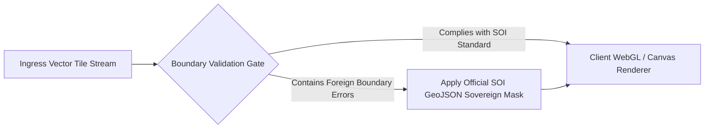
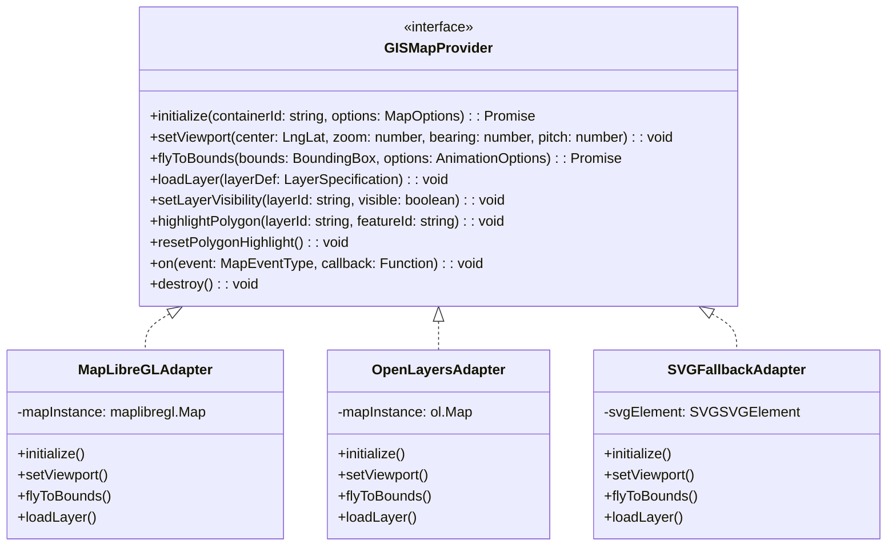
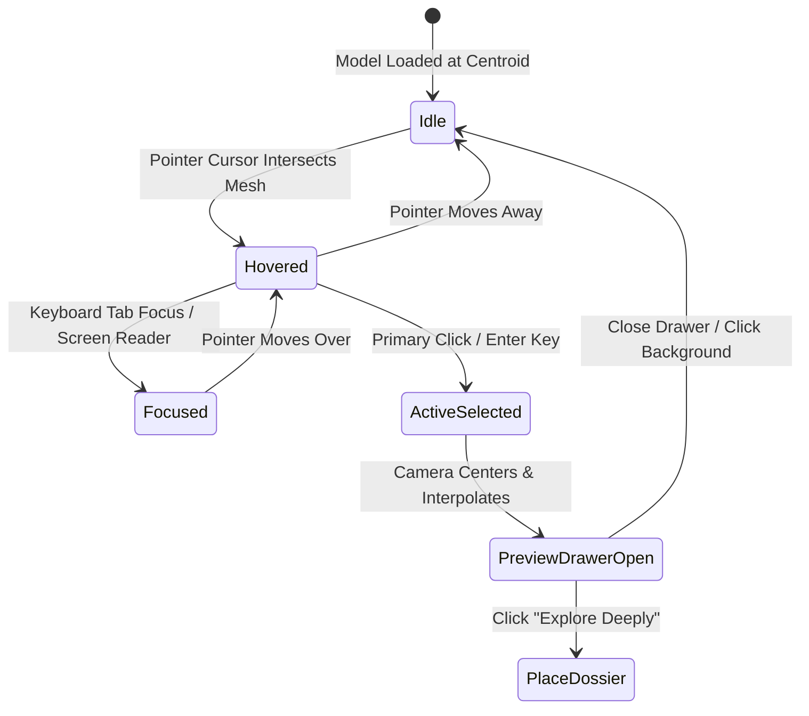
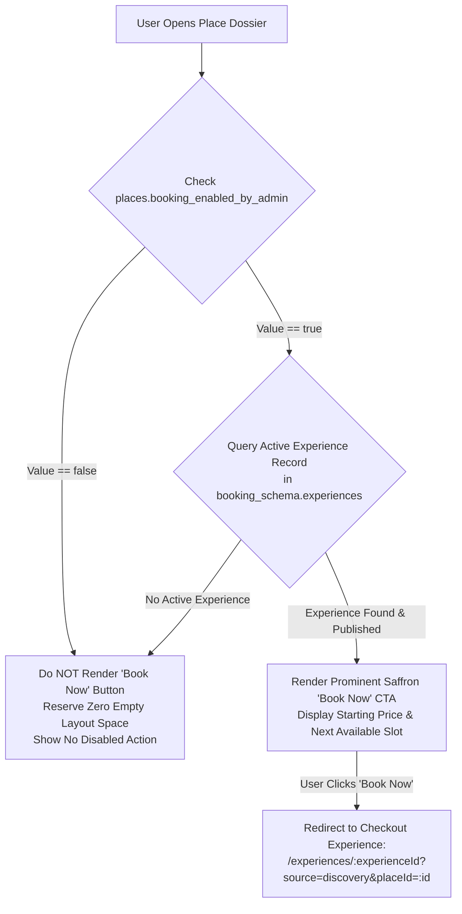
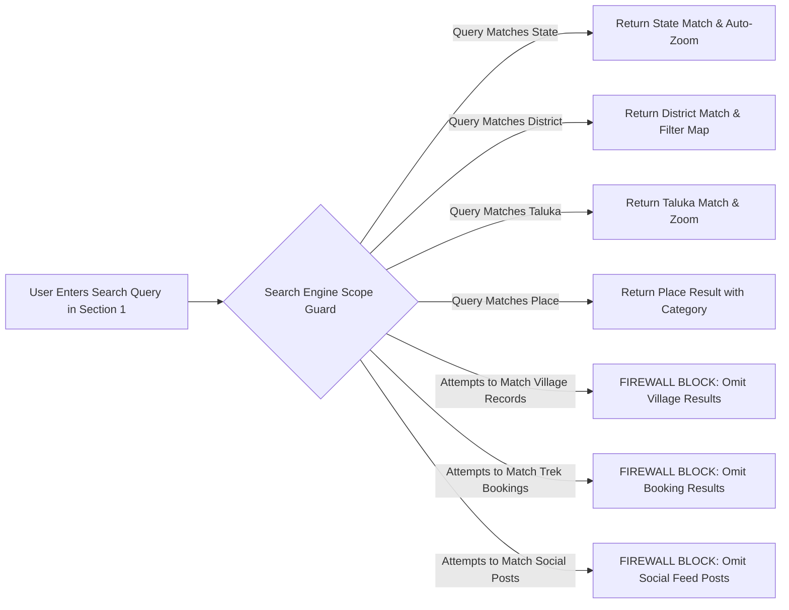

# Explore Bharat Safar — Bharat Discovery Engine Architectural Blueprint (Part 2 — Section 1)

- **Document Identifier**: EBS-BLU-41-BDE
- **Version**: 1.0.0
- **Classification**: Production Architectural Specification & System Blueprint
- **Domain**: Geographic Information Systems (GIS), Interactive Spatial Mapping & Cultural Heritage Discovery
- **Status**: Approved & Authoritative
- **Author**: Principal GIS Solutions Architect & Lead Spatial Software Engineer
- **Target Audience**: GIS Engineers, Fullstack Web Developers, WebGL/Three.js Specialists, Spatial Database Architects, Cartographic Compliance Leads
- **Related Documents**:
  - `02-specification.md` (Functional Specifications)
  - `03-architecture.md` (System Architecture)
  - `04-ui-ux.md` (UI/UX Specifications)
  - `09-api-design.md` (API Contracts)
  - `10-database-design.md` (Database Architecture)
  - `16-map-engine.md` (Spatial Specifications)
  - `17-animation.md` (Animation & Motion Design)
  - `26-business-rules.md` (Business Logic & Validation)
  - `40-enterprise-security-blueprint.md` (Security Architecture)
- **Last Updated**: 2026-09-28

---

## Executive Summary & Flagship Mission

The **Bharat Discovery Engine (BDE)** is the flagship module and visual center of **Explore Bharat Safar**. It is engineered to be the world's most immersive, interactive, culturally authoritative, and mathematically precise digital GIS map dedicated to the sovereign territory of Bharat.

The Discovery Engine is **not** a standard website homepage or commercial navigation map. Instead, it serves as an interactive spatial gateway that allows users to digitally traverse India across five strict hierarchical geographic tiers:

$$\text{India (National Overview)} \longrightarrow \text{State} \longrightarrow \text{District} \longrightarrow \text{Taluka} \longrightarrow \text{Place} \longrightarrow \text{Place Dossier} \longrightarrow \text{Experience Booking (Conditional)}$$

Users explore historical citadels, sacred shrines, biodiversity sanctuaries, mountain passes, and waterfalls before booking any expedition. Every interaction maintains high spatial precision, retina-quality rendering, fluid 60 FPS camera motion, and strict compliance with the **Survey of India** sovereign boundary standards.

```mermaid
graph TB
    subgraph NavigationHierarchy ["Hierarchical Geographical Navigation Pipeline"]
        L0["Level 0: Sovereign Bharat Map (Zoom: 4 - 6)<br/>28 States + 8 UTs + Islands + 3D Heritage Tokens"]
        L1["Level 1: State Geographic Dossier (Zoom: 7 - 9)<br/>State Polygons + Statistics + UNESCO + Featured Itineraries"]
        L2["Level 2: District Administrative Map (Zoom: 10 - 12)<br/>District Boundaries + Hill Shading + River Basins + Tourism Hubs"]
        L3["Level 3: Taluka Cultural Grid (Zoom: 13 - 15)<br/>Taluka Polygons + Road Networks + Trek Coordinates + Hidden Gems"]
        L4["Level 4: Verified Place Coordinates (Centroids)<br/>High-Density Categories + Spatial Clustering (Supercluster)"]
        L5["Level 5: Deep Place Dossier & Preview Drawer<br/>Hero Media + Architecture + Cultural Chronicles + Accessibility"]
        L6["Level 6: Conditional Experience Booking (Section 3)<br/>Admin Governed Toggle + Contextual Booking Redirection"]

        L0 -->|Select State Polygon| L1
        L1 -->|Select District Polygon| L2
        L2 -->|Select Taluka Polygon| L3
        L3 -->|Select Place Marker| L4
        L4 -->|Click Marker| L5
        L5 -->|Book Now Trigger (If Enabled)| L6
    end
```

---

## 1. Cartographic Integrity & National Sovereign Boundary Compliance

### 1.1 Survey of India Compliance Mandate
The Bharat Discovery Engine must strictly adhere to the official cartographic representations mandated by the **Survey of India (SOI)**, the **Ministry of Science and Technology**, and the **National Geospatial Policy of India**:
- **Jammu & Kashmir and Ladakh**: The complete sovereign extent of the Union Territory of Jammu & Kashmir and the Union Territory of Ladakh (including Gilgit-Baltistan, Aksai Chin, and the Siachen Glacier) must be rendered as integral, indisputable parts of Bharat.
- **Arunachal Pradesh**: The entire geographical territory of Arunachal Pradesh must be rendered without alteration or third-party dashed disputed borders.
- **Island Archipelagos**: The **Andaman and Nicobar Islands** in the Bay of Bengal and the **Lakshadweep Islands** in the Arabian Sea must be rendered with accurate spatial scaling, geographic orientation, and high-fidelity coastline vectors.
- **Sovereign Boundary Enforcement**: Any third-party vector tile service, open-source boundary repository (e.g., Natural Earth, OpenStreetMap), or international CDN tile provider that renders erroneous border depictions is intercepted, masked, and replaced with authoritative GeoJSON/TopoJSON layers approved by the Survey of India.



---

## 2. Enterprise GIS Engine & Provider-Agnostic Abstraction Layer

To ensure long-term architectural stability, vendor independence, and infrastructure resilience, the Bharat Discovery Engine decouples map rendering logic from specific third-party proprietary software through a unified **`GISMapProvider`** interface.

### 2.1 Multi-Engine Architecture
The platform supports hot-swapping between the following spatial engines without breaking application code or UI components:
1. **MapLibre GL JS**: Open-source, hardware-accelerated WebGL vector tile renderer (Primary Production Engine).
2. **OpenLayers**: Robust, enterprise GIS engine with native OGC, WMS, and WMTS protocol support.
3. **Deck.gl / Luma.gl**: High-performance GPU-powered spatial data visualization framework for ultra-dense point datasets.
4. **SVG / Canvas Fallback**: Pure vector fallback ensuring full map navigability for low-bandwidth rural connections or legacy mobile browsers lacking WebGL 2.0 support.



### 2.2 Supported Data Formats & Protocols
- **Mapbox Vector Tiles (MVT)**: Binary Google Protocol Buffers (`.pbf`) generated dynamically by PostGIS via `ST_AsMVT()`, cached at Cloudflare edge locations with a 24-hour TTL.
- **GeoJSON & TopoJSON**: High-precision topological boundary meshes compressed with TopoJSON quantization ($10^5$) to reduce polygon payload sizes by $> 80\%$.
- **PostGIS Spatial Layers**: Spatial geometries stored in PostgreSQL 16 using native `geometry(MultiPolygon, 4326)` and indexed using GiST (Generalized Search Tree).
- **Custom Overlays**: Dynamic canvas layers for historical trek routes, elevation contour relief, and monsoon rainfall radar overlays.

---

## 3. Miniature 3D Landmark Visualization Layer

Rather than relying on flat, generic map pins, the Bharat Discovery Engine introduces custom **Miniature 3D Landmark Tokens** placed at precise geographic coordinates.

### 3.1 3D Asset Pipeline & Specifications
- **Format**: glTF 2.0 / Binary GLB format with **Draco geometric mesh compression** and **KTX2 / Basis Universal texture compression**.
- **Polygon Budget**: Maximum $\le 3,500$ triangles per landmark to guarantee ultra-fast mobile loading and 60 FPS WebGL rendering.
- **Rendering Stack**: Three.js WebGL rendering context layered on top of the GIS canvas, synchronized with the map camera's projection and model-view matrices.
- **Drift-Free Spatial Anchoring**: Geographic coordinates $(\text{Latitude, Longitude, Altitude})$ are dynamically converted to Three.js world coordinates using Mercer Mercator projection matrix transformations on every camera frame.

### 3.2 Representative Landmark Catalog Across Bharat

```mermaid
graph TD
    Landmarks["Miniature 3D Landmark Catalog"]
    
    Landmarks --> North["Northern Bharat"]
    North --> DL["Dal Lake & Shikara (J&K)"]
    North --> GL["Gulmarg Gondola (J&K)"]
    North --> PG["Pangong Tso Stupa (Ladakh)"]
    North --> GT["Golden Temple (Punjab)"]
    North --> TM["Taj Mahal (Uttar Pradesh)"]
    North --> KV["Kashi Vishwanath Mandir (Uttar Pradesh)"]

    Landmarks --> West["Western Bharat"]
    West --> HM["Hawa Mahal (Rajasthan)"]
    West --> JF["Jaisalmer Golden Fort (Rajasthan)"]
    West --> SU["Statue of Unity (Gujarat)"]
    West --> RV["Rani ki Vav (Gujarat)"]
    West --> GI["Gateway of India (Maharashtra)"]
    West --> RF["Raigad Fort - Bastion of Swarajya (Maharashtra)"]
    West --> KT["Kailasa Temple - Monolithic Wonder (Maharashtra)"]
    West --> AC["Ajanta & Ellora Caves (Maharashtra)"]

    Landmarks --> South["Southern Bharat"]
    South --> HP["Hampi Stone Chariot (Karnataka)"]
    South --> MP["Mysore Palace (Karnataka)"]
    South --> BT["Brihadeeswara Temple (Tamil Nadu)"]
    South --> MT["Meenakshi Amman Temple (Tamil Nadu)"]
    South --> AB["Alleppey Traditional Kettuvallam (Kerala)"]

    Landmarks --> East["Eastern & North-Eastern Bharat"]
    East --> VM["Victoria Memorial (West Bengal)"]
    East --> KS["Konark Sun Temple Wheel (Odisha)"]
    East --> KZ["Kaziranga Rhinoceros Sanctuary (Assam)"]
```



### 3.3 Landmark Interactive State Machine

Every 3D landmark supports 8 distinct interaction states:



- **Hover Effect**: Continuous ambient hover animation powered by GSAP; landmark elevates along the Z-axis by $+12\text{px}$, casts a soft contact shadow, and triggers a subtle golden particle glow shader.
- **Contextual Tooltip**: Displays the official landmark name, heritage category badge, and brief historical epithet (e.g., *"Raigad Fort — Capital of the Maratha Empire"*).
- **Click Behavior (Non-Modal Preview Drawer)**:
  - Clicking a landmark **never** triggers an abrupt page navigation.
  - The map camera executes a smooth 1.2-second easing animation (`easeInOutCubic`) centering on the landmark coordinates.
  - A responsive non-modal preview drawer slides smoothly from the right (or bottom on mobile viewport), presenting:
    - Landmark Name & Verified Heritage Badge
    - Primary High-Resolution Hero Photograph (WebP/AVIF)
    - Administrative Location (Taluka, District, State)
    - Cultural Category (e.g., *Hill Fort*, *Rock-Cut Architecture*, *UNESCO Heritage*)
    - Curated Executive Summary (120–150 words)
    - Verified Community Rating & Review Counter
    - **"Explore Deeply" Primary Action**: Smoothly scrolls to the full place dossier or loads the complete place view.
    - **"Get Directions" Secondary Action**: Opens geographic routing interface.

---

## 4. Hierarchical Geographical Drilldown System

### 4.1 Level 0: Sovereign Bharat Map (National Overview)
- **Viewport Constraints**: Default center at $[20.5937^\circ\text{ N}, 78.9629^\circ\text{ E}]$, initial zoom level $4.5$, constrained between zoom $3.8$ and $6.0$.
- **Boundary Rendering**: Official Survey of India national boundary stroke ($2.5\text{px}$ solid saffron-gold `#D97706`), state boundary strokes ($1.0\text{px}$ semi-transparent `#94A3B8`), and multi-scale coastline polygon meshes.
- **Dynamic Choropleth Overlay**: Color-coded heatmaps indicating historical density, active trekking trails, or seasonal weather conditions.

### 4.2 Level 1: State Geographic Interaction & State Dossier
Clicking any State polygon triggers an atomic multi-step orchestration:
1. **Camera Zoom**: Smooth camera interpolation to the state's bounding box (`ST_Envelope`) using a bounding padding of $48\text{px}$.
2. **Visual Isolation**: Non-selected states smoothly diminish in visual contrast ($30\%$ opacity, desaturated).
3. **District Mesh Ingestion**: The state's internal district polygons load dynamically from the edge tile cache.
4. **State Dossier Ingestion**: The UI below the map dynamically renders the comprehensive State Dossier:
   - **Hero Visual Banner**: Ultra-wide 4K panoramic header featuring iconic state landscapes.
   - **State Overview**: State capital, official languages, population, geographic area, state animal/bird/tree emblems.
   - **Historical Chronicles**: Comprehensive history from ancient kingdoms to modern statehood.
   - **Cultural Identity**: Traditional folk dances, handlooms, indigenous festivals, culinary heritage, and musical traditions.
   - **Geographic & Climate Profile**: Major mountain ranges, river basins, climatic zones, and seasonal monsoon calendars.
   - **Curated Tourism Pillars**: UNESCO World Heritage sites, wildlife reserves, forts, pilgrimage circuits, hill stations, beaches, and waterfalls.
   - **Transit & Connectivity**: Nearest international/domestic airports, major railway junctions, national highways, and state transport hubs.
   - **Interactive District Selector**: Visual grid of all constituent districts linked to the Level 2 District Map.

### 4.3 Level 2: District Exploration Map & District Dossier
- Inside every State Dossier, a secondary synchronized GIS map focuses on the selected District.
- Features: District boundaries, district headquarters, terrain relief contours, primary river channels, and road arteries.
- **District Dossier Contents**:
  - Detailed district administrative history and collectorate profile.
  - Topographic profile (elevation ranges, annual rainfall, vegetation cover).
  - Tourism directory: major tourist hubs, pilgrimage centers, trekking base camps, and historical bastions.
  - Emergency Directory: District collectorate emergency helpline, district police control room, civil hospital lines, and forest department checkposts.
  - Constituent Taluka Grid linked to the Level 3 Taluka Map.

### 4.4 Level 3: Taluka Cultural Grid & Local Places
- High-resolution spatial breakdown showing sub-district (tehsil/taluka) boundaries.
- Features: Taluka headquarters, local connecting roads, village settlement clusters, seasonal water bodies, and elevation markers.
- **Taluka Dossier Contents**:
  - Demographic overview and rural economy highlights.
  - Comprehensive listing of important places and unmapped "Hidden Gems".
  - Basecamp guides for outdoor trails, village homestay contacts, and local transport options (state buses, shared jeeps).

### 4.5 Level 4: Verified Place Coordinates (Centroids)
- Individual places are rendered as high-density vector pins with category-specific SVG icon tokens.
- **Clustering Algorithm**: Client-side **Supercluster** dynamically aggregates dense place pins into clustered summary nodes at lower zoom levels, expanding into individual place pins as the user zooms into taluka level.

### 4.6 Level 5: Place Details Dossier
Every place page represents a comprehensive, rich digital monograph:
- **Hero Gallery**: Carousel supporting 4K photography, verified traveller photos, aerial drone imagery, and historical archival lithographs.
- **Architectural & Historical Monograph**: Construction date/era, ruling dynasty, architectural style (e.g., Dravidian, Nagara, Indo-Saracenic, Maratha Bastion), structural layout, and religious/cultural significance.
- **Travel Operations Matrix**:
  - Best season to visit and peak vs. off-peak months.
  - Official opening hours, weekly closure days, and entry ticketing schedules.
  - Vehicle parking capacity, approach road suitability (hatchback, SUV, 4WD only), and walking trail difficulty.
  - Universal accessibility audit: wheelchair ramps, accessible restrooms, audio guides, braille signage.
- **Cartographic Coordinates & Transit Matrix**: Exact latitude/longitude, elevation above sea level, distance to nearest town/city, road route step-by-step guidance, and external navigation links.
- **Emergency Protocols**: Nearest police station, local mountain rescue contacts, primary health center, venom treatment centers (for trekking zones), and forest department ranger outposts.

---

## 5. Super Admin Governed "Book Now" CTA Integration

To prevent user confusion and maintain enterprise data integrity, the commercial booking engine (Section 3) is decoupled from the geographical place dossier (Section 1).



### 5.1 Business Rules for Booking Integration
1. **Zero Layout Shift**: If booking is disabled, no empty container, placeholder skeleton, or disabled button is rendered in the DOM.
2. **Unidirectional Linkage**: The Place Dossier contains **no** booking state, inventory locks, or checkout logic. It merely passes the `experience_id` and referral telemetry to the Section 3 Booking Engine.
3. **Super Admin Authorization**: Only users with the `SUPER_ADMIN` role can toggle `booking_enabled_by_admin` in the administrative console.

---

## 6. Categorization System (Multidimensional & Extensible)

Every place belongs to one or more primary and secondary cultural categories. The category taxonomy is hierarchical, allowing multi-attribute filtering without database redesign.

| Category Slug | Display Name | Cultural / Operational Scope |
| :--- | :--- | :--- |
| `fort` | Fort & Citadel | Hill forts, sea forts, land bastions, fortified palaces. |
| `temple` | Sacred Temple | Ancient, medieval, and modern Hindu temples and sacred shrines. |
| `unesco-site` | UNESCO World Heritage | Formally inscribed cultural and natural World Heritage sites. |
| `waterfall` | Waterfall | Perennial and monsoon-active natural waterfalls. |
| `cave` | Rock-Cut Cave | Buddhist, Jain, and Hindu rock-cut cave complexes. |
| `wildlife` | Wildlife & Tiger Reserve | National parks, wildlife sanctuaries, and biosphere reserves. |
| `bird-sanctuary`| Bird Sanctuary | Wetland and forest bird observation reserves. |
| `lake` | Sacred Lake & Water Body| Glacial lakes, crater lakes, and historical reservoirs. |
| `river-ghat` | River & Sacred Ghat | Sacred confluences (Prayags), ghats, and river valleys. |
| `beach` | Coastal Beach | Pristine shores, cliffs, and coastal trekking trails. |
| `mountain-pass` | High-Altitude Pass | Himalayan and Sahyadri mountain passes (Ghats / La). |
| `trekking` | Trekking Trail | Day hikes, multi-day expeditions, and technical ascents. |
| `camping` | Wilderness Camping | Authorized lakeside, hilltop, and forest camping grounds. |
| `museum` | Museum & Archive | State, national, and private cultural museums. |
| `cuisine` | Culinary Heritage | Traditional regional food markets and authentic local dining hubs. |
| `hidden-gem` | Offbeat Hidden Gem | Undiscovered, low-footprint rural destinations. |

---

## 7. Isolated Spatial Search Engine (Section 1 Boundary)

The search bar positioned within the Bharat Discovery Engine operates under strict domain isolation:



### 7.1 Search Algorithms & Performance
- **Database Engine**: PostgreSQL Full-Text Search (`tsvector`, `tsquery`) paired with `pg_trgm` trigram similarity indexes.
- **Contextual Viewport Weighting**: Search results prioritize geographical entities situated within or closest to the user's currently active map bounding box:
  $$\text{Score} = \alpha \cdot \text{TrigramSimilarity}(q, \text{name}) + \beta \cdot \text{FullTextRank}(q, \text{description}) + \gamma \cdot \left(1 - \frac{\text{Distance}(\text{Centroid}, \text{ViewportCenter})}{\text{MaxDiagonal}}\right)$$
- **Response Ceiling**: Maximum latency $\le 85\text{ms}$ for search suggestions; results returned as lightweight GeoJSON feature collections.

---

## 8. Verified Community Reviews & Rating Engine

Every place features a granular, verified community review subsystem:
- **Scoring Scale**: Numeric ratings from $1.0$ to $5.0$ stars calculated to two decimal points.
- **Sub-Category Ratings**:
  - *Cleanliness & Maintenance*
  - *Accessibility & Road Condition*
  - *Crowd Density & Peacefulness*
  - *Photography & Scenic Beauty*
  - *Safety & Security (Particularly for solo and female travellers)*
- **Verified Traveller Badge**: Reviews authored by users with confirmed Section 3 completed expedition bookings for that location are stamped with a prominent green **Verified Explorer** cryptographic badge.
- **Moderation**: Automated profanity filtering, sentiment analysis, and anti-spam duplicate rate limiting.

---

## 9. Animation & High-Performance Motion Design

- **Map Camera Transitions**: Map transitions utilize MapLibre GL's native `flyTo` camera operator configured with custom cubic-bezier easing (`cubic-bezier(0.25, 1, 0.5, 1)`) over a duration of $1,200\text{ms}$ to $1,800\text{ms}$.
- **GSAP Timeline Orchestration**: State page scroll interactions, card reveals, and landmark hover elevations are managed via **GreenSock (GSAP)** timelines coupled with `ScrollTrigger`.
- **Hardware Acceleration**: All UI overlay panels and drawers use CSS `transform: translate3d()` and `will-change: transform` to ensure zero layout thrashing and maintain constant 60 FPS on high-refresh-rate mobile displays.

---

## 10. Comprehensive PostGIS Spatial Database Schema

```sql
CREATE SCHEMA IF NOT EXISTS geo_spatial_schema;
CREATE EXTENSION IF NOT EXISTS postgis;
CREATE EXTENSION IF NOT EXISTS pg_trgm;

-- States & Union Territories Table
CREATE TABLE geo_spatial_schema.states (
    id UUID PRIMARY KEY DEFAULT gen_random_uuid(),
    name VARCHAR(100) UNIQUE NOT NULL,
    iso_code VARCHAR(10) UNIQUE NOT NULL, -- e.g., 'IN-MH', 'IN-RJ'
    capital VARCHAR(100) NOT NULL,
    official_languages TEXT[] NOT NULL,
    boundary_geom geometry(MultiPolygon, 4326) NOT NULL,
    centroid_geom geometry(Point, 4326) NOT NULL,
    bounding_box geometry(Polygon, 4326) NOT NULL,
    overview_dossier JSONB NOT NULL,
    created_at TIMESTAMP WITH TIME ZONE DEFAULT CURRENT_TIMESTAMP NOT NULL,
    updated_at TIMESTAMP WITH TIME ZONE DEFAULT CURRENT_TIMESTAMP NOT NULL,
    deleted_at TIMESTAMP WITH TIME ZONE NULL
);

-- Districts Table
CREATE TABLE geo_spatial_schema.districts (
    id UUID PRIMARY KEY DEFAULT gen_random_uuid(),
    state_id UUID NOT NULL REFERENCES geo_spatial_schema.states(id) ON DELETE RESTRICT,
    name VARCHAR(100) NOT NULL,
    headquarters VARCHAR(100) NOT NULL,
    boundary_geom geometry(MultiPolygon, 4326) NOT NULL,
    centroid_geom geometry(Point, 4326) NOT NULL,
    emergency_directory JSONB NOT NULL,
    overview_dossier JSONB NOT NULL,
    created_at TIMESTAMP WITH TIME ZONE DEFAULT CURRENT_TIMESTAMP NOT NULL,
    updated_at TIMESTAMP WITH TIME ZONE DEFAULT CURRENT_TIMESTAMP NOT NULL,
    deleted_at TIMESTAMP WITH TIME ZONE NULL,
    CONSTRAINT uq_state_district UNIQUE (state_id, name)
);

-- Talukas / Tehsils Table
CREATE TABLE geo_spatial_schema.talukas (
    id UUID PRIMARY KEY DEFAULT gen_random_uuid(),
    district_id UUID NOT NULL REFERENCES geo_spatial_schema.districts(id) ON DELETE RESTRICT,
    name VARCHAR(100) NOT NULL,
    boundary_geom geometry(MultiPolygon, 4326) NOT NULL,
    centroid_geom geometry(Point, 4326) NOT NULL,
    overview_dossier JSONB NOT NULL,
    created_at TIMESTAMP WITH TIME ZONE DEFAULT CURRENT_TIMESTAMP NOT NULL,
    updated_at TIMESTAMP WITH TIME ZONE DEFAULT CURRENT_TIMESTAMP NOT NULL,
    deleted_at TIMESTAMP WITH TIME ZONE NULL,
    CONSTRAINT uq_district_taluka UNIQUE (district_id, name)
);

-- Hierarchical Categories Table
CREATE TABLE geo_spatial_schema.categories (
    id UUID PRIMARY KEY DEFAULT gen_random_uuid(),
    slug VARCHAR(100) UNIQUE NOT NULL,
    name VARCHAR(100) NOT NULL,
    icon_token VARCHAR(50) NOT NULL,
    parent_id UUID NULL REFERENCES geo_spatial_schema.categories(id) ON DELETE SET NULL,
    is_active BOOLEAN DEFAULT TRUE NOT NULL
);

-- Places Table (Heritage Sites, Forts, Waterfalls, Temples)
CREATE TABLE geo_spatial_schema.places (
    id UUID PRIMARY KEY DEFAULT gen_random_uuid(),
    taluka_id UUID NOT NULL REFERENCES geo_spatial_schema.talukas(id) ON DELETE RESTRICT,
    name VARCHAR(200) NOT NULL,
    slug VARCHAR(200) UNIQUE NOT NULL,
    short_description TEXT NOT NULL,
    full_monograph JSONB NOT NULL,
    location_coords geometry(Point, 4326) NOT NULL,
    elevation_meters INT,
    hero_image_url TEXT NOT NULL,
    gallery_image_urls TEXT[] DEFAULT '{}',
    panoramic_360_urls TEXT[] DEFAULT '{}',
    booking_enabled_by_admin BOOLEAN DEFAULT FALSE NOT NULL,
    associated_experience_id UUID NULL,
    average_rating NUMERIC(3, 2) DEFAULT 0.00 NOT NULL,
    total_reviews_count INT DEFAULT 0 NOT NULL,
    search_vector tsvector,
    created_at TIMESTAMP WITH TIME ZONE DEFAULT CURRENT_TIMESTAMP NOT NULL,
    updated_at TIMESTAMP WITH TIME ZONE DEFAULT CURRENT_TIMESTAMP NOT NULL,
    deleted_at TIMESTAMP WITH TIME ZONE NULL
);

-- Place Category M2M Mapping
CREATE TABLE geo_spatial_schema.place_categories (
    place_id UUID NOT NULL REFERENCES geo_spatial_schema.places(id) ON DELETE CASCADE,
    category_id UUID NOT NULL REFERENCES geo_spatial_schema.categories(id) ON DELETE CASCADE,
    is_primary BOOLEAN DEFAULT FALSE NOT NULL,
    PRIMARY KEY (place_id, category_id)
);

-- 3D Miniature Landmark Models
CREATE TABLE geo_spatial_schema.landmarks_3d (
    id UUID PRIMARY KEY DEFAULT gen_random_uuid(),
    place_id UUID UNIQUE NOT NULL REFERENCES geo_spatial_schema.places(id) ON DELETE CASCADE,
    model_name VARCHAR(150) NOT NULL,
    glb_asset_url TEXT NOT NULL,
    draco_compressed BOOLEAN DEFAULT TRUE NOT NULL,
    poly_count INT NOT NULL CHECK (poly_count <= 5000),
    bounding_box_scale NUMERIC(5, 2) DEFAULT 1.0 NOT NULL,
    geographic_anchor geometry(Point, 4326) NOT NULL,
    hover_tooltip_text VARCHAR(255) NOT NULL,
    created_at TIMESTAMP WITH TIME ZONE DEFAULT CURRENT_TIMESTAMP NOT NULL
);

-- Spatial GiST and Trigram Indexes
CREATE INDEX idx_states_geom ON geo_spatial_schema.states USING GIST(boundary_geom);
CREATE INDEX idx_districts_geom ON geo_spatial_schema.districts USING GIST(boundary_geom);
CREATE INDEX idx_talukas_geom ON geo_spatial_schema.talukas USING GIST(boundary_geom);
CREATE INDEX idx_places_coords ON geo_spatial_schema.places USING GIST(location_coords);
CREATE INDEX idx_landmarks_anchor ON geo_spatial_schema.landmarks_3d USING GIST(geographic_anchor);
CREATE INDEX idx_places_search ON geo_spatial_schema.places USING GIN(search_vector);
CREATE INDEX idx_places_name_trgm ON geo_spatial_schema.places USING GIN(name gin_trgm_ops);
```

---

## 11. RESTful & Vector Tile API Specifications

### 11.1 Dynamic Vector Tile Ingress Endpoint
- **Route**: `GET /api/v1/discovery/tiles/:z/:x/:y.pbf`
- **Output**: Protocol Buffer (`application/x-protobuf`)
- **Headers**: `Cache-Control: public, max-age=86400, s-maxage=604800, stale-while-revalidate=86400`
- **Database Function**:
  ```sql
  SELECT ST_AsMVT(tile, 'places', 4096, 'geom')
  FROM (
      SELECT id, name, slug, elevation_meters, ST_AsMVTGeom(location_coords, ST_TileEnvelope(z, x, y), 4096, 64, true) AS geom
      FROM geo_spatial_schema.places
      WHERE location_coords && ST_TileEnvelope(z, x, y) AND deleted_at IS NULL
  ) AS tile;
  ```

### 11.2 Hierarchical Data Fetching Endpoints
- `GET /api/v1/discovery/states`: Returns national state catalog with bounding boxes and centroid coordinates.
- `GET /api/v1/discovery/states/:stateSlug`: Returns complete State Dossier and district boundary geometries.
- `GET /api/v1/discovery/districts/:districtId`: Returns District profile, constituent talukas, and tourism hubs.
- `GET /api/v1/discovery/talukas/:talukaId`: Returns Taluka profile and high-density place centroids.
- `GET /api/v1/discovery/places/:placeSlug`: Returns deep Place Dossier, opening hours, accessibility, and booking status.
- `GET /api/v1/discovery/landmarks-3d`: Returns active 3D landmark GLB URLs and spatial anchor coordinates.

### 11.3 Scoped Spatial Search Endpoint
- **Route**: `GET /api/v1/discovery/search?q={query}&level={state|district|taluka|place}&bbox={minX,minY,maxX,maxY}`
- **Security Guard**: Intercepts and rejects requests containing village parameters or booking filters.
- **Response Format**:
  ```json
  {
    "status": "success",
    "query": "Kailasa",
    "totalMatches": 1,
    "results": [
      {
        "id": "e9b2c8a1-5d4f-4a3b-9c2e-8f1a2b3c4d5e",
        "name": "Kailasa Temple",
        "slug": "kailasa-temple-ellora",
        "category": "Rock-Cut Cave & UNESCO Heritage",
        "taluka": "Khuldabad",
        "district": "Chhatrapati Sambhajinagar",
        "state": "Maharashtra",
        "coordinates": { "latitude": 20.0238, "longitude": 75.1793 },
        "heroImageUrl": "https://cdn.explorebharatsafar.com/places/kailasa-hero.webp",
        "bookingEnabled": false
      }
    ]
  }
  ```

---

## 12. Non-Negotiable Business Rules for Discovery Engine

1. **Strict Sovereign Representation**: The platform shall under no circumstances render borders conflicting with the official Survey of India maps.
2. **Zero Commercial Clutter**: No commercial banner ads, third-party promotional popups, or external affiliate links shall ever appear on the Discovery Engine map canvas.
3. **Rigid Hierarchy Invariance**: Every place must belong to exactly one Taluka, every Taluka to one District, and every District to one State. Orphaned places are strictly rejected by database constraints.
4. **Conditional CTA Cleanliness**: The "Book Now" CTA shall render if and only if `booking_enabled_by_admin == true` and an active published experience is linked. If disabled, no placeholder element shall exist in the DOM.
5. **Absolute Search Quarantine**: Section 1 spatial search shall never surface village records, booking receipts, or traveller social media posts.
6. **Performance Guarantee**: The initial national map canvas must reach Interactive Time (TTI) within $\le 1.8\text{s}$ on standard 4G networks and render at a sustained 60 FPS during camera panning and zooming operations.
