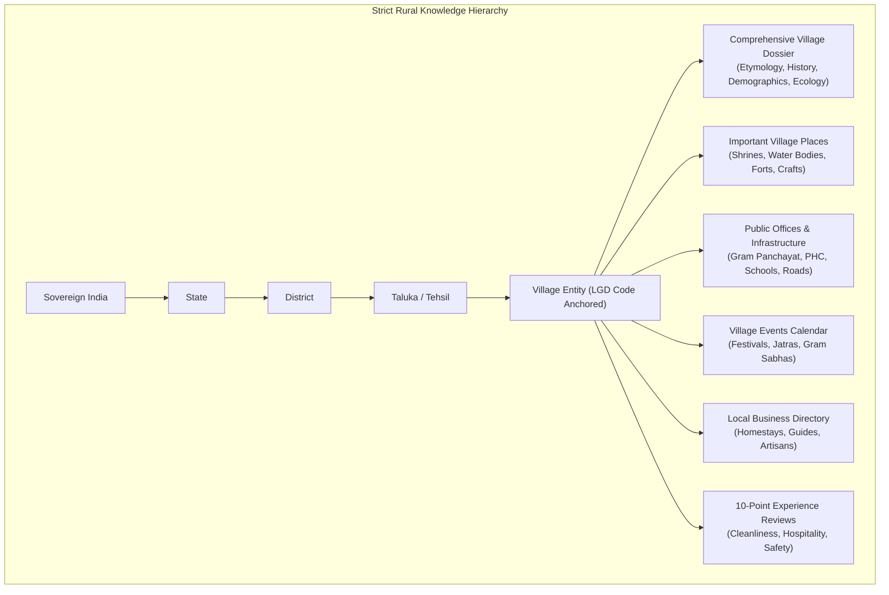
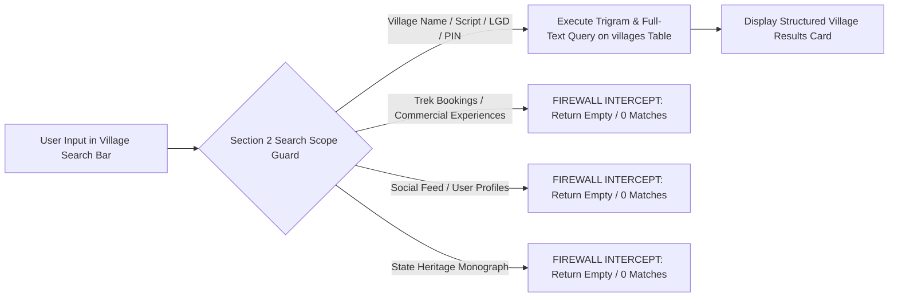
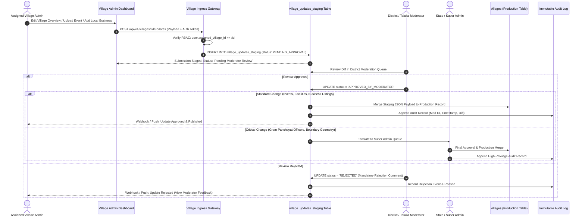

# Explore Bharat Safar — Village Information & Rural Bharat Knowledge System Blueprint (Part 3 — Section 2)

- **Document Identifier**: EBS-BLU-42-VKS
- **Version**: 1.0.0
- **Classification**: Production Architectural Specification & System Blueprint
- **Domain**: Rural Knowledge Infrastructure, Cadastral GIS, Decentralized Governance & Living Heritage
- **Status**: Approved & Authoritative
- **Author**: Principal Solutions Architect & Lead Spatial/E-Governance Software Engineer
- **Target Audience**: Fullstack Engineers, Database Architects, GIS Engineers, E-Governance Specialists, Moderation & Compliance Leads
- **Related Documents**:
  - `02-specification.md` (Functional Specifications)
  - `03-architecture.md` (System Architecture)
  - `04-ui-ux.md` (UI/UX Specifications)
  - `09-api-design.md` (API Contracts)
  - `10-database-design.md` (Database Architecture)
  - `13-admin-panel.md` (Administrative & Moderation Workflows)
  - `26-business-rules.md` (Business Logic & Validation)
  - `40-enterprise-security-blueprint.md` (Enterprise Security Blueprint)
  - `41-bharat-discovery-engine-blueprint.md` (Bharat Discovery Engine Blueprint)
- **Last Updated**: 2026-09-28

---

## Executive Summary & Rural Knowledge Mission

Section 2 of **Explore Bharat Safar** is dedicated to building the most comprehensive, structured, and culturally authoritative **Rural Bharat Knowledge System**. India is home to over 650,000 villages, each harboring unique historical narratives, traditional wisdom, ancient temples, artisanal crafts, and agricultural legacies that are rapidly disappearing from mainstream digital archives.

This platform is **not a passive directory**. It is an interactive, decentralized knowledge engine connected to the **Bharat Discovery Engine** (Section 1) while remaining an independent, sovereign functional module. It provides authorized village representatives (Village Admins) with tools to curate verified local information, while enforcing strict multi-tier editorial moderation, statutory privacy standards (DPDP Act 2023), and spatial accuracy.



---

## 1. Domain Isolation & Dedicated Village Search Engine

### 1.1 Strict Search Quarantine Mandate
The search engine embedded within Section 2 operates under strict domain boundaries to prevent contextual pollution:
- **Exclusivity**: It searches **only** village records (`rural_bharat_schema.villages`).
- **Quarantine**: Under no circumstances shall it return commercial trek bookings, traveller social posts, general articles, state tourist hubs, or payment receipts.
- **Search Key Attributes**:
  - Official Village English Name (e.g., *"Velhe"*, *"Hampi"*, *"Khonoma"*)
  - Local Language Script Name (e.g., Devanagari *"वेल्हे"*, Kannada *"ಹಂಪಿ"*)
  - Official 6-digit **Local Government Directory (LGD) Census Code**
  - Indian Postal **PIN Code**
  - Taluka and District hierarchical qualifiers



### 1.2 Search Interaction & Context Preservation Flow
When a user executes a search:
1. **Instant Predictive Lookup**: Debounced ($250\text{ms}$) type-ahead suggestions return matching villages with badges showing `Taluka`, `District`, `State`, and `Population`.
2. **Context-Preserving Results Card**: Clicking a search result smoothly transitions the user directly to the target village page without resetting the user's active geographic filters.
3. **Smooth Scroll Anchor**: If the search was initiated from within a parent district or taluka page, the view scrolls directly to the embedded Village Dossier panel.

---

## 2. Comprehensive Village Knowledge Dossier Architecture

Each village profile represents a multi-tabbed, deeply researched cultural and civic dossier organized into structured functional facets:

```mermaid
graph TD
    Dossier["Village Knowledge Dossier"]
    
    Dossier --> Tab1["1. Heritage & Identity"]
    Tab1 --> T1_1["Village Name Etymology & Meaning"]
    Tab1 --> T1_2["Historical Chronicles & Formation"]
    Tab1 --> T1_3["Traditional Arts & Indigenous Crafts"]
    Tab1 --> T1_4["Spoken Languages & Regional Dialects"]

    Dossier --> Tab2["2. Geography & Ecology"]
    Tab2 --> T2_1["Latitude, Longitude & Cadastral Boundary"]
    Tab2 --> T2_2["Altitude & Topography Relief"]
    Tab2 --> T2_3["Seasonal Water Sources & Rivers"]
    Tab2 --> T2_4["Agricultural Calendar & Primary Crops"]

    Dossier --> Tab3["3. Civic & Public Infrastructure"]
    Tab3 --> T3_1["Gram Panchayat & Administrative Office"]
    Tab3 --> T3_2["Primary Health Centre (PHC) & Sub-Centres"]
    Tab3 --> T3_3["Educational Institutions (Schools to ITIs)"]
    Tab3 --> T3_4["Road, Rail, Bus & Mobile Network Coverage"]

    Dossier --> Tab4["4. Community & Rural Tourism"]
    Tab4 --> T4_1["Sacred Shrines & Cultural Monuments"]
    Tab4 --> T4_2["Natural Attractions & Sacred Groves"]
    Tab4 --> T4_3["Verified Homestays & Farm Stays"]
    Tab4 --> T4_4["Annual Festivals & Cultural Jatras"]
```



### 2.1 Heritage, Etymology & Formation
- **Etymology**: Linguistic origin and cultural meaning of the village name (e.g., explaining Sanskrit, Dravidian, or tribal roots).
- **Historical Timeline**: Chronicles detailing the founding of the village, historical battles, visits by prominent saints or historical figures, and royal copper-plate inscriptions.
- **Traditional Crafts**: Indigenous handlooms, pottery, metal crafts, folk paintings, and agricultural traditions native to the village.

### 2.2 Geography, Soil & Agrarian Ecosystem
- **Cadastral GIS Geometry**: High-resolution polygonal boundary (`MultiPolygon`, SRID 4326) defining revenue village borders.
- **Ecological Indicators**: Elevation above sea level, annual rainfall patterns, perennial and seasonal rivers, traditional water harvesting structures (e.g., stepwells, bandharas, talaos).
- **Crop Matrix**: Kharif, Rabi, and Zaid crop schedules, indigenous seed varieties, and organic farming initiatives.

---

## 3. Provider-Agnostic Mapping & Navigation Integration

Every village profile incorporates a lightweight, responsive GIS map viewport:
- **Centroid & Boundary Rendering**: Displays the exact geographic center point and cadastral border polygon.
- **Transit & Distance Matrix**: Computes dynamic road distance and estimated driving duration from:
  - Nearest State Highway / National Highway
  - Nearest Railway Station
  - Nearest State Transport Bus Depot
  - Nearest Domestic / International Airport
- **Provider Independence**: Operates seamlessly across MapLibre GL, OpenLayers, Google Maps, or Leaflet via standard GeoJSON geometry exports.
- **One-Click Turn-by-Turn Navigation**: Generates universal deep links (`geo:lat,lng` and universal web intents) allowing explorers to launch external navigation tools.

---

## 4. Decentralized Administration & Multi-Tier Moderation Engine

To scale data collection across 650,000+ villages without compromising data veracity, Explore Bharat Safar implements a decentralized **Village Admin** model coupled with a **Zero Trust Editorial Workflow**.



### 4.1 Village Admin Role Constraints (Zero Privilege Leakage)
A user assigned the `VILLAGE_ADMIN` role operates under strict cryptographic and database constraints:
1. **Strict Spatial Boundary**: The admin can view and modify **only** the village explicitly linked to their user record (`user.assigned_village_id == target_village_id`). Any request targeting a different village returns `403 Forbidden`.
2. **Zero Commercial Access**: Village Admins have **zero** access to the commercial booking engine, customer payment ledgers, refund processors, or user personal profiles.
3. **No Direct Publishing**: Village Admins can **never** write directly to the production `villages` table. All writes are redirected to the staging ledger (`village_updates_staging`).

---

## 5. Public Administrative Transparency vs. DPDP Privacy Safeguards

The platform balances civic transparency with statutory compliance under the **Digital Personal Data Protection Act (DPDP Act 2023)**:

```mermaid
flowchart TD
    DataEntry["Information Ingestion Pipeline"] --> PrivacyClassifier{"Statutory Privacy Classifier"}
    
    PrivacyClassifier -->|Public Statutory Information| AllowPublic["Permit Display on Village Public Page"]
    AllowPublic --> Pub1["Gram Panchayat Office Building Address"]
    AllowPublic --> Pub2["Gram Sevak & Sarpanch Official Designation"]
    AllowPublic --> Pub3["Primary Health Centre Official Phone"]
    AllowPublic --> Pub4["Public Library & School Timings"]

    PrivacyClassifier -->|Private Personal Information (PII)| BlockPrivate["STRICT SANITIZATION / MASKING"]
    BlockPrivate --> Priv1["Prohibit Personal Residential Addresses of Officers"]
    BlockPrivate --> Priv2["Prohibit Personal Mobile Numbers (Without Written Consent)"]
    BlockPrivate --> Priv3["Strictly Ban Aadhaar, Voter ID & Bank Account Numbers"]
    BlockPrivate --> Priv4["Mask Emergency Responder Personal Numbers via Cloud PBX Proxy"]
```

### 5.1 Rules for Public Information
- **Statutory Transparency**: Gram Panchayat office hours, government helpline contacts, Primary Health Centre public lines, and official village development committee designations are verified and displayed.
- **Privacy Hardening**: Personal mobile numbers of local villagers, women's self-help group members, or youth club participants are strictly excluded unless verified written consent is captured and archived under DPDP compliance workflows.

---

## 6. Important Village Places & Sacred Shrines Subsystem

Every village maintains a structured inventory of culturally and geographically significant sites:
- **Sacred Architecture**: Ancient and medieval temples, historic mosques, churches, gurudwaras, Buddhist/Jain monasteries, and local village guardian shrines (*Gramdevata Mandir*).
- **Natural Heritage**: Sacred groves (*Devrai / Kovilkadu*), perennial springs, ancient banyan trees, waterfalls, and scenic river confluences.
- **Civic & Social Infrastructure**: Primary and secondary schools, junior colleges, Anganwadis, primary health clinics, public libraries, and weekly village bazaar (*Aathwade Bajar*) grounds.
- **Commemoration & Memorials**: Freedom fighter memorials (*Hutatma Smarak*), historical stepwells, watchtowers, and folk hero stone pillars (*Virgal*).

---

## 7. Media & Photo Management Pipeline

All visual assets uploaded by Village Admins and verified visitors undergo automated security and privacy quarantine:
1. **Pre-Signed Upload Ingress**: Media is uploaded directly to a private S3 quarantine bucket via temporary pre-signed URLs.
2. **Magic Byte & Antivirus Inspection**: ClamAV scans the binary payload for embedded malware and confirms file signatures (JPEG, PNG, WebP).
3. **EXIF Privacy Sanitization**: The ingestion pipeline strips all embedded EXIF metadata (camera serial numbers, precise residential GPS tags) using `Sharp` to protect villager privacy before public serving.
4. **Automated Multi-Resolution Generation**: Sharp generates responsive WebP and AVIF variants (Thumbnail: $320\text{px}$, Card: $720\text{px}$, Hero: $1920\text{px}$).

---

## 8. Village Events & Community Calendar

Village Admins may publish and manage localized community event calendars:
- **Event Types**:
  - *Cultural & Folk Festivals*: Annual Jatras, temple chariot processions, harvest festivals (Bihu, Pongal, Baisakhi, Onam).
  - *Civic & Democratic*: Statutory Gram Sabha meetings, public hearings, developmental surveys.
  - *Eco & Environmental*: Tree plantation drives, watershed conservation shramdaan, village river cleanup initiatives.
  - *Traditional Sports*: Wrestling bouts (*Kushti*), Kabaddi tournaments, rural marathon runs.
- **Event Metadata**: Title, description, start/end timestamps, exact venue coordinates, organizing committee contact, status (`UPCOMING`, `ONGOING`, `CONCLUDED`, `CANCELLED`).

---

## 9. Local Business Directory & Rural Micro-Enterprise

To stimulate sustainable rural tourism and empower rural entrepreneurs, village pages feature a verified local enterprise directory:
- **Permitted Listing Categories**:
  - *Homestays & Rural Agro-Stays*
  - *Local Traditional Guides & Storytellers*
  - *Artisanal Craft & Handloom Workshops*
  - *Village Dhabas & Traditional Food Outlets*
  - *Bicycle / Tractor / Jeep Rentals*
  - *Organic Produce & Farmer Direct Stalls*
- **Verification Verification**: Listings require validation from the Village Admin or District Moderator before activation.

---

## 10. 10-Point Multidimensional Village Review Engine

Explorers who have visited the village can submit reviews across 10 distinct qualitative dimensions:

| Review Dimension | Rating Range | Evaluation Criteria |
| :--- | :--- | :--- |
| **1. Cleanliness & Sanitation** | $1.0 - 5.0$ | Waste management, public toilet hygiene, street cleanliness. |
| **2. Rural Hospitality** | $1.0 - 5.0$ | Warmth, welcoming nature of locals, community assistance. |
| **3. Nature & Ecology** | $1.0 - 5.0$ | Green cover, unpolluted air, scenic natural landscapes. |
| **4. Safety & Security** | $1.0 - 5.0$ | Safe environment for solo travellers, families, and female explorers. |
| **5. Local Culinary Heritage** | $1.0 - 5.0$ | Authenticity, hygiene, and uniqueness of traditional village food. |
| **6. Road Accessibility** | $1.0 - 5.0$ | Quality of approach roads, public bus availability, parking. |
| **7. Photography Potential** | $1.0 - 5.0$ | Scenic vistas, architectural heritage, cultural vibrancy. |
| **8. Cultural Preservation** | $1.0 - 5.0$ | Preservation of traditional crafts, music, dialect, and rituals. |
| **9. Outdoor Adventure** | $1.0 - 5.0$ | Hiking trails, stream crossings, bird watching, camping opportunities. |
| **10. Overall Travel Experience** | $1.0 - 5.0$ | Composite holistic experience of the village exploration. |

---

## 11. Complete PostgreSQL & PostGIS Database Schema

```sql
CREATE SCHEMA IF NOT EXISTS rural_bharat_schema;
CREATE EXTENSION IF NOT EXISTS postgis;
CREATE EXTENSION IF NOT EXISTS pg_trgm;

-- Master Villages Table
CREATE TABLE rural_bharat_schema.villages (
    id UUID PRIMARY KEY DEFAULT gen_random_uuid(),
    taluka_id UUID NOT NULL REFERENCES geo_spatial_schema.talukas(id) ON DELETE RESTRICT,
    lgd_code VARCHAR(20) UNIQUE NOT NULL, -- Census / Local Government Directory Code
    name_en VARCHAR(150) NOT NULL,
    name_local VARCHAR(150) NOT NULL,
    pincode VARCHAR(10) NOT NULL,
    centroid geometry(Point, 4326) NOT NULL,
    cadastral_boundary geometry(MultiPolygon, 4326) NULL,
    population_count INT DEFAULT 0,
    elevation_meters INT,
    hero_image_url TEXT,
    gallery_image_urls TEXT[] DEFAULT '{}',
    approval_status VARCHAR(50) DEFAULT 'PUBLISHED' NOT NULL,
    assigned_admin_user_id UUID NULL REFERENCES identity_schema.users(id),
    average_rating NUMERIC(3, 2) DEFAULT 0.00 NOT NULL,
    total_reviews INT DEFAULT 0 NOT NULL,
    search_vector tsvector,
    created_at TIMESTAMP WITH TIME ZONE DEFAULT CURRENT_TIMESTAMP NOT NULL,
    updated_at TIMESTAMP WITH TIME ZONE DEFAULT CURRENT_TIMESTAMP NOT NULL,
    deleted_at TIMESTAMP WITH TIME ZONE NULL
);

-- Comprehensive Village Knowledge Profile
CREATE TABLE rural_bharat_schema.village_profiles (
    id UUID PRIMARY KEY DEFAULT gen_random_uuid(),
    village_id UUID UNIQUE NOT NULL REFERENCES rural_bharat_schema.villages(id) ON DELETE CASCADE,
    etymology_meaning TEXT,
    formation_history TEXT,
    traditional_arts TEXT[],
    primary_crops TEXT[],
    water_sources TEXT[],
    connectivity_profile JSONB NOT NULL, -- road, rail, bus, mobile network
    healthcare_profile JSONB NOT NULL,   -- PHC, sub-centres, ambulance
    education_profile JSONB NOT NULL,    -- primary, secondary, ITI, libraries
    civic_infrastructure JSONB NOT NULL, -- electricity, sanitation, waste
    updated_at TIMESTAMP WITH TIME ZONE DEFAULT CURRENT_TIMESTAMP NOT NULL
);

-- Gram Panchayat Administrative Entity
CREATE TABLE rural_bharat_schema.village_panchayats (
    id UUID PRIMARY KEY DEFAULT gen_random_uuid(),
    village_id UUID UNIQUE NOT NULL REFERENCES rural_bharat_schema.villages(id) ON DELETE CASCADE,
    gram_panchayat_name VARCHAR(150) NOT NULL,
    office_address TEXT NOT NULL,
    office_phone VARCHAR(50),
    office_email VARCHAR(100),
    office_timings VARCHAR(100),
    sarpanch_name VARCHAR(150),
    gram_sevak_name VARCHAR(150),
    public_services_list TEXT[],
    updated_at TIMESTAMP WITH TIME ZONE DEFAULT CURRENT_TIMESTAMP NOT NULL
);

-- Important Places within Village
CREATE TABLE rural_bharat_schema.village_important_places (
    id UUID PRIMARY KEY DEFAULT gen_random_uuid(),
    village_id UUID NOT NULL REFERENCES rural_bharat_schema.villages(id) ON DELETE CASCADE,
    name VARCHAR(200) NOT NULL,
    category VARCHAR(100) NOT NULL, -- 'TEMPLE', 'SHRINE', 'WATERFALL', 'SCHOOL', 'MARKET', 'HISTORIC'
    description TEXT NOT NULL,
    coordinates geometry(Point, 4326) NOT NULL,
    image_urls TEXT[] DEFAULT '{}',
    is_verified BOOLEAN DEFAULT TRUE NOT NULL,
    created_at TIMESTAMP WITH TIME ZONE DEFAULT CURRENT_TIMESTAMP NOT NULL
);

-- Village Community Events Table
CREATE TABLE rural_bharat_schema.village_events (
    id UUID PRIMARY KEY DEFAULT gen_random_uuid(),
    village_id UUID NOT NULL REFERENCES rural_bharat_schema.villages(id) ON DELETE CASCADE,
    title VARCHAR(200) NOT NULL,
    description TEXT NOT NULL,
    event_type VARCHAR(100) NOT NULL, -- 'FESTIVAL', 'GRAM_SABHA', 'SPORTS', 'ENVIRONMENT'
    start_date DATE NOT NULL,
    end_date DATE NOT NULL,
    location_details VARCHAR(255) NOT NULL,
    organizer_info VARCHAR(200) NOT NULL,
    gallery_urls TEXT[] DEFAULT '{}',
    status VARCHAR(50) DEFAULT 'UPCOMING' NOT NULL,
    created_at TIMESTAMP WITH TIME ZONE DEFAULT CURRENT_TIMESTAMP NOT NULL
);

-- Local Rural Enterprise Directory
CREATE TABLE rural_bharat_schema.village_businesses (
    id UUID PRIMARY KEY DEFAULT gen_random_uuid(),
    village_id UUID NOT NULL REFERENCES rural_bharat_schema.villages(id) ON DELETE CASCADE,
    business_name VARCHAR(200) NOT NULL,
    category VARCHAR(100) NOT NULL, -- 'HOMESTAY', 'GUIDE', 'RESTAURANT', 'CRAFT', 'RENTAL'
    contact_person VARCHAR(150) NOT NULL,
    contact_phone VARCHAR(50) NOT NULL,
    address_description TEXT NOT NULL,
    price_range VARCHAR(50),
    photo_urls TEXT[] DEFAULT '{}',
    verification_status VARCHAR(50) DEFAULT 'VERIFIED' NOT NULL,
    created_at TIMESTAMP WITH TIME ZONE DEFAULT CURRENT_TIMESTAMP NOT NULL
);

-- Staging Queue for Decentralized Village Updates
CREATE TABLE rural_bharat_schema.village_updates_staging (
    id UUID PRIMARY KEY DEFAULT gen_random_uuid(),
    village_id UUID NOT NULL REFERENCES rural_bharat_schema.villages(id) ON DELETE CASCADE,
    submitted_by UUID NOT NULL REFERENCES identity_schema.users(id),
    update_type VARCHAR(100) NOT NULL, -- 'PROFILE_EDIT', 'FACILITY_UPDATE', 'EVENT_CREATE', 'BUSINESS_ADD'
    payload JSONB NOT NULL,
    status VARCHAR(50) DEFAULT 'PENDING_APPROVAL' NOT NULL, -- 'PENDING_APPROVAL', 'APPROVED', 'REJECTED'
    reviewed_by UUID NULL REFERENCES identity_schema.users(id),
    review_comments TEXT,
    submitted_at TIMESTAMP WITH TIME ZONE DEFAULT CURRENT_TIMESTAMP NOT NULL,
    reviewed_at TIMESTAMP WITH TIME ZONE NULL
);

-- 10-Point Multidimensional Reviews
CREATE TABLE rural_bharat_schema.village_reviews (
    id UUID PRIMARY KEY DEFAULT gen_random_uuid(),
    village_id UUID NOT NULL REFERENCES rural_bharat_schema.villages(id) ON DELETE CASCADE,
    user_id UUID NOT NULL REFERENCES identity_schema.users(id) ON DELETE RESTRICT,
    ratings JSONB NOT NULL, -- { cleanliness: 5, hospitality: 5, nature: 5, safety: 4, food: 4, ... }
    average_score NUMERIC(3, 2) NOT NULL CHECK (average_score >= 1.0 AND average_score <= 5.0),
    review_text TEXT NOT NULL,
    photo_urls TEXT[] DEFAULT '{}',
    is_verified_traveller BOOLEAN DEFAULT FALSE NOT NULL,
    moderation_status VARCHAR(50) DEFAULT 'PENDING' NOT NULL, -- 'PENDING', 'APPROVED', 'REJECTED'
    created_at TIMESTAMP WITH TIME ZONE DEFAULT CURRENT_TIMESTAMP NOT NULL
);

-- Spatial and Performance Indexes
CREATE INDEX idx_villages_centroid ON rural_bharat_schema.villages USING GIST(centroid);
CREATE INDEX idx_villages_boundary ON rural_bharat_schema.villages USING GIST(cadastral_boundary);
CREATE INDEX idx_villages_lgd ON rural_bharat_schema.villages(lgd_code);
CREATE INDEX idx_villages_pincode ON rural_bharat_schema.villages(pincode);
CREATE INDEX idx_villages_taluka ON rural_bharat_schema.villages(taluka_id) WHERE deleted_at IS NULL;
CREATE INDEX idx_villages_search ON rural_bharat_schema.villages USING GIN(search_vector);
CREATE INDEX idx_villages_name_trgm ON rural_bharat_schema.villages USING GIN(name_en gin_trgm_ops);
CREATE INDEX idx_villages_staging_status ON rural_bharat_schema.village_updates_staging(status);
```

---

## 12. RESTful API Contracts for Rural Knowledge System

### 12.1 Dedicated Village Search Endpoint
- **Route**: `GET /api/v1/villages/search?q={query}&talukaId={uuid}&pincode={code}&limit=20`
- **Isolation Enforcement**: Intercepts and denies queries searching for non-village entities.
- **Response Structure**:
  ```json
  {
    "status": "success",
    "query": "Velhe",
    "totalMatches": 1,
    "results": [
      {
        "id": "c7a8b9d0-1e2f-4a5b-9c8d-7e6f5a4b3c2d",
        "nameEnglish": "Velhe",
        "nameLocal": "वेल्हे",
        "lgdCode": "556789",
        "pincode": "412212",
        "taluka": "Velhe",
        "district": "Pune",
        "state": "Maharashtra",
        "population": 3840,
        "heroImageUrl": "https://cdn.explorebharatsafar.com/villages/velhe-hero.webp",
        "centroid": { "latitude": 18.2975, "longitude": 73.6339 }
      }
    ]
  }
  ```

### 12.2 Village Profile Ingress Endpoints
- `GET /api/v1/villages/:id`: Returns comprehensive Village Dossier, Gram Panchayat data, ecology, and amenities.
- `GET /api/v1/villages/:id/places`: Returns all verified historical shrines, natural wonders, and civic points.
- `GET /api/v1/villages/:id/events`: Returns upcoming and active community events.
- `GET /api/v1/villages/:id/businesses`: Returns verified homestays, local guides, and artisanal workshops.
- `GET /api/v1/villages/:id/reviews`: Returns paginated, approved 10-point reviews.

### 12.3 Village Admin Staging Endpoints
- `POST /api/v1/villages/:id/updates`: Submits change proposal to staging queue (RBAC enforced).
- `GET /api/v1/villages/moderation/queue`: District/Taluka Moderator review feed of pending updates.
- `POST /api/v1/villages/moderation/:stagingId/review`: Approves or rejects staged update with mandatory commentary.

---

## 13. Non-Negotiable Business Rules for Rural Knowledge System

1. **Hierarchy Integrity**: Every Village belongs to exactly one Taluka, every Taluka to one District, and every District to one State.
2. **Search Quarantine**: Village search shall never return commercial experiences, hotel bookings, or social posts.
3. **Decentralized RBAC Isolation**: A Village Admin is strictly restricted to their designated village. Any cross-village edit attempt shall be rejected with `403 Forbidden` and logged in security audits.
4. **Staging Mandate**: No Village Admin can modify the production village database directly; all updates must traverse the staging queue and receive human moderator approval.
5. **DPDP Compliance**: Personal residential addresses, unconsented mobile numbers, and national identity numbers (Aadhaar, PAN) shall never be published.
6. **Immutable Audit Trails**: Every stage in the moderation lifecycle (submission, review, rejection, approval, production merge) generates a tamper-evident audit record.
