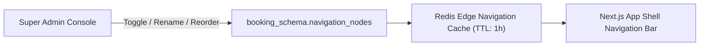
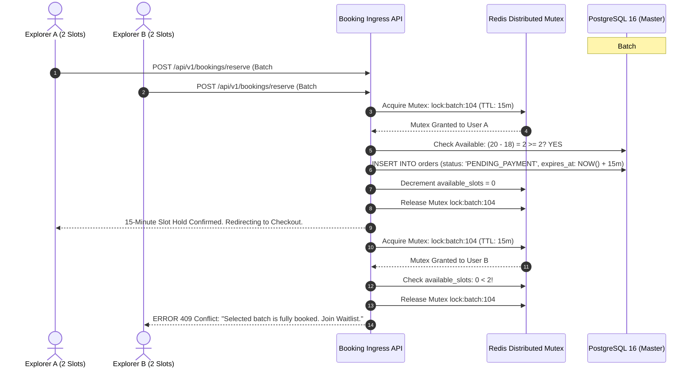
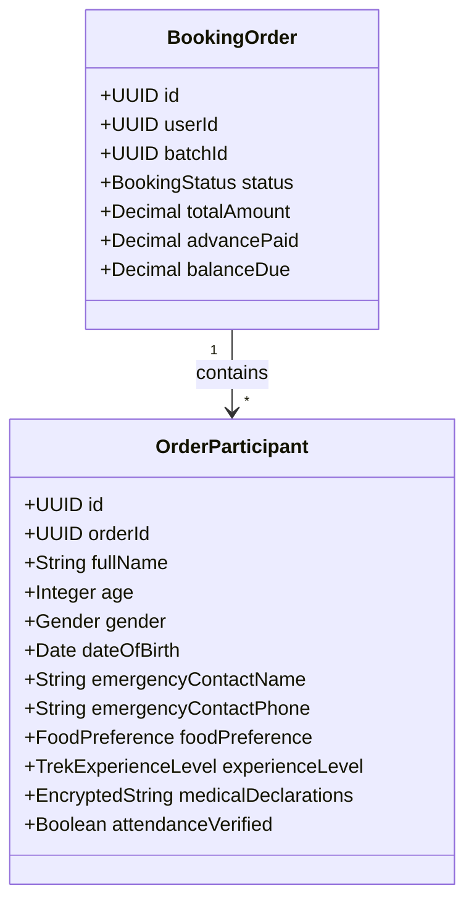
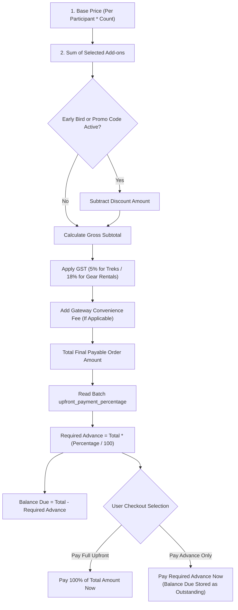
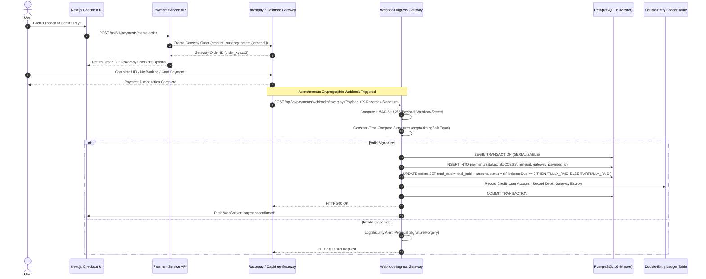
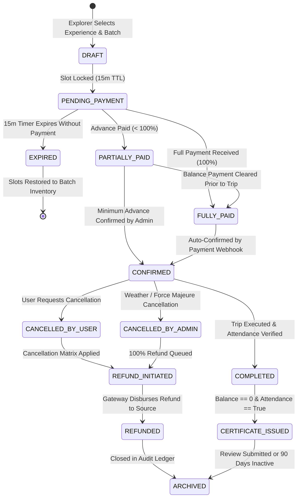
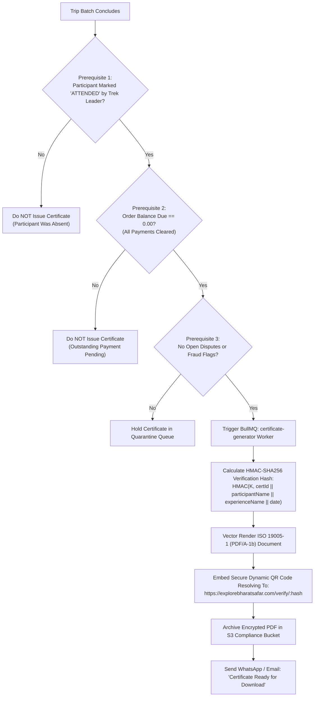

# Explore Bharat Safar — Travel Booking, Adventure & Experience Management System Blueprint (Part 4 — Section 3)

- **Document Identifier**: EBS-BLU-43-BKG
- **Version**: 1.0.0
- **Classification**: Production Architectural Specification & System Blueprint
- **Domain**: Fintech-Integrated Travel Booking, Adventure Inventory & Experience Management
- **Status**: Approved & Authoritative
- **Author**: Principal FinTech & Travel Systems Architect, Lead Cloud Systems Engineer
- **Target Audience**: Fullstack Engineers, Payment Gateway Engineers, Distributed Systems Architects, Inventory & Booking Operations Leads, Compliance Officers
- **Related Documents**:
  - `02-specification.md` (Functional Specifications)
  - `03-architecture.md` (System Architecture)
  - `09-api-design.md` (API Specifications)
  - `10-database-design.md` (Database Architecture)
  - `14-booking-system.md` (Booking System Design)
  - `20-certificate-system.md` (Certificate Engine Design)
  - `21-payment-system.md` (Payment Engine Design)
  - `26-business-rules.md` (Business Logic & Validation)
  - `40-enterprise-security-blueprint.md` (Enterprise Security Blueprint)
  - `41-bharat-discovery-engine-blueprint.md` (Bharat Discovery Engine Blueprint)
- **Last Updated**: 2026-09-28

---

## Executive Summary & Flagship Mission

Section 3 represents the central transactional engine of **Explore Bharat Safar**. It is engineered as an enterprise-grade, highly scalable travel booking platform capable of orchestrating diverse travel experiences across India: high-altitude Himalayan and Sahyadri treks, historical heritage walks, rural village immersions, wildlife safaris, photography expeditions, wilderness camping, youth leadership bootcamps, and cultural artisan workshops.

The booking engine bridges the geographical exploration of the **Bharat Discovery Engine** (Section 1) and the cultural archives of the **Rural Knowledge System** (Section 2) with real-world travel execution. It enforces millisecond-level distributed slot reservation concurrency, multi-tier partial payment schedules, cryptographic payment verification, automated attendance tracking, and tamper-evident digital certificate generation.

```mermaid
graph TB
    subgraph BookingPlatformFlow ["End-to-End Experience & Booking Lifecycle"]
        Discover["1. Experience Discovery & Dynamic Catalog<br/>(Filter by Type, Difficulty, Season, State)"]
        BatchSel["2. Batch & Date Selection<br/>(Real-Time Redis Inventory Matrix)"]
        SlotLock["3. Distributed Concurrency Slot Lock<br/>(Redis Redlock Mutex — 15m TTL)"]
        PartAdd["4. Participant Roster & Medical Consent<br/>(DPDP Act Encrypted Medical Profiles)"]
        AddonSel["5. Configurable Add-ons & Upgrades<br/>(Gear Rentals, Transport, Private Tents)"]
        PriceCalc["6. Financial Engine & Upfront % Calculation<br/>(Taxes, Early Bird, Advance vs Balance)"]
        PayGateway["7. Double-Entry Payment Processing<br/>(Razorpay / Cashfree HMAC Webhook)"]
        ConfirmOrder["8. Booking Confirmed & Real-Time Sync<br/>(Email / WhatsApp / PDF Invoicing)"]
        TripExecution["9. Trip Execution & On-Trail Operations<br/>(Trek Leader Offline App & Roster)"]
        Attendance["10. Attendance Verification & Clearance<br/>(Attendance Marked + Balance Cleared)"]
        CertIssue["11. Automated Tamper-Evident Certificate<br/>(HMAC-SHA256 Hash + PDF/A-1b QR Code)"]
        ReviewCollect["12. Verified Participant 9-Point Review<br/>(Guide, Safety, Logistics, Value)"]

        Discover --> BatchSel --> SlotLock --> PartAdd --> AddonSel --> PriceCalc --> PayGateway
        PayGateway --> ConfirmOrder --> TripExecution --> Attendance --> CertIssue --> ReviewCollect
    end
```



---

## 1. Dynamic Catalog Structure & Database-Driven Navigation

To ensure continuous business agility without requiring codebase recompilation or redeployment, the booking portal's navigation taxonomy is completely database-driven and configurable from the Super Admin console.

### 1.1 Configurable Experience Categories & Navigation Hierarchy
The system supports dynamic ordering, renaming, enabling, and disabling of experience verticals:
- **Trekking & Mountaineering**: Beginner day treks, moderate fort treks, high-altitude Himalayan expeditions, monsoon waterfall treks.
- **Heritage & Historical Walks**: Royal Maratha citadels, UNESCO World Heritage monuments, ancient temple architecture tours.
- **Rural & Village Stays**: Authentic agricultural homestays, rural craft immersions, tribal lifestyle programs.
- **Wildlife & Nature Sanctuaries**: Tiger reserve jeep safaris, wetland bird watching, sacred grove botanical explorations.
- **Demographic & Special Interest**: Senior citizen gentle tours, family-friendly camping, photography masterclasses, women-only expeditions.
- **Institutional & Corporate**: School environmental camps, university field research, corporate team-building retreats.



---

## 2. Comprehensive Experience Dossier Specification

Every published travel experience provides complete, legally binding operational details:
- **Hero Visual Section**: Multi-angle 4K photography, aerial drone video teasers, and elevation profile infographics.
- **Core Parameters**: Experience Category, Physical Difficulty Rating (*Easy*, *Moderate*, *Difficult*, *Challenging*), Maximum Altitude ($m/\text{ft}$), Total Trek Distance ($\text{km}$), and Duration ($\text{Days/Nights}$).
- **Day-Wise Detailed Itinerary**: Minute-by-minute reporting times, transit vehicle details, trail elevation gain/loss charts, meal inclusions (*Breakfast*, *Lunch*, *Hi-Tea*, *Dinner*), and accommodation types (*Alpine Tents*, *Village Homestay*, *Eco-Lodge*).
- **Logistics & Safety Framework**:
  - Meeting Point with precise GPS coordinates and Google Maps routing link.
  - Mandatory reporting time and maximum grace buffer ($15\text{ minutes}$).
  - Mandatory Gear & Packing Checklist (categorized into *Mandatory*, *Recommended*, and *Prohibited* items).
  - Medical Eligibility: Prohibited medical conditions (e.g., severe asthma, untreated cardiovascular ailments), mandatory doctor fitness certificate threshold for expeditions $> 12,000\text{ ft}$.
- **Commercial & Legal Policies**: Detailed day-based cancellation penalty matrices and non-refundable deposit terms.

---

## 3. High-Concurrency Real-Time Inventory & Distributed Mutex (Redlock)

In high-demand booking scenarios (e.g., peak Diwali, monsoon Harishchandragad treks, or weekend batches), multiple users concurrently attempt to book the final available slots in a batch. To guarantee zero overselling, Explore Bharat Safar implements the **Redis Redlock Distributed Mutex** algorithm.



### 3.1 Slot Reservation Rules
1. **Lock Duration**: The slot reservation holds inventory for exactly **15 minutes** ($\text{TTL} = 900\text{ seconds}$).
2. **Automated Expiry Sweeper**: A BullMQ worker (`expire-abandoned-locks`) polls every 30 seconds. If an order in `PENDING_PAYMENT` state exceeds its 15-minute threshold without payment confirmation, the order transitions to `EXPIRED` and the reserved slots are restored to the batch capacity.
3. **Synchronized UI Broadcast**: Batch capacity changes emit an SSE / WebSocket event (`batch:updated`) instantly updating all connected client viewports without page refreshing.

---

## 4. Participant Management & Statutory Medical Privacy (DPDP Act)

The primary booking account holder can register multiple participants under a single booking order.



### 4.1 Strict Medical Data Encryption & Lifecycle
- **Field-Level Encryption**: All medical disclosures (*allergies, chronic respiratory conditions, current medications*) are encrypted using **AES-256-GCM** with unique participant initialization vectors (IV) before writing to the database.
- **DPDP Act Compliance & 30-Day Auto-Scrub**:
  - Medical information is collected strictly for emergency safety during the expedition.
  - A scheduled background worker (`medical-data-purger`) permanently overwrites and nullifies `medical_declarations` exactly **30 days** following trip completion:
    $$\text{Trip Completed Timestamp} + 30\text{ Days} \Longrightarrow \text{Execute Cryptographic Shredding}$$

---

## 5. Configurable Add-ons & Equipment Rental System

Trips support modular, admin-configurable optional add-on products and services:
- **Equipment Rentals**: High-altitude trekking poles, water-resistant rucksacks ($60\text{L}$), sub-zero sleeping bags, headlamps with extra batteries.
- **Transportation Upgrades**: AC bus seat upgrade, private SUV pickup from major transit hubs, return vehicle transfer.
- **Culinary Upgrades**: Specialized barbecue dinner packages, traditional village feast upgrades, energy snack hampers.
- **Professional Services**: Personal professional adventure photographer, dedicated private porter, certified personal mountaineering guide.
- **Insurance Protection**: Mountain emergency search & rescue cover, medical hospitalization insurance.

---

## 6. Dynamic Pricing Engine & Upfront Advance Payment Architecture

The pricing calculation orchestrates multi-tier components, statutory taxes, and admin-governed partial payment percentages.



### 6.1 Mathematical Formulation
1. **Gross Subtotal**:
   $$\text{Subtotal} = \left(\sum_{i=1}^{N} \text{BasePrice}_i\right) + \left(\sum_{j=1}^{M} \text{AddonPrice}_j\right) - \text{Discounts}$$
2. **Statutory Tax**:
   $$\text{Tax}_{\text{GST}} = \text{Subtotal} \times \left(\frac{\text{GST Percentage}}{100}\right)$$
3. **Total Order Payable**:
   $$\text{Total Amount} = \text{Subtotal} + \text{Tax}_{\text{GST}} + \text{ConvenienceFee}$$
4. **Mandatory Upfront Advance**:
   $$\text{Advance Required} = \text{Total Amount} \times \left(\frac{\text{Upfront Percentage}}{100}\right)$$
5. **Remaining Balance**:
   $$\text{Balance Due} = \text{Total Amount} - \text{Total Amount Paid}$$

---

## 7. Cryptographic Payment Gateway Integration & Webhook Security

The platform integrates with top-tier Indian payment gateways (**Razorpay** as primary, **Cashfree** as active failover) with zero trust webhook validation.



---

## 8. Comprehensive Booking State Machine



---

## 9. Automated Tamper-Evident Digital Certificate Engine

Digital certificates celebrate participant endurance, cultural education, and ecological awareness. They are generated **automatically** upon fulfilling three non-negotiable prerequisites.



### 9.1 Certificate Data Specification
- **Unique Certificate Identifier**: Format `EBS-CERT-YYYY-XXXXXX` (e.g., `EBS-CERT-2026-048291`).
- **Participant Legal Name**: Derived from the verified government ID or participant roster.
- **Experience Details**: Official trek/expedition title, mountain range, maximum elevation reached, total trail distance covered, and completion date.
- **Authentication QR Code**: Embedded high-contrast vector QR code pointing to the public cryptographic verification endpoint (`/api/v1/certificates/verify/:hash`).
- **Archival PDF/A-1b Standard**: Conforms to ISO 19005-1 for guaranteed long-term digital preservation with embedded fonts and color profiles.

---

## 10. Verified Participant Review & Rating Engine

To maintain high platform integrity and combat fake travel reviews, the review engine implements strict verified purchaser gates:
- **Eligibility Gate**: A user is authorized to submit a review **if and only if**:
  1. The user owns or was a registered participant in a completed booking order (`orders.status == 'COMPLETED'`).
  2. The participant's attendance was marked verified (`order_participants.attendance_verified == TRUE`).
- **9 Granular Evaluation Dimensions**:
  1. *Overall Experience* ($1.0 - 5.0$)
  2. *Trek Leader & Guide Professionalism* ($1.0 - 5.0$)
  3. *Safety Standards & Medical Readiness* ($1.0 - 5.0$)
  4. *Meal Quality, Hygiene & Nutrition* ($1.0 - 5.0$)
  5. *Camping & Accommodation Standards* ($1.0 - 5.0$)
  6. *Transportation Punctuality & Comfort* ($1.0 - 5.0$)
  7. *Pre-Trip Briefing & Logistics Organization* ($1.0 - 5.0$)
  8. *Value for Money* ($1.0 - 5.0$)
  9. *Environmental & Leave No Trace (LNT) Ethics* ($1.0 - 5.0$)
- **Moderation Protocol**: Automated NLP scanning for offensive language; published reviews display a prominent **Verified Expedition Explorer** badge.

---

## 11. Complete PostgreSQL Relational Database Schema

```sql
CREATE SCHEMA IF NOT EXISTS booking_schema;

-- Enumerations
CREATE TYPE booking_schema.difficulty_level AS ENUM ('EASY', 'MODERATE', 'DIFFICULT', 'CHALLENGING', 'TECHNICAL');
CREATE TYPE booking_schema.booking_status AS ENUM (
    'DRAFT', 'PENDING_PAYMENT', 'EXPIRED', 'PARTIALLY_PAID', 
    'FULLY_PAID', 'CONFIRMED', 'COMPLETED', 'CANCELLED_BY_USER', 
    'CANCELLED_BY_ADMIN', 'REFUND_INITIATED', 'REFUNDED', 'ARCHIVED'
);
CREATE TYPE booking_schema.payment_status AS ENUM ('PENDING', 'SUCCESS', 'FAILED', 'REFUNDED');

-- Experiences / Treks Master Table
CREATE TABLE booking_schema.experiences (
    id UUID PRIMARY KEY DEFAULT gen_random_uuid(),
    place_id UUID NULL REFERENCES geo_spatial_schema.places(id) ON DELETE SET NULL,
    title VARCHAR(200) NOT NULL,
    slug VARCHAR(200) UNIQUE NOT NULL,
    category_slug VARCHAR(100) NOT NULL,
    difficulty booking_schema.difficulty_level NOT NULL,
    duration_days INT NOT NULL,
    duration_nights INT NOT NULL,
    max_altitude_meters INT,
    total_trek_distance_km NUMERIC(5, 2),
    base_price_inr NUMERIC(10, 2) NOT NULL CHECK (base_price_inr >= 0),
    upfront_payment_percentage INT DEFAULT 100 NOT NULL CHECK (upfront_payment_percentage BETWEEN 10 AND 100),
    overview_description TEXT NOT NULL,
    detailed_itinerary JSONB NOT NULL,
    packing_list JSONB NOT NULL,
    medical_guidelines TEXT NOT NULL,
    cancellation_policy JSONB NOT NULL,
    meeting_point_name VARCHAR(200) NOT NULL,
    meeting_point_coords geometry(Point, 4326) NOT NULL,
    is_published BOOLEAN DEFAULT FALSE NOT NULL,
    created_at TIMESTAMP WITH TIME ZONE DEFAULT CURRENT_TIMESTAMP NOT NULL,
    updated_at TIMESTAMP WITH TIME ZONE DEFAULT CURRENT_TIMESTAMP NOT NULL,
    deleted_at TIMESTAMP WITH TIME ZONE NULL
);

-- Scheduled Batches Table
CREATE TABLE booking_schema.batches (
    id UUID PRIMARY KEY DEFAULT gen_random_uuid(),
    experience_id UUID NOT NULL REFERENCES booking_schema.experiences(id) ON DELETE RESTRICT,
    batch_start_date DATE NOT NULL,
    batch_end_date DATE NOT NULL,
    reporting_time TIME NOT NULL,
    total_capacity INT NOT NULL CHECK (total_capacity > 0),
    available_slots INT NOT NULL CHECK (available_slots >= 0),
    batch_price_inr NUMERIC(10, 2) NOT NULL,
    lead_guide_user_id UUID NULL REFERENCES identity_schema.users(id),
    status VARCHAR(50) DEFAULT 'OPEN' NOT NULL, -- 'OPEN', 'FULL', 'COMPLETED', 'CANCELLED'
    created_at TIMESTAMP WITH TIME ZONE DEFAULT CURRENT_TIMESTAMP NOT NULL,
    updated_at TIMESTAMP WITH TIME ZONE DEFAULT CURRENT_TIMESTAMP NOT NULL,
    CONSTRAINT check_batch_dates CHECK (batch_end_date >= batch_start_date),
    CONSTRAINT check_slots_capacity CHECK (available_slots <= total_capacity)
);

-- Configurable Experience Add-ons
CREATE TABLE booking_schema.addons (
    id UUID PRIMARY KEY DEFAULT gen_random_uuid(),
    experience_id UUID NOT NULL REFERENCES booking_schema.experiences(id) ON DELETE CASCADE,
    name VARCHAR(150) NOT NULL,
    description TEXT,
    price_inr NUMERIC(10, 2) NOT NULL CHECK (price_inr >= 0),
    addon_type VARCHAR(50) NOT NULL, -- 'EQUIPMENT', 'TRANSPORT', 'MEAL', 'UPGRADE', 'INSURANCE'
    is_active BOOLEAN DEFAULT TRUE NOT NULL
);

-- Master Booking Orders Table
CREATE TABLE booking_schema.orders (
    id UUID PRIMARY KEY DEFAULT gen_random_uuid(),
    order_number VARCHAR(30) UNIQUE NOT NULL, -- e.g., 'EBS-ORD-2026-XXXXXX'
    user_id UUID NOT NULL REFERENCES identity_schema.users(id) ON DELETE RESTRICT,
    batch_id UUID NOT NULL REFERENCES booking_schema.batches(id) ON DELETE RESTRICT,
    participant_count INT NOT NULL CHECK (participant_count > 0),
    status booking_schema.booking_status DEFAULT 'DRAFT' NOT NULL,
    subtotal_inr NUMERIC(10, 2) NOT NULL,
    tax_inr NUMERIC(10, 2) NOT NULL,
    discount_inr NUMERIC(10, 2) DEFAULT 0.00 NOT NULL,
    total_amount_inr NUMERIC(10, 2) NOT NULL,
    required_advance_inr NUMERIC(10, 2) NOT NULL,
    total_paid_inr NUMERIC(10, 2) DEFAULT 0.00 NOT NULL,
    balance_due_inr NUMERIC(10, 2) NOT NULL,
    lock_expires_at TIMESTAMP WITH TIME ZONE NULL,
    created_at TIMESTAMP WITH TIME ZONE DEFAULT CURRENT_TIMESTAMP NOT NULL,
    updated_at TIMESTAMP WITH TIME ZONE DEFAULT CURRENT_TIMESTAMP NOT NULL,
    deleted_at TIMESTAMP WITH TIME ZONE NULL
);

-- Participant Roster Table
CREATE TABLE booking_schema.order_participants (
    id UUID PRIMARY KEY DEFAULT gen_random_uuid(),
    order_id UUID NOT NULL REFERENCES booking_schema.orders(id) ON DELETE CASCADE,
    full_name VARCHAR(150) NOT NULL,
    age INT NOT NULL CHECK (age BETWEEN 5 AND 99),
    gender VARCHAR(20) NOT NULL,
    date_of_birth DATE NOT NULL,
    emergency_contact_name VARCHAR(150) NOT NULL,
    emergency_contact_phone VARCHAR(50) NOT NULL,
    food_preference VARCHAR(50) DEFAULT 'VEG' NOT NULL,
    experience_level VARCHAR(50) DEFAULT 'BEGINNER' NOT NULL,
    encrypted_medical_declarations TEXT, -- AES-256-GCM Encrypted
    medical_purged_at TIMESTAMP WITH TIME ZONE NULL,
    attendance_verified BOOLEAN DEFAULT FALSE NOT NULL,
    created_at TIMESTAMP WITH TIME ZONE DEFAULT CURRENT_TIMESTAMP NOT NULL
);

-- Order Selected Add-ons Table
CREATE TABLE booking_schema.order_addons (
    id UUID PRIMARY KEY DEFAULT gen_random_uuid(),
    order_id UUID NOT NULL REFERENCES booking_schema.orders(id) ON DELETE CASCADE,
    addon_id UUID NOT NULL REFERENCES booking_schema.addons(id) ON DELETE RESTRICT,
    quantity INT DEFAULT 1 NOT NULL CHECK (quantity > 0),
    unit_price_inr NUMERIC(10, 2) NOT NULL,
    total_price_inr NUMERIC(10, 2) NOT NULL
);

-- Payment Ledger Table
CREATE TABLE booking_schema.payments (
    id UUID PRIMARY KEY DEFAULT gen_random_uuid(),
    order_id UUID NOT NULL REFERENCES booking_schema.orders(id) ON DELETE RESTRICT,
    gateway_name VARCHAR(50) NOT NULL, -- 'RAZORPAY', 'CASHFREE'
    gateway_order_id VARCHAR(100) NOT NULL,
    gateway_payment_id VARCHAR(100) UNIQUE,
    amount_inr NUMERIC(10, 2) NOT NULL,
    status booking_schema.payment_status DEFAULT 'PENDING' NOT NULL,
    payment_method VARCHAR(50), -- 'UPI', 'CARD', 'NETBANKING'
    idempotency_key VARCHAR(100) UNIQUE NOT NULL,
    webhook_verified_at TIMESTAMP WITH TIME ZONE NULL,
    created_at TIMESTAMP WITH TIME ZONE DEFAULT CURRENT_TIMESTAMP NOT NULL
);

-- Immutable Terms & Conditions Acceptance Table
CREATE TABLE booking_schema.terms_acceptance (
    id UUID PRIMARY KEY DEFAULT gen_random_uuid(),
    order_id UUID UNIQUE NOT NULL REFERENCES booking_schema.orders(id) ON DELETE CASCADE,
    user_id UUID NOT NULL REFERENCES identity_schema.users(id) ON DELETE RESTRICT,
    terms_version VARCHAR(20) NOT NULL,
    ip_address INET NOT NULL,
    user_agent TEXT NOT NULL,
    accepted_at TIMESTAMP WITH TIME ZONE DEFAULT CURRENT_TIMESTAMP NOT NULL
);

-- Digital Certificates Table
CREATE TABLE booking_schema.certificates (
    id UUID PRIMARY KEY DEFAULT gen_random_uuid(),
    certificate_number VARCHAR(50) UNIQUE NOT NULL, -- 'EBS-CERT-YYYY-XXXXXX'
    order_id UUID NOT NULL REFERENCES booking_schema.orders(id) ON DELETE RESTRICT,
    participant_id UUID UNIQUE NOT NULL REFERENCES booking_schema.order_participants(id) ON DELETE RESTRICT,
    hmac_verification_hash VARCHAR(64) UNIQUE NOT NULL,
    pdf_asset_url TEXT NOT NULL,
    issued_at TIMESTAMP WITH TIME ZONE DEFAULT CURRENT_TIMESTAMP NOT NULL
);

-- Verified Reviews Table
CREATE TABLE booking_schema.experience_reviews (
    id UUID PRIMARY KEY DEFAULT gen_random_uuid(),
    experience_id UUID NOT NULL REFERENCES booking_schema.experiences(id) ON DELETE CASCADE,
    order_id UUID NOT NULL REFERENCES booking_schema.orders(id) ON DELETE RESTRICT,
    user_id UUID NOT NULL REFERENCES identity_schema.users(id) ON DELETE RESTRICT,
    ratings JSONB NOT NULL, -- { overall: 5, guide: 5, safety: 4, food: 4, ... }
    average_rating NUMERIC(3, 2) NOT NULL CHECK (average_rating BETWEEN 1.0 AND 5.0),
    review_title VARCHAR(200) NOT NULL,
    review_text TEXT NOT NULL,
    photo_urls TEXT[] DEFAULT '{}',
    is_verified_traveller BOOLEAN DEFAULT TRUE NOT NULL,
    is_approved BOOLEAN DEFAULT FALSE NOT NULL,
    created_at TIMESTAMP WITH TIME ZONE DEFAULT CURRENT_TIMESTAMP NOT NULL
);

-- Indexes for Fast Querying
CREATE INDEX idx_batches_experience ON booking_schema.batches(experience_id, batch_start_date) WHERE status = 'OPEN';
CREATE INDEX idx_orders_user ON booking_schema.orders(user_id);
CREATE INDEX idx_orders_batch ON booking_schema.orders(batch_id);
CREATE INDEX idx_orders_status ON booking_schema.orders(status);
CREATE INDEX idx_payments_order ON booking_schema.payments(order_id);
CREATE INDEX idx_certificates_hash ON booking_schema.certificates(hmac_verification_hash);
CREATE INDEX idx_reviews_exp ON booking_schema.experience_reviews(experience_id) WHERE is_approved = TRUE;
```

---

## 12. Non-Negotiable Business Rules for Experience Booking Engine

1. **Authentication Requirement**: Booking any experience strictly requires authenticated identity. Guest checkouts are prohibited to ensure medical emergency contact traceability.
2. **Zero Overselling (Distributed Mutex)**: Inventory capacity changes must be strictly synchronized via Redis Redlock mutex locks. Under no circumstances may confirmed bookings exceed batch capacity.
3. **Double-Entry Financial Auditing**: Every incoming payment, refund, or fee deduction must generate balanced, immutable ledger entries.
4. **Strict Certificate Issuance Prerequisites**: Digital certificates shall never be generated or downloaded unless the trip is completed, the participant is verified attended, and the order balance due is exactly zero ($\text{Balance Due} = 0.00$).
5. **Medical Data Purge (DPDP Act)**: All encrypted medical disclosures must be permanently deleted from the database exactly 30 days after the batch completion date.
6. **Immutable Audit Trails**: Every booking status transition, payment webhook receipt, and administrative capacity modification must generate a tamper-evident audit record.
