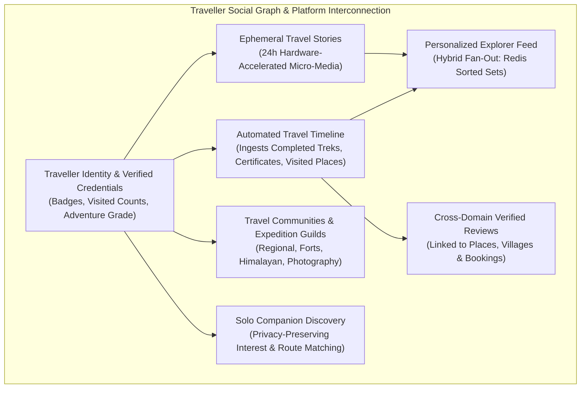
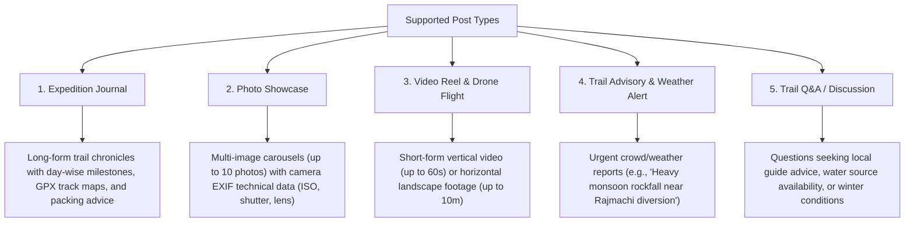
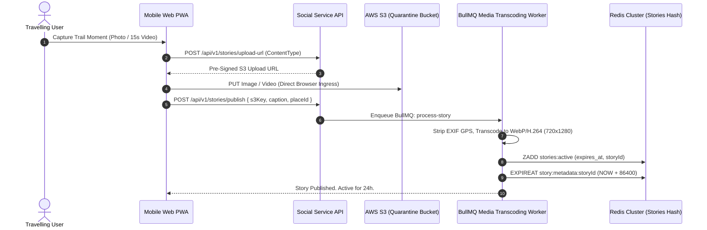
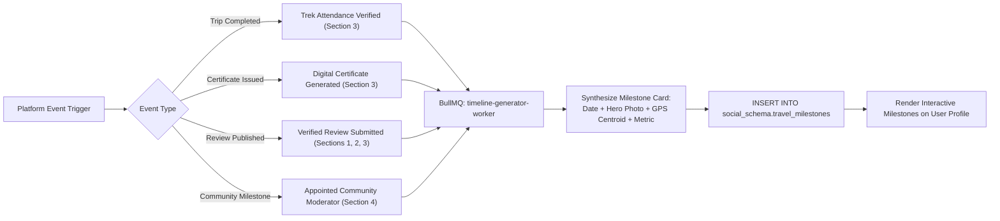
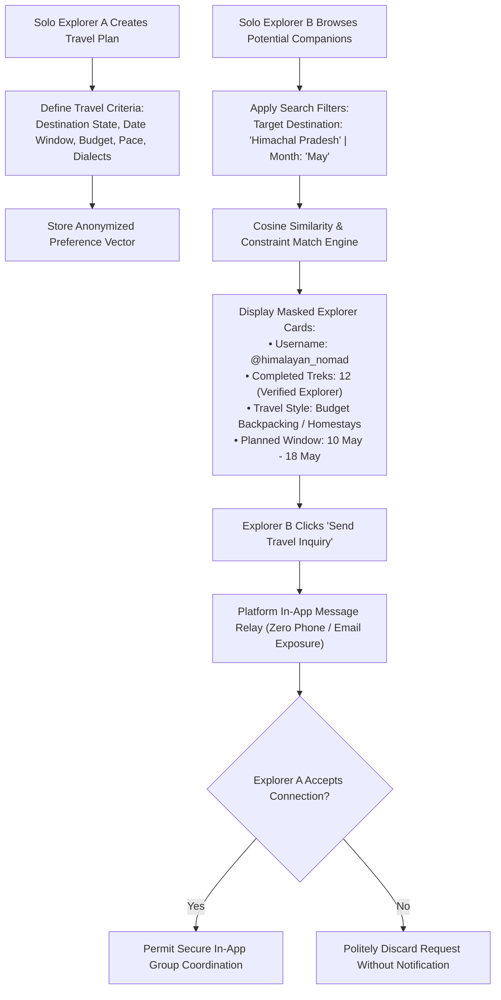
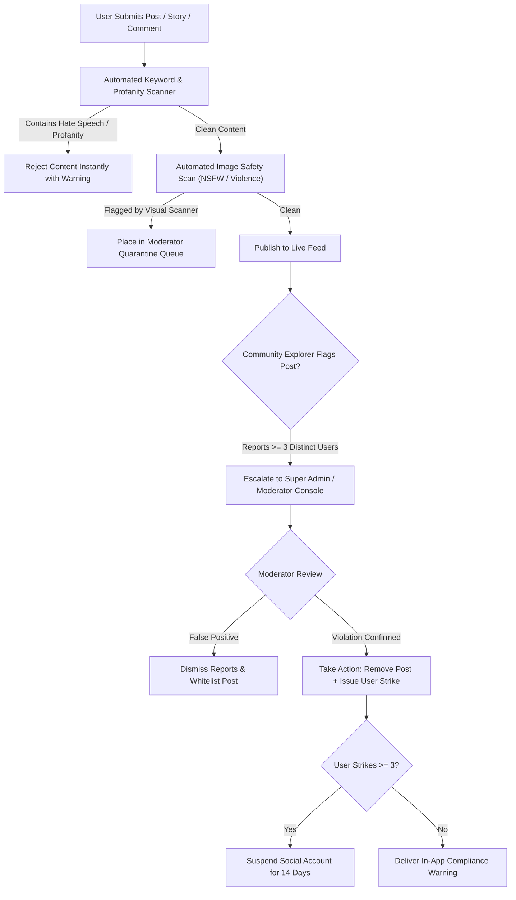

# Explore Bharat Safar — Traveller Social Network & Community Platform Blueprint (Part 5 — Section 4)

- **Document Identifier**: EBS-BLU-44-SOC
- **Version**: 1.0.0
- **Classification**: Production Architectural Specification & System Blueprint
- **Domain**: Vertical Travel Social Networking, Community Guilds & Real-Time Interaction
- **Status**: Approved & Authoritative
- **Author**: Principal Social Systems Architect & Real-Time Distributed Systems Lead
- **Target Audience**: Fullstack Engineers, Real-Time Distributed Systems Architects, Social Graph Engineers, Feed Ranking Specialists, Moderation Leads
- **Related Documents**:
  - `02-specification.md` (Functional Specifications)
  - `03-architecture.md` (System Architecture)
  - `09-api-design.md` (API Specifications)
  - `10-database-design.md` (Database Architecture)
  - `15-social-media.md` (Social Platform Design)
  - `26-business-rules.md` (Business Logic & Validation)
  - `40-enterprise-security-blueprint.md` (Enterprise Security Blueprint)
  - `41-bharat-discovery-engine-blueprint.md` (Bharat Discovery Engine Blueprint)
  - `42-village-knowledge-system-blueprint.md` (Village Knowledge System Blueprint)
  - `43-travel-booking-and-experience-management-blueprint.md` (Booking System Blueprint)
- **Last Updated**: 2026-09-28

---

## Executive Summary & Flagship Mission

Section 4 represents the social heart and community backbone of **Explore Bharat Safar**. It is explicitly **not** designed as a general-purpose, ad-driven social network. Instead, it is a purposeful, vertical social platform built specifically for the travellers, mountaineers, backpackers, cultural explorers, photographers, and rural heritage enthusiasts of Bharat.

The platform bridges real-world expedition adventures (Section 3), geographic discovery (Section 1), and rural knowledge (Section 2) with authentic human connection. It empowers explorers to connect before trips (forming groups, finding solo companions), coordinate during journeys, and celebrate achievements post-trip through automated travel timelines, verified reviews, and shared stories.



---

## 1. Traveller Identity & Dynamic Profile Dashboard

Every registered user on Explore Bharat Safar possesses an integrated **Traveller Profile** designed to showcase their authentic exploration milestones rather than superficial social vanity metrics.

### 1.1 Profile Metadata & Reputation Matrix
- **Identity Attributes**: Profile avatar, wide-angle landscape cover banner, verified legal display name, unique alphanumeric `@username`, biographical narrative ($160\text{ characters}$), home city, state, and spoken languages.
- **Exploration Level & Badges**:
  - *Adventure Grade*: Automatically assigned based on verified physical difficulty of completed expeditions (`ROOKIE`, `EXPLORER`, `PATHFINDER`, `SUMMITEER`, `EXPEDITION_LEADER`).
  - *Verified Sovereign Explorer Badge*: Earned when a user verifies visits across $> 5$ distinct Indian States/UTs.
  - *Sahyadri Sentinel Badge*: Awarded upon completing $> 10$ verified fort treks in Maharashtra.
  - *Himalayan Wanderer Badge*: Awarded upon completing high-altitude treks $> 12,000\text{ ft}$.
- **Sovereign Travel Counters (Cryptographically Derived)**:
  $$\text{States Visited} = \text{COUNT}(\text{DISTINCT } \text{state\_id} \in \text{Completed Bookings} \cup \text{Verified Check-ins})$$
  $$\text{Districts Visited} = \text{COUNT}(\text{DISTINCT } \text{district\_id})$$
  $$\text{Trek Elevation Sum} = \sum \text{MaxAltitude}(\text{Completed Expeditions})$$

### 1.2 Interactive Profile Dashboard Navigation
A traveller's profile dashboard organizes their digital footprint across distinct functional tabs:
1. **Posts & Showcase**: Chronological grid of authored text journals, multi-photo albums, and adventure videos.
2. **Active Stories**: Highlight reels and live temporary stories published within the last 24 hours.
3. **Automated Travel Timeline**: Chronological, milestone-driven visual timeline generated by platform activity.
4. **Saved Vault (Strictly Private)**: Curated bookmarks of places, villages, upcoming trek batches, articles, and gear guides.
5. **Expedition History**: Completed bookings, verified attendance badges, and issued digital certificates.
6. **Community Guilds**: Communities where the user is an active member, moderator, or organizer.
7. **Followers & Following**: Paginated social graph connection rosters.

---

## 2. High-Performance Hybrid Feed Architecture

To deliver instantaneous feed rendering across millions of active explorers without database bottlenecks, the platform implements a **Hybrid Fan-Out Feed Architecture** orchestrated via Redis Cluster.

```mermaid
flowchart TD
    NewPost["Explorer Authors New Post"] --> Classifier{"Author Follower Count?"}
    
    Classifier -->|Standard User (< 5,000 Followers)| FanOutWrite["Fan-Out-on-Write Pipeline"]
    FanOutWrite --> IngestBullMQ["Enqueue BullMQ: fanout-worker"]
    IngestBullMQ --> GetFollowers["Fetch Follower ID List"]
    GetFollowers --> PushRedis["LPUSH / ZADD to Each Follower's<br/>Redis Timeline Cache (feed:user:UUID)<br/>Trim to 800 Most Recent Items"]

    Classifier -->|Celebrity / High-Follower (> 5,000 Followers)| FanOutRead["Fan-Out-on-Read Pipeline"]
    FanOutRead --> PostStore["Write Post to Primary DB & Author Timeline Only"]
    PostStore --> FanReadTrigger["Client Requests Feed (GET /api/v1/feed)"]
    
    PushRedis --> FanReadTrigger
    FanReadTrigger --> MergeEng["Merge Fan-Out Cache + Celebrity Posts (K-Way Merge)"]
    MergeEng --> RenderFeed["Deliver Chronological Feed JSON to User Viewport"]
```

### 2.1 Feed Scoring & Personalization Formula
While the default feed is strictly chronological, users may toggle a **"Curated Discovery"** algorithmic view scored using spatial proximity, shared categories, and community affinities:
$$\text{Score} = w_1 \cdot \text{Recency} + w_2 \cdot \text{Proximity}(\text{UserLocation}, \text{PostLocation}) + w_3 \cdot \text{Affinity}(\text{UserInterests}, \text{Category}) + w_4 \cdot \log(1 + \text{Reactions} + \text{Comments})$$
Where:
- $\text{Recency} = e^{-\lambda \cdot \Delta t}$ (exponential time decay with half-life of 24 hours).
- $\text{Proximity}$: Boosted score if the post geotag is within the user's home state or upcoming booking destination.

---

## 3. Rich Post Types & Multimedia Publishing Pipeline

Explorers can publish diverse, specialized travel formats tailored to outdoor storytelling:



### 3.1 Post Metadata Attributes
- **Author Identity**: Immutable link to `traveller_profiles.id`.
- **Destination & Cadastral Tagging**: Optional foreign key links to `geo_spatial_schema.places(id)` or `rural_bharat_schema.villages(id)`.
- **Geographic Centroid**: Spatial point (`Point, 4326`) for map-based feed filtering.
- **Categorization**: Primary tags (*Trekking, Forts, Sacred Shrines, Backpacking, Wildlife, Heritage, Camping*).
- **Visibility Toggles**: `PUBLIC` (visible to all explorers), `FOLLOWERS_ONLY` (restricted to approved followers), `COMMUNITY_ONLY` (restricted to guild members).

---

## 4. Ephemeral Travel Stories Pipeline (24-Hour TTL)

Travel stories enable spontaneous, ephemeral updates while on the trail:
- **Automatic Lifecycle**: Every story is stamped with an immutable expiration timestamp:
  $$\text{expires\_at} = \text{published\_at} + 24\text{ Hours}$$
- **Redis TTL & Key Expiration**: Story metadata is indexed in a Redis Sorted Set (`stories:user:UUID`) scored by expiration timestamp. A Redis keyspace notification automatically purges expired stories.
- **View Receipts & Deduplication**: Story view tracking utilizes Redis HyperLogLog (`story:views:UUID`) ensuring distinct viewer counts with minimal memory footprint ($< 12\text{ KB}$ per story).



---

## 5. Automated Travel Timeline & Milestones Engine

The platform eliminates the need for manual travel journaling by automatically synthesizing a visually stunning **Travel Timeline** directly from platform events:



### 5.1 Auto-Generated Milestone Types
1. **Expedition Milestone**: *"Conquered Rajgad Fort — Highest Point: 1,375m — Distance: 14.2 km"*.
2. **Certification Milestone**: *"Awarded Certificate of Mountaineering Excellence (EBS-CERT-2026-048291)"*.
3. **Heritage Discovery Milestone**: *"Explored 25th Sovereign Fort in the Western Ghats"*.
4. **Rural Contribution Milestone**: *"Authored First Verified Dossier for Village Velhe"*.

---

## 6. Asymmetric Follow System & Social Graph

- **Relationship Model**: Asymmetric following (User $A$ follows User $B$ without requiring reciprocal authorization).
- **Fast Graph Lookups**: Follower and following relationships are mirrored in Redis Sets (`following:user:UUID` and `followers:user:UUID`), allowing $O(1)$ relationship checks (`SISMEMBER`) and instantaneous mutual connection calculations (`SINTER`).
- **Counter Invariance**: Follower and following counters in `traveller_profiles` are maintained via database transactional triggers to ensure zero drift.

---

## 7. Nested Comments & Real-Time Reactions Subsystem

### 7.1 Real-Time Emotional Reactions
Instead of a generic binary "Like", Explore Bharat Safar provides six travel-specific emotional reactions:

| Reaction Token | Symbol | Emotional Meaning |
| :--- | :--- | :--- |
| `LIKE` | 👍 | General agreement / acknowledgment |
| `LOVE` | ❤️ | Cultural appreciation & admiration |
| `AMAZING` | 🤩 | Breathtaking photography / scenery |
| `INSPIRING` | 🏔️ | Physical endurance / trail bravery |
| `ADVENTURE` | ⛺ | Wild outdoor spirit / bushcraft |
| `BOOKMARK` | 🔖 | Personal private save for future planning |

- **Real-Time Counters**: Reaction updates are broadcast via **WebSockets (Socket.io / NestJS WebSockets Gateway)** to all users currently viewing the post.

### 7.2 Nested Comments & Discussions
- **Thread Hierarchy**: Supports 2 levels of nested replies (Parent Comment $\rightarrow$ Direct Reply) to prevent infinite UI nesting on mobile viewports.
- **Moderation Protocol**: Comment authors can delete their own comments; post authors can hide or delete any comment on their posts.

---

## 8. Solo Explorer Discovery & Privacy-First Travel Matchmaking

Solo backpacking across India requires careful planning and safety. The **Solo Explorer Matchmaker** connects compatible travellers without ever compromising personal contact details.



### 8.1 Privacy Principles for Solo Connections
1. **Zero Contact Disclosure**: Phone numbers, personal email addresses, and residential locations are strictly forbidden from being shared in match profiles.
2. **Explicit Opt-In**: Users must explicitly toggle `"Available for Solo Companion Discovery"` on their profile.
3. **Safety Verification**: Solo match suggestions display verified booking badges, assuring users that prospective companions have verified identities and completed platform trips.

---

## 9. Travel Communities & Expedition Guilds

Communities bring together explorers passionate about specific regions or disciplines:
- **Guild Categories**:
  - *Geographic*: Maharashtra Sahyadri Guild, Himalayan High-Pass Alliance, South India Coastal Explorers, North-East Expeditions.
  - *Discipline-Based*: Mountain Photography Collective, Long-Distance Cycling, Offbeat Village Tourism, Historical Bastion Preservationists, Botanical & Sacred Grove Conservationists.
- **Governance Structure**:
  - `GUILD_LEADER`: Community founder with full management authority.
  - `GUILD_MODERATOR`: Appointed community members empowered to pin announcements, approve member requests, and delete spam posts.
  - `GUILD_MEMBER`: Verified participants entitled to post discussions, share photo galleries, and participate in community meetups.

---

## 10. Content Moderation & Anti-Spam Pipeline

Explore Bharat Safar maintains a family-friendly, culturally respectful, and safe online environment.



---

## 11. Complete PostgreSQL Relational Database Schema (`social_schema`)

```sql
CREATE SCHEMA IF NOT EXISTS social_schema;

-- Enumerations
CREATE TYPE social_schema.adventure_grade AS ENUM ('ROOKIE', 'EXPLORER', 'PATHFINDER', 'SUMMITEER', 'EXPEDITION_LEADER');
CREATE TYPE social_schema.post_visibility AS ENUM ('PUBLIC', 'FOLLOWERS_ONLY', 'COMMUNITY_ONLY', 'PRIVATE');
CREATE TYPE social_schema.reaction_type AS ENUM ('LIKE', 'LOVE', 'AMAZING', 'INSPIRING', 'ADVENTURE');
CREATE TYPE social_schema.guild_role AS ENUM ('LEADER', 'MODERATOR', 'MEMBER');

-- Master Traveller Profiles Table
CREATE TABLE social_schema.traveller_profiles (
    id UUID PRIMARY KEY DEFAULT gen_random_uuid(),
    user_id UUID UNIQUE NOT NULL REFERENCES identity_schema.users(id) ON DELETE CASCADE,
    username VARCHAR(50) UNIQUE NOT NULL,
    display_name VARCHAR(100) NOT NULL,
    bio VARCHAR(255),
    avatar_url TEXT,
    cover_image_url TEXT,
    home_state VARCHAR(100),
    home_city VARCHAR(100),
    spoken_languages TEXT[] DEFAULT '{}',
    adventure_grade social_schema.adventure_grade DEFAULT 'ROOKIE' NOT NULL,
    visited_states_count INT DEFAULT 0 NOT NULL,
    visited_districts_count INT DEFAULT 0 NOT NULL,
    completed_expeditions_count INT DEFAULT 0 NOT NULL,
    followers_count INT DEFAULT 0 NOT NULL,
    following_count INT DEFAULT 0 NOT NULL,
    is_profile_public BOOLEAN DEFAULT TRUE NOT NULL,
    is_solo_discovery_enabled BOOLEAN DEFAULT FALSE NOT NULL,
    created_at TIMESTAMP WITH TIME ZONE DEFAULT CURRENT_TIMESTAMP NOT NULL,
    updated_at TIMESTAMP WITH TIME ZONE DEFAULT CURRENT_TIMESTAMP NOT NULL
);

-- Posts & Travel Journals Table
CREATE TABLE social_schema.posts (
    id UUID PRIMARY KEY DEFAULT gen_random_uuid(),
    profile_id UUID NOT NULL REFERENCES social_schema.traveller_profiles(id) ON DELETE CASCADE,
    place_id UUID NULL REFERENCES geo_spatial_schema.places(id) ON DELETE SET NULL,
    village_id UUID NULL REFERENCES rural_bharat_schema.villages(id) ON DELETE SET NULL,
    title VARCHAR(200),
    content TEXT NOT NULL,
    media_urls TEXT[] DEFAULT '{}',
    geotag_location geometry(Point, 4326) NULL,
    visibility social_schema.post_visibility DEFAULT 'PUBLIC' NOT NULL,
    reaction_count INT DEFAULT 0 NOT NULL,
    comment_count INT DEFAULT 0 NOT NULL,
    is_flagged BOOLEAN DEFAULT FALSE NOT NULL,
    created_at TIMESTAMP WITH TIME ZONE DEFAULT CURRENT_TIMESTAMP NOT NULL,
    updated_at TIMESTAMP WITH TIME ZONE DEFAULT CURRENT_TIMESTAMP NOT NULL,
    deleted_at TIMESTAMP WITH TIME ZONE NULL
);

-- Ephemeral Travel Stories Table (24h TTL)
CREATE TABLE social_schema.temporary_stories (
    id UUID PRIMARY KEY DEFAULT gen_random_uuid(),
    profile_id UUID NOT NULL REFERENCES social_schema.traveller_profiles(id) ON DELETE CASCADE,
    media_url TEXT NOT NULL,
    media_type VARCHAR(20) DEFAULT 'IMAGE' NOT NULL, -- 'IMAGE', 'VIDEO'
    caption VARCHAR(200),
    geotag_location geometry(Point, 4326) NULL,
    view_count INT DEFAULT 0 NOT NULL,
    published_at TIMESTAMP WITH TIME ZONE DEFAULT CURRENT_TIMESTAMP NOT NULL,
    expires_at TIMESTAMP WITH TIME ZONE NOT NULL, -- published_at + 24 H
    CONSTRAINT check_story_expiration CHECK (expires_at > published_at)
);

-- Social Graph: Followers Table
CREATE TABLE social_schema.followers (
    follower_profile_id UUID NOT NULL REFERENCES social_schema.traveller_profiles(id) ON DELETE CASCADE,
    following_profile_id UUID NOT NULL REFERENCES social_schema.traveller_profiles(id) ON DELETE CASCADE,
    created_at TIMESTAMP WITH TIME ZONE DEFAULT CURRENT_TIMESTAMP NOT NULL,
    PRIMARY KEY (follower_profile_id, following_profile_id),
    CONSTRAINT check_no_self_follow CHECK (follower_profile_id <> following_profile_id)
);

-- Post Reactions Table
CREATE TABLE social_schema.post_reactions (
    post_id UUID NOT NULL REFERENCES social_schema.posts(id) ON DELETE CASCADE,
    profile_id UUID NOT NULL REFERENCES social_schema.traveller_profiles(id) ON DELETE CASCADE,
    reaction social_schema.reaction_type NOT NULL,
    created_at TIMESTAMP WITH TIME ZONE DEFAULT CURRENT_TIMESTAMP NOT NULL,
    PRIMARY KEY (post_id, profile_id)
);

-- Nested Comments Table
CREATE TABLE social_schema.post_comments (
    id UUID PRIMARY KEY DEFAULT gen_random_uuid(),
    post_id UUID NOT NULL REFERENCES social_schema.posts(id) ON DELETE CASCADE,
    profile_id UUID NOT NULL REFERENCES social_schema.traveller_profiles(id) ON DELETE CASCADE,
    parent_comment_id UUID NULL REFERENCES social_schema.post_comments(id) ON DELETE CASCADE,
    comment_text TEXT NOT NULL,
    is_flagged BOOLEAN DEFAULT FALSE NOT NULL,
    created_at TIMESTAMP WITH TIME ZONE DEFAULT CURRENT_TIMESTAMP NOT NULL,
    updated_at TIMESTAMP WITH TIME ZONE DEFAULT CURRENT_TIMESTAMP NOT NULL
);

-- Travel Communities / Guilds Master Table
CREATE TABLE social_schema.guilds (
    id UUID PRIMARY KEY DEFAULT gen_random_uuid(),
    slug VARCHAR(100) UNIQUE NOT NULL,
    title VARCHAR(150) NOT NULL,
    description TEXT NOT NULL,
    banner_url TEXT,
    creator_profile_id UUID NOT NULL REFERENCES social_schema.traveller_profiles(id) ON DELETE RESTRICT,
    member_count INT DEFAULT 1 NOT NULL,
    rules_text TEXT NOT NULL,
    is_verified BOOLEAN DEFAULT FALSE NOT NULL,
    created_at TIMESTAMP WITH TIME ZONE DEFAULT CURRENT_TIMESTAMP NOT NULL
);

-- Guild Membership Table
CREATE TABLE social_schema.guild_memberships (
    guild_id UUID NOT NULL REFERENCES social_schema.guilds(id) ON DELETE CASCADE,
    profile_id UUID NOT NULL REFERENCES social_schema.traveller_profiles(id) ON DELETE CASCADE,
    role social_schema.guild_role DEFAULT 'MEMBER' NOT NULL,
    joined_at TIMESTAMP WITH TIME ZONE DEFAULT CURRENT_TIMESTAMP NOT NULL,
    PRIMARY KEY (guild_id, profile_id)
);

-- Automated Travel Milestones Table
CREATE TABLE social_schema.travel_milestones (
    id UUID PRIMARY KEY DEFAULT gen_random_uuid(),
    profile_id UUID NOT NULL REFERENCES social_schema.traveller_profiles(id) ON DELETE CASCADE,
    title VARCHAR(200) NOT NULL,
    description TEXT NOT NULL,
    milestone_type VARCHAR(50) NOT NULL, -- 'EXPEDITION', 'CERTIFICATE', 'HERITAGE', 'VILLAGE'
    reference_id UUID NULL,
    hero_image_url TEXT,
    event_timestamp TIMESTAMP WITH TIME ZONE NOT NULL,
    created_at TIMESTAMP WITH TIME ZONE DEFAULT CURRENT_TIMESTAMP NOT NULL
);

-- Private Saved Content Table
CREATE TABLE social_schema.saved_content (
    id UUID PRIMARY KEY DEFAULT gen_random_uuid(),
    profile_id UUID NOT NULL REFERENCES social_schema.traveller_profiles(id) ON DELETE CASCADE,
    content_type VARCHAR(50) NOT NULL, -- 'POST', 'PLACE', 'VILLAGE', 'EXPERIENCE', 'ARTICLE'
    reference_id UUID NOT NULL,
    saved_at TIMESTAMP WITH TIME ZONE DEFAULT CURRENT_TIMESTAMP NOT NULL,
    CONSTRAINT uq_profile_content UNIQUE (profile_id, content_type, reference_id)
);

-- Content Moderation Reports Table
CREATE TABLE social_schema.content_reports (
    id UUID PRIMARY KEY DEFAULT gen_random_uuid(),
    reporter_profile_id UUID NOT NULL REFERENCES social_schema.traveller_profiles(id) ON DELETE CASCADE,
    content_type VARCHAR(50) NOT NULL, -- 'POST', 'COMMENT', 'STORY', 'PROFILE'
    content_id UUID NOT NULL,
    reason VARCHAR(100) NOT NULL, -- 'SPAM', 'HATE_SPEECH', 'HARASSMENT', 'MISINFORMATION'
    notes TEXT,
    status VARCHAR(50) DEFAULT 'PENDING' NOT NULL, -- 'PENDING', 'RESOLVED', 'DISMISSED'
    reviewed_by UUID NULL REFERENCES identity_schema.users(id),
    created_at TIMESTAMP WITH TIME ZONE DEFAULT CURRENT_TIMESTAMP NOT NULL
);

-- Fast Indexing
CREATE INDEX idx_posts_profile ON social_schema.posts(profile_id, created_at DESC) WHERE deleted_at IS NULL;
CREATE INDEX idx_posts_visibility ON social_schema.posts(visibility) WHERE deleted_at IS NULL;
CREATE INDEX idx_stories_active ON social_schema.temporary_stories(expires_at) WHERE expires_at > CURRENT_TIMESTAMP;
CREATE INDEX idx_comments_post ON social_schema.post_comments(post_id, created_at ASC);
CREATE INDEX idx_milestones_profile ON social_schema.travel_milestones(profile_id, event_timestamp DESC);
CREATE INDEX idx_saved_profile ON social_schema.saved_content(profile_id);
```

---

## 12. RESTful & WebSocket API Contracts for Social Network

### 12.1 Personal Feed Ingress Endpoint
- **Route**: `GET /api/v1/social/feed?cursor={timestamp}&limit=20`
- **Output**: Paginated chronological or hybrid scored post objects.

### 12.2 Post Creation & Media Ingress
- `POST /api/v1/social/posts`: Publishes text/image/video travel posts with optional place/village destination tagging.
- `POST /api/v1/social/posts/:id/react`: Toggles or updates emotional reaction (`LIKE`, `LOVE`, `AMAZING`, `INSPIRING`, `ADVENTURE`).
- `POST /api/v1/social/posts/:id/comments`: Submits parent comment or threaded reply.

### 12.3 Ephemeral Stories Endpoints
- `POST /api/v1/social/stories`: Publishes a 24-hour temporary story with media URI and optional location pin.
- `GET /api/v1/social/stories/active`: Retrieves stories published by following explorers within the last 24 hours.
- `POST /api/v1/social/stories/:id/view`: Records unique story view receipt via Redis HyperLogLog.

### 12.4 Real-Time WebSockets Gateway (`/ws/social`)
- **Event `reaction:update`**: Emits real-time updated reaction counts when explorers react to posts.
- **Event `comment:new`**: Broadcasts newly submitted comments to active post viewers.
- **Event `notification:push`**: Delivers instant in-app alerts for new followers, mentions, and milestones.

---

## 13. Non-Negotiable Business Rules for Social Network

1. **Unique Identity Linkage**: Every social profile must map to exactly one registered user account in `identity_schema.users`. Anonymous posting is strictly forbidden.
2. **Strict Privacy Safeguard**: Saved bookmarks, private wishlists, and unaccepted solo match queries shall remain private and never be surfaced in public feeds or search results.
3. **Automated Story Expiration**: All temporary stories must expire and vanish from active feeds exactly 24 hours after their published timestamp.
4. **Verified Review Integrity**: Social posts designated as reviews must only feature verified purchase/attendance credentials when linked to commercial experiences.
5. **Zero Commercial Ad Pollution**: The social home feed shall never display third-party algorithmic display ads, casino promotions, or unrelated commercial marketing.
6. **Community Self-Governance**: Guild leaders and moderators hold the authority to enforce community rules; all moderation strikes and removals generate immutable audit records.
