# Explore Bharat Safar — Core Technical Architecture, Security & Infrastructure Blueprint (Part 6)

- **Document Identifier**: EBS-BLU-45-INFRA
- **Version**: 1.0.0
- **Classification**: Production Architectural Specification & System Blueprint
- **Domain**: Cloud-Native Distributed Systems, Enterprise Infrastructure, Security & Data Engineering
- **Status**: Approved & Authoritative
- **Author**: Chief Technology Officer, Principal Distributed Systems Architect, Cloud Infrastructure Lead
- **Target Audience**: Lead Software Architects, DevOps & SRE Engineers, Fullstack Leads, Database Administrators, Security Officers
- **Related Documents**:
  - `03-architecture.md` (System Architecture)
  - `09-api-design.md` (API Specifications)
  - `10-database-design.md` (Database Architecture)
  - `22-deployment.md` (Deployment & Cloud Specifications)
  - `23-devops.md` (DevSecOps & CI/CD Pipelines)
  - `26-business-rules.md` (Business Logic & Validation)
  - `27-folder-structure.md` (Monorepo Codebase Structure)
  - `40-enterprise-security-blueprint.md` (Enterprise Security Blueprint)
  - `41-bharat-discovery-engine-blueprint.md` (Bharat Discovery Engine Blueprint)
  - `42-village-knowledge-system-blueprint.md` (Village Knowledge System Blueprint)
  - `43-travel-booking-and-experience-management-blueprint.md` (Booking System Blueprint)
  - `44-traveller-social-network-and-community-blueprint.md` (Social Network Blueprint)
- **Last Updated**: 2026-09-28

---

## Executive Summary & Architectural Vision

**Explore Bharat Safar** is architected as an enterprise-grade, distributed, cloud-native digital ecosystem. It is engineered to scale seamlessly from thousands of daily active explorers to tens of millions of concurrent national and international users, without requiring foundational architectural re-engineering.

The platform unifies four distinct functional pillars into a cohesive, loosely coupled modular system:
1. **Bharat Discovery Engine (Section 1)**: Interactive GIS mapping, WebGL 3D landmarks, and hierarchical spatial navigation.
2. **Rural Bharat Knowledge System (Section 2)**: Authoritative cultural and civic knowledge registry for 650,000+ villages.
3. **Experience Booking Engine (Section 3)**: High-concurrency inventory, distributed slot locks, and double-entry financial accounting.
4. **Traveller Social Network (Section 4)**: Vertical travel social graph, hybrid fan-out feeds, 24h stories, and community guilds.

Every technical decision adheres to the foundational pillars of **High Availability ($99.99\%$)**, **Zero Trust Security**, **Sub-Second Performance**, **Audit Immutability**, and **Cloud-Agnostic Portability**.

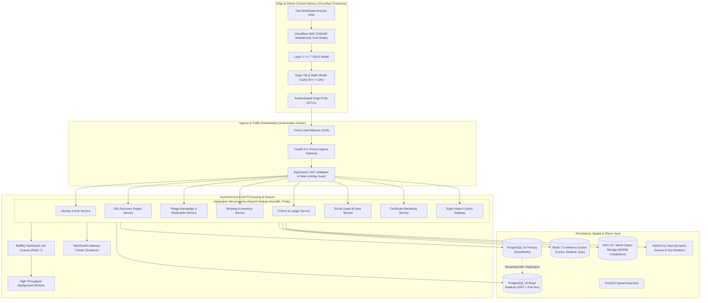

---

## 1. Core Architectural Principles & Software Design Standards

The platform follows rigorous software engineering paradigms to guarantee maintainability and prevent technical debt:

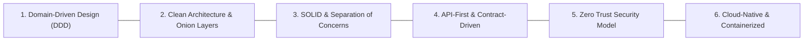

### 1.1 Domain-Driven Design (DDD) & Bounded Contexts
The system is divided into completely independent domain modules. Each domain encapsulates its own entities, value objects, domain events, and repositories:
- `IdentityDomain`: User credentials, MFA, RBAC permissions, and sessions.
- `SpatialDiscoveryDomain`: States, districts, talukas, places, and vector tiles.
- `RuralKnowledgeDomain`: Villages, Gram Panchayats, cadastral boundaries, and staging queues.
- `BookingCommerceDomain`: Batches, slot inventory, Redlock mutexes, and order lifecycles.
- `FintechLedgerDomain`: Double-entry accounting, payment webhooks, and refunds.
- `SocialCommunityDomain`: Profiles, hybrid feeds, 24h stories, and guilds.
- `GovernanceDomain`: Immutable audit logs, statutory compliance, and administrative controls.

### 1.2 Clean Architecture Layers within NestJS Modules
Every domain service implements the classic four-tier Clean Architecture:
1. **Domain Layer (Innermost)**: Pure business entities and domain rules; zero external dependencies.
2. **Application Layer**: Use-case orchestrators, Command/Query handlers (CQRS), and DTO definitions.
3. **Infrastructure Layer**: PostgreSQL TypeORM/Prisma repositories, Redis adapters, third-party HTTP clients, and S3 uploaders.
4. **Interface / Presentation Layer**: REST Controllers, WebSocket Gateways, and CLI commands.

---

## 2. Frontend Technology Stack & Client Architecture

```mermaid
graph TD
    ClientStack["Modern Frontend Client Architecture"]
    
    ClientStack --> Framework["Next.js 14+ (App Router)"]
    Framework --> SSR["Server-Side Rendering (SEO & OpenGraph)"]
    Framework --> ISR["Incremental Static Regeneration (State/District Pages)"]
    Framework --> RSC["React Server Components (Zero-Bundle Data Ingestion)"]

    ClientStack --> Language["TypeScript 5.x (Strict Mode)"]
    
    ClientStack --> Visual["UI & Styling"]
    Visual --> Tailwind["Tailwind CSS 3.4+ (Design Tokens & Dark Mode)"]
    Visual --> Radix["Radix UI (Accessible Headless Primitives)"]
    Visual --> Lucide["Lucide Icons (Tree-Shaken Vectors)"]

    ClientStack --> Motion["Motion & 3D Engine"]
    Motion --> GSAP["GreenSock (GSAP 3 + ScrollTrigger)"]
    Motion --> ThreeJS["Three.js (WebGL 3D Landmark Layer)"]
    Motion --> MapLibre["MapLibre GL JS (Hardware-Accelerated Vector Tiles)"]

    ClientStack --> State["State Management Architecture"]
    State --> ServerState["TanStack Query v5 (Server Cache & Optimistic UI)"]
    State --> ClientState["Zustand (Lightweight Viewport & Filter State)"]
    State --> FormState["React Hook Form + Zod (Strict Schema Validation)"]
```

### 2.1 Next.js App Router Route Topology
- `app/(discovery)/`: Section 1 hierarchical discovery routes (`/explore`, `/states/:stateSlug`, `/places/:placeSlug`).
- `app/(villages)/`: Section 2 rural knowledge routes (`/villages`, `/villages/:lgdCode`, `/panchayat/:id`).
- `app/(bookings)/`: Section 3 booking engine (`/experiences`, `/experiences/:slug`, `/checkout/:orderId`).
- `app/(social)/`: Section 4 traveller community (`/feed`, `/profile/:username`, `/stories`, `/guilds/:slug`).
- `app/(admin)/`: Administrative consoles with route-level RBAC middleware protection.

---

## 3. Backend Technology Stack & Microservices Strategy

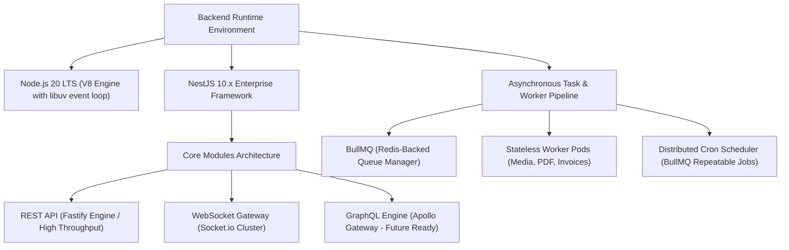

### 3.1 Background Worker Task Allocation
- `queue:media-processor`: Handles Sharp image compression, WebP/AVIF generation, and video thumbnailing.
- `queue:certificate-generator`: Generates vector PDF/A-1b documents, calculates HMAC verification hashes, and renders dynamic QR codes.
- `queue:invoice-generator`: Creates GST-compliant PDF tax invoices with digital cryptographic signatures.
- `queue:inventory-sweeper`: Scans for expired 15-minute slot locks and restores inventory to batches.
- `queue:notifications`: Dispatches multi-channel alerts (Email via Amazon SES, SMS via Twilio/Gupshup, WhatsApp via Meta Business API).
- `queue:dpdp-purger`: Daily cron executing cryptographic shredding on participant medical notes $> 30\text{ days}$ old.

---

## 4. Multi-Tier Database & Spatial Persistence Architecture

The data tier is engineered around **PostgreSQL 16** with the **PostGIS** extension, partitioned across primary read-write and auto-scaling read replicas.

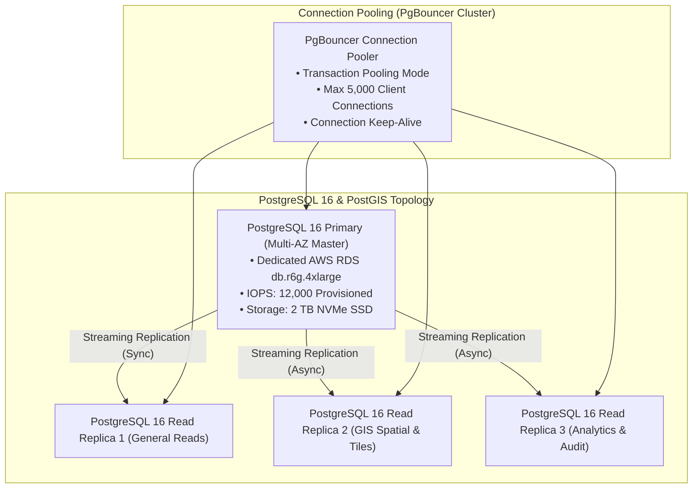

### 4.1 Schema Partitioning Strategy
To prevent degradation as data volumes surpass hundreds of millions of records, high-velocity tables implement PostgreSQL native range partitioning:
1. **`booking_schema.orders`**: Partitioned by `RANGE (created_at)` on a **yearly** basis (`orders_2026`, `orders_2027`).
2. **`booking_schema.payments`**: Partitioned by `RANGE (created_at)` on a **yearly** basis.
3. **`audit_schema.audit_logs`**: Partitioned by `RANGE (timestamp)` on a **monthly** basis, allowing seamless offloading of historical partitions to cold S3 storage.
4. **`social_schema.posts`**: Sub-divided into active posts and archived history using partitioned date ranges.

### 4.2 Comprehensive Database Table Design Rules
Every table in Explore Bharat Safar strictly enforces enterprise database standards:
- **Primary Keys**: Universal UUID v4 (`UUID DEFAULT gen_random_uuid()`) to eliminate enumeration attacks and simplify distributed replication.
- **Audit Columns**: Non-nullable `created_at` and `updated_at` with automated trigger functions; nullable `deleted_at` for soft deletes.
- **Referential Integrity**: Foreign keys with explicit `ON DELETE RESTRICT` or `ON DELETE CASCADE` specifications.
- **Spatial Indexing**: All geometry columns (`Point`, `MultiPolygon`, `Polygon`) indexed with `USING GIST`.
- **Text Search Indexing**: English and Devanagari text columns indexed with `USING GIN (gin_trgm_ops)`.

---

## 5. Redis In-Memory Infrastructure & Concurrency Architecture

A high-availability **Redis 7 Cluster** (3 Master nodes + 3 Replica nodes) provides sub-millisecond memory caching, session management, and distributed coordination.

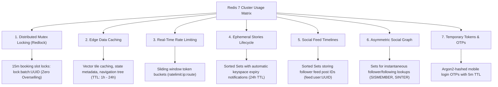

---

## 6. Real-Time WebSockets Architecture

Real-time bidirectional communication is managed by a clustered **Socket.io / NestJS WebSocket Gateway** running on dedicated Kubernetes pods with Redis Pub/Sub adapter.

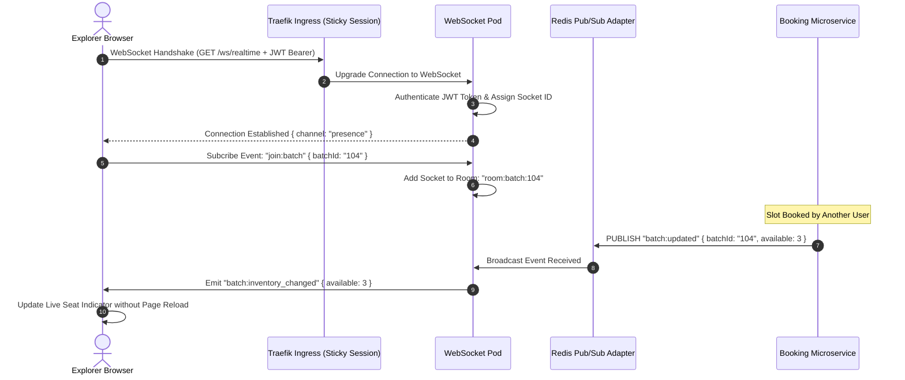

---

## 7. Storage Architecture & Multi-Bucket Vault Strategy

All unstructured media and regulatory documents are stored in **Amazon S3** (or S3-compatible enterprise Ceph/MinIO storage) segregated into dedicated, policy-hardened buckets:

| S3 Bucket Name | Access Policy | Lifecycle & Encryption | Domain Contents |
| :--- | :--- | :--- | :--- |
| `ebs-media-quarantine` | Private / Isolated | SSE-S3 / 24h Purge | Upload ingress queue pending ClamAV & EXIF scrub. |
| `ebs-media-public` | Public via CloudFront CDN | SSE-S3 / WebP Variants | Destination galleries, hero covers, village photos. |
| `ebs-stories-ephemeral` | Public via CloudFront CDN | Automated 24h Expire | Temporary stories; hardware-transcoded clips. |
| `ebs-user-avatars` | Public via CloudFront CDN | SSE-S3 / Resized 320px | Explorer profile avatars and community icons. |
| `ebs-certificates-vault`| Private / Pre-signed Only | SSE-KMS / WORM Lock | PDF/A-1b digital completion certificates. |
| `ebs-invoices-vault` | Private / Pre-signed Only | SSE-KMS / 7-Year Retain| GST-compliant tax invoices and refund receipts. |
| `ebs-audit-compliance` | WORM Compliance Mode | S3 Object Lock (7 Years) | Hourly streamed PostgreSQL audit ledger archives. |
| `ebs-database-backups` | Private / Air-Gapped | AWS KMS Customer Key | Encrypted daily WAL and PostgreSQL database dumps. |

---

## 8. Domain-Isolated Search Architecture

To ensure strict compliance with project specifications, search indexes are maintained in isolated partitions:

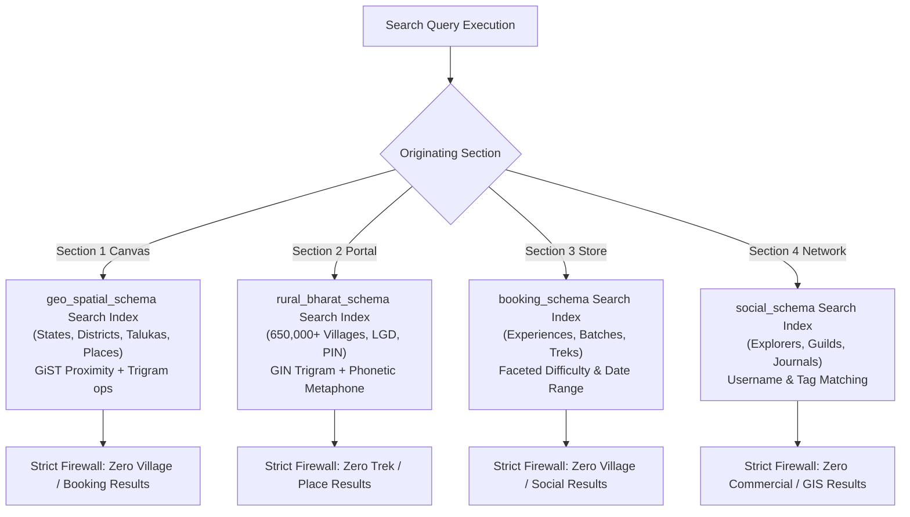

---

## 9. Comprehensive Identity, Authentication & Centralized RBAC

Authentication is secured via **Argon2id** password hashing, asymmetric **RS256 JWT** access tokens, and single-use **Refresh Token Rotation (RTR)**.

### 9.1 Centralized Role-Based Access Control (RBAC) Hierarchy

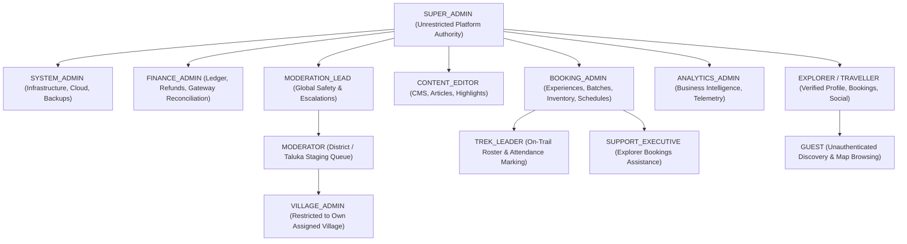

---

## 10. Enterprise Security & Cryptographic Standards Suite

The security controls strictly conform to the 80 topics established in `40-enterprise-security-blueprint.md`:
- **Cryptographic Algorithms**:
  - Passwords: **Argon2id** ($m=65536\,\text{KiB}, t=3, p=1$).
  - Tokens: **RS256** (RSA 4096-bit asymmetric key pair, rotated every 90 days).
  - Storage Encryption: **AES-256-GCM** with dynamic initialization vectors (IV).
  - Transit Encryption: **TLS 1.3** exclusively; legacy TLS 1.0, 1.1, and 1.2 disabled.
  - Certificate Signatures: **HMAC-SHA256** with platform secret rotation.
- **Application Security Headers**:
  - `Content-Security-Policy: default-src 'self'; script-src 'self' 'nonce-...'; style-src 'self' 'unsafe-inline'; img-src 'self' data: https://cdn.explorebharatsafar.com; frame-ancestors 'none';`
  - `Strict-Transport-Security: max-age=63072000; includeSubDomains; preload`
  - `X-Frame-Options: DENY`
  - `X-Content-Type-Options: nosniff`
  - `Referrer-Policy: strict-origin-when-cross-origin`

---

## 11. Immutable Audit Logging Pipeline

Every administrative modification, financial transaction, role grant, and moderation decision is streamed to an immutable, append-only audit schema:

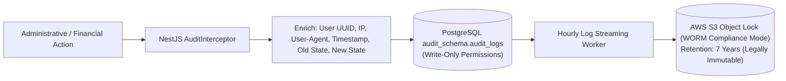

---

## 12. Standardized RESTful API Response & Error Envelope

All API endpoints across all four sections conform to a unified JSON response envelope:

### 12.1 Standard Success Envelope
```json
{
  "success": true,
  "statusCode": 200,
  "timestamp": "2026-09-28T13:50:00.000Z",
  "correlationId": "ebs-trace-9f8a7b6c5d4e",
  "data": {},
  "meta": {
    "page": 1,
    "limit": 20,
    "totalCount": 142,
    "totalPages": 8,
    "hasNextPage": true,
    "hasPreviousPage": false
  }
}
```

### 12.2 Standard Error Envelope
```json
{
  "success": false,
  "statusCode": 409,
  "error": "ConflictException",
  "message": "The selected batch has insufficient available slots for this reservation.",
  "errorCode": "EBS-BKG-SLOT-UNAVAILABLE",
  "timestamp": "2026-09-28T13:50:00.000Z",
  "correlationId": "ebs-trace-9f8a7b6c5d4e",
  "details": {
    "batchId": "b104-e9b2-4a3c-8f1d-7e6a5b4c3d2e",
    "requestedSlots": 4,
    "availableSlots": 1
  }
}
```

---

## 13. High Availability, Load Balancing & Zero-Downtime Deployments

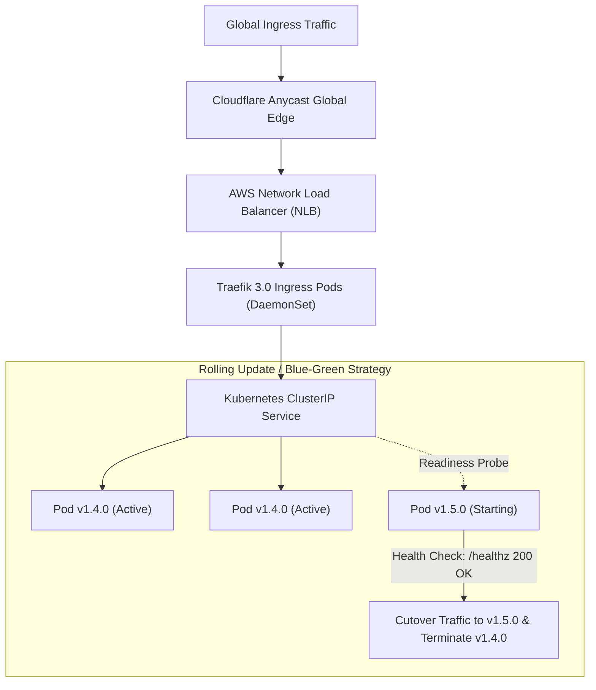

### 13.1 Health Check Endpoints
- **Liveness Probe**: `GET /healthz` (Verifies Node.js process is responsive).
- **Readiness Probe**: `GET /readyz` (Verifies database connectivity, Redis ping, and queue readiness).

---

## 14. Observability, Telemetry & Distributed Tracing

1. **Metrics Collection**: **Prometheus** scrapes operational metrics every 15 seconds from `/metrics` endpoints (HTTP latency histograms, database connection pool saturation, Redis memory usage, BullMQ queue lag).
2. **Dashboarding**: **Grafana** visualizes real-time metrics with automated alerting to Slack `#ops-alerts` and PagerDuty for P1/P2 incidents.
3. **Distributed Tracing**: **OpenTelemetry (OTel)** instrumentation with **Jaeger** tracing context propagation across microservices via standard `traceparent` headers.
4. **Structured Logging**: Structured JSON emitted to `stdout` captured by FluentBit and aggregated into **Grafana Loki**.

---

## 15. Backup, Disaster Recovery & Business Continuity (BCP)

- **PostgreSQL Continuous Archiving**: Write-Ahead Logging (WAL) continuously streamed to S3, enabling **Point-in-Time Recovery (PITR)** down to the exact second.
- **Recovery Objectives**:
  - **Recovery Point Objective (RPO)**: $\le 5\text{ minutes}$ (Maximum possible committed data loss during regional catastrophe).
  - **Recovery Time Objective (RTO)**: $\le 30\text{ minutes}$ (Complete infrastructure restoration in failover cloud region).
- **Automated Backup Drills**: Monthly unannounced automated disaster recovery restoration tests spinning up isolated staging clusters from cold backup archives.

---

## 16. Containerization & DevSecOps CI/CD Automation

```mermaid
flowchart LR
    DevCommit["Git Push to main"] --> CI_Lint["1. Lint & TypeScript Check"]
    CI_Lint --> CI_Test["2. Unit & Integration Tests"]
    CI_Test --> CI_SAST["3. SonarQube & Snyk SAST Scan"]
    CI_SAST --> DockerBuild["4. Multi-Stage Distroless Docker Build"]
    DockerBuild --> TrivyScan["5. Trivy Container Vulnerability Scan"]
    TrivyScan --> Sign["6. Cosign Image Cryptographic Signing"]
    Sign --> PushRegistry["7. Push to Private AWS ECR Registry"]
    PushRegistry --> DeployProd["8. ArgoCD GitOps Sync to Production EKS"]
```

### 16.1 Distroless Multi-Stage Container Dockerfile Standard
- **Base Image**: `node:20-alpine` (builder stage) $\rightarrow$ `gcr.io/distroless/nodejs20-debian12:nonroot` (production runtime).
- **Non-Root Execution**: Runs strictly under unprivileged user `nonroot` (UID `65532`).
- **Minimal Attack Surface**: Zero package managers (`npm`, `apk`), zero shells (`sh`, `bash`), and zero build utilities in the production container image.

---

## 17. Non-Negotiable System Foundation Business Rules

1. **Stateless Scalability**: All application pods must remain completely stateless; session persistence must reside in Redis or signed client tokens.
2. **Immutable Audit Integrity**: No software component, administrator, or database user shall possess the permission to modify or delete historical records in `audit_schema.audit_logs`.
3. **Zero Direct Production Database Access**: Software developers and support engineers are strictly barred from direct production database write access; all corrections must execute via audited migration scripts or administrative tooling.
4. **Mandatory Graceful Degradation**: If downstream secondary services (e.g., weather APIs, email dispatchers) fail, core discovery and booking workflows must continue functioning seamlessly with queued retries.
5. **Zero Single Point of Failure (SPOF)**: Every infrastructure tier (DNS, WAF, Ingress, Application Pods, Redis, PostgreSQL, Object Storage) must deploy across a minimum of three distinct physical Availability Zones (Multi-AZ).
