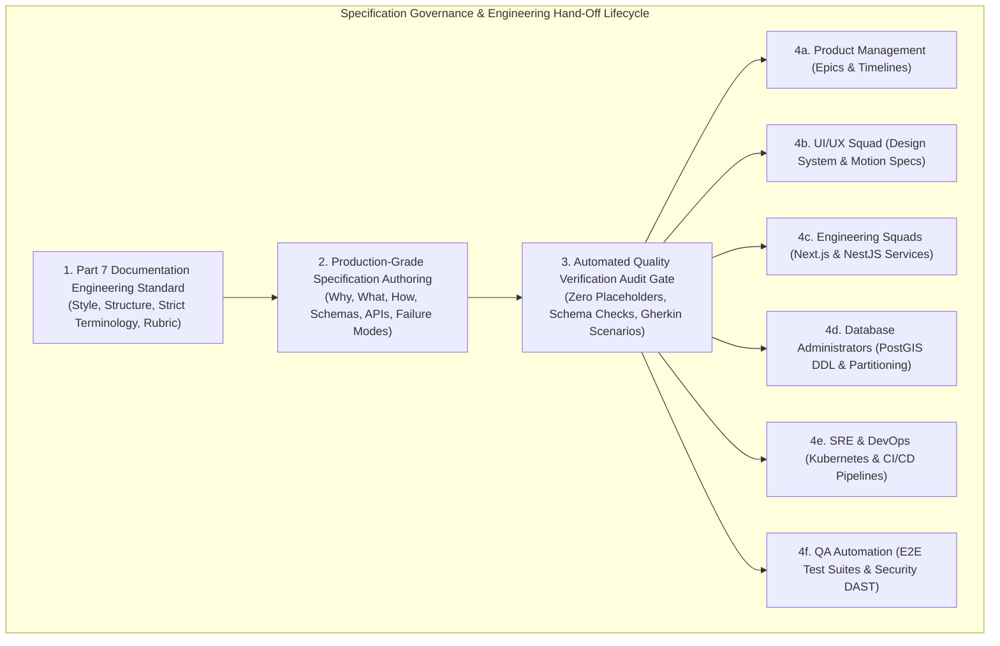
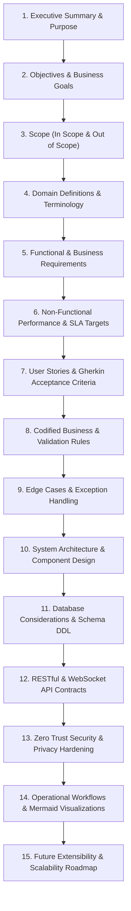

# Explore Bharat Safar — Documentation Standards, File Specifications & Governance Blueprint (Part 7)

- **Document Identifier**: EBS-BLU-46-DOCS
- **Version**: 1.0.0
- **Classification**: Production Architectural Specification & System Blueprint
- **Domain**: Technical Documentation Engineering, Specification Governance & AI Verification Standards
- **Status**: Approved & Authoritative
- **Author**: Chief Documentation Architect, Principal Systems Engineer, Technical Governance Lead
- **Target Audience**: Product Managers, Software Architects, Engineering Leads, Technical Writers, QA Automation Leads, Compliance Officers
- **Related Documents**:
  - `01-idea.md` through `39-future-updates.md` (Core Specification Suite)
  - `40-enterprise-security-blueprint.md` (Enterprise Security Blueprint)
  - `41-bharat-discovery-engine-blueprint.md` (Bharat Discovery Engine Blueprint)
  - `42-village-knowledge-system-blueprint.md` (Village Knowledge System Blueprint)
  - `43-travel-booking-and-experience-management-blueprint.md` (Booking System Blueprint)
  - `44-traveller-social-network-and-community-blueprint.md` (Social Network Blueprint)
  - `45-core-technical-architecture-and-infrastructure-blueprint.md` (Core Technical Infrastructure Blueprint)
- **Last Updated**: 2026-09-28

---

## Executive Summary & Governance Mission

This document establishes the mandatory **Documentation Engineering Standards, File Specifications, and Technical Governance Protocols** governing the entire **Explore Bharat Safar** technical documentation ecosystem (`explore-bharat-safar-ai-docs/`).

The documentation suite is engineered to serve as an immutable, production-grade technical specification that allows enterprise software engineering firms, systems integrators, and independent audit teams to build, test, secure, deploy, and maintain the complete Explore Bharat Safar platform **without requiring oral clarification or additional functional requirements**.

Every markdown document adheres to strict architectural principles: eliminating ambiguous language, enforcing mathematical precision in algorithms, defining complete database schemas, documenting positive and negative test acceptance criteria, and mapping system interactions with rich Mermaid diagrams.



---

## 1. Master Documentation File Roster & Domain Mapping

The platform documentation is organized into an ordered, non-omissible collection of specialized engineering specifications:

| File Name | Domain / Subsystem | Primary Engineering Responsibility |
| :--- | :--- | :--- |
| `01-idea.md` | Product Vision & Mission | Core philosophy, cultural mission, target demographics, value proposition. |
| `02-specification.md` | Functional Specifications | System-wide functional breakdown across all 4 core platform sections. |
| `03-architecture.md` | High-Level Architecture | Distributed system topology, service decoupling, multi-AZ deployment. |
| `04-ui-ux.md` | Design System & UI/UX | Visual tokens, layout grids, responsiveness, dark/light themes, accessibility. |
| `05-drd.md` | Disaster Recovery & BCP | RPO/RTO metrics, failover orchestration, cross-region replication. |
| `06-styleguide.md` | Brand & Typography Guide | Typography scales, brand palette, icon conventions, photography guidelines. |
| `07-roadmap.md` | Release Milestones | Phase 1 MVP to Phase 4 enterprise scale release sequencing. |
| `08-context.md` | Domain Bounded Contexts | Domain-Driven Design (DDD) aggregates, entities, and context mapping. |
| `09-api-design.md` | RESTful API Contracts | Envelopes, status codes, query parameters, OpenAPI/Swagger specifications. |
| `10-database-design.md` | Relational & PostGIS Schemas | Full PostgreSQL 16 DDL, table relationships, foreign keys, and indexes. |
| `11-security.md` | Application Security Suite | OWASP Top 10 defenses, CSP Level 3, CORS, rate limiting, and hashing. |
| `12-authentication.md` | Identity & Session Engine | Argon2id, RS256 JWT rotation, TOTP MFA, and session revocation. |
| `13-admin-panel.md` | Administrative Consoles | RBAC administration, moderation feeds, feature toggles, and dashboards. |
| `14-booking-system.md` | Booking & Inventory Engine | Slot reservation workflows, batch scheduling, participant management. |
| `15-social-media.md` | Traveller Social Network | Feeds, 24h stories, travel milestones, solo matching, community guilds. |
| `16-map-engine.md` | GIS Spatial Engine | MapLibre vector tiles, 3D landmarks, Survey of India compliance. |
| `17-animation.md` | Motion & Shader Design | GSAP timelines, Three.js shaders, 60 FPS performance budgets. |
| `18-search-system.md` | Domain-Isolated Search | Scoped search indexes across Sections 1, 2, 3, and 4; trigram matching. |
| `19-notification-system.md`| Multi-Channel Alerts | WebSockets, BullMQ queue, email/SMS/WhatsApp dispatchers. |
| `20-certificate-system.md`| Digital Certificate Authority| ISO 19005-1 PDF/A-1b vector rendering, HMAC verification, dynamic QR. |
| `21-payment-system.md` | Fintech & Double-Entry Ledger| Razorpay/Cashfree webhook verification, escrow ledgers, refunds. |
| `22-deployment.md` | Cloud & Kubernetes Deployment| Helm charts, Traefik ingress, multi-AZ deployment, autoscaling. |
| `23-devops.md` | DevSecOps & CI/CD | GitHub Actions, Trivy container scanning, Cosign image signing. |
| `24-testing.md` | QA & Testing Strategy | Unit tests, PostGIS spatial integration tests, E2E Cypress/Playwright. |
| `25-risk-analysis.md` | Enterprise Risk Matrix | Technical, legal, financial, and operational risk mitigation plans. |
| `26-business-rules.md` | Codified Business Logic | Invariant business constraints governing discovery, villages, bookings, social. |
| `27-folder-structure.md` | Monorepo Codebase Tree | Turborepo monorepo directory hierarchy (`apps/web`, `apps/api`, etc.). |
| `28-environment.md` | Environment Configuration | Secrets management, `.env` schema validation, HashiCorp Vault. |
| `29-third-party-services.md`| External Integrations | SMS gateways, payment aggregators, weather APIs, geocoding. |
| `30-workflows.md` | User Journey State Machines | Interactive sequence workflows for booking, moderation, and cancellation. |
| `31-sequence-diagrams.md`| Sequence Visualizations | UML sequence diagrams for high-concurrency and financial operations. |
| `32-activity-diagrams.md`| Activity & Workflow Models | UML activity flowcharts for booking, refund, and approval lifecycles. |
| `33-er-diagram.md` | Entity-Relationship Diagrams | Entity relationship diagrams visualizing relational database topology. |
| `34-use-case-diagrams.md`| Actor Use Case Mappings | Use case diagrams for Explorers, Village Admins, and Super Admins. |
| `35-component-diagram.md`| Component Decoupling | UML component architecture illustrating service boundaries. |
| `36-state-diagram.md` | Entity Lifecycle State Models | State machine diagrams for orders, batches, stories, and moderation. |
| `37-class-diagram.md` | Object-Oriented Domain Models| TypeScript / UML class diagrams for core domain entities. |
| `38-project-checklist.md`| Production Readiness Gate | Pre-launch architectural, security, and infrastructure verification checklist. |
| `39-future-updates.md` | Long-Term Product Roadmap | Post-launch enhancements: AI guides, offline PWAs, satellite integration. |
| `40-enterprise-security-blueprint.md` | Security Architecture | Exhaustive 80-topic Zero Trust security blueprint with 9-point rubric. |
| `41-bharat-discovery-engine-blueprint.md` | GIS Discovery Blueprint | Section 1 authoritative spatial architecture, 3D tokens, Survey of India. |
| `42-village-knowledge-system-blueprint.md` | Village System Blueprint | Section 2 authoritative rural knowledge architecture, staging, DPDP Act. |
| `43-travel-booking-and-experience-management-blueprint.md` | Booking Engine Blueprint | Section 3 authoritative booking engine, Redlock mutex, partial advances. |
| `44-traveller-social-network-and-community-blueprint.md` | Social Platform Blueprint | Section 4 authoritative vertical travel social network, hybrid feeds. |
| `45-core-technical-architecture-and-infrastructure-blueprint.md` | Core Technical Blueprint | Section 6 authoritative cloud infrastructure, Next.js/NestJS, PostgreSQL. |
| `46-documentation-standards-and-file-specifications-blueprint.md` | Documentation Blueprint | Master documentation engineering standards and AI generation governance. |

---

## 2. Mandatory Markdown Document Structure & Metadata Specification

Every generated document in `explore-bharat-safar-ai-docs/` must begin with a standardized metadata header:

```markdown
# Explore Bharat Safar — [Document Title]

- **Document Identifier**: EBS-[TYPE]-[NUMBER]-[CODE]
- **Version**: 1.0.0
- **Classification**: Production Architectural Specification & System Blueprint
- **Domain**: [Functional Domain Name]
- **Status**: Approved & Authoritative
- **Author**: [Designated Specialist Role]
- **Target Audience**: [List of Technical and Operational Stakeholders]
- **Related Documents**:
  - `XX-filename.md`
  - `YY-filename.md`
- **Last Updated**: YYYY-MM-DD

---
```

---

## 3. Mandatory Document Sections Blueprint

To ensure complete architectural clarity, documents must incorporate the following 28 structural sections where applicable:



---

## 4. Writing Style & Linguistic Standards

The documentation must maintain an objective, authoritative enterprise software engineering tone:
- **Imperative Modal Verbs**:
  - **"The platform shall..."**: Designates an absolute, non-negotiable architectural or functional mandate.
  - **"The service must..."**: Designates a mandatory implementation constraint.
  - **"The application should..."**: Designates an engineering best practice or recommended approach.
- **Prohibited Conversational Language**:
  - Strictly avoid first-person pronouns (*"I think"*, *"In my opinion"*, *"We could"*).
  - Strictly avoid speculative phrasing (*"Maybe"*, *"Probably"*, *"Might work"*).
  - Strictly avoid tutorial or informal pedagogical phrasing (*"In this chapter, let's learn how to..."*).

---

## 5. Tabular Standardization & Presentation Matrices

Whenever structured comparisons, configurations, or schemas are presented, standard GitHub-flavored Markdown tables must be utilized.

### 5.1 Standard Validation Rule Table Format
| Field Name | Type | Constraint | Regex / Format | Error Code | User Error Message |
| :--- | :--- | :--- | :--- | :--- | :--- |
| `username` | String | $3 - 30\text{ chars}$ | `^[a-zA-Z0-9_]+$` | `EBS-VAL-USER-001` | "Username must contain only letters, numbers, and underscores." |
| `pincode` | String | Exactly $6\text{ digits}$ | `^[1-9][0-9]{5}$` | `EBS-VAL-PIN-002` | "Please enter a valid 6-digit Indian Postal PIN code." |

### 5.2 Standard Role-Based Permission Table Format
| Functional Operation | Guest | Explorer | Village Admin | Moderator | Booking Admin | Super Admin |
| :--- | :---: | :---: | :---: | :---: | :---: | :---: |
| Browse Public India GIS Map | ✅ | ✅ | ✅ | ✅ | ✅ | ✅ |
| Submit Village Information Update | ❌ | ❌ | ✅ (Own) | ❌ | ❌ | ✅ |
| Approve Village Staging Queue | ❌ | ❌ | ❌ | ✅ (District) | ❌ | ✅ |
| Reserve Batch Slot (Redlock) | ❌ | ✅ | ✅ | ✅ | ✅ | ✅ |
| Modify Batch Pricing & Capacity | ❌ | ❌ | ❌ | ❌ | ✅ | ✅ |
| Issue Manual Refund Override | ❌ | ❌ | ❌ | ❌ | ❌ | ✅ |

---

## 6. Mermaid Diagram Engineering Standards

To prevent visual drift and syntax rendering failures, all diagrams must adhere to supported Mermaid formats:
1. **Flowcharts (`flowchart TD` / `flowchart LR`)**: For decision trees, multi-stage pipelines, and architectural data flows.
2. **Sequence Diagrams (`sequenceDiagram`)**: For distributed network communication, API handshakes, and cryptographic payment webhooks. Autonumbering (`autonumber`) is mandatory.
3. **State Diagrams (`stateDiagram-v2`)**: For finite state machines (e.g., booking orders, moderation staging, story expiration).
4. **Class Diagrams (`classDiagram`)**: For object-oriented domain models and interface contracts.
5. **Entity-Relationship Diagrams (`erDiagram`)**: For database schema visualizations.
6. **Syntax Rule**: Node labels containing parentheses, brackets, or arithmetic symbols must be enclosed in quotes (e.g., `id["Node Label (Extra Information)"]`). HTML tags inside labels are strictly prohibited.

---

## 7. User Stories & Gherkin Acceptance Criteria Standards

Every major feature specification must include formal User Stories coupled with Gherkin acceptance criteria covering both positive (happy path) and negative (edge/failure path) scenarios:

### 7.1 User Story Format
```text
Title: High-Concurrency Slot Reservation
As an Authenticated Explorer,
I want to temporarily hold slots in an upcoming trek batch during checkout,
So that I can enter participant medical details without losing inventory to concurrent users.

Priority: Critical (P0)
Business Value: Prevents inventory overselling and eliminates user frustration during checkout.
Dependencies: Redis Cluster, Redis Redlock Mutex Service.
```

### 7.2 Gherkin Acceptance Criteria
```gherkin
Scenario: Successful 15-Minute Slot Hold (Happy Path)
  Given the explorer is authenticated with a valid JWT
  And batch #104 has 5 available slots
  When the explorer requests to reserve 2 slots
  Then the system acquires the Redis mutex "lock:batch:104"
  And decrements available slots to 3
  And creates an order with status "PENDING_PAYMENT" and 15-minute lock expiration
  And returns a 201 Created response with the order checkout URL.

Scenario: Inventory Race Condition Rejection (Negative Path)
  Given the explorer is authenticated with a valid JWT
  And batch #104 has only 1 available slot remaining
  When the explorer requests to reserve 2 slots
  Then the system rejects the reservation attempt
  And releases the Redis mutex
  And returns a 409 Conflict error with code "EBS-BKG-SLOT-UNAVAILABLE"
  And displays an invitation to join the batch waitlist.
```

---

## 8. Uniform Terminology Dictionary

To guarantee lexical uniformity across all documents, codebases, and UI interfaces, the following terms are non-negotiable standards:

| Canonical Term | Prohibited Synonyms (Do NOT Use) | Exact Operational Definition |
| :--- | :--- | :--- |
| **Explorer** | Customer, Client, Tourist, Shopper | An authenticated user discovering destinations and booking expeditions. |
| **Village Admin** | Sarpanch, Local Mod, Village Editor | A verified community representative authorized to manage their assigned village profile. |
| **Experience** | Trip, Tour, Package, Product | A published travel event (trek, heritage walk, camping, cultural workshop). |
| **Batch** | Departure, Session, Slot Group | A specific scheduled date instance of an Experience with finite capacity. |
| **Taluka** | Tehsil, Block, Sub-District, Mandal | The sub-district administrative subdivision of an Indian District. |
| **Digital Certificate**| Diploma, Award, Slip, Voucher | An ISO 19005-1 PDF/A-1b tamper-evident document certifying expedition completion. |
| **Staging Queue** | Draft Box, Pending Review, Buffer | The quarantine table where village and community submissions await moderation. |

---

## 9. Comprehensive Multi-Stakeholder Hand-off Audit Checklist

Prior to approving any documentation file or code migration, the following verification checklist must be satisfied:

```markdown
- [x] Product Management: Clear business objectives, prioritized user stories, and feature boundaries.
- [x] UI/UX Design: Complete layout hierarchy, responsive breakpoints, motion specs, and accessibility.
- [x] Frontend Engineering: Component decomposition, client state machines, form schemas, and error UI.
- [x] Backend Engineering: RESTful/WebSocket API signatures, DTO validations, and worker queues.
- [x] Database Administration: Complete PostgreSQL 16 DDL, GiST/GIN indexes, and foreign keys.
- [x] Cloud DevOps & SRE: Containerization specs, resource limits, multi-AZ topology, and health probes.
- [x] QA Automation: Gherkin test scenarios, positive/negative criteria, and load targets.
- [x] Security & Compliance: Zero Trust verification, DPDP Act privacy rules, and Survey of India compliance.
```
