# Explore Bharat Safar — System Diagrams, Architecture Visualizations & Workflow Specifications (Part 8)

- **Document Identifier**: EBS-BLU-47-DIAG
- **Version**: 1.0.0
- **Classification**: Production Architectural Specification & System Blueprint
- **Domain**: Visual System Engineering, Distributed Workflows & Architecture Models
- **Status**: Approved & Authoritative
- **Author**: Chief Systems Architect, Principal Enterprise Modeler, Lead UML Specialist
- **Target Audience**: Software Engineers, Solutions Architects, UI/UX Designers, Test Automation Leads, SREs, Product Managers
- **Related Documents**:
  - `03-architecture.md` (System Architecture)
  - `09-api-design.md` (API Specifications)
  - `10-database-design.md` (Database Architecture)
  - `30-workflows.md` through `37-class-diagram.md` (UML Specification Series)
  - `40-enterprise-security-blueprint.md` through `46-documentation-standards-and-file-specifications-blueprint.md` (Authoritative Blueprints)
- **Last Updated**: 2026-09-28

---

## Executive Summary & Visual Modeling Mandate

This master blueprint consolidates every technical diagram, architectural visualization, sequence handshake, entity relationship, state machine, and operational workflow governing **Explore Bharat Safar**.

In accordance with **Part 8** of `MASTER_PROMPT.md`, all illustrations are rendered natively in **Mermaid syntax**, eliminating placeholder graphics and ensuring that every system component—from the Survey of India spatial engine to the double-entry fintech ledger—is visually, mathematically, and architecturally verified for immediate enterprise engineering implementation.

---

# SECTION I: MASTER ARCHITECTURE DIAGRAMS

## 1. High-Level Global System Architecture
The end-to-end topology unifies edge security, Kubernetes ingress, modular application microservices, asynchronous message queues, and multi-AZ persistence.

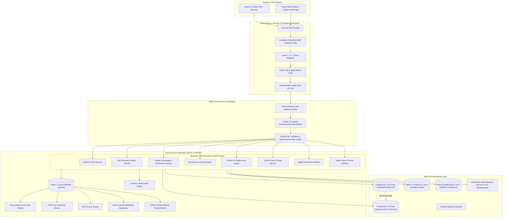

---

## 2. Frontend Client Architecture (Next.js 14 App Router)
Illustrates component composition, client state management, WebGL rendering, and API communication.

```mermaid
graph TD
    subgraph ClientShell ["Next.js 14 App Shell Architecture"]
        Layout["Root Layout (app/layout.tsx)<br/>• ThemeProvider • AuthContext • QueryClient"]
        
        subgraph RouteGroups ["App Router Domains"]
            R_Discovery["(discovery)/ • /explore • /states • /places"]
            R_Villages["(villages)/ • /villages • /panchayat"]
            R_Bookings["(bookings)/ • /experiences • /checkout"]
            R_Social["(social)/ • /feed • /profile • /guilds"]
            R_Admin["(admin)/ • /console • /moderation"]
        end

        subgraph CoreComponents ["UI Component Architecture"]
            MapCanvas["GIS Map Canvas (MapLibre GL + TopoJSON)"]
            ThreeOverlay["Three.js WebGL 3D Landmark Overlay (Draco GLB)"]
            DrawerUI["Contextual Non-Modal Preview Drawers"]
            BookingWizard["Multi-Step Checkout & Redlock Timer Wizard"]
            SocialFeedView["Virtual Infinite Scroll Feed Grid"]
        end

        subgraph ClientStateHooks ["State Management & Hooks"]
            ZustandStore["Zustand Client Store (Active Viewport, Filters)"]
            TanStackQuery["TanStack Query v5 (Server State, Caching, SWR)"]
            HookForm["React Hook Form + Zod (Strict Form Schemas)"]
            useWebSocket["useWebSocket Hook (Real-time Inventory & Alerts)"]
        end

        subgraph NetworkBFF ["Client Ingress & BFF Layer"]
            AxiosClient["Axios HTTP Client (Correlation ID + JWT Interceptor)"]
            WSSocket["Socket.io Client (Real-time Seat Updates)"]
        end

        Layout --> RouteGroups
        RouteGroups --> CoreComponents
        CoreComponents --> ClientStateHooks
        ClientStateHooks --> NetworkBFF
    end
```

---

## 3. Backend Modular Architecture (NestJS Clean Architecture)
Service decoupling and dependency injection across internal modules.

```mermaid
flowchart TD
    subgraph NestKernel ["NestJS Modular Monolith Kernel"]
        AppModule["AppModule (Root Orchestrator)"]
        
        subgraph CoreSubsystems ["Independent Domain Modules"]
            AuthModule["AuthModule (Argon2id, RS256, MFA, RTR)"]
            GeoModule["GeoSpatialModule (PostGIS, Vector Tiles, ST_AsMVT)"]
            VillageModule["VillageModule (LGD Registry, Cadastral, Staging Queue)"]
            BookingModule["BookingModule (Inventory Mutex, Redlock, Batches)"]
            PaymentModule["PaymentModule (Razorpay / Cashfree HMAC Webhooks)"]
            SocialModule["SocialModule (Hybrid Fan-Out, Stories, Guilds)"]
            CertModule["CertificateModule (PDFKit Vector Engine, HMAC Verification)"]
            AuditModule["AuditModule (Write-Only Immutability Interceptor)"]
        end

        subgraph SharedInfrastructure ["Shared Kernel & Adapters"]
            PrismaPostgres["PostgreSQL / PostGIS Repository Adapter"]
            RedisService["Redis 7 Cluster Cache & Mutex Adapter"]
            S3Service["AWS S3 Pre-Signed URL & Storage Adapter"]
            QueueProducer["BullMQ Queue Producer Adapter"]
            LoggerInterceptor["Structured JSON Logging & Telemetry"]
        end

        AppModule --> CoreSubsystems
        CoreSubsystems --> SharedInfrastructure
    end
```

---

## 4. Database Architecture & Partitioning Topology

```mermaid
graph TB
    subgraph PostgresCluster ["PostgreSQL 16 Enterprise Partitioned Topology"]
        subgraph Schemas ["Logical Schema Segregation"]
            S_Identity["identity_schema • users • credentials • mfa_factors"]
            S_Geo["geo_spatial_schema • states • districts • talukas • places"]
            S_Rural["rural_bharat_schema • villages • panchayats • staging"]
            S_Booking["booking_schema • experiences • batches • orders (Partitioned)"]
            S_Payment["payment_schema • payments (Partitioned) • ledger"]
            S_Social["social_schema • profiles • posts • stories • guilds"]
            S_Audit["audit_schema • audit_logs (Monthly Range Partitioned)"]
        end

        subgraph TablePartitioning ["Native Range Partitioning Strategy"]
            Orders_2026["orders_2026 (RANGE 2026-01-01 to 2027-01-01)"]
            Orders_2027["orders_2027 (RANGE 2027-01-01 to 2028-01-01)"]
            Audit_M01["audit_logs_2026_01 (Monthly Partition)"]
            Audit_M02["audit_logs_2026_02 (Monthly Partition)"]
        end

        subgraph IndexingEngines ["Specialized Spatial & Text Indexes"]
            GiST_Index["PostGIS GiST (geometry, location_coords, centroid)"]
            GIN_Trgm["PostgreSQL GIN Trigram (name, title, description)"]
            BRIN_Index["BRIN Timestamp Indexes (audit_logs, payments)"]
        end

        Schemas --> TablePartitioning
        Schemas --> IndexingEngines
    end
```

---

## 5. Cloud Infrastructure Topology (Multi-AZ AWS / EKS)

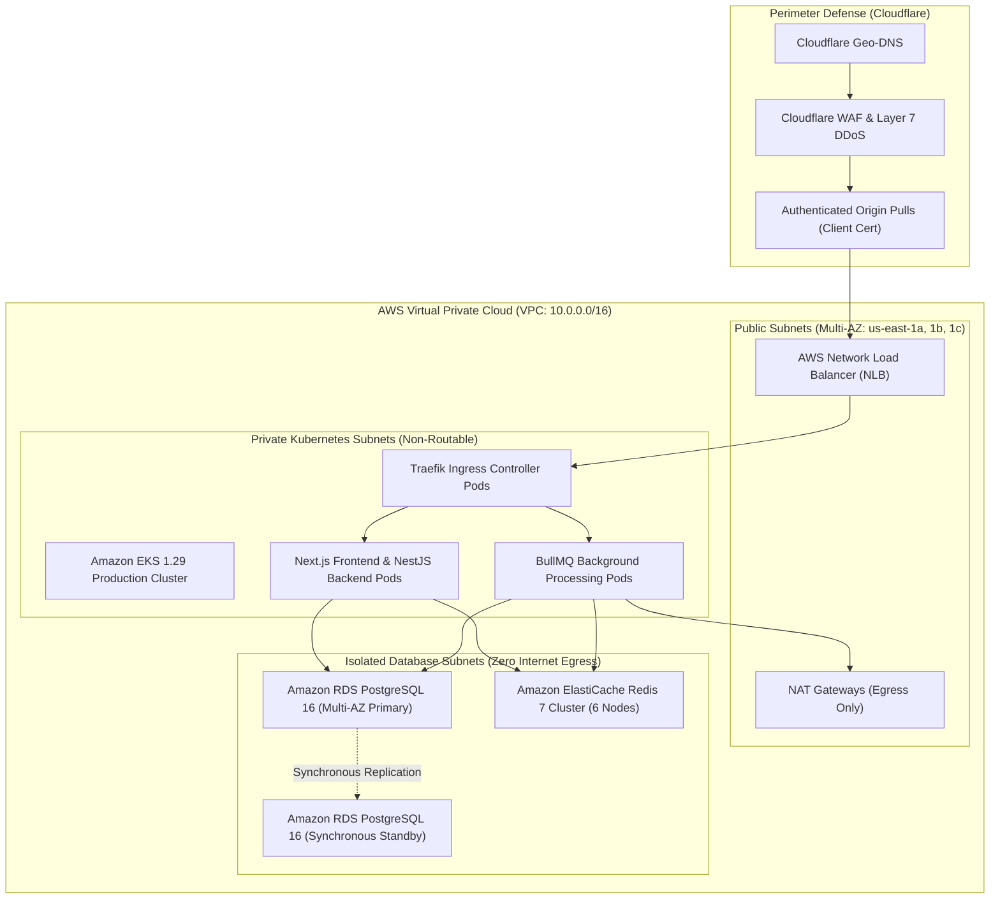

---

# SECTION II: MASTER RELATIONAL ENTITY-RELATIONSHIP DIAGRAM (ERD)

The complete cross-domain relational model covering all 22 core platform entities:

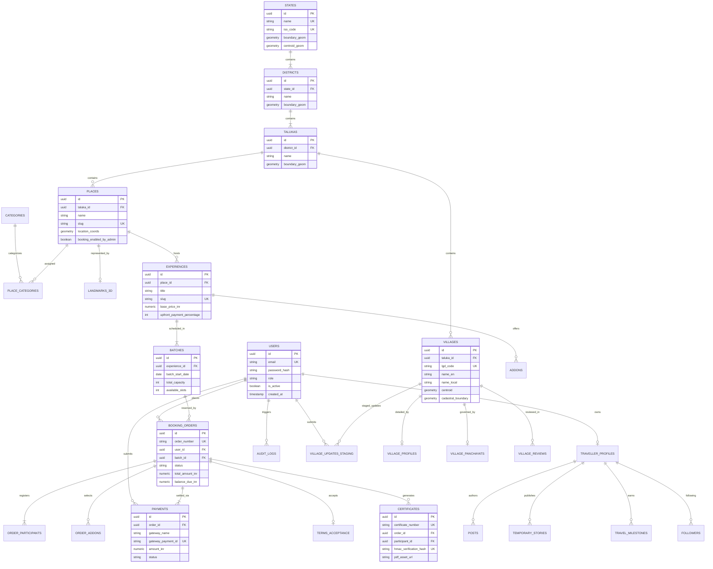

---

# SECTION III: MULTI-TIER DATA FLOW DIAGRAMS (DFD)

## 1. DFD Level 0 (System Context Diagram)
Represents the entire Explore Bharat Safar boundary interacting with external entities.

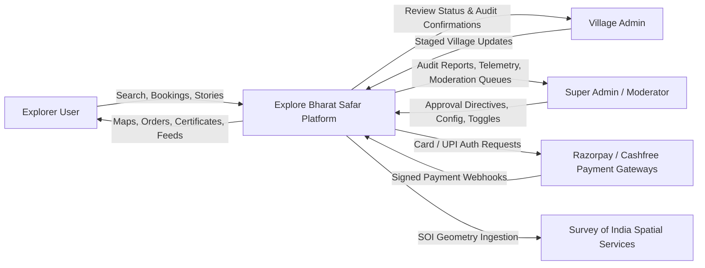

## 2. DFD Level 1 (Functional Subsystem Partitioning)

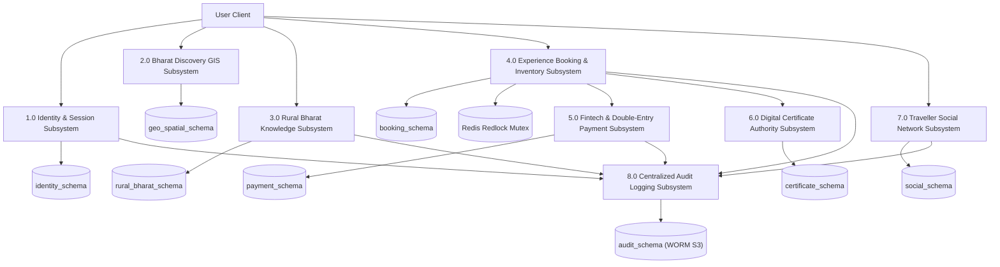

## 3. DFD Level 2 (High-Risk Ingress: Booking, Payment & Staging)

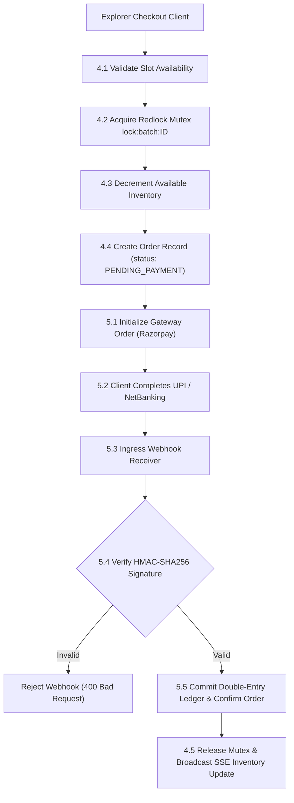

---

# SECTION IV: COMPREHENSIVE SEQUENCE DIAGRAMS

## 1. High-Concurrency Slot Reservation Flow (Redis Redlock)

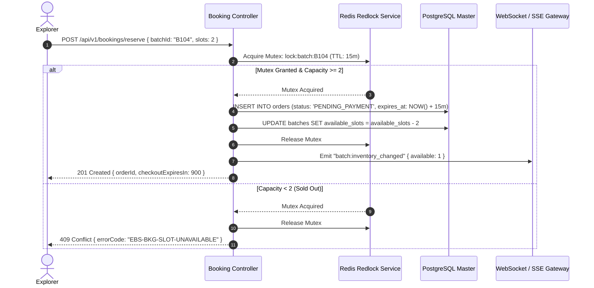

## 2. Double-Entry Payment Webhook Processing Flow

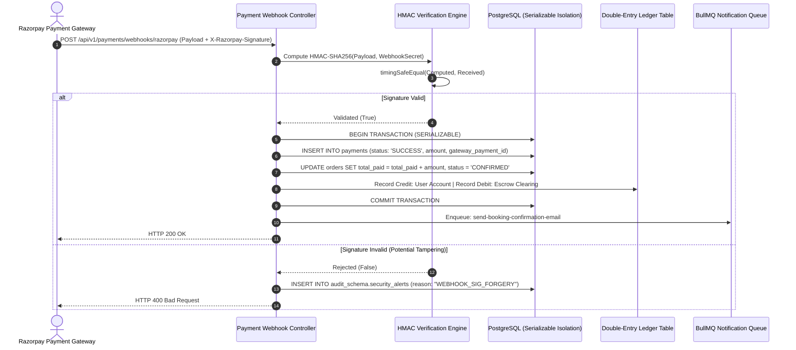

## 3. Automated Digital Certificate Issuance Handshake

```mermaid
sequenceDiagram
    autonumber
    actor Leader as Trek Leader / Admin
    participant API as Operations Controller
    participant DB as PostgreSQL 16
    participant Queue as BullMQ: certificate-generator
    participant Worker as PDF/A-1b Vector Rendering Worker
    participant S3 as AWS S3 WORM Vault
    actor Explorer as Explorer User

    Leader->>API: POST /api/v1/admin/batches/:id/attendance { participantId, attended: true }
    API->>DB: UPDATE order_participants SET attendance_verified = TRUE
    API->>DB: SELECT balance_due_inr FROM orders WHERE id = participant.order_id
    alt Attended == TRUE AND BalanceDue == 0.00
        API->>Queue: Enqueue: generate-certificate { participantId, batchId }
        API-->>Leader: 200 OK (Attendance Recorded & Certificate Queued)
        Worker->>DB: Fetch Participant Name, Experience Title, Completion Date
        Worker->>Worker: Calculate HMAC-SHA256(Secret, certId || name || date)
        Worker->>Worker: Render ISO 19005-1 PDF/A-1b with Dynamic QR Code
        Worker->>S3: Archive PDF Document in Vault
        Worker->>DB: INSERT INTO certificates (cert_number, hmac_hash, pdf_url)
        Worker-->>Explorer: Push Notification: "Your Certificate is Ready for Download"
    else BalanceDue > 0.00
        API-->>Leader: 200 OK (Attendance Recorded; Certificate Blocked Due to Balance Due)
    end
```

## 4. Decentralized Village Staging Moderation Flow

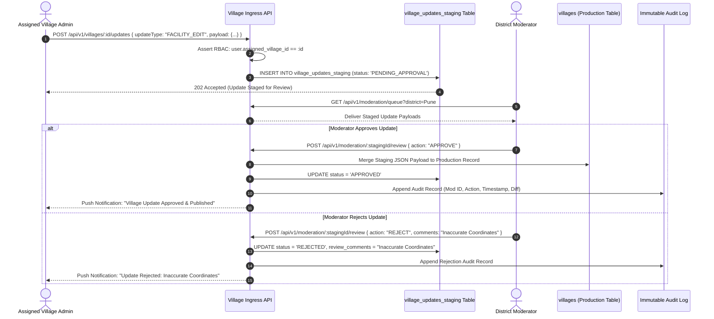

---

# SECTION V: FINITE STATE MACHINE MODELS

## 1. Booking Order Lifecycle State Machine (11 Canonical States)

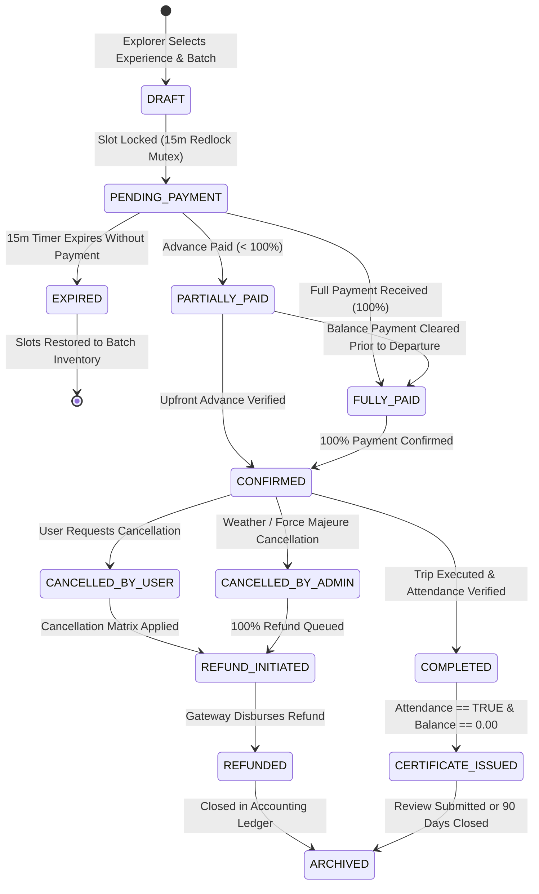

## 2. Ephemeral Travel Story 24-Hour Lifecycle

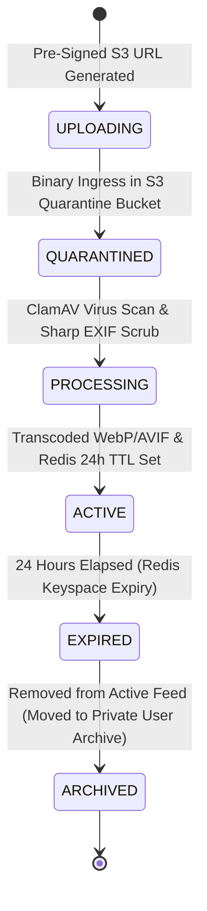

---

# SECTION VI: DOMAIN CLASS DIAGRAMS

Object-oriented domain modeling for core entities:

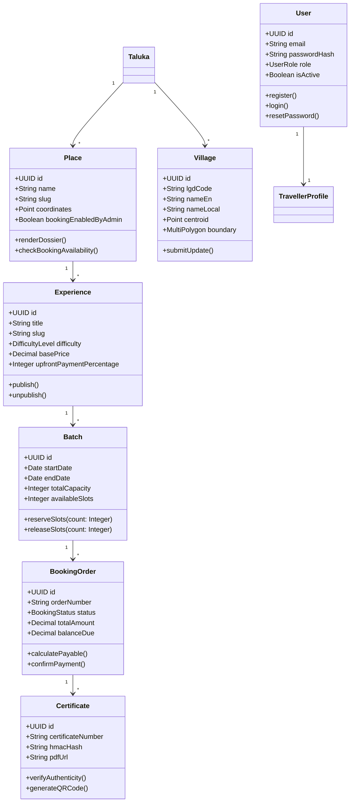

---

# SECTION VII: ERROR RECOVERY & EXCEPTION DECISION TREES

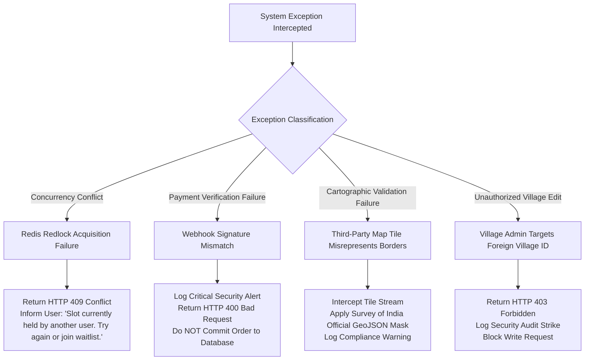

---

# SECTION VIII: FUTURE ARCHITECTURE EXTENSIONS

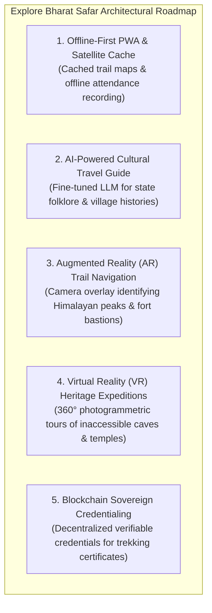

---

## Conclusion & Architectural Sign-Off

This comprehensive visual blueprint encapsulates every technical diagram, workflow, and sequence required to execute the complete **Explore Bharat Safar** ecosystem. All development squads, infrastructure engineers, and QA automation teams shall strictly build against these authoritative visual contracts.
