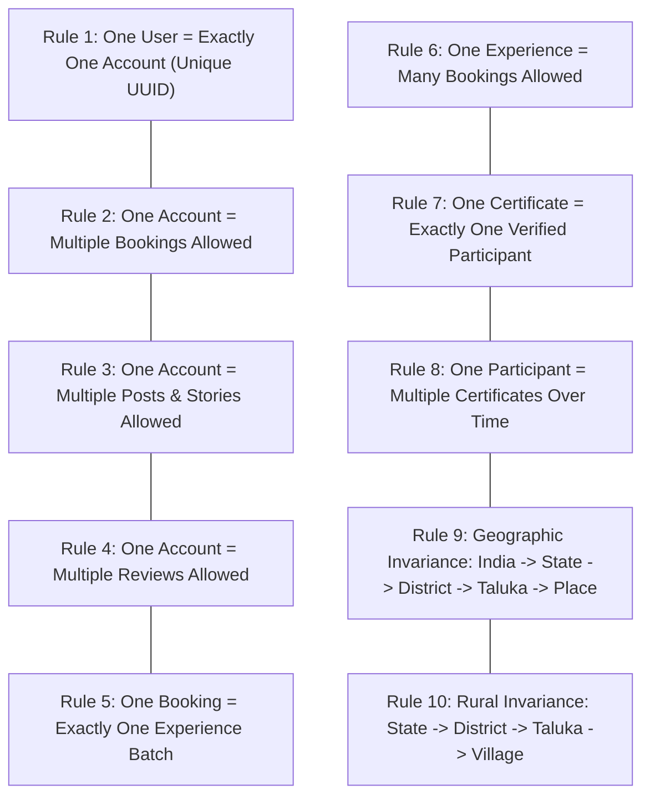
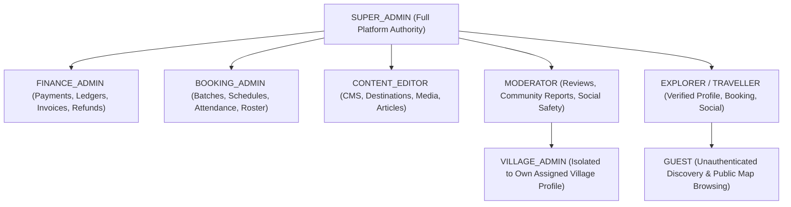
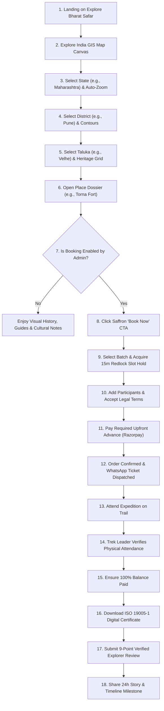
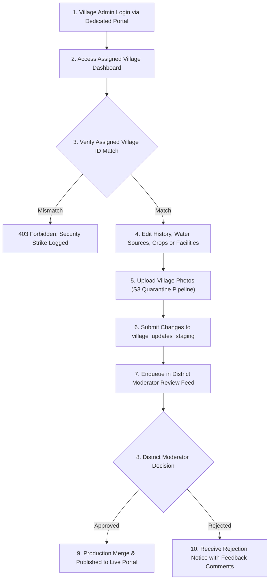
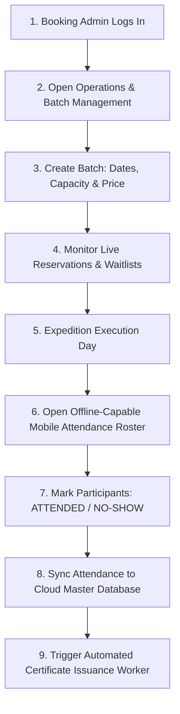
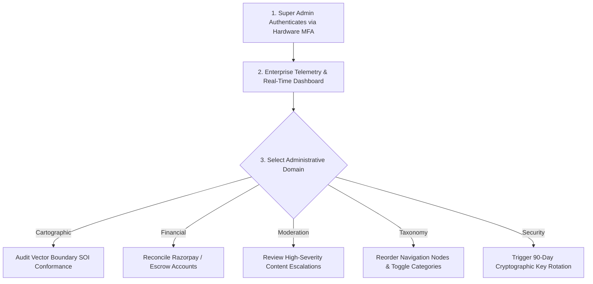

# Explore Bharat Safar — Business Logic, Validation Rules & Quality Gates Blueprint (Part 9)

- **Document Identifier**: EBS-BLU-48-BIZ
- **Version**: 1.0.0
- **Classification**: Production Architectural Specification & System Blueprint
- **Domain**: Enterprise Business Rules, Data Validation, Workflow Logic & QA Quality Gates
- **Status**: Approved & Authoritative
- **Author**: Chief Product Architect, Principal Enterprise Business Analyst, Quality Assurance Director
- **Target Audience**: Software Engineers, QA Automation Leads, Product Managers, UI/UX Designers, Security Auditors, Compliance Officers
- **Related Documents**:
  - `02-specification.md` (Functional Specifications)
  - `09-api-design.md` (API Specifications)
  - `10-database-design.md` (Database Architecture)
  - `24-testing.md` (Testing & QA Strategy)
  - `26-business-rules.md` (Codified Business Logic)
  - `38-project-checklist.md` (Project Readiness Checklist)
  - `40-enterprise-security-blueprint.md` through `47-system-diagrams-and-workflow-visualizations-blueprint.md` (Authoritative Blueprints)
- **Last Updated**: 2026-09-28

---

## Executive Summary & Business Philosophy

This blueprint establishes the authoritative **Business Logic, Invariant Functional Rules, Input Validation Specifications, User Journeys, and Production Quality Gates** for **Explore Bharat Safar**.

The platform operates under a singular unifying philosophy:

$$\text{\bf "Discover Bharat. Experience Bharat. Understand Bharat."}$$

Every feature, algorithmic state transition, API route guard, and database constraint must strictly reinforce this mission. These codified business rules take absolute precedence over implementation conveniences. Developers, designers, testers, product managers, and systems architects must maintain zero deviation from these standards.

```mermaid
graph TB
    subgraph MissionAlignment ["Core Business Philosophy & Quality Enforcement"]
        Mission["Sovereign Mission:<br/>Discover, Experience & Understand Bharat"]
        
        subgraph CorePillars ["Nine Architectural Quality Pillars"]
            P1["1. Simplicity"]
            P2["2. Consistency"]
            P3["3. Security"]
            P4["4. Performance"]
            P5["5. Accessibility"]
            P6["6. Scalability"]
            P7["7. Reliability"]
            P8["8. Maintainability"]
            P9["9. Extensibility"]
        end

        subgraph EnforcementLayers ["Enforcement & Validation Tiers"]
            Layer_UI["Tier 1: Client Form & DTO Validation (Zod)"]
            Layer_API["Tier 2: Ingress API Guards & RBAC Interceptors"]
            Layer_Domain["Tier 3: Domain Service Business Invariants"]
            Layer_DB["Tier 4: PostgreSQL Constraints & Triggers"]
            Layer_Gate["Tier 5: 10-Stage Enterprise Quality Gates"]
        end

        Mission --> CorePillars --> EnforcementLayers
    end
```

---

## 1. Global Invariant Business Rules (Ten Commandments)

The following ten global rules are immutable constraints enforced across all tiers of the platform:

### Detailed Operational Definitions
1. **Rule 1 (Identity Cardinality)**: Every registered individual must possess exactly one account record in `identity_schema.users`. Account duplication via shared mobile numbers or alias emails is blocked at database constraint level.
2. **Rule 2 (Booking Multiplicity)**: A single authenticated user can book multiple distinct batches across different dates and locations.
3. **Rule 3 (Social Multiplicity)**: An explorer may publish multiple travel journals, photo albums, and temporary stories, subject only to anti-spam rate limiting.
4. **Rule 4 (Review Multiplicity)**: An explorer may author reviews for multiple places, villages, and experiences, but is limited to **one review per completed experience booking**.
5. **Rule 5 (Booking Exclusivity)**: A booking order (`orders.id`) binds to exactly one experience batch (`batches.id`). Multi-trip bundling is handled by creating distinct linked orders.
6. **Rule 6 (Experience Capacity)**: An experience accommodates multiple scheduled batches over time, each with distinct date windows and capacities.
7. **Rule 7 (Certificate Uniqueness)**: A digital completion certificate binds to exactly one individual participant (`participant_id`). Joint or communal certificates are strictly prohibited.
8. **Rule 8 (Explorer Milestone Accumulation)**: A participant accumulates a lifetime portfolio of verified digital certificates reflecting their outdoor progression.
9. **Rule 9 (Geographical Hierarchy Invariance)**:
   $$\text{India} \longrightarrow \text{State} \longrightarrow \text{District} \longrightarrow \text{Taluka} \longrightarrow \text{Place}$$
   No place may exist without an explicit foreign key binding to an approved Taluka.
10. **Rule 10 (Rural Cadastral Hierarchy Invariance)**:
    $$\text{State} \longrightarrow \text{District} \longrightarrow \text{Taluka} \longrightarrow \text{Village (LGD Code)}$$
    Village records cannot exist independently of this administrative tree.

---

## 2. Centralized Role-Based Access Control (RBAC) Matrix

Permissions must be enforced centrally at the API gateway and domain service layers. Direct client-side permission evaluation in UI components is strictly prohibited.

| Permission / Action | Guest | Explorer | Village Admin | Moderator | Booking Admin | Finance Admin | Content Editor | Super Admin |
| :--- | :---: | :---: | :---: | :---: | :---: | :---: | :---: | :---: |
| **Browse National Map & Places** | ✅ | ✅ | ✅ | ✅ | ✅ | ✅ | ✅ | ✅ |
| **Search Scoped Section Indexes** | ✅ | ✅ | ✅ | ✅ | ✅ | ✅ | ✅ | ✅ |
| **Book Experience Batch** | ❌ | ✅ | ✅ | ✅ | ✅ | ✅ | ✅ | ✅ |
| **Publish Travel Post / Story** | ❌ | ✅ | ✅ | ✅ | ✅ | ✅ | ✅ | ✅ |
| **Submit Verified Review** | ❌ | ✅ (Attended) | ✅ | ✅ | ✅ | ✅ | ✅ | ✅ |
| **Edit Assigned Village Profile**| ❌ | ❌ | ✅ (Own Only) | ❌ | ❌ | ❌ | ❌ | ✅ |
| **Approve Village Staging Queue** | ❌ | ❌ | ❌ | ✅ (District) | ❌ | ❌ | ❌ | ✅ |
| **Verify Batch Attendance** | ❌ | ❌ | ❌ | ❌ | ✅ | ❌ | ❌ | ✅ |
| **Process Payment Refund** | ❌ | ❌ | ❌ | ❌ | ❌ | ✅ | ❌ | ✅ |
| **Publish CMS Destination Article**| ❌ | ❌ | ❌ | ❌ | ❌ | ❌ | ✅ | ✅ |
| **Manage Global Roles & Toggles** | ❌ | ❌ | ❌ | ❌ | ❌ | ❌ | ❌ | ✅ |

---

## 3. Four Canonical End-to-End User Journeys

### 3.1 Explorer / Traveller User Journey

### 3.2 Village Admin User Journey

### 3.3 Booking & Operations Admin Journey

### 3.4 Super Admin Governance Journey

---

## 4. Multi-Domain Input Validation Standards

Every incoming client payload must pass rigorous DTO validation before reaching domain logic:

| Input Field | Data Type | Constraint Rule | Regex / Pattern | Error Code | Failure Message |
| :--- | :--- | :--- | :--- | :--- | :--- |
| `email` | String | $5 - 254\text{ chars}$ | `^[^\s@]+@[^\s@]+\.[^\s@]+$` | `EBS-VAL-001` | "Please enter a valid RFC-compliant email address." |
| `password` | String | $12 - 128\text{ chars}$ | At least 1 upper, 1 lower, 1 digit, 1 symbol | `EBS-VAL-002` | "Password must be at least 12 characters with mixed types." |
| `mobile_phone` | String | $10\text{ digits}$ | `^[6-9][0-9]{9}$` | `EBS-VAL-003` | "Please enter a valid 10-digit Indian mobile number." |
| `pincode` | String | Exactly $6\text{ digits}$ | `^[1-9][0-9]{5}$` | `EBS-VAL-004` | "Please enter a valid 6-digit Indian Postal PIN code." |
| `lgd_code` | String | $5 - 10\text{ digits}$ | `^[0-9]{5,10}$` | `EBS-VAL-005` | "Invalid Local Government Directory (LGD) code." |
| `participant_age`| Integer | Between $5$ and $99$ | Numerical integer | `EBS-VAL-006` | "Participant age must be between 5 and 99 years." |
| `rating_score` | Numeric | Between $1.00$ and $5.00$ | Decimal to 2 decimal places | `EBS-VAL-007` | "Review ratings must be between 1.0 and 5.0 stars." |

---

## 5. Domain-Specific Business Validation Workflows

```mermaid
flowchart TD
    subgraph BookingGate ["Booking Validation Gate"]
        B1["1. Authenticated User?"] -->|Yes| B2["2. Batch Open & Within Booking Window?"]
        B2 -->|Yes| B3["3. Requested Slots <= Available Slots?"]
        B3 -->|Yes| B4["4. Redlock Mutex Successfully Acquired?"]
        B4 -->|Yes| B5["5. Terms Accepted (Version Stamped)?"]
        B5 -->|Yes| B_Pass["PROCEED TO PAYMENT"]
    end

    subgraph PaymentGate ["Payment Verification Gate"]
        P1["1. Active Order in PENDING_PAYMENT?"] -->|Yes| P2["2. Amount == Order Required Advance?"]
        P2 -->|Yes| P3["3. Gateway Order Successfully Created?"]
        P3 -->|Yes| P4["4. Webhook HMAC-SHA256 Signature Valid?"]
        P4 -->|Yes| P5["5. Idempotency Key Not Previously Used?"]
        P5 -->|Yes| P_Pass["COMMIT TO DOUBLE-ENTRY LEDGER"]
    end

    subgraph CertificateGate ["Certificate Clearance Gate"]
        C1["1. Batch Status == COMPLETED?"] -->|Yes| C2["2. Participant Attendance Verified == TRUE?"]
        C2 -->|Yes| C3["3. Order Balance Due == 0.00 (Fully Paid)?"]
        C3 -->|Yes| C4["4. Certificate Not Previously Issued?"]
        C4 -->|Yes| C_Pass["GENERATE PDF/A-1b QR CERTIFICATE"]
    end

    subgraph ReviewGate ["Review Publishing Gate"]
        R1["1. User Completed Verified Booking?"] -->|Yes| R2["2. Attendance Formally Marked on Trail?"]
        R2 -->|Yes| R3["3. Zero Duplicate Review for this Booking?"]
        R3 -->|Yes| R4["4. Passed Automated NLP Profanity Filter?"]
        R4 -->|Yes| R_Pass["PUBLISH WITH VERIFIED BADGE"]
    end
```

---

## 6. Ten-Stage Enterprise Quality Gates

Every feature, pull request, and release artifact must pass all ten quality gates before production rollout:

```mermaid
flowchart LR
    G1["1. Business Review"] --> G2["2. UI/UX Review"]
    G2 --> G3["3. Technical Architecture"]
    G3 --> G4["4. Security & Cryptography"]
    G4 --> G5["5. Performance & Load"]
    G5 --> G6["6. WCAG Accessibility"]
    G6 --> G7["7. Automated QA Testing"]
    G7 --> G8["8. User Acceptance (UAT)"]
    G8 --> G9["9. Production Sign-Off"]
    G9 --> G10["10. Post-Launch Telemetry"]
```

### Gate Definitions & SLAs
1. **Gate 1: Business Review**: Verified adherence to the ten commandments and cultural philosophy of Bharat.
2. **Gate 2: UI/UX Review**: Design system fidelity, responsive breakpoints, and smooth motion design.
3. **Gate 3: Technical Architecture**: Clean Architecture compliance, modular separation, and zero circular dependencies.
4. **Gate 4: Security & Cryptography**: SAST/SCA clean scans (zero high/critical vulnerabilities), Argon2id/RS256 compliance, and DPDP Act adherence.
5. **Gate 5: Performance & Load**: Sustained load testing verifying:
   - Initial Page Load Time (TTI): $\le 1.8\text{ seconds}$ on 4G networks.
   - API p95 Response Latency: $\le 85\text{ milliseconds}$.
   - Redis Cache Hit Ratio: $\ge 92\%$.
   - WebGL Map Rendering: Sustained $60\text{ FPS}$ during camera panning and zooming.
6. **Gate 6: Accessibility (WCAG 2.1 AA)**: Full keyboard navigability, screen reader ARIA support, and color contrast ratio $\ge 4.5:1$.
7. **Gate 7: Automated QA Testing**: $> 85\%$ unit test coverage, 100% PostGIS spatial integration tests passing, and zero regressions.
8. **Gate 8: User Acceptance (UAT)**: Business stakeholder verification in staging environment.
9. **Gate 9: Production Approval**: Cryptographically signed release artifact (Cosign) authorized by the Principal Systems Architect.
10. **Gate 10: Post-Launch Telemetry**: Automated 24-hour canary monitoring verifying error rates $< 0.05\%$.

---

## 7. Future Expansion Invariance Mandate

The system architecture is engineered such that future platform enhancements shall **never** require fundamental database schema redesigns or core service rewrites:
- **Mobile Native Application**: Ingests the existing versioned REST/WebSocket API contracts without backend alteration.
- **Offline PWA Mapping**: Utilizes cached TopoJSON vector tiles stored in IndexedDB without modifying PostGIS geometries.
- **AI-Powered Heritage Guide**: Operates as a stateless consumer querying existing vector search endpoints.
- **Augmented Reality (AR) Trail Navigation**: Anchors AR elements directly to existing PostGIS place coordinates and elevation attributes.
- **Cross-Border International Expeditions**: Accommodated via multi-currency database configurations without altering the core booking engine.

---

## Conclusion & Architectural Sign-Off

This document constitutes the final, non-negotiable operational standard for **Explore Bharat Safar**. All engineering squads, quality assurance testers, and project managers shall strictly measure production deliverables against the business rules, validation matrices, and quality gates detailed herein.
