# Explore Bharat Safar — Project Folder & Repository Structure Blueprint (Part 10)

- **Document Identifier**: EBS-BLU-49-REPO
- **Version**: 1.0.0
- **Classification**: Production Architectural Specification & System Blueprint
- **Domain**: Enterprise Repository Architecture, Monorepo Topology, Codebase Governance & Modular Engineering
- **Status**: Approved & Authoritative
- **Author**: Principal Software Architect, Enterprise Solution Architect, Cloud & DevOps Lead, Senior Full Stack Director
- **Target Audience**: Technical Directors, Lead Architects, Fullstack Engineers, DevOps/SRE Leads, Security Officers, QA Automation Leads
- **Related Documents**:
  - `03-architecture.md` (High-Level Architecture)
  - `09-api-design.md` (RESTful API Contracts)
  - `10-database-design.md` (Database Architecture)
  - `22-deployment.md` (Cloud Deployment & Infrastructure)
  - `23-devops.md` (DevOps & CI/CD)
  - `26-business-rules.md` (Business Logic & Invariants)
  - `27-folder-structure.md` (Initial Monorepo Tree)
  - `40-enterprise-security-blueprint.md` (Enterprise Security Blueprint)
  - `41-bharat-discovery-engine-blueprint.md` (Bharat Discovery Engine Blueprint)
  - `42-village-knowledge-system-blueprint.md` (Village Knowledge System Blueprint)
  - `43-travel-booking-and-experience-management-blueprint.md` (Booking System Blueprint)
  - `44-traveller-social-network-and-community-blueprint.md` (Social Network Blueprint)
  - `45-core-technical-architecture-and-infrastructure-blueprint.md` (Core Technical Architecture Blueprint)
  - `46-documentation-standards-and-file-specifications-blueprint.md` (Documentation Standards Blueprint)
  - `47-system-diagrams-and-workflow-visualizations-blueprint.md` (System Diagrams Blueprint)
  - `48-business-logic-validation-rules-and-quality-gates-blueprint.md` (Business Logic Blueprint)
- **Last Updated**: 2026-09-28

---

## Executive Summary & Architectural Vision

This master blueprint establishes the definitive **Enterprise Repository Structure, Codebase Topology, Folder Governance, and Module Boundary Architecture** for the entire **Explore Bharat Safar** digital ecosystem.

Engineered to sustain a **10–20 year operational horizon**, this repository architecture is modeled after the software engineering practices of hyper-scale technology enterprises (such as Google, Amazon, Meta, and Uber). It provides a unified, strictly governed monorepo foundation that seamlessly balances rapid full-stack feature velocity with institutional code quality, zero circular dependencies, atomic type safety, and microservice-readiness.

The platform architecture strictly supports the four core sovereign pillars established in the master documentation suite:
1. **Bharat Discovery Engine (Section 1)**: Interactive GIS mapping, WebGL 3D landmarks, and hierarchical spatial navigation.
2. **Rural Bharat Knowledge System (Section 2)**: Authoritative civic and cultural knowledge registry for 650,000+ villages with DPDP Act compliance.
3. **Experience Booking Engine (Section 3)**: High-concurrency inventory, 15-minute Redlock distributed slot locks, partial advances, and double-entry financial accounting.
4. **Traveller Social Network (Section 4)**: Vertical travel social graph, hybrid fan-out feeds, 24-hour ephemeral stories, badges, and community guilds.

Every directory, module, package, and file defined in this document is bound by an immutable set of engineering rules: **Purpose, Responsibilities, Allowed Files, Disallowed Files, Dependencies, Consumers, and Scalability Horizons**.

```mermaid
graph TB
    subgraph MonorepoRoot ["Explore Bharat Safar — Enterprise Monorepo Root (Turborepo + pnpm)"]
        Apps["apps/ (Deployable Applications)"]
        Packages["packages/ (Shared Internal Domain Packages)"]
        Infra["infrastructure/ (Cloud IaC & Container Manifests)"]
        Tooling["tooling/ (Build Tools, AST Rules & Linters)"]
        Scripts["scripts/ (Database Migrations, DR & Seeding)"]
        Docs["docs/ (Architectural Specs & ADRs)"]
        CI[".github/ (Enterprise CI/CD Pipelines & Security Gates)"]
    end

    Apps --> WebApp["apps/web (Next.js 14+ App Router)"]
    Apps --> APIApp["apps/api (NestJS 10+ Modular Monolith)"]
    Apps --> WorkerApp["apps/worker (BullMQ Background Workers)"]

    Packages --> DB["packages/database (PostgreSQL 16 + PostGIS)"]
    Packages --> Types["packages/types (Shared DTOs & Contracts)"]
    Packages --> UI["packages/ui (Accessible Design System)"]
    Packages --> Crypto["packages/security-crypto (Argon2id, RS256, AES-GCM)"]
    Packages --> GIS["packages/gis-core (Spatial Math & Projections)"]
    Packages --> Logger["packages/logger (OpenTelemetry + Pino)"]
    Packages --> Validators["packages/validators (Shared Zod Schemas)"]
```

---

# SECTION 1: MASTER REPOSITORY STRUCTURE & TOPOLOGY

## 1.1 Monorepo Strategy & Technology Selection

To achieve maximum engineering velocity while maintaining enterprise-grade boundary enforcement across multiple squads, Explore Bharat Safar utilizes a **single unified monorepo** managed via **pnpm Workspaces** and orchestrated by **Turborepo**:

- **Atomic Commits & Versioning**: Cross-cutting changes spanning database schemas, API DTO contracts, and frontend React Server Components can be validated, reviewed, and deployed in a single atomic pull request, eliminating version skew.
- **Computation Caching & Parallel Pipelines**: Turborepo constructs a Directed Acyclic Graph (DAG) of all package tasks (`build`, `lint`, `test`, `type-check`), caching intermediate artifacts both locally and in remote CI caches.
- **Strict Dependency Sandboxing**: pnpm's content-addressable storage and hard-link node_modules structure strictly prevents phantom dependencies (importing packages not explicitly declared in `package.json`).
- **Microservice Extraction Path**: Every module inside `apps/api` implements clean domain boundaries such that any domain service can be extracted into an independent deployable container within $<48\text{ hours}$ without codebase refactoring.

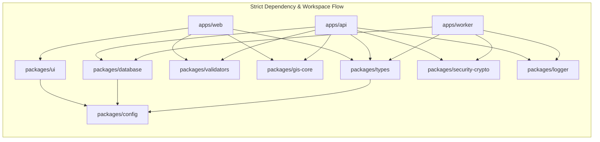

---

## 1.2 High-Level Master Repository Tree

```text
explore-bharat-safar/
├── .github/                                  # Continuous integration, delivery & compliance workflows
├── apps/                                     # Deployable application services
│   ├── web/                                  # Next.js 14+ App Router frontend application
│   ├── api/                                  # NestJS 10.x enterprise modular backend
│   └── worker/                               # BullMQ background job processing service
├── packages/                                 # Shared internal enterprise libraries & domain packages
│   ├── database/                             # PostgreSQL 16 + PostGIS schema, migrations & seeders
│   ├── types/                                # Universal TypeScript data contracts, DTOs & event schemas
│   ├── ui/                                   # Shared Tailwind CSS + Radix UI design system primitives
│   ├── config/                               # Centralized ESLint, TypeScript & Tailwind configurations
│   ├── security-crypto/                      # Cryptographic utilities (Argon2id, RS256, AES-GCM, HMAC)
│   ├── gis-core/                             # Spatial mathematics, TopoJSON simplification & GIS projections
│   ├── logger/                               # Structured Pino logger with OpenTelemetry tracing context
│   ├── validators/                           # Shared Zod validation schemas for forms, APIs & envs
│   └── analytics/                            # Telemetry event schemas & Prometheus metric definitions
├── infrastructure/                           # Cloud infrastructure as code & container configurations
│   ├── terraform/                            # Modular cloud infrastructure (AWS / DigitalOcean / Cloudflare)
│   ├── k8s/                                  # Kubernetes manifests, Traefik ingress & Helm charts
│   ├── docker/                               # Multi-stage distroless container specifications
│   └── cloudflare/                           # Edge worker scripts, WAF rules & CDN caching policies
├── tooling/                                  # Custom development tools, AST linters & generators
│   ├── eslint-plugin-ebs-boundaries/         # Custom AST rule enforcing module boundary constraints
│   └── generators/                           # Plop.js code templates for modules, components & hooks
├── scripts/                                  # DevOps, migration, database seeding & DR automation
├── docs/                                     # System documentation, ADRs, RFCs & OpenAPI contracts
│   ├── adr/                                  # Architectural Decision Records (ADR 001 - ADR 099)
│   ├── api-specs/                            # Bundled OpenAPI / Swagger JSON contracts
│   └── runbooks/                             # Production incident response & disaster recovery manuals
├── .editorconfig                             # Global editor whitespace & indentation rules
├── .gitignore                                # Git ignore patterns across all workspaces
├── .npmrc                                    # pnpm strict dependency resolution configuration
├── .nvmrc                                    # Node.js LTS version lock (v20.x)
├── .prettierrc.js                            # Unified code formatting configuration
├── package.json                              # Root monorepo metadata & orchestration scripts
├── pnpm-lock.yaml                            # Cryptographically locked dependency graph
├── pnpm-workspace.yaml                       # pnpm multi-package workspace declaration
├── README.md                                 # Monorepo onboarding & developer handbook
├── tsconfig.base.json                        # Root TypeScript compiler options
└── turbo.json                                # Turborepo pipeline caching & execution DAG
```

---

# SECTION 2: ROOT DIRECTORY SPECIFICATION & GOVERNANCE

To eliminate ambiguity across large engineering teams, every folder at the root level is governed by an exhaustive specification covering seven mandatory engineering dimensions.

---

### 2.1 `apps/` Directory

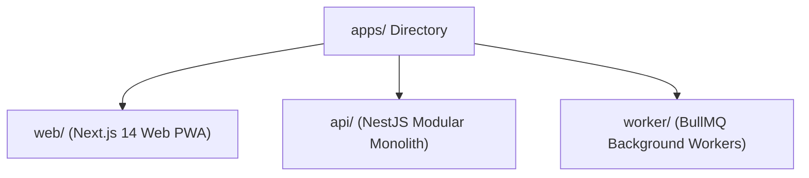

| Dimension | Specification |
| :--- | :--- |
| **Purpose** | Contains all independently deployable execution units, services, and applications within the Explore Bharat Safar ecosystem. |
| **Responsibilities** | Encapsulates runtime lifecycles, ingress routing, framework initialization, application configuration binding, and delivery to compute clusters. |
| **Allowed Files** | Application workspace directories (`web/`, `api/`, `worker/`). Top-level directory files are strictly limited to `.gitkeep` if empty. |
| **Disallowed Files** | Shared business logic, database entities, utility scripts, shared types, UI components, raw images, markdown docs. |
| **Dependencies** | May depend on any package in `packages/*`. Applications **must never** depend on or import from peer applications inside `apps/*` (e.g., `apps/web` cannot import from `apps/api`). |
| **Who Uses It** | Full-stack software engineers, DevOps/SRE engineers running local environments or deploying pods via CI/CD. |
| **Scalability Considerations** | Future microservices (e.g., `apps/gis-service`, `apps/billing-service`) can be added here without altering monorepo structure. |

---

### 2.2 `packages/` Directory

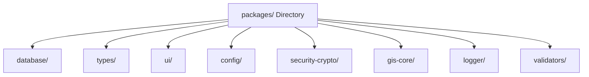

| Dimension | Specification |
| :--- | :--- |
| **Purpose** | Houses all reusable, highly decoupled, internal domain packages and shared libraries consumed by applications. |
| **Responsibilities** | Exposing clean, versioned TypeScript interfaces, database schemas, cryptographic utilities, design primitives, and configuration presets. |
| **Allowed Files** | Individual package directories (`database/`, `types/`, `ui/`, `config/`, `security-crypto/`, `gis-core/`, `logger/`, `validators/`, `analytics/`). |
| **Disallowed Files** | Deployable services, web entrypoints, HTTP controller routing, framework bootstrap code, raw Dockerfiles. |
| **Dependencies** | Packages may depend on other packages in `packages/*` following a strict acyclic dependency hierarchy (e.g., `types` has zero internal dependencies; `ui` depends on `config`). Packages **never** depend on `apps/*`. |
| **Who Uses It** | All software engineering squads building frontend features, backend controllers, background jobs, or database migrations. |
| **Scalability Considerations** | Enables infinite modular reuse; allows internal packages to be published to a private npm registry if external SDKs are ever required. |

---

### 2.3 `infrastructure/` Directory

| Dimension | Specification |
| :--- | :--- |
| **Purpose** | Declarative specification of all cloud resources, networking, container definitions, and edge security configurations. |
| **Responsibilities** | Infrastructure as Code (IaC), Kubernetes orchestration manifests, Traefik ingress routing, Cloudflare WAF and cache policies. |
| **Allowed Files** | Terraform configuration files (`.tf`, `.tfvars`), Kubernetes YAML manifests (`k8s/base/`, `k8s/overlays/`), Helm charts, multi-stage Dockerfiles. |
| **Disallowed Files** | Application source code (`.ts`, `.tsx`), database seeders, private credentials, raw SSL certificates, unencrypted secrets. |
| **Dependencies** | Consumes compiled container artifacts from `apps/*` via AWS ECR or private container registries. Independent of application code. |
| **Who Uses It** | Cloud Architects, DevOps Engineers, Site Reliability Engineers (SRE), and DevSecOps compliance officers. |
| **Scalability Considerations** | Partitioned into modular environments (`dev/`, `staging/`, `prod/`, `dr/`) to support multi-region expansion and disaster recovery. |

---

### 2.4 `tooling/` Directory

| Dimension | Specification |
| :--- | :--- |
| **Purpose** | Repository-wide developer tooling, static analysis rule extensions, and code scaffolding automation. |
| **Responsibilities** | Enforcing architectural boundaries at build time via custom ESLint AST plugins, automating boilerplate generation via Plop.js. |
| **Allowed Files** | Custom ESLint plugins (`eslint-plugin-ebs-boundaries`), AST analysis scripts, generator templates (`generators/*.hbs`), build scripts. |
| **Disallowed Files** | Production application runtime code, customer-facing assets, database connection strings, application logic. |
| **Dependencies** | ESLint, TypeScript AST tools, Plop, Handlebars. Zero production dependencies. |
| **Who Uses It** | All software developers during code authoring and CI pipelines during static analysis verification. |
| **Scalability Considerations** | Scales to include custom TypeScript compiler plugins, commitlint rule extensions, and automated architecture validation linters. |

---

### 2.5 `scripts/` Directory

| Dimension | Specification |
| :--- | :--- |
| **Purpose** | Standalone operational automation scripts for database lifecycle management, disaster recovery drills, and local setup. |
| **Responsibilities** | PostGIS database initialization, Survey of India geographic boundary ingestion, demo data synthesis, air-gapped backup restoration. |
| **Allowed Files** | Shell scripts (`.sh`, `.ps1`), TypeScript operational scripts (`.ts` executed via `tsx`), data seeders, backup verification utilities. |
| **Disallowed Files** | UI components, HTTP endpoints, business domain entities, persistent server listeners. |
| **Dependencies** | Depends on `packages/database`, `packages/logger`, and Node.js built-in runtime modules. |
| **Who Uses It** | SREs, Database Administrators (DBAs), and developers during local onboarding (`pnpm run seed`). |
| **Scalability Considerations** | Structured into subdirectories (`scripts/db/`, `scripts/dr/`, `scripts/deploy/`) to accommodate expanding operational automation. |

---

### 2.6 `docs/` Directory

| Dimension | Specification |
| :--- | :--- |
| **Purpose** | Living repository technical documentation, Architectural Decision Records (ADRs), RFCs, and OpenAPI specification artifacts. |
| **Responsibilities** | Maintaining technical decision provenance, architecture diagrams, incident runbooks, and machine-readable API contracts. |
| **Allowed Files** | Markdown documentation (`.md`), OpenAPI/Swagger schemas (`.json`, `.yaml`), Mermaid diagrams, system runbooks. |
| **Disallowed Files** | Production source code, binary executables, sensitive enterprise network topologies, unredacted customer data. |
| **Dependencies** | Pure documentation. Zero runtime dependencies. |
| **Who Uses It** | Technical Writers, Software Architects, Security Auditors, New Developer Hires, Systems Integrators. |
| **Scalability Considerations** | Versioned alongside code branches; acts as the authoritative knowledge repository for the next 20 years of platform maintenance. |

---

### 2.7 `.github/` Directory

| Dimension | Specification |
| :--- | :--- |
| **Purpose** | GitHub enterprise configuration, automated CI/CD workflows, pull request templates, and security scanning policies. |
| **Responsibilities** | Automated building, linting, unit testing, PostGIS spatial integration testing, Trivy container scanning, and Cosign image signing. |
| **Allowed Files** | YAML workflow files (`.github/workflows/*.yml`), issue templates (`.github/ISSUE_TEMPLATE/*.md`), pull request templates, CODEOWNERS. |
| **Disallowed Files** | Application source code, private deployment keys, database passwords, binary binaries. |
| **Dependencies** | GitHub Actions runners, Docker CLI, Turborepo remote cache, SonarQube, AWS ECR/EKS actions. |
| **Who Uses It** | DevOps Engineers, QA Automation Leads, Engineering Managers, and all developers submitting pull requests. |
| **Scalability Considerations** | Modular composite actions (`.github/actions/`) used to deduplicate workflow logic across all three applications. |

---

# SECTION 3: FRONTEND APPLICATION ARCHITECTURE (`apps/web`)

The frontend application is engineered using **Next.js 14+ with App Router**, strictly adhering to the architectural boundary between **React Server Components (RSC)** and **Client Components**.

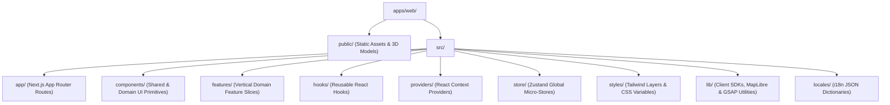

---

## 3.1 Comprehensive Directory Tree: `apps/web`

```text
apps/web/
├── public/                                   # Static assets served directly from origin root
│   ├── brand/                                # Official logos, emblems, Ashoka Chakra marks, favicons
│   │   ├── logo-full.svg
│   │   ├── logo-emblem.svg
│   │   └── favicon.ico
│   ├── geo/                                  # Pre-rendered, compressed national TopoJSON files
│   │   ├── india-national-boundary.topojson  # Authoritative national perimeter
│   │   ├── india-states-simplified.topojson  # State boundaries (500m precision)
│   │   └── india-districts.topojson          # District spatial geometry
│   ├── models/                               # WebGL 3D GLB models (Draco compressed)
│   │   ├── monuments/                        # 3D landmark models (Qutub Minar, Hampi, Konark)
│   │   └── terrain/                          # Digital elevation models (DEM)
│   └── fonts/                                # Self-hosted variable typography (Inter, Rozha One)
│
├── src/
│   ├── app/                                  # Next.js 14+ App Router root
│   │   ├── (auth)/                           # Route Group: Explorer & Administrator Authentication
│   │   │   ├── login/
│   │   │   │   └── page.tsx
│   │   │   ├── register/
│   │   │   │   └── page.tsx
│   │   │   ├── mfa-challenge/
│   │   │   │   └── page.tsx
│   │   │   ├── reset-password/
│   │   │   │   └── page.tsx
│   │   │   └── layout.tsx                    # Clean auth card shell without standard header/footer
│   │   │
│   │   ├── (discovery)/                      # Route Group: Section 1 — Bharat Discovery Engine
│   │   │   ├── explore/
│   │   │   │   ├── page.tsx                  # Full-viewport interactive India canvas
│   │   │   │   └── loading.tsx               # Skeleton map placeholder
│   │   │   ├── states/
│   │   │   │   └── [stateSlug]/
│   │   │   │       ├── page.tsx              # Deep-dive state portal (ISR cached)
│   │   │   │       ├── districts/
│   │   │   │       │   └── [districtSlug]/
│   │   │   │       │       └── page.tsx      # District cultural overview & places list
│   │   │   │       └── layout.tsx
│   │   │   ├── places/
│   │   │   │   └── [placeSlug]/
│   │   │   │       └── page.tsx              # Rich place dossier with 3D landmark viewer
│   │   │   └── layout.tsx                    # Discovery layout with persistent navigation ribbon
│   │   │
│   │   ├── (villages)/                       # Route Group: Section 2 — Rural Bharat Knowledge System
│   │   │   ├── villages/
│   │   │   │   ├── page.tsx                  # Village directory search & LGD locator
│   │   │   │   └── [lgdCode]/
│   │   │   │       ├── page.tsx              # Authoritative village page (Civic, history, crafts)
│   │   │   │       └── contribute/
│   │   │   │           └── page.tsx          # Crowd-sourced contribution modal form
│   │   │   ├── panchayat/
│   │   │   │   └── [id]/
│   │   │   │       └── page.tsx              # Gram Panchayat administrative overview
│   │   │   └── layout.tsx
│   │   │
│   │   ├── (bookings)/                       # Route Group: Section 3 — Experience Booking Engine
│   │   │   ├── experiences/
│   │   │   │   ├── page.tsx                  # Experiences catalog (treks, immersions, tours)
│   │   │   │   └── [slug]/
│   │   │   │       ├── page.tsx              # Experience details, batch selector & itinerary
│   │   │   │       └── book/
│   │   │   │           └── page.tsx          # Participant form & waiver agreement
│   │   │   ├── checkout/
│   │   │   │   └── [orderId]/
│   │   │   │       └── page.tsx              # Razorpay/Cashfree payment card with 15m lock timer
│   │   │   ├── confirmation/
│   │   │   │   └── [bookingReference]/
│   │   │   │       └── page.tsx              # Success page with downloadable pass & QR code
│   │   │   └── layout.tsx
│   │   │
│   │   ├── (social)/                         # Route Group: Section 4 — Traveller Social Network
│   │   │   ├── feed/
│   │   │   │   └── page.tsx                  # Vertical travel feed & active stories tray
│   │   │   ├── stories/
│   │   │   │   └── [storyId]/
│   │   │   │       └── page.tsx              # Full-screen ephemeral 24h story viewer
│   │   │   ├── profile/
│   │   │   │   └── [username]/
│   │   │   │       └── page.tsx              # Explorer passport, certificates, travel stats
│   │   │   ├── guilds/
│   │   │   │   └── [guildSlug]/
│   │   │   │       └── page.tsx              # Regional community guild discussions & meetups
│   │   │   └── layout.tsx
│   │   │
│   │   ├── (admin)/                          # Route Group: Administrative & Moderation Consoles
│   │   │   ├── super-admin/
│   │   │   │   ├── dashboard/page.tsx
│   │   │   │   ├── audit-logs/page.tsx
│   │   │   │   └── roles/page.tsx
│   │   │   ├── village-admin/
│   │   │   │   ├── moderation-queue/page.tsx
│   │   │   │   └── registry-update/page.tsx
│   │   │   ├── booking-admin/
│   │   │   │   ├── batches/page.tsx
│   │   │   │   └── manifests/page.tsx
│   │   │   └── layout.tsx                    # Secure admin shell with sidebar & session timeout
│   │   │
│   │   ├── api/                              # Next.js BFF (Backend-for-Frontend) Proxy Routes
│   │   │   ├── auth/session/route.ts         # Encrypted HTTP-only cookie session sync
│   │   │   ├── health/route.ts               # Pod liveness & readiness check
│   │   │   └── revalidate/route.ts           # On-demand ISR revalidation webhook
│   │   │
│   │   ├── not-found.tsx                     # Global 404 handler with cultural illustration
│   │   ├── error.tsx                         # Global error boundary handler with error reporter
│   │   ├── loading.tsx                       # Global page transition fallback
│   │   ├── layout.tsx                        # Global root layout (HTML, body, theme, font bindings)
│   │   └── page.tsx                          # Platform homepage & grand interactive entrance
│   │
│   ├── components/                           # Reusable UI component library
│   │   ├── server/                           # React Server Components (Zero client JS bundle)
│   │   │   ├── state-card-server.tsx
│   │   │   ├── village-civic-grid.tsx
│   │   │   └── booking-manifest-summary.tsx
│   │   ├── client/                           # Client Components (Explicit 'use client' directive)
│   │   │   ├── map-canvas-interactive.tsx    # MapLibre WebGL canvas container
│   │   │   ├── three-landmark-renderer.tsx   # Three.js 3D monument viewer
│   │   │   ├── slot-lock-countdown.tsx       # Live 15-minute Redlock client timer
│   │   │   └── story-progress-bar.tsx        # 15-second auto-advancing story bar
│   │   ├── shared/                           # Ubiquitous shared UI primitives
│   │   │   ├── header/
│   │   │   ├── footer/
│   │   │   ├── modal/
│   │   │   ├── badge/
│   │   │   └── drawer/
│   │   └── discovery/                        # Section 1 specific components
│   │   └── village/                          # Section 2 specific components
│   │   └── booking/                          # Section 3 specific components
│   │   └── social/                           # Section 4 specific components
│   │   └── admin/                            # Administrative data tables & controls
│   │
│   ├── features/                             # Vertical slice feature modules
│   │   ├── map-explorer/                     # GIS map viewport, layer toggles, zoom controller
│   │   ├── village-registry/                 # Village directory search, LGD filters, staging form
│   │   ├── booking-wizard/                   # Multi-step checkout, passenger forms, waiver sign
│   │   ├── social-feed/                      # Infinite post virtualizer, media carousel, reactions
│   │   └── certificate-viewer/               # Dynamic PDF viewer, HMAC badge verification
│   │
│   ├── hooks/                                # Custom React hooks
│   │   ├── use-map-viewport.ts               # Viewport bounds, zoom, and active state bounding box
│   │   ├── use-slot-lock-timer.ts            # High-precision 15m Redlock countdown with expiry callback
│   │   ├── use-websocket-presence.ts         # Real-time WebSocket connection to NestJS gateway
│   │   └── use-debounce.ts                   # Debounce hook for instant search queries
│   │
│   ├── providers/                            # Client-side React context providers
│   │   ├── query-provider.tsx                # TanStack React Query v5 client configuration
│   │   ├── auth-provider.tsx                 # Client auth session state & token refresher
│   │   ├── theme-provider.tsx                # Dark / Light theme provider (Tailwind tokens)
│   │   └── accessibility-provider.tsx        # High-contrast, dyslexia-friendly font & screen reader support
│   │
│   ├── store/                                # Lightweight client state (Zustand)
│   │   ├── map-store.ts                      # Active state, selected place, 3D layer visibility
│   │   ├── booking-draft-store.ts            # In-progress booking steps & selected batch UUID
│   │   └── story-viewer-store.ts             # Active story index, pause state, mute toggle
│   │
│   ├── styles/                               # Global styling & Tailwind configuration
│   │   ├── globals.css                       # CSS resets, root variables, brand color palette
│   │   └── typography.css                    # Scaled typography, font fallbacks, Devanagari rules
│   │
│   ├── lib/                                  # Client-side helpers & SDK instantiators
│   │   ├── api-client.ts                     # Fetch wrapper with auto-correlation headers & error handling
│   │   ├── maplibre-utils.ts                 # Vector tile layer styling & boundary highlighting
│   │   └── gsap-utils.ts                     # Pre-configured GSAP timelines and ScrollTrigger bounds
│   │
│   └── locales/                              # Multi-lingual JSON translation dictionaries
│       ├── en/                               # English (Default)
│       ├── hi/                               # Hindi (हिंदी)
│       ├── mr/                               # Marathi (मराठी)
│       └── ta/                               # Tamil (தமிழ்)
│
├── .eslintrc.js                              # Next.js strict ESLint configuration
├── next.config.mjs                           # Next.js 14 enterprise configuration (Image optimization, headers)
├── package.json                              # apps/web package dependencies & scripts
├── postcss.config.js                         # PostCSS configuration with Tailwind & Autoprefixer
├── tailwind.config.ts                        # Extended Tailwind tokens matching 06-styleguide.md
└── tsconfig.json                             # TypeScript configuration with @/* path aliases
```

---

## 3.2 Frontend Folder Governance & Invariant Rules

### `apps/web/src/components/server/`
- **Purpose**: Houses pure React Server Components (RSC) that fetch data directly or render static markup.
- **Responsibilities**: Executing on the Node.js server tier during SSR; streaming HTML directly to the browser with zero client JavaScript bundle impact.
- **Allowed Files**: Pure `.tsx` components without React lifecycle hooks (`useState`, `useEffect`) and without DOM event handlers (`onClick`, `onChange`).
- **Disallowed Files**: Components containing `'use client'`, client-side hooks, browser APIs (`window`, `localStorage`), or DOM listeners.
- **Dependencies**: May import from `packages/types`, `packages/ui`, and backend fetch utilities in `apps/web/src/lib/`.
- **Who Uses It**: App Router pages and layout templates requiring high-speed data ingestion and SEO optimization.
- **Scalability**: Keeps client-side bundle size constant regardless of the depth of page content.

### `apps/web/src/components/client/`
- **Purpose**: Houses interactive UI components that require browser events, state manipulation, or WebGL rendering.
- **Responsibilities**: Managing MapLibre GL JS instances, Three.js 3D renders, user form interactions, and real-time WebSocket listeners.
- **Allowed Files**: `.tsx` files strictly beginning with the `'use client';` directive.
- **Disallowed Files**: Direct database queries, server-only secret access, non-tree-shakable heavy backend libraries.
- **Dependencies**: `packages/ui`, `packages/types`, Zustand stores (`src/store/`), client hooks (`src/hooks/`).
- **Who Uses It**: Interactive feature layouts, modals, dynamic maps, booking checkout timers.
- **Scalability**: Components must be dynamically imported via `next/dynamic` with `ssr: false` when utilizing browser-only WebGL libraries (MapLibre, Three.js) to avoid hydration mismatches.

---

# SECTION 4: BACKEND MODULAR MONOLITH ARCHITECTURE (`apps/api`)

The backend service is engineered using **NestJS 10.x** running on the high-performance **Fastify engine**. Every domain module strictly implements **Clean Architecture (Onion Architecture)** to ensure complete decoupling of core business invariants from frameworks, databases, and network transports.

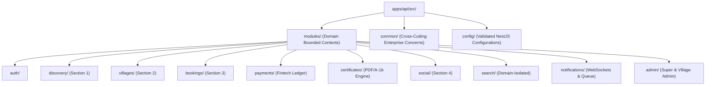

---

## 4.1 Comprehensive Directory Tree: `apps/api`

```text
apps/api/
├── src/
│   ├── modules/                              # Domain-Driven Design (DDD) Bounded Contexts
│   │   ├── auth/                             # Identity, Credentials & Access Management
│   │   │   ├── domain/                       # Core identity entities, value objects, auth invariants
│   │   │   │   ├── user.entity.ts
│   │   │   │   ├── session.entity.ts
│   │   │   │   └── value-objects/
│   │   │   │       ├── email.vo.ts
│   │   │   │       └── hashed-password.vo.ts
│   │   │   ├── application/                  # Use cases, command & query handlers (CQRS)
│   │   │   │   ├── commands/
│   │   │   │   │   ├── login.command.ts
│   │   │   │   │   ├── register-explorer.command.ts
│   │   │   │   │   └── verify-totp-mfa.command.ts
│   │   │   │   ├── queries/
│   │   │   │   │   └── get-user-profile.query.ts
│   │   │   │   └── dtos/
│   │   │   ├── infrastructure/               # Prisma repositories, Argon2 adapter, Redis session store
│   │   │   │   ├── repositories/
│   │   │   │   │   └── auth-user.repository.ts
│   │   │   │   └── adapters/
│   │   │   │       ├── argon2-password.hasher.ts
│   │   │   │       └── jwt-token.generator.ts
│   │   │   ├── presentation/                 # Ingress REST controllers & security guards
│   │   │   │   ├── auth.controller.ts
│   │   │   │   └── guards/
│   │   │   │       ├── local-auth.guard.ts
│   │   │   │       └── jwt-auth.guard.ts
│   │   │   └── auth.module.ts                # NestJS DI registration module
│   │   │
│   │   ├── discovery/                        # Section 1: Bharat Discovery Engine (GIS)
│   │   │   ├── domain/                       # Spatial entities (State, District, Taluka, Place)
│   │   │   │   ├── state.entity.ts
│   │   │   │   ├── district.entity.ts
│   │   │   │   ├── place.entity.ts
│   │   │   │   └── spatial-geometry.vo.ts
│   │   │   ├── application/                  # Geo-spatial calculation & boundary streaming
│   │   │   │   ├── services/
│   │   │   │   │   ├── spatial-query.service.ts
│   │   │   │   │   └── topojson-stream.service.ts
│   │   │   │   └── dtos/
│   │   │   ├── infrastructure/               # PostGIS spatial queries, ST_Simplify, Redis tile cache
│   │   │   │   └── repositories/
│   │   │   │       └── postgis-discovery.repository.ts
│   │   │   ├── presentation/
│   │   │   │   ├── discovery.controller.ts
│   │   │   │   └── state.controller.ts
│   │   │   └── discovery.module.ts
│   │   │
│   │   ├── villages/                         # Section 2: Rural Bharat Knowledge System
│   │   │   ├── domain/                       # Village entity, Gram Panchayat aggregate, DPDP rules
│   │   │   │   ├── village.entity.ts
│   │   │   │   ├── panchayat.entity.ts
│   │   │   │   └── staging-contribution.entity.ts
│   │   │   ├── application/                  # Staging queue workflows, moderation, LGD lookup
│   │   │   │   ├── commands/
│   │   │   │   │   ├── submit-contribution.command.ts
│   │   │   │   │   └── approve-contribution.command.ts
│   │   │   │   └── queries/
│   │   │   │       ├── get-village-by-lgd.query.ts
│   │   │   │       └── search-villages.query.ts
│   │   │   ├── infrastructure/               # PostgreSQL repo, Trigram GIN full-text index search
│   │   │   │   └── repositories/
│   │   │   │       └── village.repository.ts
│   │   │   ├── presentation/
│   │   │   │   ├── village.controller.ts
│   │   │   │   └── village-admin.controller.ts
│   │   │   └── villages.module.ts
│   │   │
│   │   ├── bookings/                         # Section 3: Experience Booking Engine
│   │   │   ├── domain/                       # Batch entity, slot inventory, 15m lock domain invariants
│   │   │   │   ├── experience.entity.ts
│   │   │   │   ├── batch.entity.ts
│   │   │   │   ├── booking-order.entity.ts
│   │   │   │   └── value-objects/
│   │   │   │       └── slot-lock.vo.ts
│   │   │   ├── application/                  # Distributed locking (Redlock), checkout lifecycle
│   │   │   │   ├── commands/
│   │   │   │   │   ├── reserve-slot.command.ts
│   │   │   │   │   ├── confirm-booking.command.ts
│   │   │   │   │   └── cancel-booking.command.ts
│   │   │   │   └── services/
│   │   │   │       └── redlock-inventory.service.ts
│   │   │   ├── infrastructure/               # Prisma repo, Redis 7 Redlock adapter, BullMQ producer
│   │   │   │   └── repositories/
│   │   │   │       └── booking.repository.ts
│   │   │   ├── presentation/
│   │   │   │   ├── booking.controller.ts
│   │   │   │   └── checkout.controller.ts
│   │   │   └── bookings.module.ts
│   │   │
│   │   ├── payments/                         # Fintech & Double-Entry Accounting Ledger
│   │   │   ├── domain/                       # Journal entry, account aggregate, escrow invariants
│   │   │   │   ├── ledger-entry.entity.ts
│   │   │   │   └── payment-transaction.entity.ts
│   │   │   ├── application/                  # Webhook verification, advance payment math, refunds
│   │   │   │   ├── commands/
│   │   │   │   │   ├── process-razorpay-webhook.command.ts
│   │   │   │   │   └── execute-refund.command.ts
│   │   │   │   └── services/
│   │   │   │       └── double-entry-ledger.service.ts
│   │   │   ├── infrastructure/               # Razorpay/Cashfree SDK adapters, HMAC verifier
│   │   │   │   └── adapters/
│   │   │   │       ├── razorpay-gateway.adapter.ts
│   │   │   │       └── cashfree-gateway.adapter.ts
│   │   │   ├── presentation/
│   │   │   │   ├── payment-webhook.controller.ts
│   │   │   │   └── payment.controller.ts
│   │   │   └── payments.module.ts
│   │   │
│   │   ├── certificates/                     # Digital Certificate Authority
│   │   │   ├── domain/                       # Certificate aggregate, HMAC verification hash
│   │   │   ├── application/                  # Synthesis trigger, QR payload generator
│   │   │   ├── infrastructure/               # BullMQ dispatch to PDFKit worker, S3 WORM uploader
│   │   │   ├── presentation/                 # Public verification endpoint (GET /verify/:uuid)
│   │   │   └── certificates.module.ts
│   │   │
│   │   ├── social/                           # Section 4: Traveller Social Network
│   │   │   ├── domain/                       # Post, 24h story, reaction, comment, guild aggregates
│   │   │   ├── application/                  # Hybrid fan-out feed assembler, story lifecycle
│   │   │   ├── infrastructure/               # Redis feed sorted sets, PostgreSQL timeline storage
│   │   │   ├── presentation/                 # Feed controller, stories controller, guilds controller
│   │   │   └── social.module.ts
│   │   │
│   │   ├── search/                           # Domain-Isolated Multi-Index Search
│   │   │   ├── application/                  # Section router firewall (GIS vs Village vs Trek vs Explorer)
│   │   │   ├── infrastructure/               # PostgreSQL GiST proximity & GIN trigram indexes
│   │   │   ├── presentation/                 # Search controller with strict domain parameter
│   │   │   └── search.module.ts
│   │   │
│   │   ├── notifications/                    # Real-Time WebSocket & Multi-Channel Dispatch
│   │   │   ├── application/                  # Alert routing, channel preferences
│   │   │   ├── infrastructure/               # Socket.io gateway cluster, Redis pub/sub adapter
│   │   │   ├── presentation/                 # WebSocket gateway handlers (events: join, subscribe)
│   │   │   └── notifications.module.ts
│   │   │
│   │   └── admin/                            # Super Admin Governance & Global Controls
│   │       ├── application/                  # Audit trail inspection, feature flags, role assignment
│   │       ├── infrastructure/               # Immutable audit_schema query repository
│   │       ├── presentation/                 # Super admin & moderation lead controllers
│   │       └── admin.module.ts
│   │
│   ├── common/                               # Cross-Cutting Infrastructure Concerns
│   │   ├── filters/                          # Global exception filters (RFC 7807 & JSON envelope)
│   │   │   ├── http-exception.filter.ts
│   │   │   └── prisma-exception.filter.ts
│   │   ├── interceptors/                     # Enterprise response envelopes & telemetry
│   │   │   ├── transform-response.interceptor.ts
│   │   │   ├── audit-logging.interceptor.ts
│   │   │   └── correlation-id.interceptor.ts
│   │   ├── guards/                           # Security enforcement guards
│   │   │   ├── roles.guard.ts                # Hierarchical RBAC guard
│   │   │   ├── permissions.guard.ts          # Granular CASL permission guard
│   │   │   └── waf-rate-limit.guard.ts       # Sliding window Redis token bucket
│   │   ├── pipes/                            # Request payload transformation & validation
│   │   │   ├── zod-validation.pipe.ts        # Zod schema validator pipe
│   │   │   └── parse-uuid.pipe.ts
│   │   ├── middleware/                       # Fastify request interceptors
│   │   │   ├── security-headers.middleware.ts# CSP Level 3, HSTS, frame-ancestors
│   │   │   └── request-logger.middleware.ts
│   │   └── decorators/                       # Custom parameter & route decorators
│   │       ├── current-user.decorator.ts
│   │       ├── roles.decorator.ts
│   │       └── audit-action.decorator.ts
│   │
│   ├── config/                               # Validated runtime configuration schemas
│   │   ├── configuration.ts                  # Typed configuration object
│   │   └── env.validation.ts                 # Strict Zod schema for process.env
│   │
│   ├── app.module.ts                         # Root application module orchestrating all domains
│   └── main.ts                               # Bootstrap entrypoint (Fastify, OpenTelemetry, Swagger)
│
├── test/                                     # End-to-End & Integration Test Suites
│   ├── e2e/                                  # API integration tests using Testcontainers
│   │   ├── auth.e2e-spec.ts
│   │   ├── booking-redlock.e2e-spec.ts
│   │   └── spatial-query.e2e-spec.ts
│   ├── fixtures/                             # Static mock payloads & test geometries
│   └── jest-e2e.json                         # Jest E2E configuration
│
├── Dockerfile                                # Distroless multi-stage container build
├── nest-cli.json                             # NestJS CLI configuration
├── package.json                              # apps/api dependencies & scripts
└── tsconfig.json                             # TypeScript compiler configuration
```

---

## 4.2 Clean Architecture Layer Invariants within Every Module

Inside every module under `apps/api/src/modules/[moduleName]/`, the dependency flow strictly follows the classic **Clean Architecture Onion Layers**:

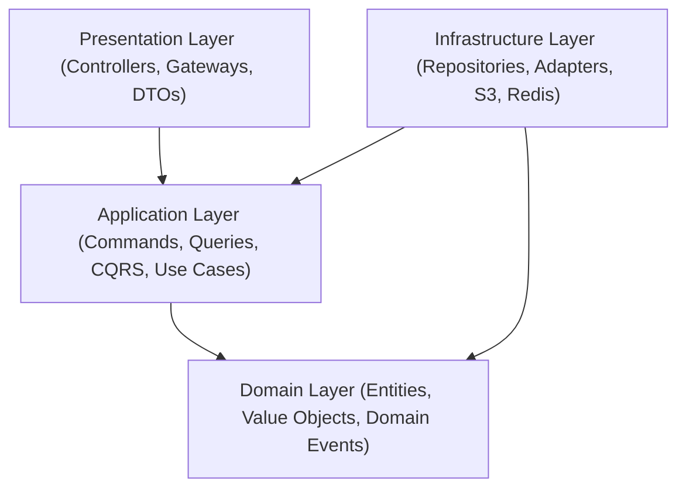

1. **Domain Layer (`domain/`)**: Pure business logic and domain rules. Contains zero framework imports (no `@nestjs/common`, no `Prisma`, no `Fastify`). Entities enforce all internal invariants (e.g., batch capacity cannot be negative, refund amount cannot exceed transaction total).
2. **Application Layer (`application/`)**: Orchestrates use cases using the CQRS pattern. Defines repository interfaces (ports) and application DTOs. Coordinates transactions across domain aggregates.
3. **Infrastructure Layer (`infrastructure/`)**: Implements ports defined in the application layer. Manages database queries via Prisma/PostGIS, Redis caching, third-party API integration (Razorpay, SMS gateways), and S3 file streaming.
4. **Presentation Layer (`presentation/`)**: Exposes REST endpoints, WebSocket event handlers, and route security guards. Converts incoming HTTP payloads into typed application commands and renders standardized JSON envelopes.

---

# SECTION 5: ASYNCHRONOUS BACKGROUND WORKER ARCHITECTURE (`apps/worker`)

High-throughput, computationally intensive, and multi-channel notification tasks are decoupled from the synchronous HTTP request-response cycle and processed by **`apps/worker`** via **BullMQ** on a high-availability **Redis 7 Cluster**.

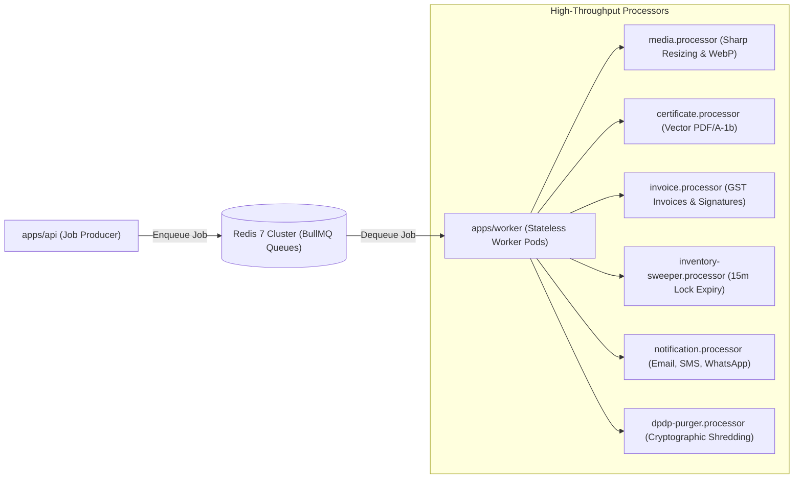

---

## 5.1 Comprehensive Directory Tree: `apps/worker`

```text
apps/worker/
├── src/
│   ├── queues/                               # Queue connection factories & queue tokens
│   │   ├── queue.constants.ts                # Queue name enumerations (MEDIA, CERTIFICATES, etc.)
│   │   └── redis-connection.ts               # Resilient Redis 7 ioredis cluster connection
│   │
│   ├── processors/                           # BullMQ stateless job processors
│   │   ├── media/                            # Media optimization & virus quarantine pipeline
│   │   │   ├── media.processor.ts            # Sharp WebP/AVIF generator, EXIF scrubber
│   │   │   └── clamav-scanner.service.ts     # ClamAV daemon antivirus stream scanner
│   │   │
│   │   ├── certificates/                     # Digital certificate synthesis pipeline
│   │   │   ├── certificate.processor.ts      # Vector PDF/A-1b compiler via PDFKit
│   │   │   ├── qr-generator.service.ts       # Dynamic high-density QR code renderer
│   │   │   └── hmac-signer.service.ts        # Cryptographic SHA256 HMAC signature generator
│   │   │
│   │   ├── invoices/                         # Financial GST tax invoice pipeline
│   │   │   ├── invoice.processor.ts          # Statutory GST invoice PDF generator
│   │   │   └── digital-signature.service.ts  # PKCS#12 digital certificate signature stamper
│   │   │
│   │   ├── inventory/                        # High-concurrency booking sweeper
│   │   │   └── inventory-sweeper.processor.ts# Scans expired 15m locks; restores batch inventory
│   │   │
│   │   ├── notifications/                    # Multi-channel alert dispatchers
│   │   │   ├── notification.processor.ts     # Multi-channel router based on user preferences
│   │   │   ├── email-dispatcher.service.ts   # Amazon SES transactional email dispatcher
│   │   │   ├── sms-dispatcher.service.ts     # Gupshup / Twilio SMS gateway dispatcher
│   │   │   └── whatsapp-dispatcher.service.ts# Meta WhatsApp Business Cloud API dispatcher
│   │   │
│   │   └── compliance/                       # Statutory compliance & data privacy pipelines
│   │       ├── dpdp-purger.processor.ts      # Cryptographic shredder for participant data > 30 days
│   │       └── story-archival.processor.ts   # Cleans expired 24h ephemeral story references
│   │
│   ├── schedulers/                           # Repeatable cron job schedules (BullMQ repeat)
│   │   ├── inventory-cron.scheduler.ts       # Runs every 60 seconds (slot lock verification)
│   │   ├── dpdp-retention.scheduler.ts       # Runs daily at 02:00 UTC (data anonymization)
│   │   └── audit-archive.scheduler.ts        # Runs hourly (audit log sync to S3 WORM storage)
│   │
│   ├── monitors/                             # BullMQ queue telemetry & failure alerting
│   │   ├── dead-letter.monitor.ts            # Captures exhausted retry jobs; alerts Slack / PagerDuty
│   │   └── queue-metrics.collector.ts        # Exposes Prometheus metrics on port 9090 (/metrics)
│   │
│   ├── config/                               # Worker environment configurations & concurrency limits
│   │   └── worker.config.ts
│   │
│   └── worker.ts                             # Bootstrap worker process (Graceful SIGTERM handlers)
│
├── Dockerfile                                # Distroless multi-stage worker container
├── package.json                              # apps/worker dependencies & scripts
└── tsconfig.json                             # TypeScript compiler configuration
```

---

# SECTION 6: SHARED ENTERPRISE PACKAGES (`packages/*`)

Shared domain packages eliminate code duplication across applications while strictly maintaining decoupled dependency boundaries.

---

## 6.1 `packages/database` — Relational & PostGIS Persistence Layer

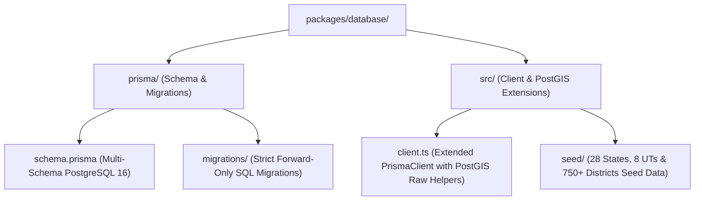

| Dimension | Specification |
| :--- | :--- |
| **Purpose** | Single authoritative persistence definition for the entire relational and spatial data tier. |
| **Responsibilities** | Housing Prisma DDL schemas, version-controlled forward-only SQL migrations, connection pooling via PgBouncer, and baseline geospatial seed data. |
| **Allowed Files** | `schema.prisma`, SQL migration scripts (`migrations/*/*.sql`), TypeScript seeder scripts (`src/seed/*.ts`), extended client wrapper (`src/client.ts`). |
| **Disallowed Files** | HTTP route controllers, frontend components, business use cases, raw unencrypted secrets. |
| **Dependencies** | `@prisma/client`, `prisma`, Node.js `pg`, `packages/config`. Zero dependencies on other internal packages. |
| **Who Uses It** | `apps/api` (for all transactional queries), `apps/worker` (for background writes), `scripts/` (for DB setup). |
| **Scalability Considerations** | Tables partitioned by date range (`orders_2026`, `payments_2026`, `audit_logs_2026_09`); spatial geometry indexed with GiST. |

---

## 6.2 `packages/types` — Universal TypeScript Contracts & DTOs

| Dimension | Specification |
| :--- | :--- |
| **Purpose** | Universal single source of truth for all data models, API envelopes, DTOs, and event signatures. |
| **Responsibilities** | Eliminating contract drift between frontend (`apps/web`), backend (`apps/api`), and background jobs (`apps/worker`). |
| **Allowed Files** | Pure TypeScript type declarations, interfaces, and enums (`.ts` files containing only type definitions). |
| **Disallowed Files** | Executable runtime code, database queries, framework dependencies, class implementations. |
| **Dependencies** | Zero internal or external dependencies. Pure, standard TypeScript. |
| **Who Uses It** | Consumed ubiquitously across all applications (`apps/*`) and shared packages (`packages/*`). |
| **Scalability Considerations** | Subdivided into domain-specific contract files: `discovery.types.ts`, `village.types.ts`, `booking.types.ts`, `social.types.ts`, `auth.types.ts`, `api-envelope.types.ts`. |

---

## 6.3 `packages/ui` — Accessible Design System Component Library

| Dimension | Specification |
| :--- | :--- |
| **Purpose** | Shared visual component library implementing the Bharat Cultural Modernism design system. |
| **Responsibilities** | Encapsulating headless Radix UI primitives styled with Tailwind CSS, ensuring strict WCAG 2.1 AA accessibility and cross-browser consistency. |
| **Allowed Files** | Reusable React UI primitives (`button.tsx`, `modal.tsx`, `drawer.tsx`, `badge.tsx`, `input.tsx`, `table.tsx`, `tabs.tsx`). |
| **Disallowed Files** | Business logic, direct API calls, backend dependencies, domain-specific state stores. |
| **Dependencies** | React 18+, Radix UI, Tailwind CSS, Lucide Icons, `packages/config`. |
| **Who Uses It** | `apps/web` (and future mobile web or administrative micro-frontends). |
| **Scalability Considerations** | Built using compound component patterns with fully exposed Tailwind class injection (`className` overrides via `clsx` and `tailwind-merge`). |

---

## 6.4 `packages/security-crypto` — Cryptographic Operations Suite

| Dimension | Specification |
| :--- | :--- |
| **Purpose** | Centralized cryptographic suite enforcing enterprise security standards across all services. |
| **Responsibilities** | Argon2id password hashing, RS256 asymmetric JWT signing and verification, AES-256-GCM field-level encryption, SHA256 HMAC certificate validation. |
| **Allowed Files** | TypeScript cryptographic utility classes and helpers (`argon2.ts`, `rs256.ts`, `aes-gcm.ts`, `hmac.ts`). |
| **Disallowed Files** | Plaintext hardcoded keys, framework-specific HTTP middleware, UI components. |
| **Dependencies** | Node.js built-in `node:crypto`, `argon2`, `jose`. |
| **Who Uses It** | `apps/api` (authentication & token issuance), `apps/worker` (certificate signing & DPDP shredding). |
| **Scalability Considerations** | Implements automated key rotation abstraction supporting HashiCorp Vault dynamic KMS secrets. |

---

## 6.5 `packages/gis-core` — Spatial Math & Cartography Engine

| Dimension | Specification |
| :--- | :--- |
| **Purpose** | Core geospatial mathematical functions, coordinate transformations, and TopoJSON simplification utilities. |
| **Responsibilities** | Haversine distance computations, Douglas-Peucker polygon simplification, WGS84 to Web Mercator projection conversion, Survey of India boundary verification. |
| **Allowed Files** | Pure mathematical algorithms, spatial bounding box calculators, GeoJSON/TopoJSON parsers. |
| **Disallowed Files** | Heavy WebGL renderers (Three.js/MapLibre), DOM-dependent code, database connection logic. |
| **Dependencies** | `topojson-client`, `topojson-simplify`, `geojson`. Platform-agnostic (runs seamlessly in Node.js, Web Workers, or Browser). |
| **Who Uses It** | `apps/web` (client-side map projection), `apps/api` (spatial query filters), `scripts/` (boundary ingestion). |
| **Scalability Considerations** | WebAssembly (Wasm) acceleration hook ready for sub-millisecond polygon containment testing. |

---

## 6.6 `packages/logger` — Enterprise Observability & Structured Logging

| Dimension | Specification |
| :--- | :--- |
| **Purpose** | Production-grade structured JSON logger integrated with OpenTelemetry distributed tracing. |
| **Responsibilities** | Emitting JSON logs to `stdout`, automatically injecting `traceId`, `spanId`, and `correlationId`, masking PII (passwords, Aadhaar, payment tokens). |
| **Allowed Files** | Pino logger wrappers, redaction rules, OpenTelemetry span injectors, correlation interceptors. |
| **Disallowed Files** | File-system direct write listeners (logs must emit to `stdout` for container log drivers). |
| **Dependencies** | `pino`, `@opentelemetry/api`, `packages/config`. |
| **Who Uses It** | Consumed ubiquitously across `apps/api` and `apps/worker`. |
| **Scalability Considerations** | Compatible with FluentBit daemonset forwarding to Grafana Loki in Kubernetes production clusters. |

---

## 6.7 `packages/validators` — Universal Zod Validation Schemas

| Dimension | Specification |
| :--- | :--- |
| **Purpose** | Shared schema validation definitions ensuring unified validation rules across client forms and backend ingress. |
| **Responsibilities** | Validating user inputs, registration forms, booking parameters, contribution submissions, and environment variables. |
| **Allowed Files** | Zod schemas (`auth.schema.ts`, `booking.schema.ts`, `village.schema.ts`, `env.schema.ts`). |
| **Disallowed Files** | Imperative UI code, SQL queries, network requests. |
| **Dependencies** | `zod`, `packages/types`. |
| **Who Uses It** | `apps/web` (React Hook Form resolvers), `apps/api` (NestJS ZodValidationPipe). |
| **Scalability Considerations** | Guarantees that any validation rule change instantly updates both client and server validation logic. |

---

# SECTION 7: INFRASTRUCTURE, TOOLING & DEVOPS (`infrastructure/*`, `tooling/*`)

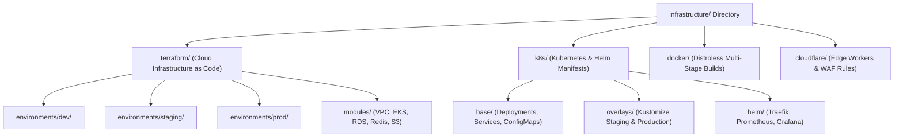

---

## 7.1 Detailed Directory Tree: `infrastructure/`

```text
infrastructure/
├── terraform/                                # Modular HashiCorp Terraform configuration
│   ├── modules/                              # Reusable cloud infrastructure modules
│   │   ├── vpc/                              # Multi-AZ VPC with public, private & database subnets
│   │   ├── eks/                              # AWS EKS Kubernetes cluster with managed node groups
│   │   ├── rds_postgis/                      # Multi-AZ PostgreSQL 16 RDS cluster with PostGIS
│   │   ├── redis_cluster/                    # AWS ElastiCache Redis 7 high-availability cluster
│   │   ├── s3_vaults/                        # Multi-bucket S3 configuration with WORM Object Lock
│   │   └── cloudflare_waf/                   # Cloudflare Enterprise DNS, WAF rules & CDN cache
│   └── environments/                         # Environment-specific root modules
│       ├── dev/
│       ├── staging/
│       ├── prod/
│       └── dr/                               # Disaster recovery failover cloud region
│
├── k8s/                                      # Declarative Kubernetes configuration
│   ├── base/                                 # Base deployment specifications
│   │   ├── apps/                             # Pod deployments & services for web, api, and worker
│   │   │   ├── web-deployment.yaml
│   │   │   ├── api-deployment.yaml
│   │   │   └── worker-deployment.yaml
│   │   ├── ingress/                          # Traefik 3.0 IngressRoute definitions & mTLS certs
│   │   ├── autoscaling/                      # Horizontal Pod Autoscaler (HPA) specifications
│   │   └── network-policies/                 # Zero-trust inter-pod egress & ingress firewall rules
│   │
│   ├── overlays/                             # Kustomize environment overlays
│   │   ├── staging/
│   │   └── production/
│   │
│   └── helm/                                 # Third-party infrastructure Helm chart values
│       ├── traefik-values.yaml
│       ├── pgbouncer-values.yaml
│       ├── prometheus-stack-values.yaml
│       └── fluentbit-values.yaml
│
├── docker/                                   # Enterprise container specifications
│   ├── Dockerfile.web                        # Next.js 14 distroless container
│   ├── Dockerfile.api                        # NestJS 10 Fastify distroless container
│   ├── Dockerfile.worker                     # BullMQ worker distroless container
│   └── .dockerignore                         # Optimized container build context filter
│
└── cloudflare/                               # Edge compute & security rules
    ├── workers/                              # Edge routing & geo-header injection workers
    └── rules/                                # OWASP Core Rule Set (CRS) rate limit & WAF JSON configs
```

---

## 7.2 Custom Linting & Architecture Enforcement: `tooling/`

To enforce the architecture defined in this document without relying on manual code reviews, the repository includes a custom AST linter plugin: **`tooling/eslint-plugin-ebs-boundaries`**.

```text
tooling/
├── eslint-plugin-ebs-boundaries/             # Custom AST boundary rule enforcer
│   ├── src/
│   │   ├── rules/
│   │   │   ├── no-cross-domain-imports.ts    # Prevents apps/api modules from importing peer modules
│   │   │   ├── no-direct-db-in-web.ts        # Blocks apps/web from importing packages/database
│   │   │   ├── enforce-rsc-client-boundary.ts# Verifies 'use client' presence when hooks are used
│   │   │   └── ban-deep-package-imports.ts   # Enforces package root imports only (@ebs/types vs @ebs/types/src/...)
│   │   └── index.ts
│   └── package.json
│
└── generators/                               # Plop.js code scaffolders
    ├── templates/                            # Handlebars template files
    │   ├── module/                           # Scaffolds 4-tier Clean Architecture NestJS module
    │   ├── rsc-component/                    # Scaffolds React Server Component
    │   └── client-component/                 # Scaffolds Client Component with tests
    └── plopfile.js
```

---

# SECTION 8: UNIVERSAL FOLDER MATRIX & GOVERNANCE

Below is the exhaustive architectural governance matrix for all standard directories referenced in enterprise systems. Every folder in the codebase must strictly satisfy its designated purpose and rules.

| Directory Name | Canonical Location | Allowed Contents | Disallowed Contents | Governing Rule |
| :--- | :--- | :--- | :--- | :--- |
| `public/` | `apps/web/public` | Static images, TopoJSON boundaries, 3D GLB models, favicons | TypeScript/JavaScript code, sensitive documents, private assets | Publicly accessible via HTTP root `/`. Cached at Cloudflare edge. |
| `src/` | `apps/*`, `packages/*` | Pure source code (`.ts`, `.tsx`, `.css`) | Binary assets, build artifacts, compiled output (`dist/`) | All compilable source code must reside inside `src/`. |
| `app/` | `apps/web/src/app` | Next.js App Router routes, layouts, page boundaries | Arbitrary reusable UI components, heavy utility scripts | Strictly reserved for Next.js routing conventions. |
| `components/` | `apps/web/src/components` | Reusable React components (`.tsx`) | Direct database queries, route handlers, backend server files | Subdivided into `server/`, `client/`, and `shared/`. |
| `features/` | `apps/web/src/features` | Self-contained domain feature slices | Ubiquitous generic primitives (buttons, modals) | Encapsulates local state, hooks, and sub-components. |
| `modules/` | `apps/api/src/modules` | NestJS domain bounded contexts (DDD) | Shared cross-cutting middleware, global constants | Follows 4-tier Clean Architecture strictly. |
| `lib/` | `apps/web/src/lib` | Client-side SDK wrappers, GSAP/MapLibre helpers | Domain business rules, server secrets | Stateless helper libraries. |
| `hooks/` | `apps/web/src/hooks` | Custom React hooks (`use-*.ts`) | Non-hook utility functions, JSX components | Reusable stateful logic; must adhere to React Hook Rules. |
| `providers/` | `apps/web/src/providers` | React context providers | Page-specific UI layouts, DOM markup | Top-level context wrappers (`QueryClient`, `Auth`, `Theme`). |
| `services/` | `apps/api/src/modules/*/application` | Application use case services, domain orchestrators | HTTP request/response objects, UI logic | Stateless orchestrators executing domain commands. |
| `store/` | `apps/web/src/store` | Zustand client-side micro-stores | Heavy persistent business records, server credentials | Ephemeral client UI state (map viewport, active story). |
| `styles/` | `apps/web/src/styles` | CSS files (`globals.css`, `typography.css`) | Inline CSS-in-JS scripts, component files | Pure CSS styling using Tailwind CSS design tokens. |
| `types/` | `packages/types/src` | TypeScript interfaces, type aliases, enums | Executable JavaScript runtime code, classes | Universal single source of truth for contracts. |
| `constants/` | `packages/types/src/constants` | Immutable configuration constants, regex patterns | Secret API keys, dynamic runtime variables | Static enumerations and invariant values. |
| `config/` | `apps/*/src/config` | Validated runtime configuration schemas | Hardcoded environment strings, database credentials | All values must validate against strict Zod schemas. |
| `middleware/` | `apps/api/src/common/middleware` | Fastify request interceptors, security headers | Domain business invariants, database queries | Executes on raw HTTP stream before route handler. |
| `utils/` | `packages/*/src/utils` | Pure mathematical & string helper functions | Stateful operations, database connections | Deterministic, side-effect-free pure functions. |
| `validators/` | `packages/validators/src` | Zod validation schemas for forms, DTOs & envs | Imperative UI code, SQL queries | Shared between client forms and backend pipes. |
| `schemas/` | `packages/database/prisma` | Prisma schema DDL and PostGIS spatial models | Application business logic, route handlers | Relational schema definitions. |
| `assets/` | Monorepo root / docs | Documentation diagrams, design mockups, architectural SVGs | Production runtime code, uncompressed raw media | Non-production design and documentation assets. |
| `scripts/` | Monorepo root `scripts/` | Database seeders, migration scripts, DR tools | Web controllers, UI components | Standalone execution via CLI or CI/CD pipelines. |
| `tests/` | `apps/*/test` | E2E integration test suites, Testcontainers specs | Production runtime code, hardcoded test secrets | Automated verification suites. |
| `docs/` | Monorepo root `docs/` | Architectural Decision Records (ADR), runbooks | Source code, compiled binaries | Living documentation repository. |
| `logs/` | Ephemeral (Container stdout) | Direct file writing is **disallowed** in production | Local `.log` files in containers | All logs emit to `stdout` in structured JSON via Pino. |
| `uploads/` | Ephemeral (S3 Multi-Bucket) | Local file storage is **disallowed** in production | Local file uploads inside container filesystem | Managed entirely via S3 multi-bucket architecture. |
| `emails/` | `apps/worker/src/processors/notifications`| Transactional email templates (React Email / MJML) | Backend API controllers, raw HTML without styles | High-fidelity responsive email templates. |
| `workers/` | `apps/worker` | BullMQ stateless job worker processes | Synchronous HTTP ingress listeners | Asynchronous task execution. |
| `queues/` | `apps/worker/src/queues` | BullMQ queue token definitions & connection logic | Job payload business logic | Queue configurations and connection pools. |
| `cache/` | `apps/api/src/infrastructure/cache` | Redis 7 cluster caching adapters & Redlock mutexes | Long-term persistent data storage | Ephemeral, sub-millisecond memory caching. |
| `security/` | `packages/security-crypto` | Cryptographic algorithms (Argon2id, RS256, AES-GCM) | Plaintext credentials, unrotated keys | Enterprise security primitives. |
| `monitoring/` | `infrastructure/k8s/helm` | Prometheus metric collectors, Grafana dashboards | Application business logic | Cluster and application telemetry. |
| `analytics/` | `packages/analytics` | Telemetry event schemas & metric definitions | Sensitive PII, customer billing tokens | Anonymized product analytics and operational metrics. |
| `locales/` | `apps/web/src/locales` | Multi-lingual translation dictionaries (`en`, `hi`, etc.) | Hardcoded text strings inside JSX | Internationalization dictionaries via `next-intl`. |
| `generated/` | Ephemeral (`node_modules/.prisma`) | Auto-generated Prisma clients, GraphQL types | Manually authored code (overwritten on build) | Auto-generated during compilation. |

---

# SECTION 9: SUBSYSTEM-SPECIFIC ARCHITECTURAL MAPPINGS

To guarantee absolute alignment with the 48 specifications in `explore-bharat-safar-ai-docs/`, the 24 core technical subsystems are explicitly mapped to their corresponding repository locations.

```mermaid
graph TD
    Subsystems["24 Core Enterprise Subsystems"]
    
    Subsystems --> S1["1. Next.js App Router ➔ apps/web/src/app/"]
    Subsystems --> S2["2. React Server & Client Components ➔ apps/web/src/components/"]
    Subsystems --> S3["3. GIS Discovery Engine ➔ apps/api/src/modules/discovery/ & packages/gis-core/"]
    Subsystems --> S4["4. Rural Village System ➔ apps/api/src/modules/villages/"]
    Subsystems --> S5["5. Booking & 15m Redlock ➔ apps/api/src/modules/bookings/"]
    Subsystems --> S6["6. Traveller Social Network ➔ apps/api/src/modules/social/"]
    Subsystems --> S7["7. Fintech & Double-Entry Ledger ➔ apps/api/src/modules/payments/"]
    Subsystems --> S8["8. Certificate Authority ➔ apps/worker/src/processors/certificates/"]
    Subsystems --> S9["9. Database & PostGIS ➔ packages/database/"]
    Subsystems --> S10["10. Redis 7 Cluster ➔ apps/api/src/infrastructure/cache/"]
```

---

### 1. Next.js App Router
- **Repository Location**: `apps/web/src/app/`
- **Architectural Mapping**: Route groups `(auth)`, `(discovery)`, `(villages)`, `(bookings)`, `(social)`, and `(admin)`. Employs Next.js parallel routes (`@modal`) and intercepting routes (`(.)contribute`) for seamless modal interactions without URL breakage.

### 2. Server Components vs Client Components
- **Repository Location**: `apps/web/src/components/server/` vs `apps/web/src/components/client/`
- **Architectural Mapping**: Server Components execute exclusively during SSR on the Node.js server to stream HTML with zero bundle overhead. Client Components (tagged with `'use client'`) handle interactive UI, WebGL canvas rendering, and user input state.

### 3. Shared Components
- **Repository Location**: `packages/ui/src/` & `apps/web/src/components/shared/`
- **Architectural Mapping**: Ubiquitous headless primitives (Radix UI) styled with Tailwind CSS, including accessible modals, slide-out drawers, status badges, buttons, and responsive navigation shells.

### 4. Feature Modules
- **Repository Location**: `apps/web/src/features/`
- **Architectural Mapping**: Vertical slice feature folders (`map-explorer`, `village-registry`, `booking-wizard`, `social-feed`, `certificate-viewer`) bundling local components, custom hooks, and state logic together.

### 5. Business Logic & Invariants
- **Repository Location**: `apps/api/src/modules/*/domain/` & `packages/validators/`
- **Architectural Mapping**: Pure TypeScript domain entities enforcing invariant business rules defined in `26-business-rules.md` and `48-business-logic-validation-rules-and-quality-gates-blueprint.md`.

### 6. Authentication & Identity
- **Repository Location**: `apps/api/src/modules/auth/` & `packages/security-crypto/`
- **Architectural Mapping**: Argon2id password hashing, RS256 asymmetric JWT signing/rotation, TOTP MFA challenge, and single-use Refresh Token Rotation (RTR).

### 7. Centralized RBAC
- **Repository Location**: `apps/api/src/common/guards/roles.guard.ts` & `apps/api/src/modules/admin/`
- **Architectural Mapping**: Hierarchical 10-role access control (`SUPER_ADMIN` down to `GUEST`) enforcing route guards and granular CASL permission policies.

### 8. Experience Booking & Slot Lock Engine
- **Repository Location**: `apps/api/src/modules/bookings/` & `apps/worker/src/processors/inventory/`
- **Architectural Mapping**: 15-minute distributed slot locking via Redlock mutexes on Redis 7 Cluster, batch capacity integrity checks, and automated inventory sweeps for abandoned checkouts.

### 9. Bharat Discovery Engine (GIS)
- **Repository Location**: `apps/api/src/modules/discovery/` & `packages/gis-core/`
- **Architectural Mapping**: Spatial PostGIS boundary simplification (`ST_SimplifyPreserveTopology`), 3D landmark metadata streaming, TopoJSON delivery, and strict Survey of India national boundary compliance.

### 10. Rural Bharat Village System
- **Repository Location**: `apps/api/src/modules/villages/`
- **Architectural Mapping**: Registry for 650,000+ villages, LGD code index, Gram Panchayat civic directories, community staging queue, and DPDP Act compliance.

### 11. Traveller Social Platform
- **Repository Location**: `apps/api/src/modules/social/`
- **Architectural Mapping**: Vertical travel social graph, hybrid fan-out feeds, 24-hour ephemeral stories with automatic Redis keyspace expiry, community guilds, and Solo Explorer matching.

### 12. Admin Panel & Consoles
- **Repository Location**: `apps/web/src/app/(admin)/` & `apps/api/src/modules/admin/`
- **Architectural Mapping**: Dedicated consoles for Super Admin, System Admin, Finance Admin, Booking Admin, Content Editor, and Moderation Leads with session timeouts and audit logging.

### 13. Super Admin & Village Admin Security Enclaves
- **Repository Location**: `apps/api/src/modules/admin/` & `apps/api/src/modules/villages/presentation/village-admin.controller.ts`
- **Architectural Mapping**: Village Admins are strictly scoped to their assigned LGD village code via database query tenant filters, while Super Admins operate under multi-party MFA and immutable audit logging.

### 14. Notification System
- **Repository Location**: `apps/api/src/modules/notifications/` & `apps/worker/src/processors/notifications/`
- **Architectural Mapping**: Clustered Socket.io WebSockets for real-time in-app alerts, coupled with BullMQ dispatchers routing transactional emails (SES), SMS (Gupshup), and WhatsApp messages.

### 15. Digital Certificate Authority
- **Repository Location**: `apps/api/src/modules/certificates/` & `apps/worker/src/processors/certificates/`
- **Architectural Mapping**: ISO 19005-1 compliant PDF/A-1b vector certificate synthesis via PDFKit, dynamic QR code generation, and HMAC-SHA256 tamper-evident digital verification signatures.

### 16. Payments & Fintech Ledger
- **Repository Location**: `apps/api/src/modules/payments/`
- **Architectural Mapping**: Razorpay and Cashfree webhook verification, double-entry financial accounting ledger (`booking_schema.journal_entries`), escrow allocation, upfront percentage splits, and automated refunds.

### 17. Maps & GIS Cartography
- **Repository Location**: `apps/web/src/components/client/map-canvas-interactive.tsx` & `packages/gis-core/`
- **Architectural Mapping**: MapLibre GL JS hardware-accelerated vector tile rendering, smooth SVG fallback renderer, and dynamic zoom-based layer switching (National $\rightarrow$ State $\rightarrow$ District $\rightarrow$ Place).

### 18. Domain-Isolated Search Engine
- **Repository Location**: `apps/api/src/modules/search/`
- **Architectural Mapping**: Strict domain-isolated search routers executing scoped PostgreSQL GIN trigram and GiST proximity queries across Sections 1, 2, 3, and 4 with absolute cross-domain firewalls.

### 19. Media Management & Quarantine Bucket
- **Repository Location**: `apps/worker/src/processors/media/` & `infrastructure/terraform/modules/s3_vaults/`
- **Architectural Mapping**: Multi-bucket S3 architecture: incoming media routes to `ebs-media-quarantine`, undergoes ClamAV scanning and Sharp WebP compression, and is promoted to `ebs-media-public`.

### 20. Animations & WebGL Shaders
- **Repository Location**: `apps/web/src/components/client/three-landmark-renderer.tsx` & `apps/web/src/lib/gsap-utils.ts`
- **Architectural Mapping**: GSAP 3 animation timelines with ScrollTrigger bounds, custom Three.js WebGL shaders for cultural landmark rendering, maintaining 60 FPS budgets and respecting `prefers-reduced-motion`.

### 21. API Contracts & Envelopes
- **Repository Location**: `packages/types/src/api-envelope.types.ts` & `apps/api/src/common/interceptors/`
- **Architectural Mapping**: Strict standardized JSON response and error envelopes across all endpoints, providing status codes, timestamps, correlation IDs, and pagination metadata.

### 22. Database & PostGIS Persistence
- **Repository Location**: `packages/database/`
- **Architectural Mapping**: PostgreSQL 16 multi-schema topology (`geo_spatial_schema`, `rural_bharat_schema`, `booking_schema`, `social_schema`, `audit_schema`), range partitioned tables, and universal UUID v4 primary keys.

### 23. In-Memory Caching & Redis Infrastructure
- **Repository Location**: `apps/api/src/infrastructure/cache/`
- **Architectural Mapping**: High-availability Redis 7 Cluster managing Redlock distributed locks, sliding window token bucket rate limits, edge tile caches, and social timeline sorted sets.

### 24. Background Jobs & Workers
- **Repository Location**: `apps/worker/src/`
- **Architectural Mapping**: Stateless BullMQ worker pods consuming from dedicated Redis queues, backed by dead-letter queue monitoring and Prometheus telemetry scrapers.

---

# SECTION 10: ARCHITECTURAL BOUNDARIES, DDD & CLEAN LAYERING

## 10.1 Domain-Driven Design (DDD) Bounded Contexts

The platform is strictly organized around five autonomous Bounded Contexts:

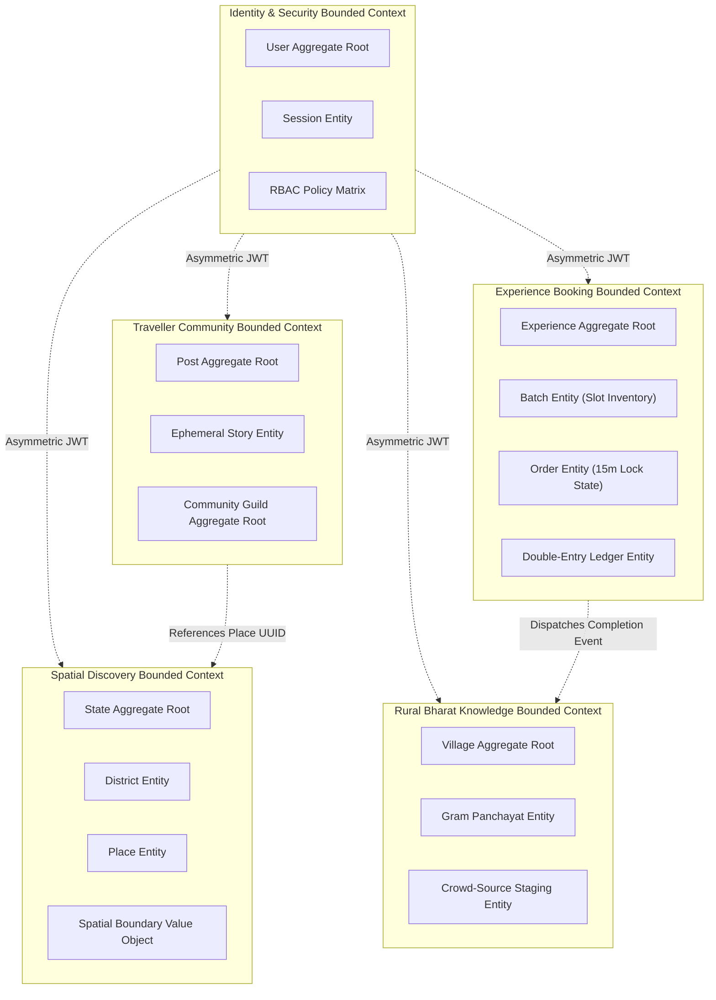

### Invariant Bounded Context Rules:
1. **Zero Cross-Context Database Writes**: No domain module can issue an `INSERT`, `UPDATE`, or `DELETE` query against a database table belonging to another domain.
2. **Cross-Domain Foreign Key Loose Coupling**: Foreign keys referencing entities across bounded contexts must be treated as logical UUID references, never hard relational database constraints that impede future microservice decoupling.
3. **Communication via Contracts**: Cross-context data sharing must occur either via synchronous internal service facades (using typed DTOs from `packages/types`) or via asynchronous domain events dispatched over BullMQ / Redis Pub/Sub.

---

## 10.2 Module Boundaries & Clean Architecture Layering

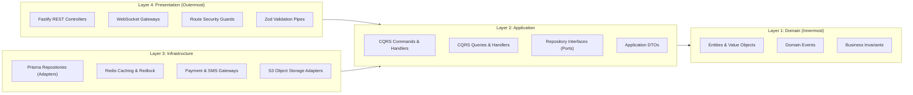

### Dependency Inversion Rule:
- Dependencies point **strictly inward**.
- The `Domain` layer has **zero dependencies** on external libraries, frameworks, or database drivers.
- The `Application` layer defines interfaces (Ports) for persistence; the `Infrastructure` layer implements those interfaces (Adapters).
- If any database technology is swapped (e.g., Prisma replaced with raw Kysely or TypeORM), **zero lines of code in the Domain or Application layers will change**.

---

# SECTION 11: ENTERPRISE GOVERNANCE, NAMING CONVENTIONS & IMPORT RULES

## 11.1 Standardized Naming Conventions

To ensure absolute consistency across millions of lines of code, the repository enforces a single naming specification across all workspaces:

| Artifact Type | Naming Convention | Example |
| :--- | :--- | :--- |
| **Directories / Folders** | `kebab-case` | `apps/api/src/modules/village-registry/` |
| **React Components** | `PascalCase.tsx` | `SlotLockCountdown.tsx`, `MapCanvasInteractive.tsx` |
| **React Server Components** | `[name]-server.tsx` | `state-card-server.tsx`, `village-civic-grid.tsx` |
| **React Custom Hooks** | `use-[kebab-case].ts` | `use-slot-lock-timer.ts`, `use-map-viewport.ts` |
| **Zustand State Stores** | `[name]-store.ts` | `map-store.ts`, `booking-draft-store.ts` |
| **NestJS Controllers** | `[name].controller.ts` | `village.controller.ts`, `booking.controller.ts` |
| **NestJS Services** | `[name].service.ts` | `spatial-query.service.ts`, `double-entry-ledger.service.ts` |
| **NestJS Modules** | `[name].module.ts` | `discovery.module.ts`, `payments.module.ts` |
| **Domain Entities** | `[name].entity.ts` | `batch.entity.ts`, `village.entity.ts` |
| **Value Objects** | `[name].vo.ts` | `slot-lock.vo.ts`, `spatial-geometry.vo.ts` |
| **CQRS Commands** | `[action]-[entity].command.ts` | `reserve-slot.command.ts`, `approve-contribution.command.ts` |
| **CQRS Queries** | `get-[entity].query.ts` | `get-village-by-lgd.query.ts`, `search-places.query.ts` |
| **Data Transfer Objects** | `[action]-[entity].dto.ts` | `create-booking.dto.ts`, `update-village.dto.ts` |
| **Zod Validation Schemas** | `[name].schema.ts` | `booking.schema.ts`, `village.schema.ts` |
| **TypeScript Type Files** | `[domain].types.ts` | `discovery.types.ts`, `booking.types.ts` |
| **Unit Test Files** | `[name].spec.ts` | `slot-lock.vo.spec.ts`, `spatial-query.service.spec.ts` |
| **E2E / Integration Tests**| `[name].e2e-spec.ts` | `booking-redlock.e2e-spec.ts`, `auth.e2e-spec.ts` |

---

## 11.2 Path Aliasing Scheme & Import Rules

Direct relative traversals across package or boundary limits (e.g., `../../../../packages/database`) are strictly banned by static linting rules. The repository utilizes standardized path aliases:

```json
{
  "compilerOptions": {
    "paths": {
      "@ebs/types": ["packages/types/src"],
      "@ebs/types/*": ["packages/types/src/*"],
      "@ebs/ui": ["packages/ui/src"],
      "@ebs/ui/*": ["packages/ui/src/*"],
      "@ebs/database": ["packages/database/src"],
      "@ebs/security-crypto": ["packages/security-crypto/src"],
      "@ebs/gis-core": ["packages/gis-core/src"],
      "@ebs/logger": ["packages/logger/src"],
      "@ebs/validators": ["packages/validators/src"],
      "@/*": ["src/*"]
    }
  }
}
```

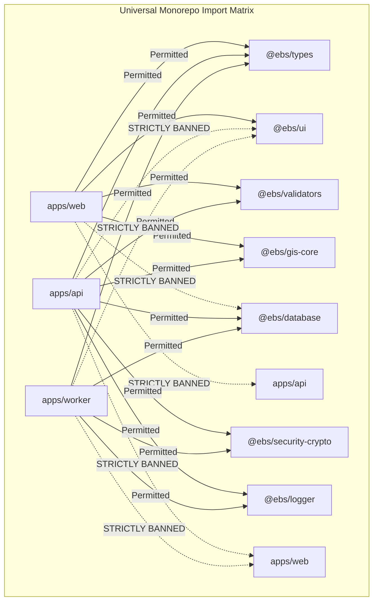

### Mandatory Import Restrictions:
1. **Frontend-to-Database Firewall**: `apps/web` is **strictly prohibited** from importing `@ebs/database` or any database driver. All data ingestion must execute via HTTP REST APIs or BFF endpoints.
2. **Backend-to-UI Firewall**: `apps/api` and `apps/worker` are **strictly prohibited** from importing `@ebs/ui` or React-specific libraries.
3. **Zero Peer Application Coupling**: Applications inside `apps/*` can never import from sibling applications.
4. **Barrel File Rule**: Internal packages export explicitly named symbols from root index files (`src/index.ts`). Wildcard re-exports (`export * from ...`) in performance-critical paths are banned to ensure tree-shaking efficacy.

---

# SECTION 12: CODE OWNERSHIP, RACI MATRIX & LONG-TERM SCALABILITY

## 12.1 Engineering Squad RACI Responsibility Matrix

To prevent architectural drift and assign clear maintenance accountability across large enterprise teams, codebase directories are mapped to engineering squads using the RACI framework:

- **R (Responsible)**: The primary squad that authors, maintains, and reviews code in this directory.
- **A (Accountable)**: The engineering lead or director with final sign-off authority.
- **C (Consulted)**: Subject matter experts consulted prior to architectural modifications.
- **I (Informed)**: Stakeholders informed of changes via automated GitHub notifications.

| Directory Path | Primary Squad | Responsible (R) | Accountable (A) | Consulted (C) | Informed (I) |
| :--- | :--- | :--- | :--- | :--- | :--- |
| `apps/web/src/app/(discovery)` | Discovery & GIS Squad | Frontend GIS Lead | UI Director | GIS Architect | All Explorers |
| `apps/web/src/app/(villages)` | Village Knowledge Squad | Rural Web Lead | Product Director | Panchayat Liaison| Content Leads |
| `apps/web/src/app/(bookings)` | Booking & Fintech Squad | Checkout Frontend Lead| Technical Director| Fintech Architect | Support Lead |
| `apps/web/src/app/(social)` | Social & Community Squad| Social Web Lead | UI Director | Trust & Safety | Marketing |
| `apps/web/src/app/(admin)` | Platform Core Squad | Admin Console Lead | Security Officer | All Squad Leads | Ops Lead |
| `apps/api/src/modules/auth` | Security & Platform Squad| Auth Backend Lead | Chief Security Off.| DevSecOps Lead | All Squads |
| `apps/api/src/modules/discovery`| Discovery & GIS Squad | Spatial DB Lead | Principal Architect| Cartography Lead | Mobile Team |
| `apps/api/src/modules/villages` | Village Knowledge Squad | Rural Backend Lead | Enterprise Architect| DPDP Officer | Content Squad |
| `apps/api/src/modules/bookings` | Booking & Fintech Squad | Distributed Engine Lead| Technical Director| Finance Admin | Booking Admins|
| `apps/api/src/modules/payments` | Booking & Fintech Squad | Fintech Ledger Lead | Chief Financial Off.| Banking Partner | Audit Lead |
| `apps/worker/src/processors` | SRE & Platform Squad | Background Job Lead | SRE Director | Core Architects | Incident Team |
| `packages/database` | Database Architecture Squad| Principal DBA | Enterprise Architect| All Tech Leads | SRE Squad |
| `packages/ui` | Design Systems Squad | Design System Lead | Principal Designer | Frontend Leads | Accessibility |
| `packages/security-crypto` | Security & Platform Squad| Cryptography Lead | Chief Security Off.| Compliance Off. | Core Leads |
| `packages/gis-core` | Discovery & GIS Squad | GIS Algorithm Lead | Principal Architect| Cartographer | GIS Leads |
| `infrastructure/terraform` | DevOps & Cloud SRE Squad | Cloud Infra Lead | Cloud Director | Security Officer | CTO |
| `infrastructure/k8s` | DevOps & Cloud SRE Squad | Kubernetes Lead | SRE Director | Core Architects | On-Call SREs |
| `.github/workflows` | DevSecOps Squad | CI/CD Pipeline Lead | Head of Engineering| Security Officer | All Engineers |

---

## 12.2 Microservice Extraction Blueprint (48-Hour Decoupling Path)

While Explore Bharat Safar launches as a modular monolith inside `apps/api` for operational simplicity and atomic deployments, every module is architected for instantaneous microservice extraction when transaction volume dictates horizontal decoupling.

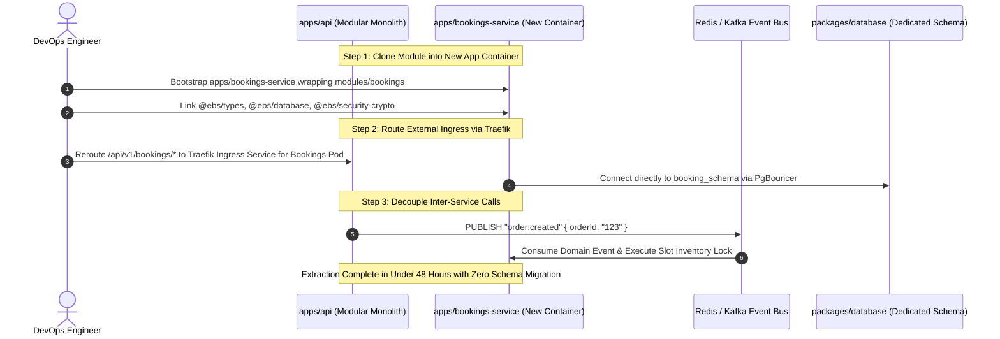

### Microservice Readiness Checklist:
1. **Schema Separation**: Database tables are already isolated by PostgreSQL schemas (`booking_schema`, `geo_spatial_schema`, `rural_bharat_schema`, `social_schema`). Migrating to dedicated RDS instances requires zero table restructuring.
2. **DTO Contracts Pre-Extracted**: All API request and response DTOs already reside in `@ebs/types`. The newly extracted service and the existing frontend continue consuming identical type definitions without contract changes.
3. **Decoupled Business Logic**: The Domain and Application layers of each module contain zero imports from sibling modules. Inter-module communication executes exclusively via interfaces that can be swapped from direct dependency injection to gRPC or REST in minutes.

---

## 12.3 Ten-to-Twenty Year Scalability & Extensibility Roadmap

The repository structure is engineered to withstand two decades of platform evolution, adapting gracefully to emerging technologies and massive data growth:

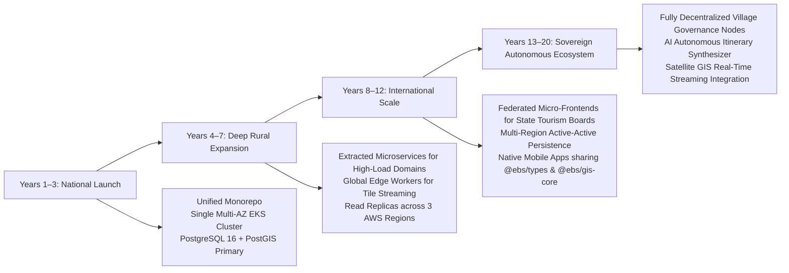

1. **State & Union Territory Expansion**: Adding a new State or Union Territory requires zero architectural modification; developers simply ingest new spatial polygons into `packages/database/src/seed/` and register the state slug.
2. **New Experience Types**: Expanding beyond treks into rural homestays, artisan workshops, and spiritual retreats requires only adding new subtype definitions to `experience.entity.ts` within the existing `bookings` domain aggregate.
3. **Decentralized Village Administration**: Gram Panchayat portals are structurally isolated inside `apps/web/src/app/(admin)/village-admin/`, allowing individual district administrations to safely manage local data without system-wide privileges.
4. **Offline Progressive Web Apps (PWA)**: The strict separation of `packages/gis-core` and `@ebs/types` enables compiling spatial calculation routines directly to WebAssembly (Wasm) and bundling vector tiles into local IndexedDB for complete offline trekking navigation in remote Himalayan and Western Ghat regions.

---

## 12.4 Summary of Architectural Compliance

This document completes the foundational technical specifications for Explore Bharat Safar. Every folder, file type, dependency boundary, import rule, and ownership tier established herein forms an immutable architectural contract. Software engineering teams scaffolding the repository must adhere strictly to this blueprint to guarantee institutional quality, zero technical debt, and unbroken system stability for decades to come.
